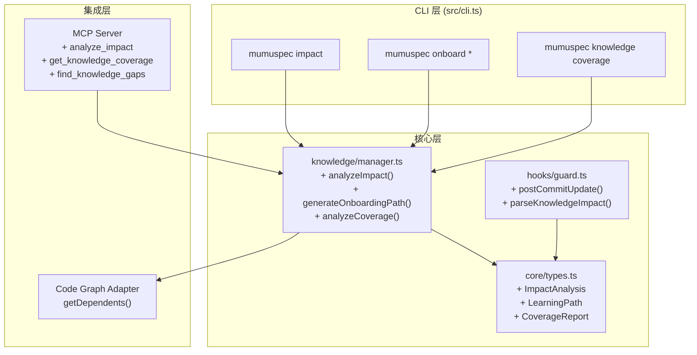

# Design: introduce-ua-design

> 层级: Level 1 设计文档 | 所属层: Knowledge Layer 增强 | 版本: 0.13.0

---

## 1. 设计概览

### 1.1 目标

在 MumuSpec Knowledge Layer 中引入 Understand-Anything 的 4 个核心设计：
- **A. Diff 影响分析** — 变更代码 → 关联知识预警
- **B. Onboarding 路径** — 拓扑排序引导式学习
- **C. Git 增量更新** — 提交时自动刷新知识新鲜度
- **D. 知识覆盖度分析** — 识别未覆盖的重要代码

### 1.2 架构总览



---

## 2. Level 0 — 根层：类型定义与存储

### 2.1 新增类型（types.ts）

```typescript
/** 影响分析结果 */
export interface ImpactAnalysis {
  generated_at: string;
  diff_range: string;
  changed_files: ChangedFile[];
  direct_impact: ImpactNode[];
  indirect_impact: ImpactNode[];
  knowledge_warnings: KnowledgeWarning[];
  recommendations: ImpactRecommendation;
}

export interface ChangedFile {
  path: string;
  change_type: 'added' | 'modified' | 'deleted';
  lines_changed: number;
}

export interface ImpactNode {
  node_path: string;
  node_type: 'File' | 'Function' | 'Class' | 'Module';
  distance: number;  // 1 = direct, 2+ = indirect
  dependents?: string[];
  impacted_specs?: SpecRef[];
  impacted_knowledge?: KnowledgeRef[];
}

export interface KnowledgeWarning {
  knowledge_id: string;
  warning_type: 'SCOPE_OVERLAP' | 'RISK_AMPLIFY' | 'DECISION_DEVIATION';
  message: string;
  suggestion: string;
  severity: 'high' | 'medium' | 'low';
}

export interface ImpactRecommendation {
  regression_scope: string[];
  review_focus: string[];
  knowledge_pages_to_review: string[];
}

/** 学习路径 */
export interface LearningPath {
  scope: string;
  generated_at: string;
  generated_for: string;
  steps: LearningStep[];
  total_steps: number;
  estimated_minutes: number;
}

export interface LearningStep {
  order: number;
  code_node: string;
  code_node_type: string;
  reason: string;
  knowledge_pages: string[];
  learning_objectives: string[];
  check_questions: string[];
}

/** 覆盖度报告 */
export interface CoverageReport {
  scope: string;
  generated_at: string;
  coverage: CoverageStats;
  gaps: CoverageGap[];
  overloads: KnowledgeOverload[];
}

export interface CoverageStats {
  total_code_nodes: number;
  covered_nodes: number;
  coverage_ratio: number;
  by_type: Record<string, { total: number; covered: number }>;
}

export interface CoverageGap {
  node: string;
  node_type: string;
  importance: number;
  suggested_type: 'decision' | 'pattern' | 'rationale';
}

export interface KnowledgeOverload {
  node: string;
  pages_count: number;
}
```

### 2.2 存储结构

```
.mumuspec/
├── knowledge/
│   ├── knowledge-graph.json   # 新增：UA 风格的图谱 JSON（从 Knowledge Page 自动生成）
│   ├── _reverse-index.yaml    # 已有
│   └── ...
├── onboarding/                # 新增
│   ├── src-payment-junior.yaml
│   └── progress/
│       └── user-progress.yaml
└── changes/<name>/
    ├── impact-analysis.yaml   # 新增：变更影响缓存
    └── ...
```

---

## 3. Level 1 — 模块层：knowledge/manager.ts 扩展

### 3.1 新增函数

#### analyzeImpact()

```typescript
/** 分析变更影响范围 + 知识预警 */
export function analyzeImpact(
  projectRoot: string,
  config: MumuSpecConfig,
  options: {
    diffRange?: string;
    scope?: string;
    withKnowledge?: boolean;
    maxDepth?: number;
  }
): ImpactAnalysis;
```

**算法**：
1. `git diff --name-only [diffRange]` 获取变更文件
2. 从 Reverse Index 查每个文件的关联 Knowledge Page
3. 通过 Code Graph `getDependents()` BFS 扩展 3 跳（上限 1000 节点）
4. 对每个关联 Knowledge Page 生成 Warning
5. 组装推荐建议

**降级**：Code Graph 不可用时，仅用 Reverse Index 做 1 跳分析。

#### generateOnboardingPath()

```typescript
/** 生成学习路径 */
export function generateOnboardingPath(
  projectRoot: string,
  config: MumuSpecConfig,
  scope: string,
  role: 'junior' | 'mid' | 'senior' | 'pm'
): LearningPath;
```

**算法**：
1. 从 Code Graph 提取 scope 子图
2. 计算入口节点（入度最小）
3. BFS 拓扑排序
4. 每步通过 Reverse Index 关联 Knowledge Page
5. 按角色过滤详细程度

**降级**：Code Graph 不可用时，用文件系统目录结构 + graph_bindings 近似。

#### analyzeCoverage()

```typescript
/** 知识覆盖度分析 */
export function analyzeCoverage(
  projectRoot: string,
  config: MumuSpecConfig,
  scope?: string
): CoverageReport;
```

**算法**：
1. 获取 scope 内所有代码节点（Code Graph 或文件系统扫描）
2. 从 Reverse Index 获取已覆盖节点
3. uncovered = all - covered
4. importance = backwardRefCount × graphBindingsCount
5. gaps = sortBy(importance).desc()

---

## 4. Level 2 — CLI 层：命令定义

### 4.1 `mumuspec impact`

```
mumuspec impact [--diff <range>] [--scope <path>] [--json] [--with-knowledge]
```

**输出模式**：
- 终端 TUI：面板样式（参考现有 dashboard）
- JSON：`--json` 输出完整 ImpactAnalysis

### 4.2 `mumuspec onboard`

```
mumuspec onboard init --scope <path> [--role junior|mid|senior|pm]
mumuspec onboard start --scope <path>
mumuspec onboard next --scope <path>
mumuspec onboard complete-step <n> --scope <path>
mumuspec onboard progress --scope <path>
```

**交互 UI**：终端面板 + 键盘导航（n/p/o/k/q）

### 4.3 `mumuspec knowledge coverage`

```
mumuspec knowledge coverage [--scope <path>] [--json]
mumuspec knowledge gaps --scope <path> [--min-importance <n>]
```

### 4.4 `mumuspec knowledge graph-export`

```
mumuspec knowledge graph-export [--output <path>]
```

将 Knowledge Page 导出为 UA 风格的 JSON 图谱格式（可提交 Git）。

---

## 5. Level 3 — Hook 层：增量更新

### 5.1 post-commit Hook

```typescript
/** post-commit 触发的知识增量更新 */
export function postCommitKnowledgeUpdate(
  projectRoot: string,
  config: MumuSpecConfig
): {
  updatedPages: string[];
  stalePages: string[];
  deviations: DeviationRecord[];
};
```

**超时保护**：Promise.race 500ms 超时，超时后写入 .mumuspec/knowledge/.pending-update.json 队列。

### 5.2 commit-msg Hook

解析提交消息中的 `Knowledge-Impact` 块：

```
Knowledge-Impact:
  IMPLEMENTS: [KP-xxx, ...]
  AFFECTS: [KP-xxx, ...]
  SUPERSEDES: [KP-xxx, ...]  # block 并提示
```

解析结果写入 `.mumuspec/knowledge/.commit-context.json`，由 post-commit 消费。

### 5.3 配置扩展

```yaml
# .mumuspec.yaml / config.yaml
knowledge:
  # ... 现有配置
  commit_update:
    enabled: true
    timeout_ms: 500
    async: true
    llm_enhancement: false  # 可配置 LLM 增强
  commit_message:
    parse_knowledge_impact: true
  coverage:
    importance_formula: "ref_count * node_count"
    gap_threshold: 5
```

---

## 6. Level 4 — MCP 工具层

| 工具 | 输入 | 输出 |
|------|------|------|
| `analyze_impact` | diff_range?, scope? | ImpactAnalysis |
| `generate_onboarding_path` | scope, role | LearningPath |
| `get_knowledge_coverage` | scope? | CoverageReport |
| `find_knowledge_gaps` | scope?, min_importance? | CoverageGap[] |
| `detect_decision_deviation` | changed_files[] | DeviationRecord[] |
| `query_knowledge` | query | ChatAnswer |

---

## 7. Chat 功能设计（Understand-Anything 风格知识问答）

### 7.1 目标

提供 `mumuspec chat` 命令，允许开发者通过自然语言查询项目知识库，获得基于已有 Knowledge Page 的回答。不需要 LLM 依赖，仅通过关键词匹配实现。

### 7.2 CLI 接口

```bash
# 直接查询
mumuspec chat "Saga 模式"
mumuspec chat "KP-0007"
mumuspec chat "payment architecture"

# 交互模式（无参数时进入交互提示）
mumuspec chat

# JSON 输出
mumuspec chat "auth" --json
```

### 7.3 输出面板

```
┌─── CHAT ANSWER ─────────────────────────────────────────┐
│ Query: Saga 模式
│ Confidence: high
└─────────────────────────────────────────────────────────┘

Found in [KP-0007] Saga 分布式事务模式 (decision):
本项目采用 Saga 模式管理分布式事务...

References:
  [KP-0007] Saga 分布式事务模式 (decision, 100%)
```

### 7.4 核心算法

```
算法: answerQuery(projectRoot, config, query)
输入: projectRoot, config, query
输出: ChatAnswer

1. 获取全部 Knowledge Pages (listKnowledgePages)
2. 对 query 分词 → queryTerms
3. 对每个 Knowledge Page 计算相关性分数:
   - 完全 ID 匹配: +100
   - ID 包含查询: +50
   - 标题完全匹配: +80
   - 标题包含查询: +40
   - 标题中每个查询词: +10
   - 内容包含查询: +20
   - 内容中每个查询词匹配: +2
   - 标签匹配: +15
4. 按分数降序排列
5. 取 score > 0 的前 5 个
6. 计算 relevance = score / maxScore
7. 组装 answer 文本 (根据 reference 数量选择模板)
8. 确定 confidence: high/medium/low
```

### 7.5 类型定义

```typescript
interface ChatKnowledgeRef {
  id: string;
  title: string;
  type: 'decision' | 'pattern' | 'risk' | 'rationale' | 'lesson';
  relevance: number;
}

interface ChatAnswer {
  query: string;
  generated_at: string;
  answer: string;
  references: ChatKnowledgeRef[];
  confidence: 'high' | 'medium' | 'low';
}
```

---

## 8. Dashboard 增强设计（项目状况 + Roadmap + Goals）

### 8.1 目标

扩展现有 `mumuspec dashboard` 命令，在终端面板中展示：
- 当前变更状态（已有）
- 知识覆盖度统计（新增）
- 项目目标 / Goals（新增）
- 路线图 / Roadmap（新增）
- 告警提示（新增）

### 8.2 CLI 接口

```bash
mumuspec dashboard              # 终端面板输出
mumuspec dashboard --json       # JSON 输出
```

### 8.3 输出面板

```
╔══════════════════════════════════════════════════════════╗
║                   MUMUSPEC DASHBOARD                     ║
╚══════════════════════════════════════════════════════════╝

Project: mumuspec
Root:    D:\Code\AI-coding\mumuspec

┌─── Active Change ───────────────────────────────────────┐
│ Name:     introduce-ua-design
│ Phase:    build
│ Workflow: full
│ Hooks:    ✓ installed
│ Knowledge: 31 pages (2 stale)
└─────────────────────────────────────────────────────────┘

─── Knowledge Coverage ─────────────────────────────────────
  Pages: 31 total, 2 stale
  Coverage: 62.5%

─── Project Goals ──────────────────────────────────────────
  ✓ [GOAL-01] 完成 Knowledge Layer 核心功能 (completed)
  ► [GOAL-02] 引入 Understand-Anything 设计模式 (in_progress)

─── Roadmap ────────────────────────────────────────────────
  ✓ [RM-01] Diff 影响分析 — Q3 2026 (completed)
  ► [RM-02] Onboarding 引导路径 — Q3 2026 (in_progress)
  ○ [RM-03] Dashboard 集成 — Q4 2026 (planned)

─── Alerts ─────────────────────────────────────────────────
  ⚠ 2 stale knowledge page(s) need review
  ⚠ No hooks installed — run `mumuspec hooks install`

─── Hooks ─────────────────────────────────────────────────
  ✓ pre-commit
  ✓ post-merge
  ○ commit-msg
```

### 8.4 数据来源

Dashboard 数据来自 Knowledge Base 中的特定标签：
- **Goals**: Knowledge Page 标签包含 `goal`、`vision`、`milestone`
- **Roadmap**: Knowledge Page 标签包含 `roadmap`
- **Coverage**: `analyzeCoverage()` 计算
- **Alerts**: 基于 stale pages、gaps、hook 状态自动生成

### 8.5 核心算法

```
算法: getDashboardData(projectRoot, config, options)
输入: projectRoot, config, { activeChange, hookStatus, changePhase, ... }
输出: DashboardData

1. 获取所有 Knowledge Pages (listKnowledgePages)
2. 获取 stale pages (listStalePages)
3. 计算 coverage (analyzeCoverage)
4. 从 Knowledge Pages 提取 Goals (tags 包含 goal/vision/milestone)
5. 从 Knowledge Pages 提取 Roadmap (tags 包含 roadmap)
6. 生成 Alerts:
   - stale > 0 → 告警
   - gaps > 0 → 告警
   - hooks 未安装 → 告警
7. 组装 DashboardData 结构
```

### 8.6 类型定义

```typescript
interface ProjectGoal {
  id: string;
  title: string;
  description: string;
  status: 'planned' | 'in_progress' | 'completed';
  related_pages: string[];
}

interface RoadmapItem {
  id: string;
  title: string;
  milestone: string;
  status: 'planned' | 'in_progress' | 'completed';
  related_changes: string[];
}

interface DashboardData {
  project: string;
  projectRoot: string;
  activeChange: { ... } | null;
  hooks: { available: string[]; installed: string[] };
  coverage: { totalPages: number; stalePages: number; coverageRatio: number };
  goals: ProjectGoal[];
  roadmap: RoadmapItem[];
  alerts: string[];
}
```

---

## 9. 关键 SHALL/SHALL NOT

### SHALL

- impact 分析 SHALL 使用 Code Graph 适配器做精确依赖追踪
- onboarding 路径 SHALL 按拓扑排序（入口→核心→辅助）
- post-commit 更新 SHALL 非阻塞（异步 + 超时 500ms）
- 偏离检测 SHALL 可配置（规则默认 + LLM 可选）
- 覆盖度 importance SHALL 计算为 backwardRefCount × graphBindingsCount
- CLI 输出 SHALL 支持 `--json` 供 CI/MCP 使用
- 知识图谱 JSON SHALL 保持与现有 Knowledge Page 格式向后兼容
- chat 查询 SHALL 返回相关性排序的 Knowledge Page 引用
- dashboard SHALL 从 Knowledge Page 标签提取 Goals 和 Roadmap

### SHALL NOT

- impact 分析 SHALL NOT 在 Code Graph 不可用时静默降级（需 WARN）
- post-commit hook SHALL NOT 阻塞 git push（即使分析失败）
- Dashboard GUI SHALL NOT 成为核心依赖（终端面板优先）
- onboarding SHALL NOT 修改 Knowledge Page 内容
- 新增命令 SHALL NOT 破坏现有 knowledge/* 命令行为
- chat SHALL NOT 依赖外部 LLM 服务（关键词匹配实现）
- dashboard Goals/Roadmap SHALL NOT 修改 Knowledge Page 内容

---

## 10. 设计理由（Ponytail）

| 决策 | 理由 |
|------|------|
| Code Graph 而非仅 Reverse Index | Q1-K01：用户选择最准确方案 |
| 两层 onboarding 排序 | Q1-K02：兼容性 + 精确性平衡 |
| 可配置 LLM 偏离检测 | Q1-K03：默认快速（规则），可选准确（LLM） |
| importance = ref × node | Q1-K04：加权评估知识价值 |
| 500ms hook 超时 | Q3-004：不阻塞开发者工作流 |
| backward ref 作为 importance 基础 | Q1-002：Reverse Index 已有此数据 |
| chat 用关键词匹配而非 LLM | ponytail: 零依赖、快速、确定性 |
| dashboard 标签驱动 Goals/Roadmap | ponytail: 复用已有知识页面，无需新数据格式 |
| 终端面板而非 Web GUI | ponytail: 保持 CLI-first 一致性 |

---

## 11. Q4 盲区缓解

| 盲区 | 缓解措施 |
|------|---------|
| Code Graph 未安装 | CLI WARN + 文档降级说明 |
| 大型代码库 BFS 超时 | max_nodes=1000 上限 + 截断提示 |
| Conventional Commits 兼容 | Knowledge-Impact 放消息尾部 |
| 知识页面被删除 | onboarding UI 标注「已过期」 |
| 多用户并发修改 | git merge 策略处理 |
| chat 关键词无匹配 | 返回低置信度 + 提示可用命令 |
| dashboard 无 Goals/Roadmap | 静默跳过该面板（不报错） |
| 大量知识页面搜索慢 | 限制 max 5 个结果 + 截断 |

---

> **导航**: [← Proposal](./proposal.md) | [Delta Specs](./delta-specs/) | [决策记录](./decisions.md)
