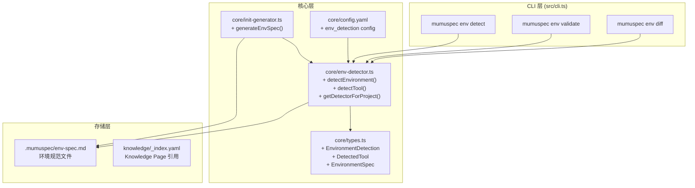

# Design: add-env-spec

> 层级: Level 1 设计文档 | 所属层: Core Layer + CLI Layer | 版本: 0.13.0

---

## 1. 设计概览

### 1.1 目标

在 MumuSpec 中引入 Environment Spec 能力，自动检测和记录项目环境及核心组件位置：
- **A. 环境检测器** — 检测 JDK/Maven/Node/Python 等工具位置和版本
- **B. env-spec.md 格式** — 标准化环境规范文件格式
- **C. CLI 命令** — `mumuspec env detect/validate/diff`
- **D. init 集成** — 在 `mumuspec init` 时自动执行环境检测

### 1.2 架构总览



---

## 2. Level 0 — 根层：类型定义与存储

### 2.1 新增类型（types.ts）

```typescript
/** 环境检测结果 */
export interface EnvironmentDetection {
  timestamp: string;
  os: OSInfo;
  tools: DetectedTool[];
  missing: string[];
  warnings: string[];
}

/** 操作系统信息 */
export interface OSInfo {
  type: 'windows' | 'linux' | 'macos';
  arch: 'x64' | 'arm64' | 'x86';
  version: string;
  envVars: Record<string, string>;
}

/** 检测到的工具 */
export interface DetectedTool {
  name: string;
  ecosystem: ToolEcosystem;
  version: string;
  location: string;
  envVars: Record<string, string>;
  status: 'ok' | 'warn' | 'missing';
}

/** 工具生态标识 */
export type ToolEcosystem =
  | 'java'
  | 'node'
  | 'python'
  | 'go'
  | 'rust'
  | 'build'
  | 'container';

/** 环境规范条目 */
export interface EnvironmentSpec {
  tool: string;
  requirement: string;
  minVersion?: string;
  requiredEnvVars?: string[];
  detected?: DetectedTool;
  lastChecked?: string;
}

/** env-spec.md 文件结构 */
export interface EnvSpecFile {
  layer: 0;
  scope: '.env';
  type: 'environment';
  lastUpdated: string;
  environments: EnvSpecSection[];
}

/** 环境规范段落 */
export interface EnvSpecSection {
  category: string;
  shall: string[];
  shallNot: string[];
  detected: DetectedTool[];
  notes?: string;
}
```

### 2.2 存储结构

```
.mumuspec/
├── env-spec.md              # 新增：环境规范文件
├── knowledge/
│   ├── decisions/           # 已有
│   ├── patterns/            # 已有
│   ├── risks/               # 已有
│   ├── lessons/             # 已有（可能新增环境相关知识页）
│   └── _index.yaml          # 已有
└── changes/<name>/
    └── ...                  # 已有
```

---

## 3. Level 1 — 模块层：env-detector.ts

### 3.1 核心函数

#### detectEnvironment()

```typescript
/**
 * 检测当前开发环境
 * @param options 检测选项
 * @returns 完整环境检测结果
 */
export async function detectEnvironment(options?: {
  ecosystems?: ToolEcosystem[];
  cache?: boolean;
  timeout?: number;
}): Promise<EnvironmentDetection>;
```

**算法**：
1. 检测操作系统类型和架构
2. 按生态分组并行检测（`Promise.all`）
3. 每个工具执行 `ToolDetector.detect()`
4. 汇总结果，生成 warnings（版本过低等）
5. 过滤敏感环境变量

**性能**：
- 全量检测 < 2 秒
- 单项检测 1 秒超时
- 失败工具记为 `status: 'missing'`，不阻断流程

#### detectTool()

```typescript
/**
 * 检测单个工具
 * @param name 工具名称
 * @param config 工具检测配置
 * @returns 检测结果或 null
 */
export function detectTool(
  name: string,
  config: ToolDetectorConfig
): Promise<DetectedTool | null>;
```

### 3.2 工具检测配置

```typescript
interface ToolDetectorConfig {
  command: string;        // 版本查询命令（只读）
  versionRegex: RegExp;   // 版本号提取正则
  envVars?: string[];     // 需要检测的环境变量
  locationCmd?: string;   // 位置查询命令
}

/** 预定义检测配置 */
const DETECTOR_CONFIGS: Record<string, ToolDetectorConfig> = {
  jdk: {
    command: 'java -version 2>&1',
    versionRegex: /version "?(1\.\d+|\d+[\d.]*)"?/,
    envVars: ['JAVA_HOME'],
    locationCmd: process.platform === 'win32' ? 'where java' : 'which java',
  },
  maven: {
    command: 'mvn -version',
    versionRegex: /Apache Maven (\d+\.\d+\.\d+)/,
    envVars: ['MAVEN_HOME', 'M2_HOME'],
    locationCmd: process.platform === 'win32' ? 'where mvn' : 'which mvn',
  },
  node: {
    command: 'node --version',
    versionRegex: /v(\d+\.\d+\.\d+)/,
    envVars: ['NODE_PATH', 'NVM_DIR'],
    locationCmd: process.platform === 'win32' ? 'where node' : 'which node',
  },
  npm: {
    command: 'npm --version',
    versionRegex: /(\d+\.\d+\.\d+)/,
    locationCmd: process.platform === 'win32' ? 'where npm' : 'which npm',
  },
  python: {
    command: 'python --version 2>&1 || python3 --version 2>&1',
    versionRegex: /Python (\d+\.\d+\.\d+)/,
    envVars: ['VIRTUAL_ENV', 'CONDA_DEFAULT_ENV'],
    locationCmd: process.platform === 'win32' ? 'where python' : 'which python3',
  },
};
```

### 3.3 项目感知检测

```typescript
/**
 * 根据项目配置文件决定检测范围
 * @param projectRoot 项目根目录
 * @returns 需要检测的生态列表
 */
export function detectRequiredEcosystems(
  projectRoot: string
): ToolEcosystem[];
```

| 配置文件 | 检测生态 |
|----------|----------|
| `pom.xml` / `build.gradle` | java |
| `package.json` | node |
| `go.mod` | go |
| `Cargo.toml` | rust |
| `pyproject.toml` / `requirements.txt` | python |
| `Dockerfile` | container |
| `Makefile` | build |

---

## 4. Level 2 — CLI 层：env 命令

### 4.1 `mumuspec env detect`

```
mumuspec env detect [--save] [--ecosystem <name>] [--json]
```

**参数**：
| 参数 | 类型 | 说明 |
|------|------|------|
| `--save` | boolean | 保存到 `.mumuspec/env-spec.md` |
| `--ecosystem` | string | 仅检测指定生态（可重复） |
| `--json` | boolean | JSON 格式输出 |

**输出示例**：
```
=== Environment Detection ===

OS: Windows 10.0.26100 (x64)

Java:
  JDK:    17.0.8  C:\Program Files\Java\jdk-17  [ok]
  Maven:  3.9.4   C:\apache-maven-3.9.4        [ok]
  Gradle: NOT FOUND                           [missing]

Node:
  Node.js: v24.18.0  C:\Program Files\nodejs   [ok]
  npm:     10.9.0    C:\Program Files\nodejs   [ok]
  pnpm:    NOT FOUND                           [missing]

Result: 2 missing, 0 warnings
  Run `mumuspec env validate` for details.
```

### 4.2 `mumuspec env validate`

```
mumuspec env validate [--fix] [--strict]
```

**参数**：
| 参数 | 类型 | 说明 |
|------|------|------|
| `--fix` | boolean | 自动修复 minor 问题（仅生成建议） |
| `--strict` | boolean | 严格模式，warning 也视为错误 |

**退出码**：
| 码 | 含义 |
|----|------|
| 0 | 所有检查通过 |
| 1 | 警告（版本不匹配但不影响功能） |
| 2 | 错误（必需工具缺失或版本过低） |
| 3 | 检测执行失败 |

### 4.3 `mumuspec env diff`

```
mumuspec env diff [--against <file>]
```

**参数**：
| 参数 | 类型 | 说明 |
|------|------|------|
| `--against` | string | 对比目标环境文件路径 |

---

## 5. Level 3 — init 集成

### 5.1 集成点

在 `src/core/init-generator.ts` 中扩展 `scaffoldKnowledgeBase()`：

```typescript
/** 生成环境知识页 */
function generateEnvKnowledgePage(
  detection: EnvironmentDetection,
  analysis: ProjectAnalysis
): KnowledgePageDraft;
```

### 5.2 生成逻辑

1. `mumuspec init` 执行 `analyzeProject()` 后
2. 调用 `detectRequiredEcosystems()` 确定检测范围
3. 调用 `detectEnvironment()` 执行检测
4. 如果检测到工具链配置文件：
   - 生成 `.mumuspec/env-spec.md`（Detected 部分填充）
   - 生成 `lessons/KP-XXXX-environment-setup.md` 知识页

---

## 6. 关键 SHALL/SHALL NOT

### SHALL

- env-detector.ts MUST 实现并行检测，总耗时 < 2s
- 单项检测 MUST 有 1 秒超时保护
- 检测命令 MUST 仅执行只读操作（`--version`、`which`、`echo`）
- env-spec.md MUST 使用 `type: environment` frontmatter
- Detected 部分 MUST 由 `env detect --save` 自动生成，手动修改会被覆盖
- CLI MUST 输出彩色、人类可读的检测结果
- 环境检测结果 MUST 过滤敏感变量（含 password/secret/token/key 的变量名）

### SHALL NOT

- env-detector MUST NOT 执行网络请求
- env-detector MUST NOT 修改任何系统配置或文件
- 检测逻辑 MUST NOT 因单个工具未安装而阻断整体检测
- `env validate --fix` MUST NOT 安装缺失工具或升级版本
- env-spec.md MUST NOT 记录敏感信息

---

## 7. 安全约束

### 敏感变量过滤规则

```typescript
const SENSITIVE_PATTERNS = [
  /password/i,
  /secret/i,
  /token/i,
  /key/i,
  /credential/i,
  /auth/i,
  /private/i,
];

function filterSensitiveVars(vars: Record<string, string>): Record<string, string> {
  return Object.fromEntries(
    Object.entries(vars).filter(([key]) =>
      !SENSITIVE_PATTERNS.some(p => p.test(key))
    )
  );
}
```

---

## 8. 设计理由（Ponytail）

| 决策 | 理由 |
|------|------|
| 并行检测而非串行 | 2 秒性能要求下串行太慢 |
| `which`/`where` 命令检测位置 | 平台标准工具，零依赖 |
| 预定义检测配置 | 减少运行时复杂度，优先 boring solution |
| 敏感变量过滤 | 安全约束，防止 env-spec 泄露信息 |
| Detected 部分自动覆盖 | 保证检测结果始终反映真实环境 |

---

## 9. 错误处理

| 场景 | 行为 |
|------|------|
| 工具未安装 | `status: 'missing'`，不阻断 |
| 版本号提取失败 | `status: 'warn'`，version 标记为 `unknown` |
| 检测超时（1s） | `status: 'missing'`，warnings 记录超时 |
| 命令执行失败 | catch 异常，记为 missing |
| env-spec.md 不存在时 validate | 提示先运行 `--save` |

---

> **导航**: [← Proposal](./proposal.md) | [Delta Specs](./delta-specs/) | [决策记录](./decisions.md)
