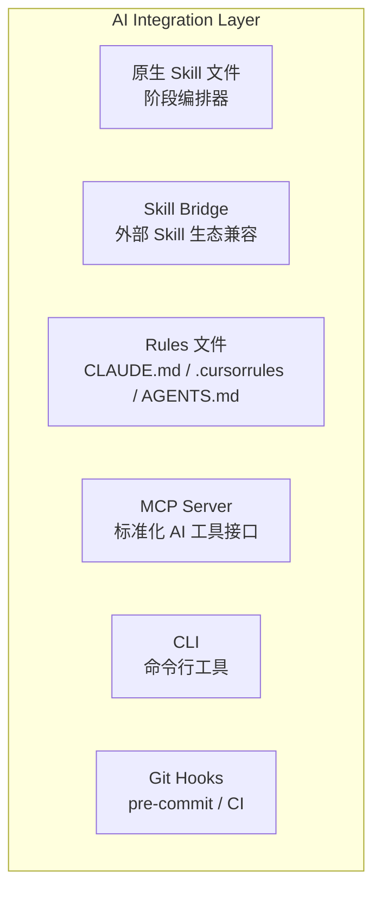
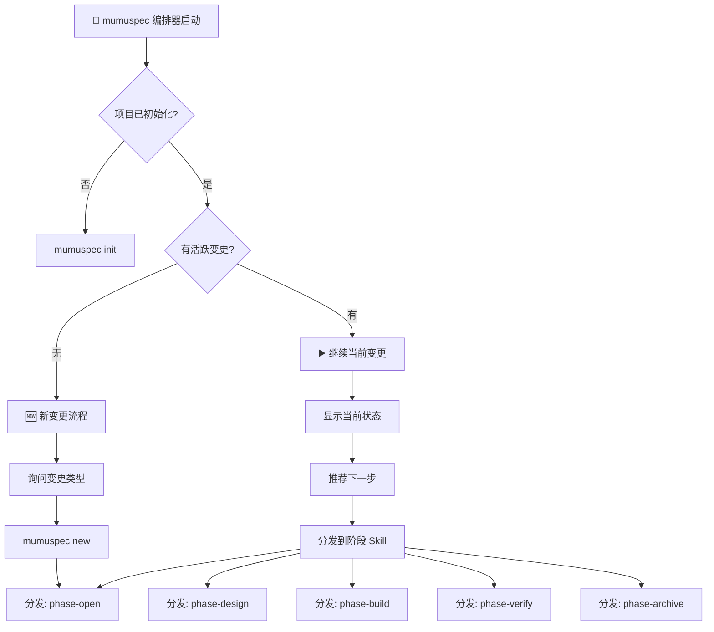
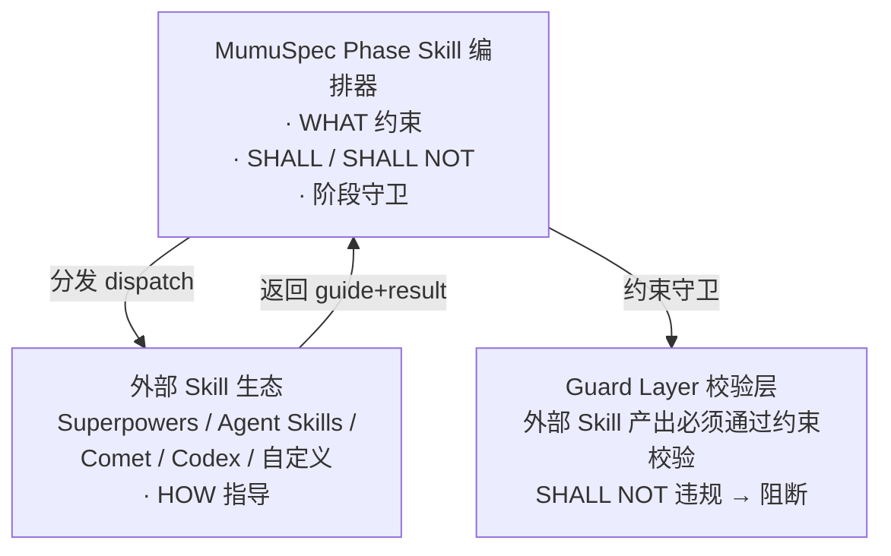
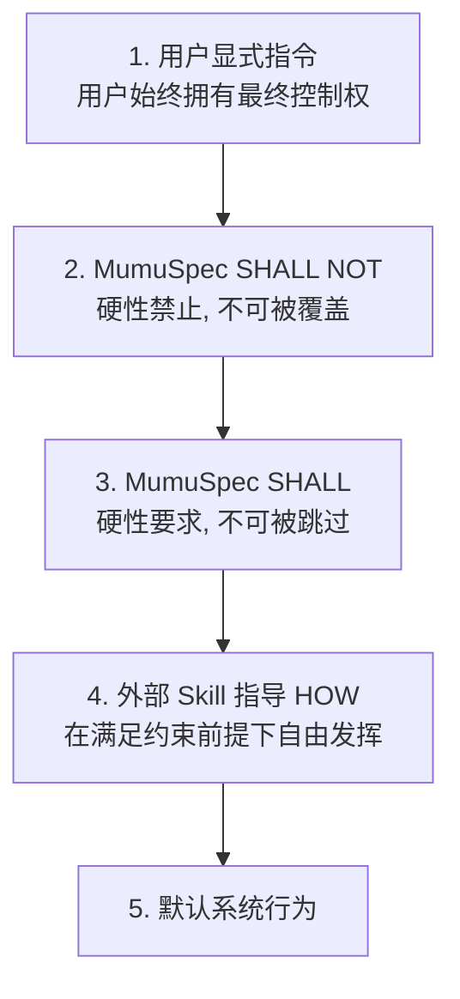

# AI Integration Layer — AI 编程工具集成

> **Source**: `docs/design/ai-integration.md` | **Type**: docs | **Imported**: 2026-07-31

## Summary

> 层级: Level 1 设计文档 | 所属层: AI Integration Layer

## Original Content

# AI Integration Layer — AI 编程工具集成

> 层级: Level 1 设计文档 | 所属层: AI Integration Layer

---

## 1. 集成架构

MumuSpec 通过多种方式与 AI 编程工具集成：



## 2. 原生 Skill 文件（阶段编排器）

> **Phase 归属**: Skill 编排器在 Phase 2 实现（grill me 风格一站式入口），Hyperplan 对抗式规划推迟到 Phase 5 实现。Phase 1-2 实现 Rules 文件生成 + 编排器 Skill,Phase 3 实现 Skill Bridge 兼容层。

MumuSpec 为每个变更阶段提供原生 Skill 文件，作为**阶段编排器**，负责在该阶段内分发到外部 Skill 生态：

```
.mumuspec/skills/
├── mumuspec.md               # 🎯 编排器入口（grill me 风格）
├── phase-open.md             # Open 阶段：需求探索与变更初始化
├── phase-design.md           # Design 阶段：技术设计与测试用例
├── phase-build.md            # Build 阶段：TDD 实现与代码编写
├── phase-verify.md           # Verify 阶段：验证与审查
├── phase-archive.md          # Archive 阶段：归档与知识沉淀
├── workflow.yaml             # 编排配置：阶段分发规则
└── custom/                   # 项目自定义 Skill
```

每个 Skill 文件包含：触发条件、前置条件检查、执行步骤（含外部 Skill 分发点）、阻塞点定义、退出条件、阶段守卫调用。

### 编排器模式（grill me 风格）

编排器 `mumuspec.md` 是 AI 开发者的**一站式入口**：

1. **自动感知** — 检测当前项目是否初始化、是否有活跃变更、变更处于哪个阶段
2. **智能推荐** — 根据当前状态推荐下一步操作
3. **一键执行** — 单条命令启动完整工作流
4. **阶段编排** — 自动分发给阶段 Skill 执行具体步骤



### 编排流程

编排器启动时按以下顺序检测：

1. **项目检测**：`mumuspec doctor` — 检查 .mumuspec/ 结构与配置文件
2. **变更检测**：`mumuspec list` — 列出活跃变更
3. **阶段检测**：`mumuspec status [name]` — 获取当前变更的详细状态
4. **下一步推荐**：基于 Phase + Workflow 推荐

### 阶段分发表

| 当前 Phase | 编排器动作 | 目标 Skill |
|-----------|-----------|-----------|
| 无活跃变更 | 创建新变更 | `phase-open` |
| `open` | 填写 proposal、定义 scope | `phase-open` |
| `design` | 技术设计、认知框架、测试用例 | `phase-design` |
| `build` | TDD 实现、代码编写 | `phase-build` |
| `verify` | 验证、代码审查 | `phase-verify` |
| `archive-in-progress` | 合并、知识提取、归档 | `phase-archive` |

## 3. 外部 Skill 生态兼容

> **Phase 归属**: Skill Bridge 兼容层在 Phase 3 实现,Phase 1-2 仅实现 Rules 文件生成。

MumuSpec 原生 Skill 作为编排器，在每个阶段内部按需分发给外部 Skill 生态。外部 Skill 提供 **HOW** 的指导，MumuSpec 提供 **WHAT** 的约束：



### 优先级与冲突解决



| 冲突场景 | 处理方式 |
|---------|---------|
| Skill 建议 vs SHALL NOT | SHALL NOT 优先，阻断 |
| Skill 建议 vs SHALL | SHALL 优先，要求调整 |
| 多个 Skill 冲突 | 按分发顺序，后者覆盖前者 |
| Skill 不可用 | required=true 阻断；required=false 跳过 |

### 兼容的 Skill 生态

| 生态 | dispatch_mode | 说明 |
|------|--------------|------|
| Superpowers | deep | 深度集成，`~/.claude/skills` |
| Agent Skills | deep | 深度集成，`~/.agents/skills` |
| Comet | interop | 协议互操作 |
| Codex | platform | 平台适配（按需启用） |
| Custom | — | 项目自定义，`.mumuspec/skills/custom` |

### 阶段-Skill 映射概要

| 阶段 | 关键 Skill |
|------|-----------|
| **Open** | brainstorming (required), spec-driven-development (required), gitnexus-impact-analysis (required) |
| **Design** | brainstorming (required), hyperplan (conditional), test-case-design (required), api-and-interface-design (optional) |
| **Build** | writing-plans (required), test-driven-development (required), source-driven-development (optional) |
| **Verify** | verification-before-completion (required), requesting-code-review (required) |
| **Archive** | finishing-a-development-branch (required), ci-cd-and-automation (required) |
| **横切** | context-engineering, using-git-worktrees, documentation-and-adrs, doubt-driven-development |

> Skill 生态详细配置（含 hyperplan 7 阶段流程、Skill 矩阵、分发协议、决策记录）见 [参考：Skill 生态](../reference/skill-ecosystem.md)。

## 4. AI 工具适配层

### 设计动机

AI 编程工具生态快速演进(Claude Code → Cursor → OpenCode → Codex 等),MumuSpec 核心逻辑 SHALL NOT 依赖具体 AI 工具 API。建立 AI 工具适配层抽象,使 MumuSpec 能快速适配新出现的 AI 工具。

### AIToolAdapter 接口

```typescript
interface AIToolAdapter {
  // 生成 Rules 文件
  generateRules(spec: SpecTree, config: RulesConfig): Promise<RulesFile>;

  // 调用 Skill
  invokeSkill(skillId: string, params: SkillParams): Promise<SkillResult>;

  // 检查兼容性
  checkCompatibility(): Promise<CompatibilityReport>;

  // 获取适配器信息
  getInfo(): AdapterInfo;
}

interface AdapterInfo {
  name: string;           // 如 "claude-code"
  displayName: string;    // 如 "Claude Code"
  supportedFeatures: ('rules_generation' | 'skill_invocation' | 'mcp_server')[];
  version: string;
}
```

### 具体适配器

#### ClaudeCodeAdapter

- **适配工具**: Claude Code(Anthropic)
- **支持特性**: rules_generation(CLAUDE.md)、skill_invocation、mcp_server
- **Phase 归属**: Phase 1(基础 Rules 生成)+ Phase 3(Skill Bridge)
- **配置项**: `ai_integration.tool: "claude-code"`

#### CursorAdapter

- **适配工具**: Cursor
- **支持特性**: rules_generation(.cursorrules)
- **Phase 归属**: Phase 1(基础 Rules 生成)
- **配置项**: `ai_integration.tool: "cursor"`

#### OpenCodeAdapter

- **适配工具**: OpenCode
- **支持特性**: rules_generation(AGENTS.md)、skill_invocation
- **Phase 归属**: Phase 1(基础 Rules 生成)+ Phase 3(Skill Bridge)
- **配置项**: `ai_integration.tool: "opencode"`

#### CodexAdapter

- **适配工具**: OpenAI Codex
- **支持特性**: rules_generation
- **Phase 归属**: Phase 1(基础 Rules 生成)
- **配置项**: `ai_integration.tool: "codex"`

### 降级路径

当具体 AI 工具未适配时(如市场出现新的 AI 编程工具),MumuSpec SHALL 降级为通用 Rules 文件生成:

1. 生成通用的 AGENTS.md 文件(所有 AI 工具均可读取)
2. 在 `mumuspec status` 输出 WARN: "当前 AI 工具 [工具名] 未适配,使用通用 Rules 文件"
3. 通用 Rules 文件包含:规范优先级体系说明、SHALL/SHALL NOT 约束清单、变更状态机说明

### 适配器注册机制

```yaml
# .mumuspec.yaml
ai_integration:
  tool: "claude-code"  # claude-code | cursor | opencode | codex | generic
  auto_detect: true    # 自动检测当前环境使用的 AI 工具
```

`auto_detect: true` 时,MumuSpec SHALL 自动检测环境变量与配置文件,选择合适的适配器。检测失败时降级为 generic。

### 新 AI 工具适配流程

当市场出现新的 AI 编程工具时:
1. 实现新的 AIToolAdapter(仅需实现接口方法)
2. 注册到适配器注册表
3. 核心逻辑无需修改
4. 适配器未完成前,用户可使用 generic 降级模式

---

## 5. Rules 文件生成

MumuSpec 自动从规范生成 AI Rules 文件，供不同 AI 工具加载：

```yaml
# config.yaml 中的 AI 集成配置
ai:
  generate_rules: true
  mcp_server: true
  rules_files:
    - "CLAUDE.md"        # Claude Code
    - ".cursorrules"      # Cursor
    - "AGENTS.md"         # 通用 Agent
```

Rules 文件内容包含：
- 项目概述与当前工作目录
- 渐进式披露加载的规范（SHALL + SHALL NOT）
- Ponytail 基础编码约束（7 级优先级阶梯）
- 设计知识加载提示（引用 `.mumuspec/knowledge/` 和 `mumuspec knowledge context`）
- 代码结构查询提示（引用 `mumuspec search` / `mumuspec trace`）
- 工作流规则（worktree 隔离、单一活跃变更、自顶向下/自下向上、TDD）
- 禁止项优先级（SHALL NOT > SHALL）
- Skill 生态兼容说明

## 6. MCP Server

提供标准化 AI 工具接口：

```json
{
  "mcpServers": {
    "mumuspec": {
      "command": "npx",
      "args": ["@mumuspec/mcp-server"],
      "env": { "MUMUSPEC_ROOT": "${workspaceRoot}" }
    }
  }
}
```

> 完整 MCP 工具列表见 [参考：MCP 工具](../reference/mcp-tools.md)。

## 7. CLI 命令

提供命令行工具操作 MumuSpec 的所有功能：规范管理、变更管理、状态机回退、worktree 管理、代码图谱查询、知识管理、校验、文档生成、测试用例管理、契约管理、认知框架管理等。

### mumuspec install — Skill 与命令安装

为常见 AI 编程 agent 安装推荐技能与便捷命令：

```bash
# 列出可安装的 CatPaw 技能
mumuspec install catpaw --list

# 安装指定 CatPaw 技能（默认用户全局）
mumuspec install catpaw browser pdf pptx

# 安装到项目范围
mumuspec install catpaw pdf --target workspace --workspace-path /path/to/project

# 搜索可用技能
mumuspec install catpaw --search doc

# 查看已安装技能
mumuspec install catpaw --installed
```

**可用 CatPaw 技能包**：

| 包名 | 分类 | 描述 |
|------|------|------|
| browser | automation | 浏览器自动化：导航、表单、截图、数据提取 |
| pdf | document | PDF 处理：提取文本/表格、合并/拆分、加密、OCR |
| pptx | document | PowerPoint 处理：创建、读取、编辑演示文稿 |
| xlsx | document | Excel 处理：创建、读取、编辑电子表格与公式 |
| docx | document | Word 处理：创建、读取、编辑文档与样式 |
| settings | productivity | CatPaw 设置管理：偏好、MCP、应用配置 |

> 预留：`mumuspec install claude` 与 `mumuspec install cursor` 支持 Claude Code 与 Cursor 命令安装（coming soon）。

### mumuspec status — 变更状态概览

显示当前活跃变更的状态摘要：
- 当前 Phase 和 Workflow
- build_layers 进度
- test-cases 锁定状态
- rollback/rebuild 计数
- 下一步操作建议

### mumuspec doctor — 环境诊断

检查 MumuSpec 运行环境：
- Node.js 版本
- Git 仓库状态
- .mumuspec/ 目录完整性
- config.yaml 校验
- 图谱索引新鲜度
- Skill 生态可用性
- 依赖工具（tree-sitter 等）

### mumuspec wizard — 交互式引导

为新用户提供交互式引导：
- 初始化项目规范
- 创建第一个变更
- 选择 Workflow（hotfix/tweak/full）
- 逐步引导完成五阶段流程

> 完整 CLI 命令列表见 [参考：CLI 命令](../reference/cli-commands.md)。

## 8. Git Hooks

Pre-commit hook 集成 MumuSpec 快速检查：
1. SHALL NOT 快速检查
2. 测试不可变性检查
3. 规范格式校验

CI/CD pipeline 集成全量检查：
- 全量 SHALL + SHALL NOT 检查
- 漂移检测（规范 + 图谱 + 设计文档 + 契约 + 知识）
- 代码图谱完整性
- Phase Guard 阶段守卫

---

> **导航**: [← 校验层](guard-layer.md) | [返回概览](../overview.md)

