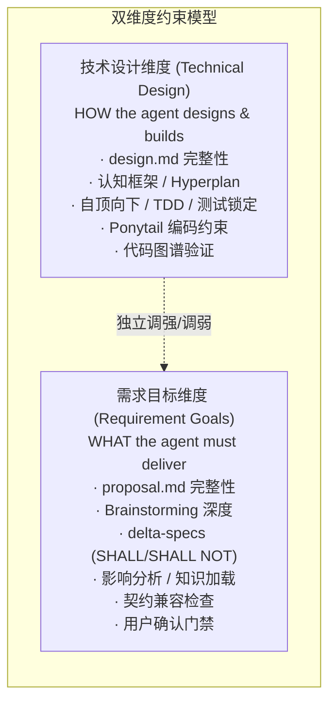
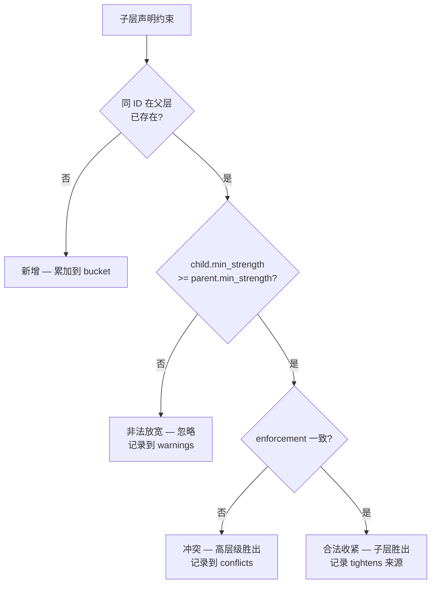
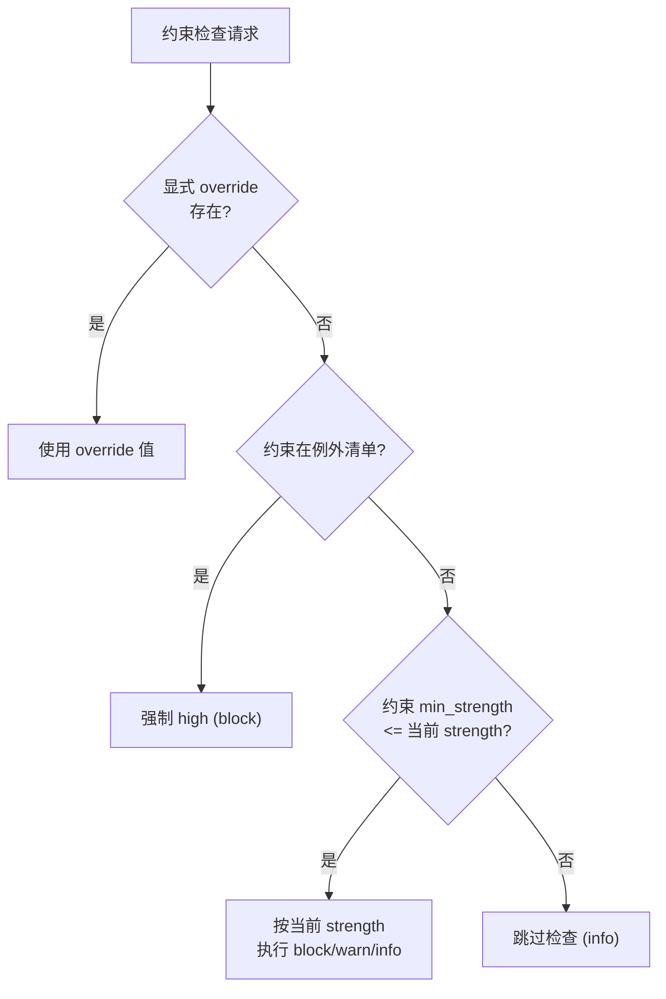
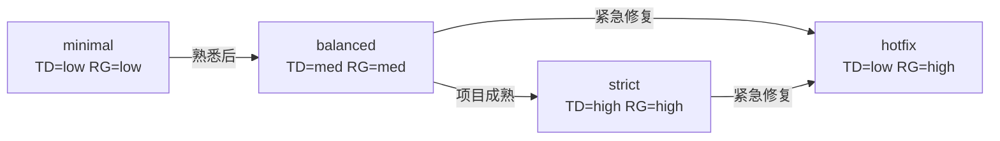

# Constraint Strength — 动态约束强度系统

> **Source**: `docs/design/constraint-strength.md` | **Type**: docs | **Imported**: 2026-07-31

## Summary

> 层级: Level 1 设计文档 | 所属层: 横切所有层（Spec / Change / Guard / AI Integration）

## Original Content

# Constraint Strength — 动态约束强度系统

> 层级: Level 1 设计文档 | 所属层: 横切所有层（Spec / Change / Guard / AI Integration）

---

## 0. 设计目标

MumuSpec 的核心目标是**创建独立于代码的、基于"技术设计 + 需求目标"两个维度的持久化正反向约束指导 agent 的工作**。

为达成此目标，约束系统 SHALL 满足以下要求：

1. **持久化** — 约束定义存储在 `.mumuspec/` 下，版本化管理，不随代码删除而消失
2. **独立于代码** — 约束描述"agent 应该 / 不应该做什么"，不引用具体代码路径或符号
3. **双维度** — 沿"技术设计"和"需求目标"两条独立轴线组织，可分别调强或调弱
4. **正反向并重** — 正向（SHALL）指明必达目标，反向（SHALL NOT）划定不可逾越红线
5. **动态可调** — 三档强度（high / medium / low）按团队成熟度、项目阶段、变更类型动态切换
6. **渐进式放开** — 强度调低时，工作流限制逐级放开，不出现"全开 / 全关"的二元跳变

---

## 1. 当前 LLM 约束分析（基线）

在引入动态强度前，MumuSpec 0.11.0 设计中已存在的 LLM 约束可归为 7 类：

| # | 约束类别 | 当前形态 | 强度可调性 | 来源文档 |
|---|---------|---------|-----------|---------|
| C1 | 工作流规则 | 4 项二值开关（worktree / single_active / top_down / tdd_enforced） | 仅 on/off | [change-layer.md §四大工作流规则](change-layer.md) |
| C2 | Phase Guard 阻断 | 5 个正向转换守卫 + 4 个回退守卫，硬性 block | 不可调 | [phase-guards.md](../reference/phase-guards.md) |
| C3 | 认知框架 Q1-Q4 | full 工作流强制启用，5 轮收敛，Q4 ≥3 维度 | 仅 enable/disable | [cognitive-framework.md](../reference/cognitive-framework.md) |
| C4 | Hyperplan 对抗审查 | 触发条件满足即执行，5 critic + 3 round 固定 | 仅 enable/disable | [skill-ecosystem.md](../reference/skill-ecosystem.md) |
| C5 | Brainstorming | "跳过此步骤被禁止"，必须多轮 | 不可调 | [skills/mumuspec-open.md](../reference/skills/mumuspec-open.md) |
| C6 | 测试不可变性 | design_locked + suites_hash 全程锁定 | 不可调 | [phase-guards.md](../reference/phase-guards.md) |
| C7 | Ponytail 编码约束 | 7 级阶梯强制 + `strict_no_new_deps` | 仅 enable/disable | [spec-layer.md §2](spec-layer.md) |
| C8 | 影响分析 / 知识加载 / 契约检查 | "立即执行，跳过被禁止" | 不可调 | [skills/mumuspec-open.md](../reference/skills/mumuspec-open.md) |
| C9 | decisions.md hash | content_hash 强制校验防篡改 | 不可调 | [phase-guards.md](../reference/phase-guards.md) |

### 1.1 当前形态的三大问题

1. **二元化** — 大多数约束只有"强制 / 关闭"两态，缺乏中间档位
2. **单维度** — 所有约束混在一起，无法区分"技术设计严谨度"与"需求目标完整度"
3. **代码耦合** — 约束检查多依赖代码状态（图谱、test-cases hash），缺少独立于代码的持久化约束层

### 1.2 与"内部强制、外部兼容"哲学的关系

约束强度系统 **不改变** 设计哲学边界：
- **内部强制** 仍然适用：使用 MumuSpec 管理的项目，按配置的强度等级强制执行
- **外部兼容** 仍然适用：外部 Skill 不受 MumuSpec 约束强度影响
- 强度系统只是把"内部强制的程度"从二值变为三档

---

## 2. 双维度约束模型

### 2.1 两个维度



| 维度 | 回答 | 主要约束类别 | 失败成本 |
|------|------|-------------|---------|
| **技术设计** (TD) | HOW — 如何设计与实现 | C1（部分）/ C2 / C3 / C4 / C6 / C7 / C8（图谱） | 架构腐化、技术债、回归 bug |
| **需求目标** (RG) | WHAT — 必须达成什么 | C1（部分）/ C5 / C8（影响/知识/契约）/ C9 + 用户门禁 | 范围蔓延、做错事、契约断裂 |

### 2.2 维度独立性

两个维度 **完全独立可配置**，允许 9 种组合：

| 组合 | 场景 |
|------|------|
| TD=high + RG=high | 默认配置，新项目 / 团队不熟 / 关键系统 |
| TD=high + RG=medium | 重构类变更（技术严谨，需求明确） |
| TD=high + RG=low | 罕见，不推荐 |
| TD=medium + RG=high | 新功能开发（需求严，技术可灵活） |
| TD=medium + RG=medium | 熟悉项目的常规迭代 |
| TD=medium + RG=low | 探索性原型 |
| TD=low + RG=high | 紧急 hotfix（保需求正确，省技术流程） |
| TD=low + RG=medium | 简单 tweak |
| TD=low + RG=low | 教学 demo / 一次性脚本 |

### 2.3 维度优先级规则

当两个维度的约束发生冲突时：

1. **SHALL NOT（反向禁止）优先于 SHALL（正向要求）** — 不论维度
2. **需求目标 SHALL NOT > 技术设计 SHALL NOT** — 避免做错事比避免技术债更重要
3. **需求目标 SHALL > 技术设计 SHALL** — 范围正确优先于实现完美
4. **High strength > Low strength** — 同类约束以更严格者为准

---

## 3. 三档强度定义

### 3.1 强度语义

| 强度 | 语义 | 阻断行为 | 适用场景 |
|------|------|---------|---------|
| **high** | 强制执行（block） | Pre-commit / Phase Guard 阻断 | 新项目、关键系统、团队不熟 |
| **medium** | 推荐执行（warn） | 输出 WARN，记录到 decisions.md，不阻断 | 成熟项目常规迭代 |
| **low** | 提示执行（info） | 输出 INFO，仅在 verify.md 汇总 | 紧急修复、原型探索、教学 |

### 3.2 例外：不可降级的约束

以下约束 **不论强度等级** 始终保持 high（不可配置降级）：

| 约束 | 原因 |
|------|------|
| `archive-completed` 终态守卫 | 防止已归档变更被修改 |
| `discard_change` 用户确认 | 防止 AI 自动废弃变更 |
| 不可变字段 hash 校验（`git_merge.commit_sha`） | 防止合并状态被篡改 |
| 安全/敏感信息扫描 | 不可妥协 |
| SHALL NOT 在 CI/CD 阶段 | Low 强度下 Pre-commit 可降为 WARN，但 CI 仍阻断 |

> 例外清单可在 `.mumuspec/config.yaml` 中通过 `constraint_strength.exceptions` 查看，但 **不可关闭**。

---

## 4. 强度映射矩阵

### 4.1 技术设计维度 (TD)

| 约束项 | high | medium | low |
|--------|------|--------|-----|
| `design.md` 完整性 | 必需，覆盖所有 affected_scopes 层级 | 必需，至少根层 + 受影响层 | 可选，仅作为设计备注 |
| 自顶向下设计顺序 | 强制 Level 0→N 逐层 | 推荐，允许模块内跳跃 | 关闭 |
| 认知框架 Q1-Q4 | full 工作流强制启用，5 轮收敛，Q4 ≥3 维度 | 可选，最多 3 轮，Q4 ≥1 维度 | 关闭 |
| Hyperplan 对抗审查 | 触发条件满足即执行，5 critic + 3 round | 用户显式触发，3 critic + 1 round | 关闭 |
| 代码图谱验证 | 必需（确认无破坏性调用链） | 推荐（仅检查直接调用） | 关闭 |
| Ponytail 编码约束 | 强制 7 级阶梯检查 + `strict_no_new_deps` | 仅 YAGNI + 复用检查 | 关闭 |
| `build_layers` 计划 | 必需，多层 | 必需，单层即可 | 可选 |
| 测试用例设计 | 每层 cases.md + design_locked | 至少 layer-0-cases.md + design_locked | 可选（hotfix 路径） |
| 测试套件锁定 | suites_hash 全程锁定 | 仅 design_locked，suites_hash 软校验 | 关闭 |
| TDD 红绿循环 | 强制 Red→Green→Refactor | 测试存在即可，不强制循环 | 关闭 |

### 4.2 需求目标维度 (RG)

| 约束项 | high | medium | low |
|--------|------|--------|-----|
| `proposal.md` 完整性 | 必需：目标 / 非目标 / 范围 / 影响 / 验收场景 | 必需：目标 / 范围 / 影响 | 简要描述即可 |
| Brainstorming 深度 | 必需多轮（≤5 轮），含选项式 Q&A | 必需，单轮即可 | 可选，记录跳过理由 |
| `delta-specs/` | 必需 SHALL + SHALL NOT | 必需 SHALL，SHALL NOT 推荐 | 可选，可在 Build 阶段补 |
| 影响分析 | 必需 `gitnexus-impact-analysis` | 推荐，可简化为文件级 | 关闭 |
| 历史知识加载 | 必需 `mumuspec knowledge context` | 推荐 | 关闭 |
| 契约兼容检查 | 必需 `mumuspec contract compat-check` | 推荐 | 关闭 |
| 用户确认门禁 | 全部 18 个 BP 阻塞点生效 | 仅 BP-3 / BP-4 / BP-8 / BP-14 / BP-17 | 仅 BP-17（归档最终确认） |
| `decisions.md` | 每阶段 ≥1 条 + content_hash 校验 | 每阶段 ≥1 条，无 hash 校验 | 可选，仅归档阶段 |
| 单一活跃变更 | 强制（`workflow.single_active_change: true`） | 软警告，允许 ≤3 并行 | 关闭 |
| Worktree 隔离 | 强制（`workflow.worktree_isolation: true`） | 推荐，允许 branch 降级 | 关闭 |

### 4.3 跨维度约束（基于优先级规则求值）

| 约束类型 | 求值规则 |
|---------|---------|
| SHALL NOT (TD) | 取 TD 强度，但 low 时仍 WARN（CI 阻断） |
| SHALL NOT (RG) | 取 RG 强度，但 low 时仍 WARN（CI 阻断） |
| SHALL (TD) | 取 TD 强度 |
| SHALL (RG) | 取 RG 强度 |
| SHOULD / MAY | 始终 info 级别 |

---

## 5. 持久化约束文件

### 5.1 设计原则

约束文件 **独立于代码**：
- 不引用具体代码符号、文件路径、函数名
- 描述 agent 应做 / 不应做的 **行为准则**，而非代码状态
- 即使代码全部删除，约束文件仍有意义

### 5.2 文件位置

约束文件按**目录树分层存放**，与 `spec.md` 完全对齐——每个目录的 `.mumuspec/` 下可有独立的 `constraints.yaml`。根层为 Level 0，子层自动继承父层约束。

```
my-project/
├── .mumuspec/                          # 根层 (Level 0)
│   ├── config.yaml                     # 全局配置（含 constraint_strength）
│   ├── constraints.yaml                # ← 根层约束（项目级不变量）
│   ├── spec.md
│   ├── design.md
│   └── prohibitions.md
├── src/
│   ├── .mumuspec/                      # Level 1
│   │   └── constraints.yaml            # ← src 层约束（继承 + 收紧根层）
│   └── api/
│       └── .mumuspec/                  # Level 2
│           └── constraints.yaml        # ← src/api 层约束（继承 + 收紧）
└── tests/
    └── .mumuspec/                      # Level 1
        └── constraints.yaml            # ← tests 层约束（更宽松的测试策略）
```

> **设计原则**：约束文件的树状分布与 `spec.md` 完全一致，遵循 [Spec Layer §3 继承规则](spec-layer.md#3-树状目录结构--渐进式披露)。子层可收紧但不可放宽父层约束。

### 5.3 `constraints.yaml` 文件格式（单层）

每个 `constraints.yaml` 描述**本层及直接子层概要**的约束。文件格式如下：

```yaml
# .mumuspec/constraints.yaml
# 持久化正反向约束 — 独立于代码，指导 agent 工作
# 由 mumuspec constraints 命令管理，可手工编辑

version: "0.2.0"               # 0.12.1+ 起支持树状字段
last_updated: "2026-07-27"

# 本层 scope 与 layer（可选；缺失时由文件路径推断）
layer: 0
scope: "."

# 强度覆盖（本层及未覆盖的子层）。缺省时继承父层；
# 根层缺省时回退到 config.yaml: constraint_strength.*
strength:
  technical_design: high        # high | medium | low
  requirement_goals: high       # high | medium | low

# 正向约束 (SHALL) — agent 必须做到
forward:
  technical_design:
    - id: TD-SHALL-001
      content: "design.md 必须覆盖所有 affected_scopes 涉及的层级"
      min_strength: high         # high 及以上强制；medium/low 降为 warn/info
      enforcement: "phase_guard: design_to_build"
      category: "design_completeness"

    - id: TD-SHALL-002
      content: "测试用例必须在 Design 阶段定义并锁定（design_locked=true）"
      min_strength: medium
      enforcement: "test_cases.design_locked"
      category: "test_design"

    - id: TD-SHALL-003
      content: "新代码必须遵循 Ponytail 7 级优先级阶梯"
      min_strength: high
      enforcement: "ponytail_compliance_check"
      category: "coding_constraint"

  requirement_goals:
    - id: RG-SHALL-001
      content: "proposal.md 必须包含目标、非目标、影响范围、验收场景"
      min_strength: high
      enforcement: "phase_guard: open_to_design"
      category: "proposal_completeness"

    - id: RG-SHALL-002
      content: "每个变更必须有至少一个 delta-spec（含 SHALL）"
      min_strength: medium
      enforcement: "phase_guard: open_to_design"
      category: "spec_coverage"

    - id: RG-SHALL-003
      content: "归档前必须用户显式确认（BP-17）"
      min_strength: low          # 即使 low 也强制（例外清单）
      enforcement: "phase_guard: verify_to_archive"
      category: "user_gate"

# 反向约束 (SHALL NOT) — agent 绝不能做
reverse:
  technical_design:
    - id: TD-SHALL-NOT-001
      content: "禁止跳过 Design 阶段直接编码（hotfix/tweak 预设除外）"
      min_strength: medium
      enforcement: "phase_guard: design_to_build"
      category: "phase_integrity"

    - id: TD-SHALL-NOT-002
      content: "禁止引入未被 design.md 声明的新依赖"
      min_strength: high
      enforcement: "ponytail_drift"
      category: "dependency_hygiene"

    - id: TD-SHALL-NOT-003
      content: "禁止篡改已锁定的 test-cases/ 哈希"
      min_strength: low          # 例外：始终强制
      enforcement: "test_immutability_drift"
      category: "test_immutability"

  requirement_goals:
    - id: RG-SHALL-NOT-001
      content: "禁止无 delta-specs 的变更进入 Build 阶段"
      min_strength: medium
      enforcement: "phase_guard: open_to_design"
      category: "spec_coverage"

    - id: RG-SHALL-NOT-002
      content: "禁止 AI 自动发起 Discard 操作"
      min_strength: low          # 例外：始终强制
      enforcement: "discard_change_guard"
      category: "user_gate"

    - id: RG-SHALL-NOT-003
      content: "禁止绕过用户确认门禁（BP-1~BP-18）"
      min_strength: high
      enforcement: "blocking_point_check"
      category: "user_gate"

# 元数据
metadata:
  generated_by: "mumuspec constraints init"
  source_specs:                  # 自动从哪些 spec.md 汇总
    - ".mumuspec/spec.md"
    - "src/.mumuspec/spec.md"
  custom_constraints_count: 0    # 项目自定义约束数
```

### 5.4 子层文件示例

子层文件**只需声明本层新增或收紧的约束**，其余从父层继承：

```yaml
# src/api/.mumuspec/constraints.yaml
# Level 2 — src/api 层。继承根层 + src 层的约束。
version: "0.2.0"
last_updated: "2026-07-27"
layer: 2
scope: "src/api"

# 本层强度收紧（仅 TD，RG 继承父层）
strength:
  technical_design: high         # 父层若是 medium，本层收紧为 high（合法）
  # requirement_goals 缺省 → 继承父层

# 本层新增的 API 层专属约束
forward:
  technical_design:
    - id: TD-SHALL-API-001
      content: "所有 public API 必须有契约定义（contracts/outbound/）"
      min_strength: high
      enforcement: "contract_drift_check"
      category: "api_contract"
  # requirement_goals 缺省 → 继承父层

reverse:
  technical_design:
    # 收紧父层 TD-SHALL-NOT-002：根层允许 medium，本层收紧为 high
    - id: TD-SHALL-NOT-002
      content: "禁止引入未被 design.md 声明的新依赖（API 层：零例外）"
      min_strength: high         # 必须 ≥ 父层（根层是 high，等价收紧）
      enforcement: "ponytail_drift"
      category: "dependency_hygiene"
      tightens:                  # 显式标注收紧来源
        layer: 0
        scope: "."
        id: TD-SHALL-NOT-002

    # 本层新增禁止项
    - id: TD-SHALL-NOT-API-001
      content: "API 层禁止直接访问数据库（必须经 service 层）"
      min_strength: high
      enforcement: "code_graph:layer_separation"
      category: "architecture_separation"
```

### 5.5 与现有 `spec.md` 的关系

| 文件 | 内容 | 与代码关系 | 时序 |
|------|------|-----------|------|
| `spec.md` | 业务级 SHALL / SHALL NOT（按层组织） | 与代码强绑定（漂移检测） | 随变更演进 |
| `prohibitions.md` | SHALL NOT 汇总（按层继承） | 与代码强绑定 | 随变更演进 |
| `constraints.yaml` | **行为级**正反向约束（agent 行为准则） | **独立于代码** | 持久化，跨变更 |

**约束来源**：
- `constraints.yaml` 中的条目 **可由** `spec.md` 的 SHALL/SHALL NOT 自动派生（通过 `mumuspec constraints sync`）
- 也 **可由** 项目手工添加（自定义约束，如团队规范、合规要求）
- 派生条目通过 `source_specs` 字段追踪来源

### 5.6 树状层级与继承（0.12.1+）

约束文件按目录树分层存放，**底层级受高层级约束，冲突时以高层级为准**。这是 `constraints.yaml` 与 Spec Layer 树状分布对齐的关键设计。

#### 5.6.1 继承规则

子层自动继承父层的所有约束（forward + reverse × td + rg），并可在本层进行以下三种操作：

| 操作 | 含义 | 合法性 |
|------|------|--------|
| **新增（extend）** | 声明父层没有的新约束 ID | ✅ 始终合法 |
| **收紧（tighten）** | 同 ID，`min_strength` 提高或 `content` 范围收窄 | ✅ 合法 |
| **放宽（relax）** | 同 ID，`min_strength` 降低或 `content` 范围扩大 | ❌ 非法，被忽略并 WARN |

> 与 [Spec Layer §3 继承规则](spec-layer.md#3-树状目录结构--渐进式披露) 一致：**子层可收紧不可放宽；SHALL NOT 累加不覆盖**。

#### 5.6.2 累加与覆盖语义

| 约束类型 | 跨层语义 | 示例 |
|---------|---------|------|
| **SHALL NOT（反向）** | 累加（union） — 所有层的禁止项都生效 | 根层禁止依赖 X；子层禁止依赖 Y → 子层同时禁 X、Y |
| **SHALL（正向）** | 累加（union） — 所有层的要求都需满足 | 根层要求 design.md；子层要求 API 契约 → 子层两者都要 |
| **同 ID 冲突（enforcement 不同）** | 高层级优先（`highest_layer_wins`） | 根层 `TD-SHALL-001: enforcement=A`；子层同 ID `enforcement=B` → 根层胜出，子层记入 `conflicts.losers` |
| **同 ID 非法放宽** | 忽略子层，父层保留（`manual_review`） | 根层 `TD-SHALL-001: min=high`；子层同 ID `min=low` → 根层保留，子层记入 `conflicts.losers` + `warnings` |
| **同 ID 合法收紧** | 子层胜出（不产生 conflict） | 根层 `TD-SHALL-001: min=medium`；子层同 ID `min=high` → 子层替换父层条目，`tightens` 字段记录来源 |

#### 5.6.3 冲突解决流程



#### 5.6.4 强度的层级继承

`strength` 字段同样遵循继承：

```yaml
# 根层 .mumuspec/constraints.yaml
strength:
  technical_design: medium       # 项目级默认
  requirement_goals: high

# src/api/.mumuspec/constraints.yaml（子层）
strength:
  technical_design: high         # 收紧（合法：high > medium）
  # requirement_goals 缺省 → 继承根层的 high
```

强度继承规则：

1. 子层 `strength.<dim>` 缺省 → 继承父层
2. 子层 `strength.<dim>` 显式设置 → 必须 ≥ 父层（否则忽略，WARN）
3. 根层 `strength.<dim>` 缺省 → 回退到 `config.yaml: constraint_strength.<dim>`
4. 子层无法降低父层的强度等级

#### 5.6.5 解析后的 `ConstraintTreeNode`

`mumuspec constraints resolve` 命令将整棵约束树解析为 `ConstraintTreeNode`，每个节点包含：

```typescript
interface ConstraintTreeNode {
  layer: number;                 // 0 = 根
  scope: string;                 // "." | "src" | "src/api" | ...
  strength: { td: Strength; rg: Strength };
  forward: { td: Entry[]; rg: Entry[] };  // 含 inherited + local
  reverse: { td: Entry[]; rg: Entry[] };
  children: Map<string, ConstraintTreeNode>;
  parent: ConstraintTreeNode | null;
}
```

每个 `Entry` 携带 `inherited: boolean` 与 `tightens?: { layer, scope, id }` 元数据，便于审计。

#### 5.6.6 冲突审计

冲突不阻断解析，但全部记录到 `ConstraintTreeResolution.conflicts`：

```typescript
interface ConstraintConflict {
  id: string;                            // 冲突的约束 ID
  dimension: 'technical_design' | 'requirement_goals';
  direction: 'forward' | 'reverse';
  winner: ConstraintEntry;               // 高层级（layer 数字小）
  losers: ConstraintEntry[];             // 低层级尝试覆盖者
  resolution: 'highest_layer_wins' | 'manual_review';
  // 注：合法收紧不产生 conflict，仅记录到 ConstraintEntry.tightens
}
```

`mumuspec constraints resolve --scope <path>` 输出该 scope 的有效约束集 + 冲突清单，agent 加载约束时优先读取解析结果而非原始文件。

#### 5.6.7 合法收紧与冲突的区分

设计原则：**合法收紧不是冲突，不产生 `ConstraintConflict` 记录**。

| 场景 | 处理方式 | 记录位置 |
|------|---------|---------|
| 子层同 ID，`min_strength` ≥ 父层，`enforcement` 一致 | 合法收紧 — 子层胜出，父层条目被替换 | `ConstraintEntry.tightens` 字段 |
| 子层同 ID，`min_strength` < 父层 | 非法放宽 — 忽略子层，父层保留 | `conflicts[]` (resolution=`manual_review`) + `warnings[]` |
| 子层同 ID，`enforcement` 不同 | 收紧失败 — 父层保留 | `conflicts[]` (resolution=`highest_layer_wins`) + `warnings[]` |
| 同层文件中重复声明同 ID | 同层重复 — 首声明胜出 | `conflicts[]` (resolution=`highest_layer_wins`) + `warnings[]` |

```typescript
interface ConstraintConflict {
  id: string;
  dimension: 'technical_design' | 'requirement_goals';
  direction: 'forward' | 'reverse';
  winner: ConstraintEntry;
  losers: ConstraintEntry[];
  resolution: 'highest_layer_wins' | 'manual_review';  // 不含 'tightening_allowed'
}
```

> `resolution: 'tightening_allowed'` 在 0.12.1 草案中曾出现，但在最终实现中移除：合法收紧不产生冲突记录，仅通过 `ConstraintEntry.tightens` 字段标注继承来源。

### 5.7 与 `decisions.md` 的关系

`decisions.md` 记录"为什么这么做"的决策，`constraints.yaml` 记录"必须 / 不能做什么"的约束。两者互补：
- 决策可被新决策推翻（superseded）
- 约束只能被显式删除或降级（min_strength 调整）
- 约束触发时，agent SHOULD 在 `decisions.md` 记录该约束的执行情况

---

## 6. 工作流限制的渐进式放开

### 6.1 强度与工作流规则的关系

四大工作流规则（C1）按维度归类后，强度联动如下：

| 工作流规则 | 维度归属 | high | medium | low |
|-----------|---------|------|--------|-----|
| `worktree_isolation` | RG | 强制 | 推荐（允许 branch 降级） | 关闭 |
| `single_active_change` | RG | 强制（1 个） | 软警告（≤3 并行） | 关闭（无上限，WARN） |
| `top_down_design` | TD | 强制（Level 0→N） | 推荐（允许模块内跳跃） | 关闭 |
| `tdd_enforced` | TD | 强制（Red→Green→Refactor） | 测试存在即可 | 关闭 |

> `workflow.*` 配置项若显式设置，**优先于** 强度等级（覆盖）。未设置时按强度等级求值。

### 6.2 Phase Guard 渐进式放开

每个 Phase Guard 检查项标注 `min_strength` 字段，求值规则：

```typescript
function shouldEnforce(check: GuardCheck, strength: Strength): boolean {
  if (check.exceptions?.includes('always_enforce')) return true;
  return strengthRank(strength) >= strengthRank(check.min_strength);
}

function enforceAction(check: GuardCheck, actualStrength: Strength): 'block' | 'warn' | 'info' {
  if (shouldEnforce(check, actualStrength)) {
    return actualStrength === 'high' ? 'block' : actualStrength === 'medium' ? 'warn' : 'info';
  }
  return 'info';
}
```

#### `open_to_design` 守卫检查项分级

| 检查项 | 维度 | min_strength | high | medium | low |
|--------|------|--------------|------|--------|-----|
| proposal.md 存在且非空 | RG | low | block | block | block |
| proposal.md 含目标/非目标/范围/验收 | RG | high | block | warn | info |
| delta-specs/ 至少一个 spec 文件 | RG | medium | block | block | warn |
| affected_scopes 已定义 | RG | medium | block | block | warn |
| impact-analysis.json 存在 | RG | medium | block | warn | info |
| single_active_change: true | RG | high | block | warn | info |
| worktree_created: true | RG | high | block | warn | info |
| brainstorming_completed: true | RG | high | block | warn | info |
| knowledge_context_loaded: true | RG | high | block | warn | info |
| decisions_log.counts.open > 0 | RG | medium | block | block | warn |
| decisions_log.content_hash matches | RG | high | block | warn | info |
| user_confirmed: true (BP-3) | RG | low | block | block | block |

#### `design_to_build` 守卫检查项分级

| 检查项 | 维度 | min_strength | high | medium | low |
|--------|------|--------------|------|--------|-----|
| design.md 存在且非空 | TD | low | block | block | block |
| design.md 覆盖所有 affected 层级 | TD | high | block | warn | info |
| constraints/ 存在 | TD | medium | block | block | warn |
| build_layers 已定义 | TD | medium | block | block | warn |
| design_layers_covered: [0,1,2,3] | TD | high | block | warn | info |
| each_layer_shall_defined: true | TD | high | block | warn | info |
| test-cases/ 每层至少一个 cases.md | TD | high | block | warn | info |
| test-cases/ 至少 layer-0-cases.md | TD | medium | block | block | warn |
| test_cases.design_locked: true | TD | medium | block | block | warn |
| test_cases.design_content_hash matches | TD | high | block | warn | info |
| tdd_mode == "tdd" | TD | high | block | warn | info |
| cognitive_framework.converged: true | TD | high | block | warn | info |
| cognitive_framework.q4_scans >= 3 | TD | high | block | warn | info |
| hyperplan_result.hard_constraints merged | TD | high | block | warn | info |
| ponytail_constraints_defined: true | TD | high | block | warn | info |
| user_confirmed: true (BP-4) | RG | low | block | block | block |

#### `build_to_verify` 守卫检查项分级

| 检查项 | 维度 | min_strength | high | medium | low |
|--------|------|--------------|------|--------|-----|
| all tasks.md items checked | TD | medium | block | block | warn |
| code committed | TD | medium | block | block | warn |
| build_layers all status = done | TD | medium | block | block | warn |
| build_layers bottom-up order | TD | high | block | warn | info |
| each layer enforcement passed | TD | high | block | warn | info |
| code-graph updated | TD | high | block | warn | info |
| test_cases.design_locked: true | TD | medium | block | block | warn |
| test_cases.design_content_hash matches | TD | high | block | warn | info |
| test_cases.suites_locked: true | TD | high | block | warn | info |
| all layer suite hashes match | TD | high | block | warn | info |
| all test suites passed (green) | TD | high | block | warn | info |
| ponytail_compliance_checked: true | TD | high | block | warn | info |
| decisions_log.counts.build > 0 | RG | medium | block | block | warn |
| decisions_log.content_hash matches | RG | high | block | warn | info |

#### `verify_to_archive` 守卫检查项分级

| 检查项 | 维度 | min_strength | high | medium | low |
|--------|------|--------------|------|--------|-----|
| verify_result: pass | TD+RG | low | block | block | block |
| verify.md exists | TD+RG | low | block | block | block |
| all SHALL enforcements passed | TD | high | block | warn | info |
| all SHALL NOT enforcements passed | TD | low | block | block | block |
| no critical drift detected | TD | low | block | block | block |
| code-graph integrity verified | TD | high | block | warn | info |
| all build_layers verified | TD | medium | block | block | warn |
| test_immutability_verified | TD | low | block | block | block |
| decisions_log.counts.verify > 0 | RG | medium | block | block | warn |
| user_confirmed: true (BP-17) | RG | low | block | block | block |

### 6.3 阻塞点（Blocking Points）分级

18 个阻塞点按维度和强度分级：

| 阻塞点 | 阶段 | 维度 | min_strength | 说明 |
|--------|------|------|--------------|------|
| BP-1 | Open | RG | high | 需求澄清完成确认（medium/low 跳过） |
| BP-2 | Open | RG | high | PRD 拆分决策 |
| BP-3 | Open | RG | low | 工件审查与确认（**始终生效**） |
| BP-4 | Design | RG | low | 设计方案确认（**始终生效**） |
| BP-5 | Design | TD | high | 认知框架 Q2 回答 |
| BP-6 | Design | TD | high | 认知框架 Q3 确认 |
| BP-7 | Design | TD | high | Hyperplan 开放问题 |
| BP-8 | Design | TD | medium | 测试用例锁定确认 |
| BP-9 | Build | TD | high | 计划暂停选择 |
| BP-10 | Build | TD | high | 工作流配置选择 |
| BP-11 | Build | TD | high | 分支命名确认 |
| BP-12 | Build | TD | high | 规范增量更新 |
| BP-13 | Build | RG | high | 范围扩展拆分 |
| BP-14 | Verify | RG | low | 验证失败修复/接受偏差（**始终生效**） |
| BP-15 | Verify | TD | high | 测试失败处理 |
| BP-16 | Verify | TD | high | 分支处理方式 |
| BP-17 | Archive | RG | low | 归档最终确认（**始终生效**） |
| BP-18 | 预设 | RG | medium | 升级条件触发 |

> `min_strength: low` 的阻塞点列入 **例外清单**，不论强度等级始终生效。

---

## 7. Skill 分发的强度联动

`skills.dispatch` 配置项随强度联动：

| 分发策略 | high | medium | low |
|---------|------|--------|-----|
| `required_skill_missing` | block | warn | skip |
| `shall_violation` | block | warn | info |
| `shall_not_violation` | block | block | warn（CI 仍 block） |
| `skill_timeout` | 300s（固定） | 300s | 60s |
| `parallel_dispatch` | false | false | true（允许） |

Hyperplan 配置随强度联动：

| Hyperplan 配置 | high | medium | low |
|---------------|------|--------|-----|
| `enabled` | true | true | false |
| `critic_count` | 5（固定） | 3（降级） | — |
| `max_rounds` | 3（固定） | 1（降级） | — |
| `trigger_conditions.min_affected_scopes` | 3 | 5（更难触发） | — |

---

## 8. 配置与命令

### 8.1 配置示例

```yaml
# .mumuspec/config.yaml
constraint_strength:
  technical_design: high       # high | medium | low
  requirement_goals: high       # high | medium | low
  
  # 例外清单（只读，不可关闭）
  exceptions:
    - archive_terminal_state
    - discard_user_confirmation
    - commit_sha_immutability
    - sensitive_info_scan
    - shall_not_violation_in_ci
    - bp_03_user_confirmation
    - bp_04_design_confirmation
    - bp_14_verify_failure
    - bp_17_archive_confirmation
  
  # 显式覆盖（高级用户，优先级高于强度等级）
  overrides:
    workflow:
      worktree_isolation: inherit       # inherit | true | false
      single_active_change: inherit
      top_down_design: inherit
      tdd_enforced: inherit
    cognitive_framework: inherit        # inherit | required | optional | off
    hyperplan: inherit                  # inherit | required | conditional | off
    brainstorming: inherit              # inherit | required | lightweight | off
    test_immutability: inherit          # inherit | strict | design_only | off
    impact_analysis: inherit            # inherit | required | recommended | off
```

### 8.2 CLI 命令

```bash
# 查看当前约束强度
mumuspec constraints strength

# 设置约束强度（项目级）
mumuspec constraints strength --td high --rg medium

# 单次变更覆盖（不修改 config.yaml）
mumuspec constraints strength --change <name> --td low --rg medium

# 初始化持久化约束文件
mumuspec constraints init

# 从 spec.md 同步约束到 constraints.yaml
mumuspec constraints sync

# 列出所有约束（按维度过滤）
mumuspec constraints list --dimension td
mumuspec constraints list --dimension rg
mumuspec constraints list --type shall-not

# 添加自定义约束
mumuspec constraints add \
  --dimension td \
  --type shall-not \
  --content "禁止使用 var 关键字声明变量" \
  --min-strength medium

# 验证当前变更是否满足约束
mumuspec constraints check --change <name>

# 解析约束树（0.12.1+）
mumuspec constraints resolve                  # 全树解析，输出 root + conflicts
mumuspec constraints resolve --scope src/api  # 仅输出该 scope 的有效约束集
mumuspec constraints resolve --conflicts-only # 仅输出冲突清单
```

### 8.3 预设强度组合

```bash
# 新项目 / 关键系统（默认）
mumuspec constraints preset strict       # TD=high, RG=high

# 成熟项目常规迭代
mumuspec constraints preset balanced     # TD=medium, RG=medium

# 紧急 hotfix 场景
mumuspec constraints preset hotfix       # TD=low, RG=high

# 探索性原型
mumuspec constraints preset exploratory  # TD=medium, RG=low

# 教学 demo
mumuspec constraints preset minimal      # TD=low, RG=low
```

---

## 9. 求值流程

### 9.1 强度求值顺序



### 9.2 强度求值伪代码

```typescript
type Strength = 'high' | 'medium' | 'low';
type Dimension = 'technical_design' | 'requirement_goals';

interface ConstraintCheck {
  id: string;
  dimension: Dimension;
  min_strength: Strength;
  always_enforce?: boolean;  // 例外清单
}

function evaluate(
  check: ConstraintCheck,
  config: ConstraintStrengthConfig,
): { action: 'block' | 'warn' | 'info'; reason: string } {
  // 1. 例外清单：始终 high
  if (check.always_enforce || config.exceptions.includes(check.id)) {
    return { action: 'block', reason: 'exception: always enforce' };
  }

  // 2. 显式 override 优先
  const override = config.overrides?.[check.dimension];
  if (override && override !== 'inherit') {
    return actionByStrength(override);
  }

  // 3. 当前强度低于 min_strength：跳过
  const current = config.strength[check.dimension];
  if (rank(current) < rank(check.min_strength)) {
    return { action: 'info', reason: `strength ${current} < min ${check.min_strength}` };
  }

  // 4. 按当前强度执行
  return actionByStrength(current);
}

function actionByStrength(s: Strength) {
  return s === 'high'
    ? { action: 'block' as const, reason: 'high strength' }
    : s === 'medium'
      ? { action: 'warn' as const, reason: 'medium strength' }
      : { action: 'info' as const, reason: 'low strength' };
}

function rank(s: Strength): number {
  return s === 'high' ? 3 : s === 'medium' ? 2 : 1;
}
```

---

## 10. 与现有系统的集成

### 10.1 与 Spec Layer 集成

- `spec.md` 中的 SHALL / SHALL NOT 自动派生到 `constraints.yaml`（`mumuspec constraints sync`）
- 派生条目 `source_specs` 字段追踪来源
- `constraints.yaml` 中的自定义约束不回写到 `spec.md`（避免循环）

### 10.2 与 Change Layer 集成

- 每个 Phase Guard 在执行前读取 `constraint_strength` 配置
- 守卫检查项的 `min_strength` 在 `phase-guards.md` 中标注
- 阻塞点 BP-1~BP-18 按 `min_strength` 求值
- `decisions.md` 记录每次强度变更与降级理由

### 10.3 与 Guard Layer 集成

- Pre-commit / CI 阶段的漂移检测按强度分级执行
- Low 强度下 Pre-commit 可降为 WARN，但 CI 仍阻断 SHALL NOT 违规
- 漂移检测 P0/P1/P2 与约束强度正交（独立配置）

### 10.4 与 AI Integration Layer 集成

- Rules 文件（CLAUDE.md / .cursorrules / AGENTS.md）生成时包含当前约束强度
- MCP Server 新增 `constraints.check` 工具供 AI 查询当前约束
- Skill 分发策略随强度联动（见 §7）

### 10.5 与 Knowledge Layer 集成

- `constraints.yaml` 纳入知识层索引（PageIndex）
- 约束变更视为知识更新，触发知识漂移检测
- 归档时提取约束执行情况到知识页面

---

## 11. 采用曲线

### 11.1 新用户零配置默认

`mumuspec init` 默认使用 `strict` 预设（TD=high, RG=high）—— 对新项目与不熟悉的代码库采用最安全的姿态,避免在团队尚未建立规范意识时过早放宽约束。熟悉后可通过 `mumuspec constraints preset balanced` 主动降级。

| 用户类型 | 推荐预设 | 强度组合 |
|---------|---------|---------|
| 新用户首次试用 | strict | TD=high, RG=high |
| 独立开发者个人项目 | balanced | TD=medium, RG=medium |
| 关键系统 / 生产项目 | strict | TD=high, RG=high |
| 紧急 hotfix | hotfix | TD=low, RG=high |
| 教学 demo | minimal | TD=low, RG=low |

### 11.2 强度升级路径



强度变更通过 `mumuspec constraints strength` 命令显式执行，记录到 `decisions.md`。

---

## 12. 版本演进

| 版本 | 变更 |
|------|------|
| 0.11.0 | 工作流规则从硬性约束降级为默认开启可配置（二元化） |
| **0.12.0** | **引入动态约束强度系统（本设计文档）**：双维度 + 三档强度 + 持久化 constraints.yaml |
| **0.12.1** | **constraints.yaml 树状层级化**：按目录树分层存放；子层继承父层约束可收紧不可放宽；同 ID 冲突高层级优先；新增 `resolveConstraintTree()` 解析器与冲突审计 |
| 0.13.0 | 预期：约束强度与 CI/CD 策略深度集成、跨项目约束共享 |

---

## 13. 开放问题

1. **跨变更强度一致性** — 同一项目内不同变更使用不同强度，是否允许？（当前：允许，但记录到 decisions.md）
2. **强度变更审计** — 强度变更是否需要 Tech Lead 审批？（当前：仅记录，不审批）
3. **约束冲突自动检测** — 当 `constraints.yaml` 与 `spec.md` 的 SHALL/SHALL NOT 冲突时如何处理？（当前：以 `spec.md` 为准，`constraints.yaml` 标记 conflict）
4. **强度等级细化** — 未来是否需要 4 档（如 very-high / high / medium / low）？（当前：3 档足够）
5. **机器学习自动调强** — 是否根据历史变更成功率自动调整强度？（当前：不实现，留给未来）
6. **跨层级冲突的显式覆盖** — 子层是否可在显式声明 `override_parent: true` 时突破"高层级优先"规则？（0.12.1 当前：不允许，留给 0.13 评估）

---

> **导航**: [← 变更层](change-layer.md) | [规范层 →](spec-layer.md) | [配置 →](../reference/configuration.md) | [返回概览](../overview.md)

