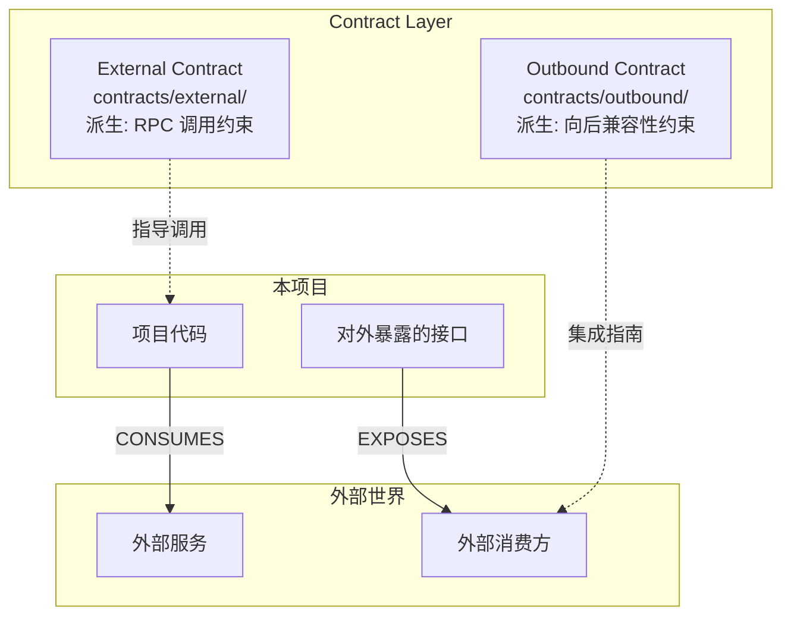
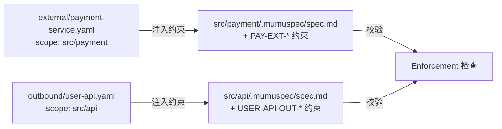

# Contract Layer — 外部服务契约与自身对外契约

> **Source**: `docs/design/contract-layer.md` | **Type**: docs | **Imported**: 2026-07-31

## Summary

> 层级: Level 1 设计文档 | 所属层: Contract Layer | 版本: 0.8.0 新增

## Original Content

# Contract Layer — 外部服务契约与自身对外契约

> 层级: Level 1 设计文档 | 所属层: Contract Layer | 版本: 0.8.0 新增

---

## 1. 契约分类与定位

在现代微服务架构中，项目既**消费**大量外部服务，又**对外暴露**自身的接口。Contract Layer 将这两类接口约定纳入规范体系，使 AI 能获取精确的接口约束。



| 契约类型 | 目录 | 核心问题 | 派生约束 |
|---------|------|---------|---------|
| **外部服务契约** | `contracts/external/` | "我如何正确调用外部服务？" | RPC 调用约束（超时、重试、错误处理、降级） |
| **自身对外契约** | `contracts/outbound/` | "外部如何正确集成我的服务？" | 向后兼容性约束（不删字段、不改语义、版本管理） |

> **与 spec.md 的关系**：`spec.md` 定义项目自身代码"做什么/不做什么"；Contract Layer 定义"与外部世界交互时做什么/不做什么"。契约派生的约束自动注入到对应层级 `spec.md`。

## 2. 契约目录结构

```
.mumuspec/contracts/
├── external/                        # 外部服务契约
│   ├── payment-service.yaml         # 支付服务（gRPC）
│   ├── user-center-api.yaml         # 用户中心（REST API）
│   └── _index.yaml
├── outbound/                        # 自身对外契约
│   ├── user-api.yaml                # 用户 API（REST）
│   ├── order-rpc.yaml               # 订单 RPC（gRPC）
│   └── _index.yaml
├── schemas/                         # 共享 Schema 定义
│   ├── common/                      # 公共类型（分页、错误码等）
│   └── enums/                       # 共享枚举
└── _registry.yaml                   # 契约注册表
```

## 3. 外部服务契约格式

描述项目依赖的外部服务，自动派生 RPC 调用约束：

```yaml
# contracts/external/payment-service.yaml
contract:
  type: external
  name: "payment-service"
  provider: "支付平台团队"
  category: rpc                     # rpc | rest | graphql | mq | middleware | database
  protocol: "gRPC"
  version: "v2.1.0"                 # 外部服务版本
  contract_version: "1.0.0"         # 本契约文件版本
  stability: stable                 # stable | beta | deprecated

service:
  name: "PaymentService"
  policies:                         # 服务级策略（派生约束来源）
    timeout: "5s"
    retry:
      max_attempts: 3
      backoff: "exponential"
      retryable_errors: [INTERNAL, UNAVAILABLE, DEADLINE_EXCEEDED]
    circuit_breaker:
      enabled: true
      failure_threshold: 5
      recovery_timeout: "30s"
  endpoints:
    - name: "CreatePayment"
      request: { message: "CreatePaymentRequest", fields: [...] }
      response: { message: "CreatePaymentResponse", fields: [...] }
      errors:
        - code: "INSUFFICIENT_FUNDS", retryable: false
        - code: "INTERNAL", retryable: true

# 派生约束（自动注入到对应层级 spec.md）
derived_constraints:
  scope: "src/payment"              # 约束注入目标层级
  shall:
    - id: "PAY-EXT-001"
      desc: "所有 PaymentService RPC 调用必须设置 5s 超时"
      enforcement: { type: "ast", check: "rpc-call-timeout(service=PaymentService, max=5s)" }
      severity: ERROR
    - id: "PAY-EXT-003"
      desc: "RPC 调用失败时必须按指数退避重试（最多 3 次，仅对 retryable=true）"
      enforcement: { type: "ast", check: "rpc-retry-strategy(...)" }
  shall_not:
    - id: "PAY-EXT-NOT-001"
      desc: "禁止在非 src/payment/ 模块中直接调用 PaymentService"
      enforcement: { type: "ast", check: "scope-restriction(...)" }
      severity: ERROR
    - id: "PAY-EXT-NOT-003"
      desc: "禁止对 retryable=false 的错误进行重试"
      enforcement: { type: "ast", check: "no-retry-non-retryable(...)" }
```

## 4. 自身对外契约格式

描述项目对外暴露的接口，作为集成指南的事实来源，派生向后兼容性约束：

```yaml
# contracts/outbound/user-api.yaml
contract:
  type: outbound
  name: "user-api"
  category: rest                     # rpc | rest | graphql | event | sdk
  protocol: "REST"
  version: "v1.2.0"                  # 对外 API 语义化版本
  contract_version: "1.0.0"
  stability: stable
  exposed_to: external               # external | internal | partner
  base_path: "/api/v1"
  auth: "Bearer JWT"

service:
  name: "UserAPI"
  endpoints:
    - method: "POST"
      path: "/users/register"
      stability: stable
      request: { schema: { ... } }
      response: { status: 201, schema: { $ref: "..." } }
      errors:
        - { status: 409, code: "USERNAME_EXISTS" }
    - method: "PATCH"
      path: "/users/{id}"
      stability: beta                # beta 端点，可能变更
  events:                            # 对外发布的领域事件
    - name: "user.registered"
      delivery: "at-least-once"

# 向后兼容性约束（自动注入到 spec.md）
derived_constraints:
  scope: "src/api"
  shall:
    - id: "USER-API-OUT-001"
      desc: "stable 端点的响应字段只能新增不能删除"
      enforcement: { type: "compat", check: "backward-compatible-response(...)" }
  shall_not:
    - id: "USER-API-OUT-NOT-001"
      desc: "禁止在 stable 版本中删除已有响应字段"
      enforcement: { type: "compat", check: "no-breaking-field-removal(...)" }
    - id: "USER-API-OUT-NOT-004"
      desc: "禁止未标注 deprecation 直接移除端点"
      enforcement: { type: "compat", check: "deprecation-before-removal" }
```

## 5. 契约注册表

所有契约在 `_registry.yaml` 中注册，提供全局视图和版本追踪：

```yaml
external_contracts:
  - name: "payment-service"
    file: "external/payment-service.yaml"
    provider: "支付平台团队"
    version: "v2.1.0"
    stability: stable
    consumed_by: ["src/payment"]
    derived_constraint_count: 8

outbound_contracts:
  - name: "user-api"
    file: "outbound/user-api.yaml"
    version: "v1.2.0"
    stability: stable
    exposed_to: external
    implemented_by: ["src/api/controllers"]
    derived_constraint_count: 7

stats:
  total_external: 3
  total_outbound: 2
  total_derived_constraints: 30
```

## 6. 约束派生机制

契约的 `derived_constraints` 自动注入到对应层级 `spec.md`，与手写规范共同受 Enforcement 校验：



**派生规则**：
1. `derived_constraints.scope` 决定约束注入的目标 `.mumuspec/` 层级
2. 注入的约束 ID 以契约名前缀 + `-EXT-` / `-OUT-` 标识来源
3. 注入约束继承目标层级的 Enforcement 继承规则
4. 契约文件更新时，派生约束自动同步（标记 `[auto-derived from contract: <name>]`）
5. 手动修改派生约束触发漂移检测告警

## 7. 版本管理与兼容性

采用**双重版本号**：`version`（服务/API 版本）+ `contract_version`（契约文件版本）。

**兼容性矩阵**：

| 变更场景 | 处理方式 | 严重级别 |
|---------|---------|---------|
| 外部服务 major 版本升级 | 创建新变更，重新评估所有派生约束 | ERROR |
| 外部服务 minor 升级（新增字段） | 更新契约，新增字段标记 optional | WARN |
| 删除 stable 端点 | **阻断**！必须先 deprecated 至少 1 个版本周期 | ERROR |
| 删除 stable 端点响应字段 | **阻断**！stable 只能新增不能删除 | ERROR |
| 改变 stable 端点字段类型 | **阻断**！stable 类型不可变 | ERROR |
| 新增端点 | 允许，必须标注 stability | INFO |
| beta 端点变更 | 允许，通知已知消费方 | WARN |

## 8. 与变更生命周期集成

| 阶段 | 契约相关动作 |
|------|------------|
| **Open** | 识别契约影响范围：新增/变更外部依赖？修改对外接口？ |
| **Design** | 设计契约变更方案：新增端点的 stability？外部服务升级兼容性评估？ |
| **Build** | 实现代码匹配契约：RPC 调用符合超时/重试约束；对外接口符合声明 |
| **Verify** | 契约一致性校验 + 契约漂移检测 |
| **Archive** | 更新契约文件与注册表；生成/更新集成指南与依赖文档 |

## 9. 文档生成集成

| 文档类型 | 数据来源 | 生成内容 |
|---------|---------|---------|
| 集成指南 (`docs/integration/`) | `contracts/outbound/` | API 参考、快速开始、SDK 说明、错误码参考 |
| 外部依赖文档 (`docs/dependencies/`) | `contracts/external/` | 依赖图、调用约束汇总、超时/重试策略参考 |

**文档映射**：Outbound REST → `docs/integration/api-<name>.md`；External RPC → `docs/dependencies/ext-<name>.md`

## 10. CLI 命令

```bash
mumuspec contract init                          # 初始化 contracts/ 目录
mumuspec contract add-external <name> [--category rpc|rest|mq|middleware|database]
mumuspec contract add-outbound <name> [--category rpc|rest|event|sdk]
mumuspec contract list [--type external|outbound]
mumuspec contract verify <name>                 # 校验契约与代码一致性
mumuspec contract derive <name>                 # 手动触发约束派生注入
mumuspec contract drift                         # 契约漂移检测
mumuspec contract impact <name>                 # 追踪变更影响范围
mumuspec contract compat-check <name>           # 向后兼容性检查
mumuspec contract doc generate [--name <name>]  # 从契约生成文档
```

> 完整 CLI 命令见 [参考：CLI 命令](../reference/cli-commands.md)。

---

> **导航**: [← 规范层](spec-layer.md) | [变更层 →](change-layer.md) | [返回概览](../overview.md)

