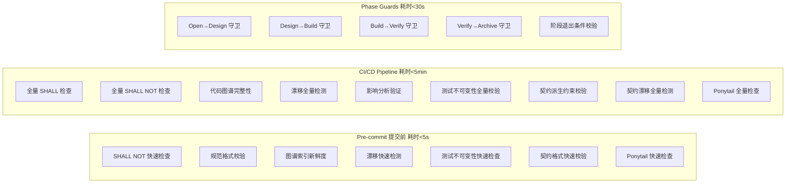

# Guard Layer — 自动化校验

> **Source**: `docs/design/guard-layer.md` | **Type**: docs | **Imported**: 2026-07-31

## Summary

> 层级: Level 1 设计文档 | 所属层: Guard Layer

## Original Content

# Guard Layer — 自动化校验

> 层级: Level 1 设计文档 | 所属层: Guard Layer

---

## 1. 校验体系



## 2. 校验层次

### 性能指标矩阵

| 操作 | 1k 文件 | 10k 文件 | 100k 文件 | 约束 |
|------|---------|---------|---------|---------|
| Pre-commit SHALL NOT 检查 | < 1s | < 3s | < 5s | 增量检查（仅 staged 文件） |
| CI 全量 SHALL + SHALL NOT | < 30s | < 2min | < 5min | 并行检查 + 缓存 |
| Phase Guard | < 5s | < 15s | < 30s | 仅检查工件完整性 |
| 图谱索引（全量） | < 10s | < 1min | < 5min | 增量索引优先 |
| 图谱索引（增量） | < 1s | < 3s | < 10s | 仅解析变更文件 |
| 漂移检测（全量） | < 20s | < 1min | < 3min | 规范 + 图谱 + 契约 |
| 规范加载（渐进式披露） | < 100ms | < 300ms | < 500ms | 仅加载 3 层 |

### 2.1 Pre-commit（提交前）

快速检查（<5s），阻止明显违规进入代码库：
- SHALL NOT 快速检查（lint 规则子集）
- 规范格式校验
- 测试不可变性检查（test-cases/ + 套件 hash 未被篡改）
- 契约格式快速校验
- Ponytail 快速检查（YAGNI 检查 + 依赖检查）

### 2.2 CI/CD Pipeline（持续集成）

全量检查（<5min），确保代码库整体一致性：
- 全量 SHALL + SHALL NOT 检查
- 代码图谱完整性
- 漂移全量检测（规范漂移 + 图谱漂移 + 设计文档漂移 + 契约漂移 + 知识漂移 + Ponytail 约束漂移）
- 测试不可变性全量校验
- 契约派生约束校验 + 契约漂移全量检测
- Ponytail 全量检查（7 级阶梯合规 + 不必要依赖检测 + 样板代码检测）

### 2.3 Phase Guards（阶段守卫）

每个阶段转换必须通过脚本校验（<30s）：
- 检查工件完整性（proposal/design/tasks/delta-specs/test-cases）
- 检查约束满足（SHALL/SHALL NOT）
- 检查测试锁定状态
- 检查决策记录（decisions.md hash 防篡改）
- 失败时阻断转换并报告缺失工件

> Phase Guard 详细规则见 [参考：Phase Guard 规则](../reference/phase-guards.md)。

## 3. 漂移检测

漂移检测识别规范声明与代码实际之间的不一致：

| 漂移类型 | 检测内容 | 严重级别 |
|---------|---------|---------|
| **规范漂移** | spec.md 声明的 Requirement 在代码中无对应实现 | ERROR |
| **图谱漂移** | 代码图谱节点与实际代码不一致 | WARN |
| **设计文档漂移** | design.md 描述的组件关系与代码图谱不一致 | WARN |
| **测试不可变性漂移** | test-cases/ 或测试套件 hash 被篡改 | ERROR |
| **契约漂移 — 外部服务** | 代码调用了外部服务但无契约声明；RPC 策略不一致 | ERROR |
| **契约漂移 — 对外接口** | 代码暴露接口未在 outbound 契约声明 | ERROR |
| **契约漂移 — 向后兼容** | stable 端点字段被删除或类型被改变 | ERROR |
| **契约漂移 — 注册表** | contracts/ 文件未在 _registry.yaml 注册 | WARN (auto_fix) |
| **知识漂移 — 代码已删除** | 知识页面关联的代码节点在图谱中不存在 | ERROR |
| **知识漂移 — 过期** | 知识页面 verified_at 超过 freshness 阈值 | WARN |
| **知识漂移 — 决策被覆盖** | 代码实际行为与 confirmed 决策矛盾 | ERROR |
| **知识漂移 — 索引不一致** | PageIndex 注册的文件不存在 | WARN (auto_fix) |
| **Ponytail 约束漂移 — 未声明依赖** | 代码引入了未在 design.md 中声明的新依赖 | ERROR |
| **Ponytail 约束漂移 — 不必要抽象** | 代码存在未被请求的抽象层 | WARN |

> 漂移检测详细规则见 [参考：漂移检测规则](../reference/drift-detection.md)。

### 漂移检测分级

12 种漂移检测分为三级，在不同阶段执行：

#### P0 必需（Phase 1 实现，Pre-commit 阶段阻断提交）

- `spec_drift`：规范与代码不一致
- `shall_not_violation`：SHALL NOT 约束被违反

P0 漂移 SHALL 在 Pre-commit 阶段运行，阻断提交，耗时 < 5s。

#### P1 重要（Phase 2 实现，CI 阶段阻断合并）

- `graph_drift`：规范-代码绑定边失效
- `test_immutability_drift`：测试被非法修改
- `ponytail_drift`：Ponytail 编码约束违反

P1 漂移 SHALL 在 CI 阶段运行，阻断合并。

#### P2 可选（Phase 3+ 实现，仅生成报告不阻断）

- `contract_drift`（6 类子项）：契约漂移
- `knowledge_drift`（4 类子项）：知识漂移
- `design_doc_drift`：设计文档漂移

P2 漂移 SHALL 仅生成报告，不阻断任何操作。

### 阶段分布

| 阶段 | 运行的漂移检测 | 阻断行为 |
|------|--------------|---------|
| Pre-commit | P0（spec_drift + shall_not_violation） | 阻断 git commit |
| CI | P0 + P1 | 阻断 PR 合并 |
| Report | P0 + P1 + P2 | 仅生成报告，不阻断 |

## 4. Git Hooks

```bash
# .git/hooks/pre-commit (或通过 husky/lefthook 配置)

# 1. SHALL NOT 快速检查
mumuspec check --shall-not --staged-only

# 2. 测试不可变性检查
mumuspec check --test-immutability --staged-only

# 3. 规范格式校验
mumuspec validate --quiet

# 4. Ponytail 快速检查
mumuspec check --ponytail --staged-only
```

---

## 5. 安全校验

### 5.1 威胁模型

| 威胁面 | 威胁 | 影响 | 缓解措施 |
|--------|------|------|----------|
| MCP Server | 未授权访问 MCP 工具 | 规范/代码被篡改 | 本地绑定 + Token 认证 |
| 规范文件 | 恶意 YAML/Markdown 注入 | 执行任意代码 | 输入校验 + 沙箱解析 |
| CLI 命令 | 路径遍历攻击 | 读取项目外文件 | 路径白名单校验 |
| .mumuspec.yaml | 状态篡改 | 绕过 Phase Guard | hash 校验 + 不可变字段 |
| 契约文件 | 外部服务伪造契约 | 注入错误 RPC 约束 | 签名验证 + 来源标记 |
| Git Hooks | Hook 被禁用 | 绕过 pre-commit 检查 | CI 层兜底校验 |

### 5.2 MCP Server 访问控制

- 绑定 `127.0.0.1`，不暴露到网络
- Token 认证：`MUMUSPEC_MCP_TOKEN` 环境变量
- 工具权限分级：
  - `read`：search_graph / trace_path / get_spec_context / detect_drift
  - `write`：index_repository / check_compliance（需显式授权）
  - `admin`：contract derive / change state transition（需交互确认）

### 5.3 输入校验规则

| 输入来源 | 校验规则 | 失败行为 |
|---------|----------|----------|
| spec.md YAML frontmatter | Schema 校验（layer/scope/last_updated 类型检查） | 阻断加载，报告 `E-SPEC-001` |
| .mumuspec.yaml | 字段类型 + 枚举值 + 不可变字段校验 | 阻断状态转换 |
| CLI 参数（路径类） | 项目根目录路径白名单 | 拒绝执行，报告 `E-SECURITY-001` |
| 契约 YAML | `$ref` 引用解析 + 字段完整性校验 | 阻断契约加载，报告 `E-CONTRACT-006` |
| Enforcement check 表达式 | AST 表达式语法校验 | 阻断规则注册 |

### 5.4 敏感信息检测

- 规范文件和 decisions.md 扫描敏感信息模式：
  - API Key / Token / 密码模式（正则匹配）
  - 私有 IP / 内部域名
  - 数据库连接字符串
- 检测到敏感信息时 WARN 级别告警（不阻断，记录到 audit log），报告 `E-SECURITY-003`
- 可通过 config.yaml `security.sensitive_info_scan` 配置开关

### 5.5 审计日志

所有关键操作记录到 `.mumuspec/audit.log`（JSONL 格式）：

```jsonl
{"ts":"2026-07-09T10:30:00Z","actor":"user","action":"change.create","change":"add-auth","result":"success"}
{"ts":"2026-07-09T10:35:00Z","actor":"agent:cli","action":"guard.transition","from":"open","to":"design","result":"success"}
{"ts":"2026-07-09T11:00:00Z","actor":"agent:mcp","action":"spec.validate","result":"fail","error":"E-SPEC-001"}
```

## 6. 可观测性

### 6.1 结构化日志

CLI 输出支持三种 verbosity 模式：

| 模式 | 标志 | 输出格式 | 适用场景 |
|------|------|----------|----------|
| 默认 | （无） | 人类可读文本 | 日常交互 |
| 详细 | `--verbose` | 人类可读 + 调试信息 | 排查问题 |
| JSON | `--json` | 结构化 JSON（每行一条） | CI/CD 管道解析 |
| 静默 | `--quiet` | 仅错误输出 | 脚本调用 |

JSON 格式示例：

```json
{"level":"info","ts":"2026-07-09T10:30:00Z","msg":"Phase guard passed","change":"add-auth","from":"open","to":"design","duration_ms":1200}
```

### 6.2 关键操作 Audit Log

以下操作自动写入 `.mumuspec/audit.log`：
- 变更创建 / 废弃 / 归档
- 阶段转换（正向 + 回退）
- 规范校验（失败时）
- 契约派生 / 漂移检测
- 配置变更

### 6.3 CI 告警输出

CI 环境中，MumuSpec 输出兼容 GitHub Actions / GitLab CI 的告警格式：

```
::error file=src/api/controller.ts,line=42::E-SPEC-005: SHALL NOT violation - direct entity return detected
::warning file=.mumuspec/spec.md::E-SPEC-004: Enforcement missing for SHALL requirement
```

---

> **导航**: [← 知识层](knowledge-layer.md) | [AI 集成层 →](ai-integration.md) | [返回概览](../overview.md)

