# AI Coding Agent 生态深度调研报告

> **[研究参考]** 基于 2026-08 时期的 AI Coding Agent 生态格局。
>
> 层级: Level 3 附录

> 覆盖 Skills 工程化、规范驱动开发、记忆层、代码图谱、多代理编排五大方向，解析 8 个标杆项目的设计理念、核心流程、架构设计与未来演进。含 OpenCode 插件开发体系深度解析。

**日期**: 2026 年 7 月 | **基于**: 公开 GitHub 仓库及官方文档调研

---

## 目录

- [1. 调研背景与范围](#1-调研背景与范围)
- [2. 生态全景图与分类体系](#2-生态全景图与分类体系)
- [3. 项目逐一深度解析](#3-项目逐一深度解析)
- [4. 多维度对比分析](#4-多维度对比分析)
- [5. 核心流程架构图](#5-核心流程架构图)
- [6. 理念与设计哲学对比](#6-理念与设计哲学对比)
- [7. 项目间依赖与生态关系](#7-项目间依赖与生态关系)
- [8. OpenCode 插件开发体系深度解析](#8-opencode-插件开发体系深度解析)
- [9. 未来发展趋势与演进方向](#9-未来发展趋势与演进方向)
- [10. 结论](#10-结论)
- [参考来源](#参考来源)

---

## 1. 调研背景与范围

2025-2026 年，AI Coding Agent 领域经历了爆发式增长。从 Claude Code、Cursor 到 Codex CLI，编码 Agent 正在重塑软件工程的工作方式。然而，裸 Agent 面临着**意图不对齐、缺乏纪律、无长期记忆、代码理解低效**等核心痛点。围绕这些问题，一个蓬勃的开源生态正在形成。

本报告聚焦以下 **8 个具有代表性的开源项目**，覆盖**五大方向**：

| 方向 | 项目 | GitHub | Stars |
|------|------|--------|-------|
| Skills 工程化 | mattpocock/skills | github.com/mattpocock/skills | ~100k |
| 规范驱动开发 | Fission-AI/OpenSpec | github.com/Fission-AI/OpenSpec | ~58k |
| 完整开发方法论 | obra/superpowers | github.com/obra/superpowers | ~160k |
| AI 记忆层 | mem0 | github.com/mem0ai/mem0 | ~60k |
| 代码知识图谱 | CodeGraphContext | github.com/CodeGraphContext/CodeGraphContext | ~35k |
| 代码知识图谱 | codebase-memory-mcp | github.com/DeusData/codebase-memory-mcp | ~8k |
| 工作流编排 | rpamis/comet | github.com/rpamis/comet | ~2.4k |
| 多代理编排 | oh-my-openagent | github.com/code-yeongyu/oh-my-openagent | ~65k |

---

## 2. 生态全景图与分类体系

这 8 个项目并非孤立存在，它们围绕 AI Coding Agent 构成了一个**分层生态**。从底层的代码理解与记忆存储，到中层的规范管理与工作流编排，再到上层的多代理协作执行，形成了完整的工具链。

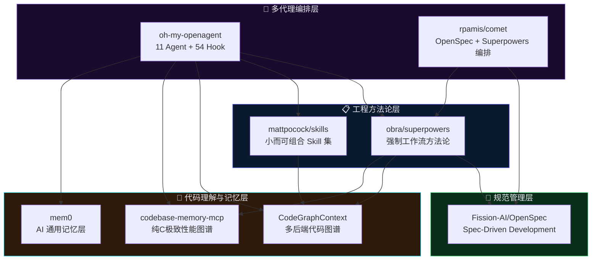

> **核心洞察**：该生态呈现出清晰的"分层依赖"特征——底层提供代码理解和记忆能力，中层提供规范和流程约束，上层完成多代理协作编排。项目之间既有竞争也有互补，形成了有机的工具链生态。

---

## 3. 项目逐一深度解析

### 3.1 mattpocock/skills

| 属性 | 详情 |
|------|------|
| **创建者** | Matt Pocock（Total TypeScript 创始人） |
| **Stars** | ~100k |
| **核心定位** | 面向 AI Agent 的工程化技能库 |

**核心理念**：反 Vibe Coding——强调软件工程基础比以往更重要。Skills 不是大框架，而是**小而可组合**的独立指令单元，每个 Skill 解决一个具体工程问题。

**核心关注点**：解决 AI Agent 的四大失败模式——意图不对齐、冗长输出、代码质量差、代码库熵增。

**关键创新**：
- **CONTEXT.md 共享领域语言**：通过建立项目级术语表，让 Agent 和人类使用统一词汇
- **双层调用模型**（User-invoked / Model-invoked）：区分用户触发的编排型 Skill 和模型自动触发的工程纪律型 Skill

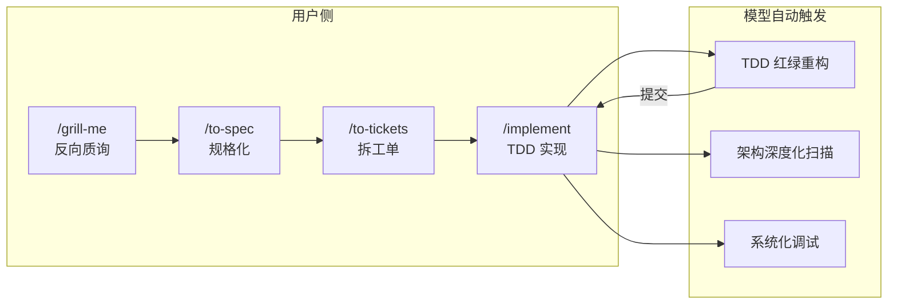

### 3.2 Fission-AI/OpenSpec

| 属性 | 详情 |
|------|------|
| **Stars** | ~58k |
| **核心定位** | AI 原生规范驱动开发框架 |

**核心理念**：**"先对齐再编码"**——通过结构化规范文件让人类和 AI 在写代码之前对需求达成明确共识，消除 AI 在需求模糊时产生不可预测结果的问题。

**五大核心概念**：
1. **Specs 是真相源**——描述系统当前行为，存放在 `openspec/specs/`
2. **Change 是工作单元**——每次变更对应 `openspec/changes/` 下的一个文件夹
3. **Delta Specs 描述变化**——只写 ADDED/MODIFIED/REMOVED 的差异
4. **Artifacts 逐步构建**——proposal → specs → design → tasks → implement
5. **Archive 闭环**——完成后 delta specs 合并回主 specs

**关键创新**：**"Enablers, not Gates"**——产物之间的依赖是"使下一步成为可能"而非强制顺序。

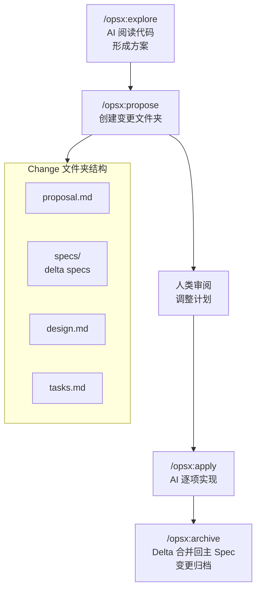

### 3.3 obra/superpowers

| 属性 | 详情 |
|------|------|
| **Stars** | ~160k |
| **版本** | v6.1.1 |
| **核心定位** | 完整开发方法论与强制工作流 |
| **商业化** | Prime Radiant 公司提供企业级支持 |

**核心理念**：**强制工作流，不是建议**——Skills 是 Agent 必须遵循的流程，而非可选的提示词。测试驱动开发至上，子代理驱动开发，证据优于声明。

**关键创新**：
- **子代理驱动开发**：每个任务分发给独立的子 Agent 执行
- **两阶段审查**：规格合规性 + 代码质量，关键问题阻塞进度
- **原子任务规划**：将工作拆分为 2-5 分钟的任务，每个包含精确文件路径、完整代码、验证步骤

```mermaid
flowchart TD
    BR["Brainstorming<br/>苏格拉底式提问<br/>需求细化"] --> GT["Git Worktrees<br/>创建隔离工作空间<br/>建立测试基线"]
    GT --> PL["编写计划<br/>2-5 分钟原子任务<br/>精确文件路径+完整代码"]
    PL --> EX["子代理执行<br/>两阶段审查<br/>规格合规 → 代码质量"]
    EX --> TDD["TDD 循环<br/>RED → GREEN → REFACTOR"]
    TDD --> CR["Code Review<br/>自动审查<br/>关键问题阻塞"]
    CR --> FN["Finishing Branch<br/>测试验证<br/>合并/PR/丢弃"]
    CR -->|有阻塞| EX

    style TDD fill:#1a0a2e,stroke:#a78bfa
    style CR fill:#2e1a0a,stroke:#f472b6
```

### 3.4 mem0

| 属性 | 详情 |
|------|------|
| **Stars** | ~60k |
| **孵化** | YC S24 |
| **核心定位** | AI Agent 智能记忆层 |

**核心理念**：为 AI 助手和 Agent 提供**跨会话的个性化记忆**，解决 LLM 无状态的痛点。记忆不仅来自对话，Agent 确认的动作也以同等权重存储。

**关键创新**：
- **ADD-only 提取算法（v3）**：一次 LLM 调用完成记忆提取，记忆只增不改
- **多信号融合检索**：语义向量 + BM25 关键词 + 实体匹配并行打分
- **时序推理**：区分"当前状态"、"过去事件"和"未来计划"

**三档部署**：Library（pip）→ Self-Hosted Server（Docker）→ Cloud Platform（零运维）

```mermaid
flowchart LR
    IN["对话消息输入"] --> EX["LLM 提取<br/>ADD-only 算法"]
    EX --> VB["向量化嵌入"]
    VB --> DB[(向量数据库<br/>Qarant + PostgreSQL)]

    Q["用户查询"] --> MS["多信号融合检索"]
    DB --> MS
    MS -->|"语义+BM25+实体"| TOP["Top-K 相关记忆"]
    TOP --> INJ["注入系统提示词"]
    INJ --> LLM["LLM 生成<br/>个性化响应"]

    style DB fill:#0a2e1a,stroke:#4ade80
    style MS fill:#2e1a0a,stroke:#22d3ee
```

### 3.5 CodeGraphContext (CGC)

| 属性 | 详情 |
|------|------|
| **Stars** | ~35k |
| **版本** | v0.5.1 |
| **核心定位** | 可插拔后端的代码知识图谱引擎 |

**核心理念**：将代码仓库转化为**可查询的知识图谱**，解决 AI Agent 理解大型代码库时反复扫描文件、Token 消耗巨大的问题。

**关键创新**：
- **多后端图数据库**：支持 FalkorDB Lite、KuzuDB、Neo4j 等 5 种后端
- **Tree-sitter 多语言 AST**：统一解析 23+ 语言
- **预索引 Bundle 生态**：.cgc 格式的预构建索引包可从 Hugging Face 下载
- **SCIP 精确索引**：对 C/C++/C# 提供更精确的调用和继承分析

### 3.6 codebase-memory-mcp

| 属性 | 详情 |
|------|------|
| **Stars** | ~8k |
| **版本** | v0.8.1 |
| **核心定位** | 纯 C 极致性能代码图谱 MCP |

**核心理念**：**极致性能、零依赖**——纯 C 实现、单文件静态二进制、158 种语言 Tree-sitter 内置、无 Docker 无 API Key。

**关键创新**：
- **RAM-first 管线**：Linux 内核 28M LOC 仅需 3 分钟索引
- **Hybrid LSP 语义类型解析**：14 种语言的轻量级 C 实现类型推断
- **内置语义搜索**：嵌入 Nomic 模型，无需外部 API
- **120x Token 节省**：结构查询 3,400 tokens vs 文件搜索 412,000 tokens

```mermaid
flowchart LR
    subgraph CGC["CodeGraphContext"]
        C1["Tree-sitter<br/>23+ 语言"] --> GDB[(多后端图数据库<br/>FalkorDB/Kuzu/Neo4j)]
        GDB --> MCP1["21 个 MCP 工具"]
        MCP1 --> VIZ1["可视化<br/>2D/3D 力导向"]
    end
    subgraph CBM["codebase-memory-mcp"]
        C2["Tree-sitter<br/>158 语言<br/>纯 C"] --> SQL[(SQLite<br/>FTS5 + 内嵌向量)]
        SQL --> MCP2["15 个 MCP 工具"]
        C2 --> LSP["Hybrid LSP<br/>14 语言类型解析"]
        SQL --> SEM["内置语义搜索<br/>Nomic 嵌入"]
    end

    style CGC fill:#0a1a2e,stroke:#6366f1
    style CBM fill:#2e1a0a,stroke:#22d3ee
```

### 3.7 rpamis/comet

| 属性 | 详情 |
|------|------|
| **Stars** | ~2.4k |
| **版本** | v0.3.9 |
| **核心定位** | OpenSpec + Superpowers 双星驱动编排器 |

**核心理念**：OpenSpec 处理 **WHAT**（大纲、提案、Spec 生命周期），Superpowers 处理 **HOW**（设计、规划、执行、收尾），Comet 作为**编排层**将二者串联为五阶段流水线。

**关键创新**：
- **可恢复工作流**：通过 `.comet.yaml` 状态文件记录阶段和验证结果，中断后一键继续
- **脚本化守护**：不信任 Agent 的"完成了"声明，通过 Shell 脚本检查实际状态
- **防漂移双层防护**：Rule（软提醒）+ Hook（硬拦截）

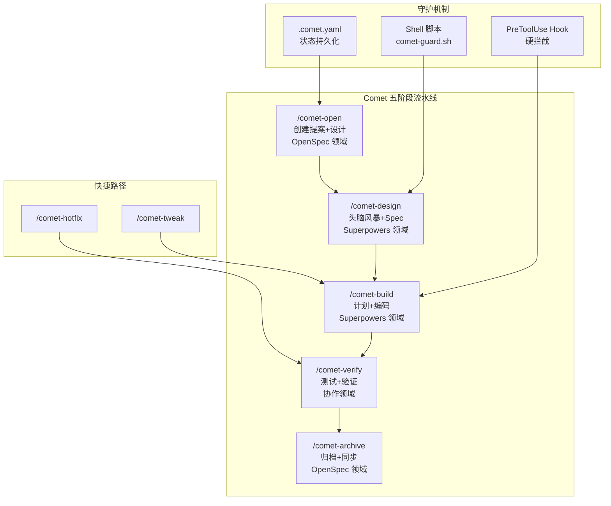

### 3.8 oh-my-openagent (OmO)

| 属性 | 详情 |
|------|------|
| **Stars** | ~65k |
| **版本** | v4.13.0 |
| **核心定位** | 多代理全自主编码系统 |

**核心理念**：**"Agent 是工作者，不是助手"**——人类只发起任务，Agent 思考、决策、执行。11 个专职 Agent 各司其职，通过 54+ 生命周期 Hook 实现完全自主执行。

**关键创新**：
- **多代理编排（Team Mode）**：11 个专职 Agent 通过 `team_*` 工具协调
- **表达式层次**：Skill > MCP > Tool > Hook 四层架构
- **反锁定哲学**：不被任何单一 AI 供应商绑定

**规模**：7 个月 9,559 次提交，平均每天约 45 次。正在经历多 Agent 框架重构（Multi-Harness Agent OS Refactor），将代码拆分为严格的 Core/MCP/Skills/Adapters/Platform/Web 六层架构。

```mermaid
flowchart TD
    USER["用户输入<br/>ultrawork"] --> INSTALL["安装配置<br/>11 Agent 模型匹配"]
    INSTALL --> LAUNCH["ulw-loop<br/>自主循环"]
    LAUNCH --> TEAM["11 个专职 Agent 协作"]
    TEAM --> HOOKS["54+ 生命周期 Hook<br/>过程控制"]
    HOOKS --> DONE["任务完成"]

    subgraph ARCH["六层架构重构"]
        CORE["Core<br/>纯 TS 逻辑<br/>规则/配置/状态机"]
        MCP_L["MCP<br/>外部工具服务器"]
        SKILLS["Skills<br/>静态 Markdown"]
        ADAPTERS["Adapters<br/>框架胶水层"]
        PLATFORM["Platform<br/>Node 启动器"]
        WEB_L["Web<br/>营销网站"]
    end
    CORE --> MCP_L
    CORE --> SKILLS
    ADAPTERS --> CORE
    ADAPTERS --> MCP_L
    PLATFORM --> ADAPTERS

    style TEAM fill:#1a0a2e,stroke:#a78bfa
    style HOOKS fill:#2e1a0a,stroke:#f472b6
```

---

## 4. 多维度对比分析

### 4.1 定位与核心理念

| 项目 | 一句话定位 | 核心理念 | 解决的核心痛点 |
|------|-----------|----------|---------------|
| skills | 工程师个人技能集 | 小而可组合，反 Vibe Coding | Agent 意图不对齐、代码熵增 |
| OpenSpec | 规范驱动开发框架 | 先对齐再编码，Delta Specs | 需求模糊导致 AI 不可预测 |
| superpowers | 完整开发方法论 | 强制工作流，子代理驱动 | Agent 缺乏工程纪律 |
| mem0 | AI 通用记忆层 | 跨会话记忆，多信号融合 | LLM 无状态，无长期记忆 |
| CGC | 多后端代码图谱 | 可插拔图数据库，预索引生态 | AI 读代码 Token 浪费 |
| CBM | 极致性能代码图谱 | 纯 C、零依赖、单二进制 | 索引速度和部署复杂度 |
| comet | 双星驱动编排器 | OpenSpec WHAT + Superpowers HOW | 状态丢失、文档不同步 |
| OmO | 多代理全自主系统 | Agent 是工作者不是助手 | 单 Agent 能力天花板 |

### 4.2 技术栈与实现语言

| 项目 | 主语言 | 存储方案 | 部署方式 | Agent 平台支持 |
|------|--------|----------|---------|---------------|
| skills | Shell + JS | 本地文件 | npx / Plugin | Claude Code, Codex |
| OpenSpec | TypeScript | 本地文件 + YAML | CLI / npm | 25+ AI 工具 |
| superpowers | Shell + JS | 本地文件 | Plugin（10+ 平台） | Claude/Codex/Cursor/Kimi 等 |
| mem0 | Python + TS | Qdrant + PostgreSQL | pip / Docker / Cloud | Claude/Cursor/Codex 等 |
| CGC | Python + React | 5 种图数据库 | pip / Docker | MCP + CLI |
| CBM | **纯 C** | SQLite + 内嵌向量 | 单静态二进制 | MCP（43 个 Agent） |
| comet | JS + Bash | YAML 状态文件 | CLI（29 个平台） | 29 个 AI 平台 |
| OmO | TypeScript | 本地状态机 | Bun workspaces | OpenCode/Codex 等 |

### 4.3 成熟度与活跃度

| 项目 | Stars | 版本 | 提交数 | 创建时间 | 团队/公司 |
|------|-------|------|--------|----------|----------|
| skills | ~100k | v1.1.0 | 314 | 2025 | Matt Pocock（个人） |
| OpenSpec | ~58k | v1.5.0 | 610 | 2025 | Fission-AI（社区 72 人） |
| superpowers | ~160k | v6.1.1 | 628 | 2025 | Prime Radiant（商业） |
| mem0 | ~60k | 360 releases | 2,501 | 2024 | mem0 AI（YC S24） |
| CGC | ~35k | v0.5.1 | 1,558 | 2025 | 社区（25+ 贡献者） |
| CBM | ~8k | v0.8.1 | 1,643 | 2026 | DeusData |
| comet | ~2.4k | v0.3.9 | 219 | 2026-05 | rpamis 组织 |
| OmO | ~65k | v4.13.0 | 9,559 | 2025-12 | 独立开发者 + AI 助手 |

---

## 5. 核心流程架构图

### 5.1 三种工作流方法论对比

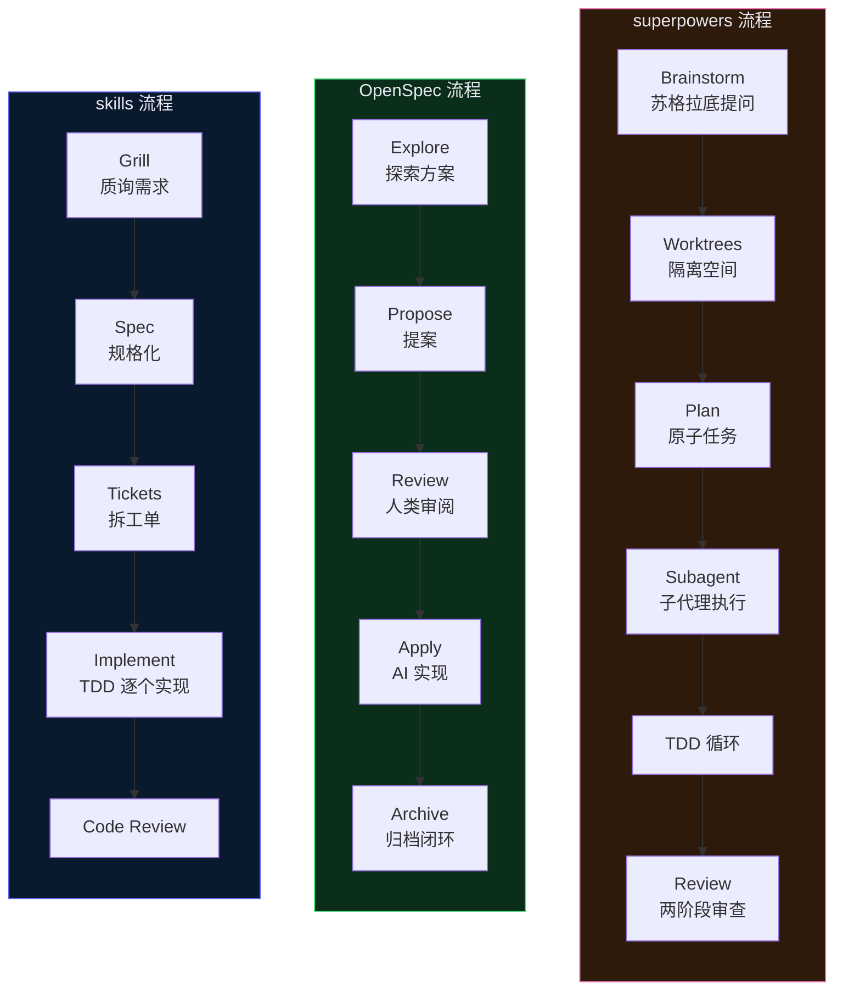

### 5.2 代码理解层工作原理

```mermaid
flowchart TD
    SRC["源代码仓库"] --> PARSE{"解析引擎"}

    subgraph CGC_P["CodeGraphContext"]
        TS1["Tree-sitter<br/>23 语言"] --> GDB[(FalkorDB/Kuzu<br/>Neo4j 等)]
        SCIP["SCIP<br/>C/C++/C#"] --> GDB
        GDB --> MCP_CGC["21 MCP 工具"]
    end

    subgraph CBM_P["codebase-memory-mcp"]
        TS2["Tree-sitter<br/>158 语言 纯C"] --> SQLITE[(SQLite<br/>FTS5)]
        LSP_H["Hybrid LSP<br/>14 语言"] --> SQLITE
        SQLITE --> MCP_CBM["15 MCP 工具"]
        SEM_E["内置语义<br/>Nomic 嵌入"] --> SQLITE
    end

    PARSE --> CGC_P
    PARSE --> CBM_P

    MCP_CGC --> AGENT["AI Coding Agent<br/>Claude/Cursor/Codex"]
    MCP_CBM --> AGENT

    style CGC_P fill:#0a1a2e,stroke:#6366f1
    style CBM_P fill:#2e1a0a,stroke:#22d3ee
```

---

## 6. 理念与设计哲学对比

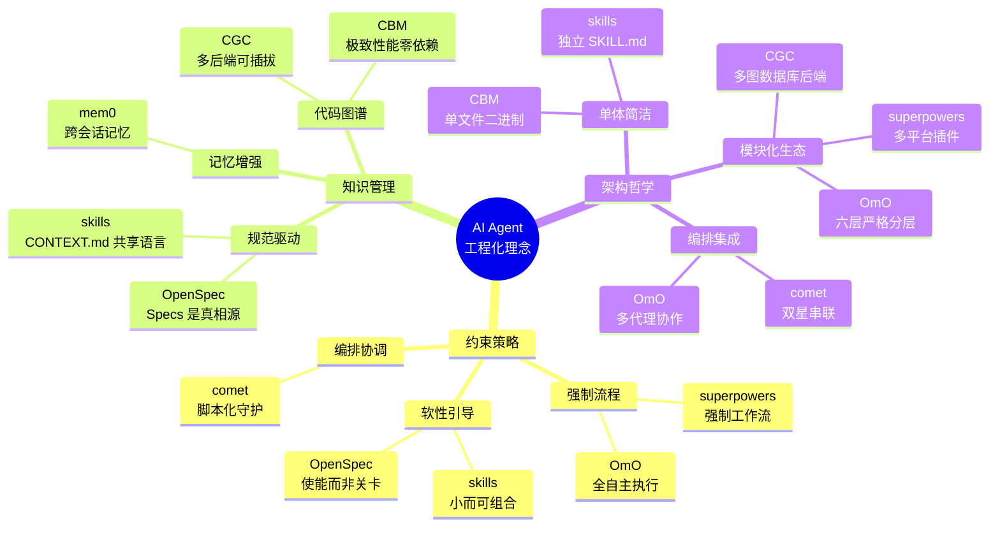

> **哲学分野**：skills 和 OpenSpec 代表"**使能派**"——提供工具但不强制流程；superpowers 和 OmO 代表"**强制派**"——Agent 必须遵循预定工作流；comet 则代表"**编排派**"——在强制与使能之间寻找平衡，通过脚本守护确保流程可靠性。

---

## 7. 项目间依赖与生态关系

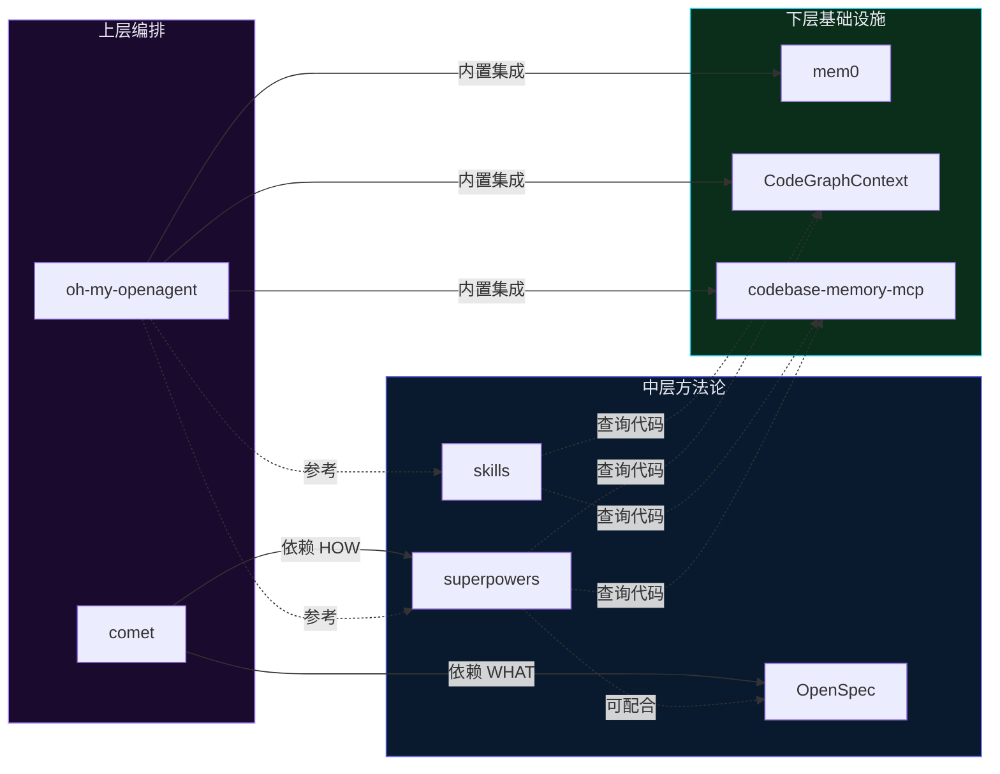

### 7.1 竞争与互补矩阵

**skills vs superpowers vs OpenSpec**：

| 维度 | skills | superpowers | OpenSpec |
|------|--------|------------|----------|
| 关系 | 互补 | 竞争（流程方法论） | 互补 |
| 差异 | 轻量、个人、可组合 | 重量、强制、完整流水线 | 规范管理、需求追溯 |
| 协作 | 可与 OpenSpec 配合使用 | 已有 comet 将二者串联 | 为 superpowers 提供规范层 |

**CGC vs CBM**（代码图谱竞争）：

| 维度 | CGC | CBM |
|------|-----|-----|
| 差异 | 生态丰富、多后端、Python | 极致性能、零依赖、纯 C |
| 选择标准 | 需要灵活后端或可视化 | 追求速度和极简部署 |

**comet vs OmO**（编排层）：

| 维度 | comet | OmO |
|------|-------|-----|
| 差异 | 串联现有工具、脚本守护 | 自建全套、11 Agent 自主执行 |
| 选择标准 | 已用 OpenSpec/Superpowers | 追求全自主、批量任务 |

---

## 8. OpenCode 插件开发体系深度解析

> **背景**：OpenCode 是 Anthropic 推出的开源编码 Agent CLI 工具，其插件系统基于 JavaScript/TypeScript，采用事件驱动架构。superpowers、oh-my-openagent 等主流项目均已提供完整的 OpenCode 适配。

### 8.1 插件系统架构概览

OpenCode 的插件是 **JavaScript/TypeScript 模块**，通过导出插件函数来订阅事件和扩展行为。插件可通过三种方式加载：

| 加载方式 | 路径/配置 | 作用域 |
|---------|----------|--------|
| 项目级本地插件 | `.opencode/plugins/*.js\|ts` | 仅当前项目 |
| 全局本地插件 | `~/.config/opencode/plugins/*.js\|ts` | 所有项目 |
| npm 包插件 | `opencode.json` 中 `plugin` 数组 | 按配置范围 |

npm 插件在启动时由 Bun 自动安装，缓存于 `~/.cache/opencode/node_modules/`。

### 8.2 插件目录结构

`.opencode/` 是 OpenCode 的项目级配置目录，采用**复数命名约定**（向后兼容单数）：

```
.opencode/
├── plugins/          # JS/TS 插件文件
├── skills/           # SKILL.md 技能目录
├── commands/         # Markdown 自定义命令
├── agents/           # Markdown 代理定义
├── modes/            # 模式定义
├── tools/            # 自定义工具
├── themes/           # 主题
└── package.json      # 插件/技能依赖（可选）
```

配置加载优先级（后覆盖前）：
1. 远程配置（`.well-known/opencode`）
2. 全局配置（`~/.config/opencode/opencode.json`）
3. 自定义配置（`OPENCODE_CONFIG`）
4. 项目配置（`opencode.json`）
5. **`.opencode` 目录**
6. 内联配置（`OPENCODE_CONFIG_CONTENT`）

### 8.3 插件基本结构

```javascript
// .opencode/plugins/example.js
export const MyPlugin = async ({ project, client, $, directory, worktree }) => {
  console.log("Plugin initialized!")
  return {
    // Hook implementations go here
  }
}
```

插件函数接收上下文对象：
- `project`：当前项目信息
- `directory`：当前工作目录
- `worktree`：git 工作树路径
- `client`：OpenCode SDK 客户端（日志、AI 交互）
- `$`：Bun 的 Shell API

TypeScript 插件可导入类型：
```typescript
import type { Plugin } from "@opencode-ai/plugin"
export const MyPlugin: Plugin = async (ctx) => { ... }
```

### 8.4 Hook 与事件体系

OpenCode 提供 **16+ 种钩子**，分为以下类别：

| 类别 | 钩子名称 |
|-----|---------|
| **命令** | `command.executed` |
| **文件** | `file.edited`, `file.watcher.updated` |
| **LSP** | `lsp.client.diagnostics`, `lsp.updated` |
| **消息** | `message.part.removed`, `message.part.updated`, `message.removed`, `message.updated` |
| **权限** | `permission.asked`, `permission.replied` |
| **会话** | `session.created`, `session.compacted`, `session.deleted`, `session.diff`, `session.error`, `session.idle`, `session.status`, `session.updated` |
| **待办** | `todo.updated` |
| **Shell** | `shell.env` |
| **工具** | `tool.execute.before`, `tool.execute.after` |
| **TUI** | `tui.prompt.append`, `tui.command.execute`, `tui.toast.show` |
| **实验性** | `experimental.chat.messages.transform`, `experimental.session.compacting` |

钩子签名模式为 `(input, output) => void`，插件可读取输入并修改输出：

```javascript
export const EnvProtection = async () => {
  return {
    "tool.execute.before": async (input, output) => {
      if (input.tool === "read" && output.args.filePath.includes(".env")) {
        throw new Error("Do not read .env files")
      }
    },
  }
}
```

### 8.5 关键实验性钩子

**`experimental.chat.messages.transform`** —— 消息转换钩子：
- 在每次 agent 步骤触发（OpenCode 的 prompt.ts 每步从 DB 重载消息）
- 可修改消息内容、附加 parts
- **superpowers 利用此钩子**向首条用户消息注入 bootstrap 上下文

**`experimental.session.compacting`** —— 压缩钩子：
- 在 LLM 生成续接摘要前触发
- 可通过 `output.context.push()` 注入额外上下文
- 或设置 `output.prompt` 完全替换压缩提示词

### 8.6 自定义工具 API

插件可通过 `tool` 辅助函数注册自定义工具，与内置工具同等对待：

```typescript
import { type Plugin, tool } from "@opencode-ai/plugin"

export const CustomToolsPlugin: Plugin = async (ctx) => {
  return {
    tool: {
      mytool: tool({
        description: "This is a custom tool",
        args: {
          foo: tool.schema.string(),
        },
        async execute(args, context) {
          const { directory, worktree } = context
          return `Hello ${args.foo} from ${directory}`
        },
      }),
    },
  }
}
```

自定义工具使用 Zod schema 定义参数，与内置工具一同出现在工具列表中。若名称冲突，**插件工具优先**。

### 8.7 Skills 标准在 OpenCode 中的支持

OpenCode 原生支持 `skill` 工具来发现和加载技能。技能存放于：
- 项目级：`.opencode/skills/<skill-name>/`
- 全局：`~/.config/opencode/skills/<skill-name>/`

每个技能目录至少包含 `SKILL.md`，且**必须带有 YAML frontmatter**：

```markdown
---
name: work-with-pr
description: "Full PR lifecycle in a fresh task-owned git worktree..."
---

# Work With PR
...
```

Skill 加载优先级（高到低）：
1. **项目级 skills**（`.opencode/skills/`）
2. **个人 skills**（`~/.config/opencode/skills/`）
3. **插件注册的 skills**（通过 `config` hook 注入 `skills.paths`）

**AGENTS.md**：OpenCode 通过 `/init` 命令初始化项目时生成 `AGENTS.md`（应提交到 Git），用于描述项目结构和编码规范。

### 8.8 现有 OpenCode 插件生态

#### superpowers 的 OpenCode 适配

```
superpowers/
├── .opencode/
│   ├── INSTALL.md              # OpenCode 安装指南
│   └── plugins/
│       └── superpowers.js      # OpenCode 插件入口
├── skills/                     # 共享技能库（跨平台）
│   ├── using-superpowers/
│   ├── brainstorming/
│   ├── writing-plans/
│   └── ...
└── docs/README.opencode.md
```

**插件实现**（`.opencode/plugins/superpowers.js`）：
- `config` hook：将 `../../skills` 目录注入 `config.skills.paths`
- `experimental.chat.messages.transform` hook：向首条用户消息注入 `using-superpowers` skill 内容 + OpenCode 工具映射表

**OpenCode 工具映射**（superpowers 的平台无关动作 → OpenCode 工具）：

| Superpowers 动作 | OpenCode 工具 |
|-----------------|--------------|
| Create or update todos | `todowrite` |
| Subagent | `task`（`subagent_type: "general"` 或 `"explore"`） |
| Invoke a skill | `skill` |
| Read files | `read` |
| Create/edit/delete files | `apply_patch` |
| Run shell commands | `bash` |
| Search files | `grep`, `glob` |
| Fetch a URL | `webfetch` |

#### oh-my-openagent 的 OpenCode 适配

```
.opencode/
├── AGENTS.md                    # 项目级代理配置
├── background-tasks.json        # 后台任务运行时状态
├── command/                     # 5 个 slash 命令
│   ├── get-unpublished-changes.md
│   ├── omomomo.md
│   ├── publish.md
│   ├── remove-deadcode.md
│   └── security-research.md
└── skills/                      # 5 个项目级技能
    ├── github-triage/
    ├── hyperplan/
    ├── pre-publish-review/
    ├── work-with-pr/
    └── work-with-pr-workspace/
```

**安装方式**：
```bash
bunx oh-my-openagent install   # Ultimate edition for OpenCode
```

### 8.9 OpenCode 与 Claude Code 插件对比

| 维度 | OpenCode | Claude Code |
|-----|----------|-------------|
| **插件语言** | JavaScript/TypeScript | Shell 脚本 + JSON 配置 |
| **Hook 模型** | ~16 种事件钩子，TypeScript event handlers | PreToolUse/PostToolUse/Stop/SessionStart/SessionEnd 等 |
| **插件安装** | npm 包或本地 JS/TS；Bun 自动安装 | Plugin Marketplace（`/plugin install`）+ `.claude-plugin/` |
| **配置目录** | `.opencode/` + `~/.config/opencode/` | `.claude/` + `~/.claude/` |
| **模型支持** | 模型无关（Anthropic/OpenAI/Google/本地模型等） | 主要面向 Anthropic 模型 |
| **运行环境** | Bun/Node 运行时，独立进程 | 与 Claude Code 主进程紧密集合 |
| **子代理** | Primary/Subagent 模式（Build/Plan/General/Explore/Scout） | Subagents（通过 Task 工具调用） |
| **Skill 格式** | `SKILL.md` + YAML frontmatter | `SKILL.md` + YAML frontmatter |
| **项目指令** | `AGENTS.md` | `CLAUDE.md` |
| **开发体验** | 更开放（模型无关、npm 生态）、TypeScript 类型安全 | 更深度集成（模型优化配合、官方 marketplace 管控） |

### 8.10 OpenCode 插件开发最佳实践

```mermaid
flowchart TD
    subgraph DEV["插件开发流程"]
        INIT["1. 初始化 .opencode/ 目录<br/>npm init -y"] --> CODE["2. 编写插件 JS/TS<br/>导出 Plugin 函数"]
        CODE --> TEST["3. 本地测试<br/>opencode run"]
        TEST --> SKILL["4. 编写 SKILL.md<br/>YAML frontmatter"]
        SKILL --> PUBLISH["5. 发布<br/>npm publish 或 Git 仓库引用"]
    end
    subgraph ARCH["推荐架构模式"]
        CORE["核心逻辑<br/>平台无关"] --> ADAPT["OpenCode 适配层<br/>Hook 映射+工具映射"]
        ADAPT --> SKILL_F["Skills 目录<br/>跨平台共享"]
    end
    DEV --> ARCH

    style CORE fill:#0a1a2e,stroke:#6366f1
    style ADAPT fill:#2e1a0a,stroke:#22d3ee
    style SKILL_F fill:#0a2e1a,stroke:#4ade80
```

---

## 9. 未来发展趋势与演进方向

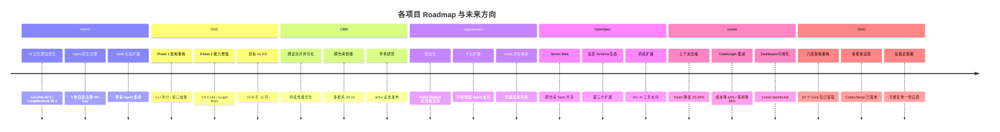

### 9.1 五大趋势研判

**趋势一：从"提示工程"到"工程纪律"**

skills、superpowers、OpenSpec 的共同方向是：将软件工程经典实践（TDD、Code Review、Architecture Decision Records）编码为 Agent 可执行的结构化指令。这不是取代工程师，而是通过 Agent 强化工程纪律。未来，Skill 标准可能成为跨 Agent 平台的"工程实践交换格式"。

**趋势二：代码理解的"图谱化"和"极致化"**

CGC 和 CBM 代表了两个方向——CGC 追求生态丰富和多后端可插拔，CBM 追求极致性能和零依赖。二者的竞争将推动整个代码图谱领域向前发展。学术研究（CBM 的 arXiv 论文）表明，代码图谱可带来 120x Token 节省和 83% 的回答质量提升。

**趋势三：多代理编排成为新范式**

OmO（11 Agent）和 comet（双星编排）代表了从"单 Agent + Skills"到"多 Agent 协作"的范式转变。未来可能出现标准化的 Agent 间通信协议，类似微服务领域的 gRPC/REST。

**趋势四：记忆层成为 Agent 基础设施**

mem0 将 AI 记忆从"对话上下文窗口"提升为"持久化知识层"。随着 Agent 从单任务向长期项目级协作演进，跨会话记忆将成为标配能力。

**趋势五：工具链整合与标准化**

当前各项目通过 MCP 协议实现互操作，但 Skill 标准尚未统一（Claude Code、Codex、OpenCode 各有差异）。未来可能出现类似 W3C 标准的 Agent Skill 互操作规范，实现真正的跨平台 Skill 共享。

---

## 10. 结论

2025-2026 年的 AI Coding Agent 生态正在经历从"裸 Agent"到"工程化 Agent"的关键转型。本报告调研的 8 个项目，覆盖了这一转型的五个核心维度：**工程方法论**（skills/superpowers）、**规范驱动**（OpenSpec）、**记忆基础设施**（mem0）、**代码理解**（CGC/CBM）、**多代理编排**（comet/OmO）。

这些项目并非简单的工具集合，而是代表了一种新的软件工程范式：**以 Agent 为执行者、以规范为真相源、以图谱为代码理解引擎、以记忆为跨会话知识、以多代理为复杂任务解决框架**。它们共同描绘了一个未来——AI Agent 不再是"写代码的聊天机器人"，而是具备完整工程能力、长期记忆、代码深度理解和多代理协作能力的"AI 工程师"。

### 选型建议

| 场景 | 推荐方案 |
|------|---------|
| 中小型项目 | skills + OpenSpec，建立轻量级规范和技能体系 |
| 大型项目或团队协作 | superpowers 强制工作流 + CGC 代码图谱 |
| 追求全自主化 | OmO 多代理编排 |
| 已有 OpenSpec/Superpowers 基础 | comet 串联编排 |
| 所有场景 | mem0 作为 Agent 记忆层 |
| 需要代码理解加速 | CBM（追求极速）或 CGC（追求灵活性） |
| OpenCode 平台开发 | 参考 superpowers 的多 harness 适配策略 |

---

## 参考来源

1. [mattpocock/skills - GitHub](https://github.com/mattpocock/skills)
2. [Fission-AI/OpenSpec - GitHub](https://github.com/Fission-AI/OpenSpec)
3. [OpenSpec overview.md](https://github.com/Fission-AI/OpenSpec/blob/main/docs/overview.md)
4. [obra/superpowers - GitHub](https://github.com/obra/superpowers)
5. [mem0ai/mem0 - GitHub](https://github.com/mem0ai/mem0)
6. [CodeGraphContext/CodeGraphContext - GitHub](https://github.com/CodeGraphContext/CodeGraphContext)
7. [DeusData/codebase-memory-mcp - GitHub](https://github.com/DeusData/codebase-memory-mcp)
8. [rpamis/comet - GitHub](https://github.com/rpamis/comet)
9. [code-yeongyu/oh-my-openagent - GitHub](https://github.com/code-yeongyu/oh-my-openagent)
10. [oh-my-openagent ROADMAP.md](https://github.com/code-yeongyu/oh-my-openagent/blob/dev/ROADMAP.md)
11. [OpenCode 官方文档 - Plugins](https://opencode.ai/docs/plugins)
12. [OpenCode 官方文档 - Config](https://opencode.ai/docs/config)
13. [OpenCode 官方文档 - Commands](https://opencode.ai/docs/commands)
14. [OpenCode 官方文档 - Agents](https://opencode.ai/docs/agents)
