# MumuSpec — AI 编程规范体系设计方案

> **版本**: 0.5.0-draft
> **日期**: 2026-07-09
> **状态**: 设计草案
>
> **0.2.0 变更**: 新增三条核心工作流规则：默认 worktree 隔离、单一活跃变更约束、自顶向下设计 + 自下向上实现
> **0.3.0 变更**: 状态机管理变更阶段，支持 Build/Verify 回退到 Design；Archive 阶段增加 git 提交与合并请求处理
> **0.4.0 变更**: 新增外部 Skill 生态兼容层，支持 Superpowers/Agent Skills 等 skill 体系在开发各阶段提供指导
> **0.4.1 变更**: 修复流程连贯性与正确性问题——状态机路径补全（hotfix/discard/accept-deviations/archive-ci-fail-rollback）、archive 拆分为 in-progress/completed 子状态、回退计数顺序修正（先 checks 后 side_effects）、verify-rebuild 独立计数（rebuild_count/rebuild_limit）、硬性规则与配置矛盾消除（single_active_change 固定、constraint_violation 拆分为 shall/shall_not）、Phase Guard 补强、阶段输入输出声明统一、hotfix/tweak 路径输入契约、Worktree 规则统一、自顶向下设计完整性、Archive 子流程事务性、规范继承 Enforcement 规则
> **0.5.0 变更**: 新增目录级设计文档（design.md）——每个 `.mumuspec/` 目录维护本层设计文档，记录架构决策与设计原理；新增文档生成引擎——根据各目录下的 spec + design 自动生成对外技术文档和业务文档，支持多模板、多格式输出、CI 同步校验

---

## 1. 背景与动机

### 1.1 问题陈述

当前 AI 编程辅助工具（Cursor、Claude Code、Copilot 等）面临三大核心挑战：

1. **规范缺失或单向**：现有规范体系要么只说"要做什么"（正向约束），忽略"绝不能做什么"（反向禁止），导致 AI 在边界场景失控；要么只有笼统的 `.cursorrules` 全量加载，造成上下文过载。
2. **规范与代码脱节**：规范文档写完即过时，无法通过自动化手段校验代码是否遵守规范，沦为"摆设文档"。
3. **缺乏代码结构感知**：AI 在大型代码库中"盲人摸象"，不理解模块间依赖关系，容易做出破坏性修改。

### 1.2 参考项目调研总结

| 项目 | 核心价值 | 借鉴点 | 差异/不足 |
|------|---------|--------|----------|
| **OpenSpec** | 变更驱动的规范生命周期（proposal → specs → design → tasks → apply → verify → archive），delta spec 语义合并 | 变更工件流水线、delta spec 的 ADDED/MODIFIED/REMOVED/RENAMED 语义、archive 历史归档 | 只有正向要求，无反向禁止；规范集中存放而非树状分布；无代码索引 |
| **Comet (rpamis)** | OpenSpec + Superpowers 双星工作流，五阶段状态机（open → design → build → verify → archive），phase guard 脚本校验 | 状态机 + 阶段守卫、可恢复工作流、hotfix/tweak 预设路径、CodeGraph 语义索引、handoff 包压缩 | 强绑定特定 Skill 生态；规范仍集中存放；无树状渐进披露 |
| **codebase-memory-mcp / GitNexus** | 代码知识图谱（Nodes: File/Function/Class + Edges: CALLS/IMPORTS/IMPLEMENTS），14 个 MCP 工具，~500 tokens 返回精确结构查询 | 知识图谱 schema、search_graph/trace_path/detect_changes/query_graph、影响分析、死代码检测 | 纯索引工具，不含规范体系；需与规范层集成 |
| **context-engineering** | 上下文分层（Rules → Specs → Source → Errors → History），渐进式披露原则 | 分层加载策略、反模式（context starvation/flooding/stale）、选择性包含 | 方法论层面，非具体实现 |

### 1.3 设计目标

MumuSpec 旨在构建一套**面向 AI 编程的双向约束规范体系**，核心理念：

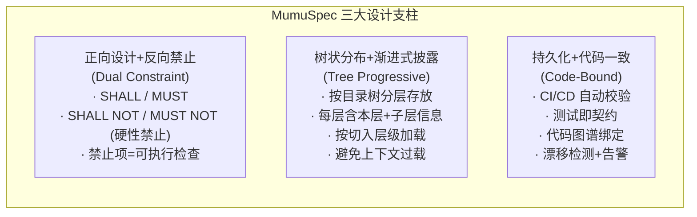

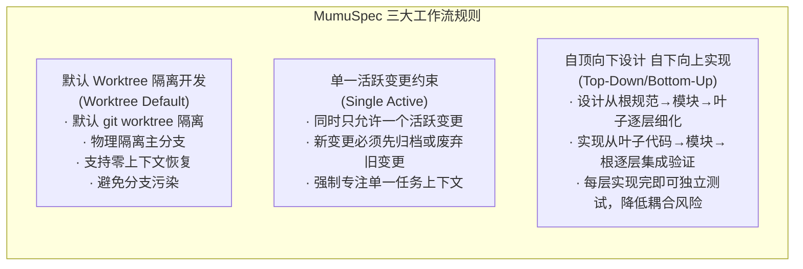

### 1.4 三大工作流规则

上述三条工作流规则是 MumuSpec 的硬性流程约束，贯穿变更生命周期的所有阶段：

#### 规则一：默认 Worktree 隔离开发

所有变更默认使用 `git worktree` 创建独立工作区，而非在主分支上创建分支。这确保了：
- **物理隔离**：主工作区不受变更影响，随时可切换上下文
- **零上下文恢复**：worktree 保留了完整的工作区状态，支持跨会话恢复
- **避免分支污染**：每个变更在独立目录中工作，合并前不影响主分支

> 仅在 worktree 不可用的特殊环境（如某些 CI 容器）中，才允许降级为 branch 方式，且需在 `.mumuspec.yaml` 中记录降级原因。

#### 规则二：单一活跃变更约束

同一时间**只允许存在一个活跃变更**（`phase` 不为 `archived` 的变更）。新变更创建前：
- 如果存在活跃变更，必须先将其归档（archive）或废弃（discard）
- 状态机在 `open` 阶段入口检查活跃变更数量，超出一个时直接拒绝创建
- 这强制 AI 和开发者保持**单一任务专注**，避免多变更交叉污染上下文

> 对于需要拆分的大型需求，应在 Open 阶段的 PRD 拆分预检中规划为顺序执行的多个变更，而非并行创建。

#### 规则三：自顶向下设计，自下向上实现

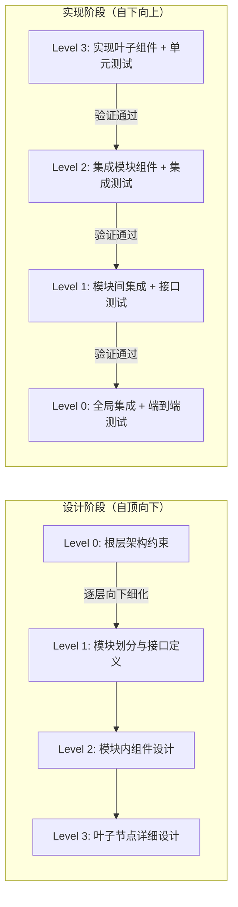

**设计自顶向下**：在 Design 阶段，从根层规范开始，逐层向下细化设计，每一层的设计基于上层约束，并为下层提供约束。这确保了架构一致性——上层的 SHALL NOT 在下层设计时自动继承。

**实现自下向上**：在 Build 阶段，从最底层的叶子组件开始实现，逐层向上集成。每完成一层的实现，立即运行该层级的规范校验和测试。这确保了：
- 每层实现完成后即可独立验证，问题在最小范围内暴露
- 上层集成时，下层已通过验证，降低调试复杂度
- 符合依赖方向——上层依赖下层，先实现被依赖方

---

## 2. 总体架构

### 2.1 架构全景图

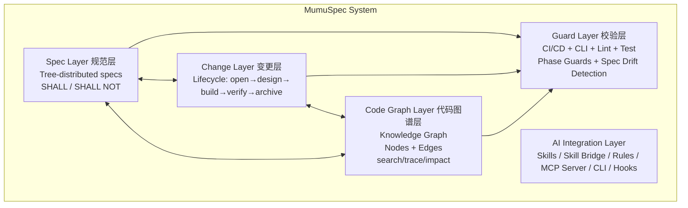

### 2.2 分层职责

| 层 | 职责 | 核心产出 |
|----|------|---------|
| **Spec Layer（规范层）** | 树状分布的双向约束规范，按目录结构分层存放；每层维护设计文档；自动生成对外文档 | `.mumuspec/` 目录树、各层 `spec.md`、`design.md`、`prohibitions.md`、`docs/` 生成文档 |
| **Change Layer（变更层）** | 变更驱动的规范生命周期管理 | `changes/<name>/` 下的 proposal/design/tasks/delta-specs |
| **Code Graph Layer（代码图谱层）** | 代码结构索引，为规范提供代码事实基础 | 知识图谱（节点+边）、索引数据库 |
| **Guard Layer（校验层）** | 自动化校验规范与代码一致性 | CI 检查脚本、lint 规则、phase guards、漂移检测 |
| **AI Integration Layer（AI 集成层）** | 与 AI 编程工具的集成接口，兼容外部 Skill 生态 | Skills、Skill Bridge、rules 文件、MCP server、CLI、hooks |

---

## 3. Spec Layer — 树状分布的双向约束规范

### 3.1 核心设计：正向 + 反向并重

MumuSpec 的每个规范单元包含两类硬性约束：

```yaml
# spec.md 中的规范单元结构示例

## Requirement: API 响应格式

### SHALL (正向要求 — 必须做到)
- 所有 API 响应必须使用统一信封格式 `{ code, message, data }`
- 分页接口必须返回 `total`、`page`、`pageSize` 字段
- 错误响应必须包含 `errorCode` 和 `errorMessage`

### SHALL NOT (反向禁止 — 绝不能做)
- 禁止在 API 响应中直接返回数据库实体对象（必须经过 DTO 转换）
- 禁止在 `data` 字段中嵌套超过 3 层的深层结构
- 禁止使用 HTTP 状态码 200 表示业务错误

### Enforcement (可执行校验)
- SHALL-1: lint 规则 `enforce-response-envelope` 检查所有 Controller 返回类型
- SHALL-2: 测试 `PaginationSpec` 验证分页字段存在性
- SHALL_NOT-1: lint 规则 `no-raw-entity-return` 检查返回类型不含 `@Entity` 注解类
- SHALL_NOT-2: 静态分析 `max-nesting-depth` 设置阈值为 3
```

### 3.2 树状目录结构 — 渐进式披露

规范按项目目录结构分层存放。**每个目录的 `.mumuspec/` 包含该目录及其直接子目录的规范概要**，AI 从哪个目录切入，就只加载对应层级的规范。每个 `.mumuspec/` 目录同时维护本层的 `design.md` 设计文档，记录架构决策与设计原理。

```
my-project/
├── .mumuspec/                          # 根层规范 (Level 0)
│   ├── spec.md                         # 全局架构规范 + 正向/反向约束
│   ├── design.md                       # 根层设计文档（架构决策、技术选型、全局设计原理）
│   ├── prohibitions.md                 # 全局禁止清单（汇总）
│   ├── config.yaml                     # MumuSpec 配置
│   └── index.yaml                      # 规范索引（指向各子层）
│
├── docs/                               # 对外文档输出目录（自动生成）
│   ├── technical/                      # 技术文档
│   │   ├── architecture.md             # 系统架构文档（从根层 spec+design 生成）
│   │   ├── api-reference.md            # API 参考文档（从 api 层 spec 生成）
│   │   └── module-auth.md              # 模块技术文档（从 auth 层 spec+design 生成）
│   └── business/                       # 业务文档
│       ├── overview.md                 # 业务概览（从根层 spec 生成）
│       └── feature-auth.md             # 认证功能说明（从 auth 层 spec 生成）
│
├── src/
│   ├── .mumuspec/                      # src 层规范 (Level 1)
│   │   ├── spec.md                     # src 层编码规范 + 子目录概要
│   │   ├── design.md                   # src 层设计文档（模块划分决策、依赖关系设计）
│   │   ├── prohibitions.md             # src 层禁止清单
│   │   └── index.yaml                  # src 层子目录索引（auth/api/lib）
│   │
│   ├── auth/
│   │   ├── .mumuspec/                  # auth 模块规范 (Level 2)
│   │   │   ├── spec.md                 # 认证授权规范
│   │   │   ├── design.md               # 认证模块设计文档（认证方案选型、token 策略设计）
│   │   │   └── prohibitions.md         # 认证模块禁止项
│   │   ├── login.ts
│   │   └── token.ts
│   │
│   ├── api/
│   │   ├── .mumuspec/                  # api 模块规范 (Level 2)
│   │   │   ├── spec.md                 # API 设计规范
│   │   │   ├── design.md               # API 层设计文档（路由设计、中间件链设计）
│   │   │   ├── prohibitions.md         # API 模块禁止项
│   │   │   └── index.yaml              # api 层子目录索引（controllers/middlewares）
│   │   ├── controllers/
│   │   │   ├── .mumuspec/             # controllers 层规范 (Level 3)
│   │   │   │   ├── spec.md             # Controller 编写规范
│   │   │   │   └── design.md           # Controller 层设计文档（DTO 映射设计、异常处理策略）
│   │   │   └── user.controller.ts
│   │   └── middlewares/
│   │       └── auth.middleware.ts
│   │
│   └── lib/
│       ├── .mumuspec/                  # lib 模块规范 (Level 2)
│       │   ├── spec.md
│       │   └── design.md               # 工具库设计文档（工具分类策略、复用设计）
│       └── utils.ts
│
├── tests/
│   └── .mumuspec/                      # 测试规范 (Level 1)
│       ├── spec.md
│       └── design.md                   # 测试策略设计文档（测试分层策略、覆盖率目标设计）
│
└── .mumuspec/
    └── changes/                        # 变更管理目录
        ├── add-user-auth/              # 活跃变更
        └── archive/
            └── 2026-07-01-fix-login/   # 已归档变更
```

### 3.3 渐进式披露加载策略

当 AI 从某个目录切入工作时，**只加载三层规范 + 设计文档**：

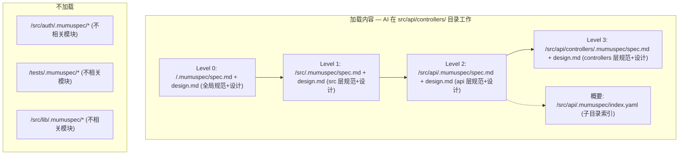

```yaml
# .mumuspec/index.yaml — 子目录规范索引
# 每个目录的 index.yaml 记录其直接子目录的规范概要
# AI 通过索引决定是否需要深入加载某子目录

children:
  auth:
    summary: "认证授权模块：JWT token、OAuth2、权限校验"
    key_prohibitions:
      - "禁止在非 auth 模块中直接操作 token"
      - "禁止将密码明文记录到日志"
    spec_path: "src/auth/.mumuspec/spec.md"
    design_path: "src/auth/.mumuspec/design.md"   # 设计文档路径
    
  api:
    summary: "API 层：Controller、Middleware、DTO 转换"
    key_prohibitions:
      - "禁止 Controller 直接调用数据库 Repository"
      - "禁止在 Middleware 中修改请求体"
    spec_path: "src/api/.mumuspec/spec.md"
    design_path: "src/api/.mumuspec/design.md"
    
  lib:
    summary: "通用工具库：工具函数、类型定义"
    key_prohibitions:
      - "禁止在 lib 中引入业务逻辑依赖"
    spec_path: "src/lib/.mumuspec/spec.md"
    design_path: "src/lib/.mumuspec/design.md"
```

### 3.4 规范文件格式

#### 3.4.1 `spec.md` — 正向 + 反向约束

```markdown
---
# spec.md frontmatter
layer: 2                    # 规范层级（0=根, 1=src, 2=模块...）
scope: "src/api"            # 规范作用范围
last_verified: "2026-07-08" # 最后校验日期
code_graph_hash: "a1b2c3d"  # 对应代码图谱快照 hash
---

# API 模块规范

## Purpose

定义 API 层的架构约束、编码规范和禁止事项。所有 Controller、Middleware、DTO 
相关的代码变更必须遵守本规范。

## Requirements

### Requirement: Controller 规范

#### SHALL
- Controller 类必须使用 `@RestController` 注解
- 每个端点必须使用 `@ApiOperation` 描述用途
- 请求参数必须使用 DTO 类接收，禁止使用裸 `Map` 或 `JSONObject`
- 响应必须经过 `ResponseTransformer` 转换为统一信封格式

#### SHALL NOT
- **禁止** Controller 直接注入 `Repository` 或 `DAO`（必须通过 Service 层）
- **禁止** 在 Controller 中编写业务逻辑（仅做参数校验和转发）
- **禁止** 使用 `@Autowired` 字段注入（必须使用构造器注入）
- **禁止** Controller 方法超过 50 行

#### Enforcement
| ID | 类型 | 检查方式 | 严重级别 |
|----|------|---------|---------|
| CTRL-001 | SHALL | lint: `controller-must-use-rest-annotation` | ERROR |
| CTRL-002 | SHALL | lint: `controller-must-have-api-operation` | WARN |
| CTRL-003 | SHALL NOT | lint: `no-repository-in-controller` | ERROR |
| CTRL-004 | SHALL NOT | lint: `no-business-logic-in-controller` | WARN |
| CTRL-005 | SHALL NOT | ast: `max-method-length(50)` | ERROR |

### Requirement: 错误处理

#### SHALL
- 所有可预见异常必须使用 `@ExceptionHandler` 统一处理
- 业务异常必须继承 `BusinessException` 基类
- 异常必须包含 `errorCode` 和用户友好的 `message`

#### SHALL NOT
- **禁止** 使用 `try-catch` 吞掉异常（catch 块不能为空）
- **禁止** 直接将异常堆栈信息返回给客户端
- **禁止** 使用 `RuntimeException` 抛出业务错误（必须用具体子类）

#### Enforcement
| ID | 类型 | 检查方式 | 严重级别 |
|----|------|---------|---------|
| ERR-001 | SHALL | test: `ExceptionHandlerTest` | ERROR |
| ERR-002 | SHALL NOT | lint: `no-empty-catch` | ERROR |
| ERR-003 | SHALL NOT | lint: `no-raw-exception-to-client` | ERROR |
```

#### 3.4.2 `prohibitions.md` — 禁止项汇总

```markdown
---
layer: 1
scope: "src"
---

# src 层禁止清单

> 本文件汇总 src 层及其子模块的所有禁止项，供 AI 快速加载。

## 全局禁止（适用于所有子目录）

| ID | 禁止内容 | 原因 | 检查方式 |
|----|---------|------|---------|
| G-001 | 禁止使用 `console.log` 进行生产日志 | 使用统一的 Logger | lint: `no-console-log` |
| G-002 | 禁止硬编码配置值 | 必须使用配置中心或环境变量 | lint: `no-hardcoded-config` |
| G-003 | 禁止使用 `any` 类型 | 类型安全 | lint: `no-explicit-any` |
| G-004 | 禁止在循环中执行数据库查询 | N+1 查询性能问题 | ast: `no-db-in-loop` |
| G-005 | 禁止忽略 Promise rejection | 未处理异常风险 | lint: `no-floating-promise` |

## 模块级禁止（仅适用于特定子目录）

### auth/
| ID | 禁止内容 | 检查方式 |
|----|---------|---------|
| AUTH-001 | 禁止在日志中记录 token 内容 | lint: `no-token-in-log` |
| AUTH-002 | 禁止将密码以明文形式传输 | test: `PasswordEncryptionTest` |

### api/
| ID | 禁止内容 | 检查方式 |
|----|---------|---------|
| API-001 | 禁止 Controller 直接调用 Repository | lint: `no-repo-in-controller` |
| API-002 | 禁止在 Middleware 中修改请求体 | lint: `no-middleware-body-modify` |
```

#### 3.4.3 `design.md` — 目录级设计文档

每个 `.mumuspec/` 目录维护一份 `design.md`，**记录本层的设计决策、架构原理和上下文**。与 `spec.md`（定义"必须做什么/不能做什么"）互补，`design.md` 回答"为什么这样设计"。

```markdown
---
# design.md frontmatter
layer: 2                    # 设计文档层级（与 spec.md 一致）
scope: "src/api"            # 设计作用范围
last_updated: "2026-07-09"  # 最后更新日期
design_version: "1.0"       # 设计版本号
---

# API 模块设计文档

## Architecture Overview

本层采用分层架构：Controller → Service → Repository。
API 层作为外部请求入口，负责参数校验、DTO 转换和响应封装，
不包含业务逻辑（业务逻辑下沉到 Service 层）。

## Design Decisions

### Decision: 选择 RESTful 风格而非 GraphQL
- **背景**: 需要对外提供标准 HTTP API，客户端以 Web 前端为主
- **决策**: 采用 RESTful 风格
- **理由**: 团队熟悉度高、缓存友好、工具链成熟
- **替代方案**: GraphQL（因学习成本和 N+1 风险放弃）
- **影响**: 所有端点遵循 REST 资源命名规范（见 spec.md Requirement: RESTful 路由）

### Decision: 统一响应信封格式
- **背景**: 不同端点返回格式不一致，客户端处理复杂
- **决策**: 所有响应使用 `{ code, message, data }` 信封
- **理由**: 统一错误处理、简化客户端解析、支持渐进式扩展
- **影响**: 定义为 spec.md SHALL 约束（enforce-response-envelope）

## Component Relationships

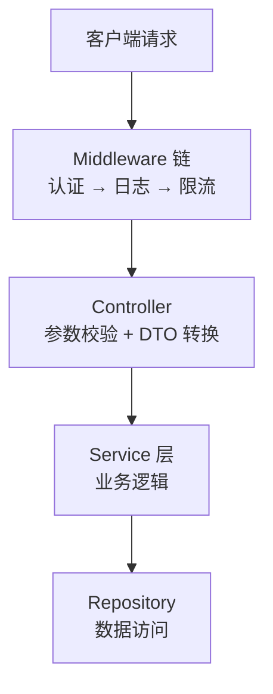

## Key Interfaces

| 接口 | 职责 | 消费方 |
|------|------|--------|
| `IRestController` | 所有 Controller 的基础接口，定义统一响应方法 | 所有 Controller |
| `ResponseTransformer` | 将 Service 返回值转换为统一信封 | Controller 层 |
| `IDtoMapper` | Entity ↔ DTO 映射接口 | Controller 层 |

## Dependencies

- **上游依赖**: 根层规范（全局架构约束、技术栈约束）
- **下游约束**: controllers/ 层（继承本层所有 SHALL/SHALL NOT）
- **外部依赖**: `express`（路由）、`class-validator`（参数校验）、`class-transformer`（DTO 转换）

## Design History

| 日期 | 版本 | 变更 | 变更关联 |
|------|------|------|---------|
| 2026-07-01 | 0.9 | 初始设计 | change: init-api-layer |
| 2026-07-05 | 1.0 | 增加统一响应信封 | change: add-response-envelope |
```

**`design.md` 与 `spec.md` 的关系**：

| 维度 | `spec.md` | `design.md` |
|------|-----------|-------------|
| 回答的问题 | 做什么 / 不能做什么 | 为什么这样设计 |
| 约束类型 | 硬性约束（SHALL / SHALL NOT） | 设计决策与原理（软性指导） |
| 可执行校验 | 有 Enforcement 检查 | 无直接校验，但影响 spec 生成 |
| 变更触发 | 代码变更触发 delta-spec | 设计变更时同步更新 |
| 文档生成 | 作为技术/业务文档的事实来源 | 作为架构决策记录(ADR)的来源 |
| AI 加载 | 渐进式披露加载 | 与 spec.md 一同加载 |

**设计文档维护规则**：
1. 每个有 `.mumuspec/spec.md` 的目录**必须**同时维护 `design.md`
2. 变更的 Design 阶段产出会更新对应层级的 `design.md`（delta-design 合并到主 design.md）
3. `design.md` 中的 Design Decision 应与 `spec.md` 中的 Requirement 对应——每个关键决策产生对应的约束
4. `design.md` 纳入漂移检测：检测设计文档描述的组件关系是否与代码图谱一致

### 3.5 规范层级关系

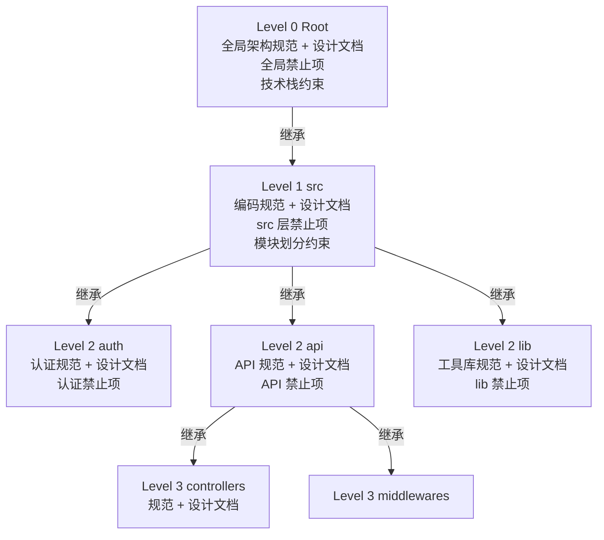

**规范继承规则**：
1. 子层自动继承父层的所有 SHALL 和 SHALL NOT
2. 子层可以收紧父层约束，但不能放宽
3. 子层的 SHALL NOT 累加到父层（不覆盖）
4. 子层可以添加父层没有的特定约束
5. Enforcement 随对应 SHALL/SHALL NOT 一并继承：子层可通过相同 ID 重定义 check 方式（覆盖），但不可降低 severity（如父层 ERROR 子层不可降为 WARN）
6. Enforcement 的 target 在继承时自动收敛到子层 scope（如父层 `target: "src/api/**/*.ts"` 在子层 `src/api/controllers/` 收敛为 `src/api/controllers/**/*.ts`）
7. `design.md` 随规范层级一同继承：子层 `design.md` 的 Architecture Overview 应引用父层设计上下文，Design Decisions 可补充但不覆盖父层决策

### 3.6 文档生成引擎 — 从规范到对外文档

MumuSpec 不仅能约束 AI 编程行为，还能**根据各目录下的 spec.md + design.md 自动生成对外技术文档和业务文档**。这确保了对外文档始终与内部规范保持一致，消除"规范文档写完即过时"和"对外文档与内部规范脱节"两大痛点。

#### 3.6.1 生成架构

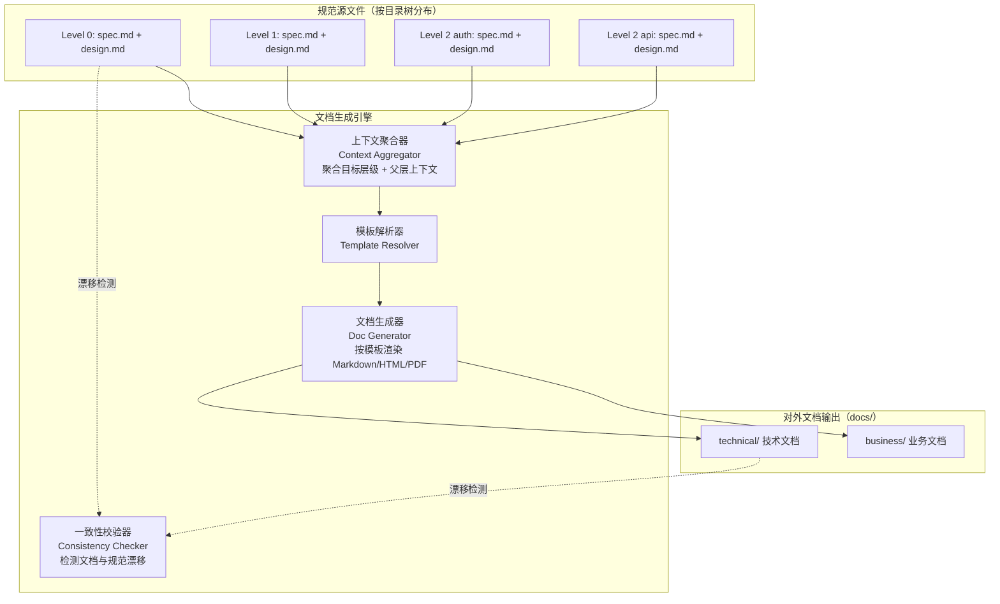

#### 3.6.2 文档类型与映射规则

文档生成引擎将规范源文件映射为两类对外文档：

| 文档类型 | 目标读者 | 数据来源 | 生成内容 |
|---------|---------|---------|---------|
| **技术文档** (`docs/technical/`) | 开发者、架构师 | `spec.md` (Requirements + Enforcement) + `design.md` (Architecture + Decisions) | 架构文档、API 参考、模块技术说明、ADR 决策记录、依赖关系图 |
| **业务文档** (`docs/business/`) | 产品经理、业务方、新成员 | `spec.md` (Requirements 描述) + `design.md` (Architecture Overview) | 功能概览、业务规则说明、模块职责描述、用户流程说明 |

**层级到文档的映射规则**：

| 规范层级 | 生成的技术文档 | 生成的业务文档 |
|---------|-------------|-------------|
| Level 0 (根) | `architecture.md` — 系统架构总览 | `overview.md` — 业务全景概览 |
| Level 1 (src) | `tech-standards.md` — 技术规范汇总 | （通常不单独生成） |
| Level 2 (模块) | `module-<name>.md` — 模块技术文档 | `feature-<name>.md` — 功能业务说明 |
| Level 3 (子模块) | 合并到父模块文档的子章节 | 合并到父模块文档的子章节 |

> Level 3 及更深层级的文档默认合并到父模块文档中，不单独生成文件，避免文档碎片化。

#### 3.6.3 文档模板系统

文档生成使用模板系统，模板定义了如何从 spec + design 提取信息并组织为对外文档：

```yaml
# .mumuspec/templates/technical-module.yaml
# 技术文档模板：模块级

template:
  name: "technical-module"
  type: technical
  scope: module           # module | root | layer
  
  sections:
    - title: "模块概述"
      source: design.md#Architecture Overview
      transform: "passthrough"    # 原样输出
      
    - title: "架构设计"
      source: design.md#Component Relationships
      transform: "render_mermaid" # 渲染 Mermaid 图表
      
    - title: "设计决策"
      source: design.md#Design Decisions
      transform: "extract_adr"    # 提取为 ADR 格式
      
    - title: "接口规范"
      source: spec.md#Requirements
      filter: "type == 'interface'"
      transform: "to_api_table"   # 转换为 API 表格
      
    - title: "约束与限制"
      source: spec.md#Requirements
      filter: "type == 'constraint'"
      transform: "to_constraint_list"
      
    - title: "禁止事项"
      source: prohibitions.md
      transform: "to_warning_list"
      
    - title: "变更历史"
      source: design.md#Design History
      transform: "to_changelog"
```

```yaml
# .mumuspec/templates/business-module.yaml
# 业务文档模板：模块级

template:
  name: "business-module"
  type: business
  scope: module
  
  sections:
    - title: "功能概述"
      source: design.md#Architecture Overview
      transform: "simplify_for_business"  # 去除技术细节，保留业务描述
      
    - title: "业务规则"
      source: spec.md#Requirements
      filter: "type == 'business_rule'"
      transform: "to_business_rule_list"
      
    - title: "用户流程"
      source: design.md#Component Relationships
      transform: "to_user_flow"           # 转换为用户可理解的流程图
      
    - title: "限制与注意事项"
      source: spec.md#SHALL NOT
      transform: "to_business_constraint"  # 转换为业务语言描述的约束
```

**模板查找规则**：
1. 优先使用 `.mumuspec/templates/` 下的项目自定义模板
2. 未找到自定义模板时，使用内置默认模板（`@mumuspec/templates/`）
3. 模板可通过 npm 包分发和共享（`@mumuspec/template-*`）

#### 3.6.4 上下文聚合策略

文档生成时，引擎会聚合目标层级及其父层的上下文，确保生成的文档包含完整的上下文信息：

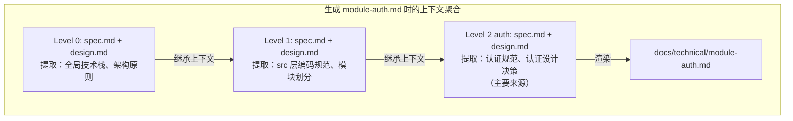

**聚合规则**：
- **技术文档**：聚合从根到目标层的所有 `spec.md` 的 SHALL 约束 + 所有 `design.md` 的 Design Decisions
- **业务文档**：聚合从根到目标层的 `spec.md` 的 Requirement 描述 + `design.md` 的 Architecture Overview
- **不聚合同级**：不加载兄弟模块的规范（如生成 auth 文档时不加载 api 规范）
- **可选深度**：通过 `--depth` 参数控制聚合的父层深度（默认全部聚合）

#### 3.6.5 文档生成与变更生命周期集成

文档生成嵌入变更生命周期的关键节点：

| 阶段 | 文档生成动作 | 说明 |
|------|------------|------|
| **Design** | 更新 `design.md` 后，标记受影响文档为 `stale` | 设计变更可能导致文档过期 |
| **Build** | 实现完成后，自动重新生成受影响层级的文档 | 代码变更触发文档同步 |
| **Verify** | 校验生成文档与 spec/design 的一致性 | 文档漂移检测 |
| **Archive** | 将最终文档提交到主分支 | 文档随代码一同合并 |

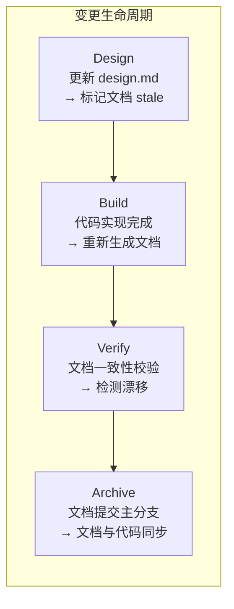

#### 3.6.6 文档一致性校验

文档生成后，一致性校验器检测生成文档与规范源文件之间的漂移：

```yaml
# 文档漂移检测规则
doc_drift_detection:
  - check: "spec.md 新增 Requirement 但文档未更新"
    detection: "比较 spec.md 的 Requirement 列表与文档中的约束章节"
    severity: WARN
    auto_fix: true    # 自动重新生成文档
    
  - check: "design.md Design Decision 变更但 ADR 章节未更新"
    detection: "比较 design.md 的 Design Decisions 与文档中的决策记录"
    severity: WARN
    auto_fix: true
    
  - check: "SHALL NOT 新增但文档禁止事项章节缺失"
    detection: "比较 prohibitions.md 与文档中的限制章节"
    severity: ERROR
    auto_fix: true
    
  - check: "文档手动修改导致与 spec 不一致"
    detection: "比较文档内容与 spec 生成的预期内容"
    severity: ERROR
    auto_fix: false   # 不自动覆盖手动修改，发出警告
    recommendation: "文档为自动生成，请勿手动修改。如需定制，请修改模板。"
```

> **文档生成原则**：`docs/` 目录下的文件是自动生成的，不应手动修改。如需定制文档内容或格式，应修改模板（`.mumuspec/templates/`）或源文件（`spec.md` / `design.md`），然后重新生成。

#### 3.6.7 多格式输出

文档生成引擎支持多种输出格式：

| 格式 | 用途 | 配置项 |
|------|------|--------|
| **Markdown** (默认) | 开发者文档、Git 仓库内文档 | `output.format: markdown` |
| **HTML** | 文档站点、Wiki 发布 | `output.format: html` |
| **PDF** | 正式文档、离线分发 | `output.format: pdf` |
| **Confluence** | 企业 Wiki 同步 | `output.format: confluence` |

```yaml
# 多格式输出配置示例
docs:
  output:
    default_format: markdown      # 默认格式
    formats:
      - markdown                   # 总是生成 Markdown
      - html:                      # 额外生成 HTML
          output_dir: "docs/site"
          theme: "default"
      - pdf:                       # 按需生成 PDF
          output_dir: "docs/pdf"
          only: ["architecture", "api-reference"]  # 仅特定文档生成 PDF
```

---

## 4. Change Layer — 变更驱动的规范生命周期

### 4.1 变更生命周期

借鉴 OpenSpec + Comet 的工件流水线，增加双向约束、代码图谱集成，并遵循三大工作流规则：

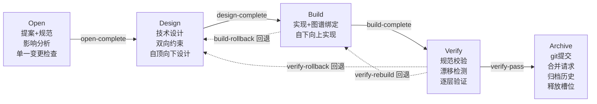

> Build/Verify 发现设计问题可回退到 Design 重新设计

**工作流规则在各阶段的体现**：

| 规则 | Open | Design | Build | Verify | Archive |
|------|------|--------|-------|--------|---------|
| 默认 Worktree | 创建 worktree | 在 worktree 中进行 | 在 worktree 中实现 | 在 worktree 中进行 | 合并后清理 worktree |
| 单一活跃变更 | 检查无其他活跃变更 | — | — | — | 归档后释放变更槽位 |
| 自顶向下/自下向上 | — | 自顶向下设计 | 自下向上实现 | 逐层验证 | — |
| 状态机回退 | — | 接收回退 | 可发起回退 | 可发起回退 | 终态不可回退 |
| Git 合并 | — | — | — | — | 提交+合并请求 |

### 4.1.1 状态机转换规则

变更阶段由状态机严格管理，支持正向流转和反向回退：

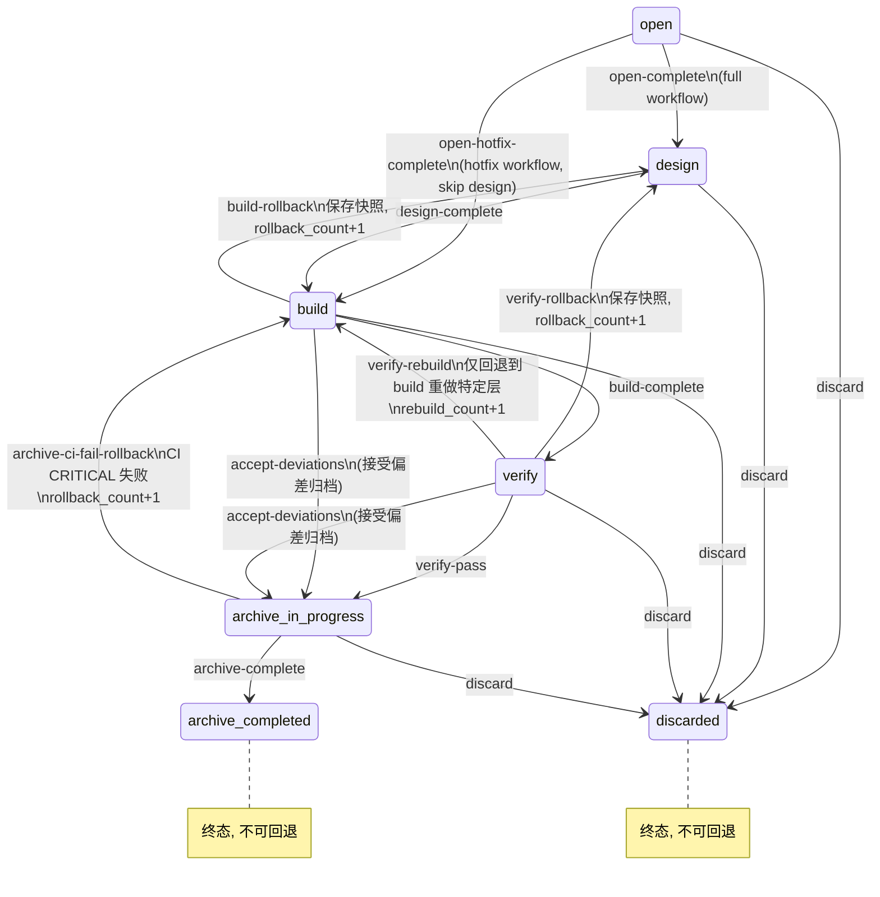

> **状态说明**：
> - `archive-in-progress`：Archive 阶段执行中（A1-A6 Git 合并、B1-B5 规范归档、C1-C4 清理），允许 CI 失败回退
> - `archive-completed`：Archive 阶段全部完成（archive_complete guard 通过），终态不可回退
> - `discarded`：废弃终态，变更已清理，槽位已释放

**正向转换事件**：

| 事件 | 源状态 | 目标状态 | 条件 |
|------|--------|---------|------|
| `open-complete` | open | design | Phase Guard: open_to_design 全部通过（workflow == full） |
| `open-hotfix-complete` | open | build | Phase Guard: open_to_build_hotfix 全部通过（workflow == hotfix） |
| `design-complete` | design | build | Phase Guard: design_to_build 全部通过 |
| `build-complete` | build | verify | Phase Guard: build_to_verify 全部通过 |
| `verify-pass` | verify | archive-in-progress | Phase Guard: verify_to_archive 全部通过 |
| `accept-deviations` | build / verify | archive-in-progress | Phase Guard: verify_to_archive_with_deviations 全部通过（rollback_limit 超限时用户选择接受偏差） |
| `archive-complete` | archive-in-progress | archive-completed | Phase Guard: archive_complete 全部通过 |

**反向回退事件**：

| 事件 | 源状态 | 目标状态 | 触发条件 | 副作用 |
|------|--------|---------|---------|--------|
| `build-rollback` | build | design | Build 阶段发现设计方案不可行 / 约束冲突 / 缺失关键设计 | 保存当前状态快照，记录回退原因，rollback_count+1 |
| `verify-rollback` | verify | design | Verify 阶段发现规范与实现存在根本性矛盾 / 设计假设错误 | 保存验证报告，记录回退原因，rollback_count+1 |
| `verify-rebuild` | verify | build | Verify 发现实现层 bug（非设计问题），需修复代码 | 保留设计不变，仅回退到 Build 重做特定层，rebuild_count+1 |
| `archive-ci-fail-rollback` | archive-in-progress | build | Archive 阶段 A4 CI 检查 CRITICAL 失败 | 保存 Archive 阶段快照，记录回退原因，rollback_count+1 |

**终止事件**：

| 事件 | 源状态 | 目标状态 | 触发条件 | 副作用 |
|------|--------|---------|---------|--------|
| `discard` | open / design / build / verify / archive-in-progress | discarded | 用户主动废弃变更 | 保存快照到 snapshots/discard/，清理 worktree，移动变更到 archive/discarded/，释放槽位 |

**回退规则**：

1. **回退前必须保存快照**：回退操作触发前，状态机自动保存当前阶段的工件快照到 `.mumuspec/changes/<name>/snapshots/` 目录，确保回退不丢失工作成果
2. **回退必须记录原因**：每次回退必须在 `.mumuspec.yaml` 中记录 `rollback_reason`，包含发现的问题描述和回退决策依据
3. **回退计数限制**：`rollback_count` 限制 `build-rollback`、`verify-rollback`、`archive-ci-fail-rollback` 三类回退的总和，默认上限为 3 次（可配置）。`verify-rebuild` 使用独立的 `rebuild_count` / `rebuild_limit`（默认 5），不计入 rollback_count。超过任一上限时状态机拒绝回退，要求用户选择：接受当前偏差归档（`accept-deviations`）/ 废弃变更重新开始（`discard`）
4. **回退后保留历史**：回退不删除之前的工件，而是在原有基础上修改，snapshots 目录保留所有历史版本供追溯
5. **archive-completed 为终态**：`archive-completed` 状态不可回退，如需修改应创建新变更。`archive-in-progress` 允许通过 `archive-ci-fail-rollback` 回退到 build
6. **回退是用户决策点**：回退操作必须通过用户确认，AI 不能自动发起回退
7. **Open 阶段不支持回退**：Open 阶段无回退路径，如需修改需求应通过 `discard` 废弃后重新创建变更

### 4.2 变更工件结构

```
.mumuspec/changes/<change-name>/
├── .mumuspec.yaml              # 变更状态文件（状态机 + 回退追踪 + git 合并）
├── proposal.md                 # 为什么 + 做什么（含影响分析）
├── design.md                   # 怎么做（技术设计）
├── tasks.md                    # 实现任务清单
├── delta-specs/                # 规范变更（delta semantics）
│   └── <scope>/
│       └── spec.md             # ADDED/MODIFIED/REMOVED/RENAMED
├── constraints/                # 本次变更引入的约束
│   ├── new-shall.md            # 新增正向要求
│   └── new-shall-not.md        # 新增反向禁止
├── code-graph/                 # 代码图谱绑定
│   ├── impact-analysis.json    # 影响分析结果
│   └── base-ref.txt            # 基准 commit hash
├── snapshots/                  # 回退快照（每次回退自动保存）
│   ├── build-rollback-1/       # 第一次 Build→Design 回退快照
│   │   ├── design.md           # 回退时的 design.md 副本
│   │   ├── tasks.md            # 回退时的 tasks.md 副本
│   │   ├── build-layers.json   # 回退时的层级状态
│   │   └── rollback-reason.md  # 回退原因记录
│   └── verify-rollback-1/      # 第一次 Verify→Design 回退快照
│       ├── verify.md           # 验证报告副本
│       ├── design.md           # 回退时的 design.md 副本
│       └── rollback-reason.md  # 回退原因记录
└── verify.md                   # 验证报告
```

### 4.3 `.mumuspec.yaml` 状态文件

```yaml
# 变更状态机配置文件
# 注：创建变更时，以下字段从 config.yaml 的 default_* 拷贝为初始值：
#   workflow <- config.changes.default_workflow
#   isolation <- config.changes.default_isolation
#   build_mode <- config.changes.default_build_mode
#   tdd_mode <- config.changes.default_tdd_mode
#   rollback_limit <- config.changes.default_rollback_limit
#   rebuild_limit <- config.changes.default_rebuild_limit
change: add-user-auth
workflow: full                    # full | hotfix | tweak
phase: build                      # open | design | build | verify | archive-in-progress | archive-completed | discarded
created_at: 2026-07-08

# 状态机回退追踪
# rollback_count 限制 build-rollback / verify-rollback / archive-ci-fail-rollback 三类回退总和
# verify-rebuild 不计入 rollback_count，使用独立的 rebuild_count
rollback_count: 0                 # 累计回退次数（build-rollback + verify-rollback + archive-ci-fail-rollback）
rollback_history:                 # 回退历史记录（所有回退事件均记录，含 counted 字段标识是否计入 rollback_count）
  # - from: build
  #   to: design
  #   event: "build-rollback"
  #   reason: "发现 Controller 层缺少 DTO 转换设计"
  #   timestamp: "2026-07-08T14:30:00Z"
  #   snapshot: "snapshots/build-rollback-1/"
  #   counted: true                # 计入 rollback_count
  # - from: verify
  #   to: design
  #   event: "verify-rollback"
  #   reason: "SHALL NOT 约束在当前架构下无法满足，需重新设计"
  #   timestamp: "2026-07-08T15:00:00Z"
  #   snapshot: "snapshots/verify-rollback-1/"
  #   counted: true                # 计入 rollback_count
  # - from: verify
  #   to: build
  #   event: "verify-rebuild"
  #   reason: "Layer 2 集成测试失败，需修复组件"
  #   timestamp: "2026-07-08T16:00:00Z"
  #   snapshot: "snapshots/verify-rebuild-1/"
  #   counted: false               # verify-rebuild 不计入 rollback_count，计入 rebuild_count
  # - from: archive-in-progress
  #   to: build
  #   event: "archive-ci-fail-rollback"
  #   reason: "CI CRITICAL: 全量 SHALL NOT 检查失败 3 项"
  #   timestamp: "2026-07-08T17:00:00Z"
  #   snapshot: "snapshots/archive-rollback-1/"
  #   counted: true                # 计入 rollback_count
rollback_limit: 3                 # rollback_count 上限（从 config.default_rollback_limit 拷贝）

# verify-rebuild 独立计数（防止 verify→build 无限循环）
rebuild_count: 0                  # verify-rebuild 累计次数
rebuild_limit: 5                  # rebuild_count 上限（从 config.default_rebuild_limit 拷贝），超限强制升级为 verify-rollback

# 规范关联
affected_scopes:                  # 受影响的规范层级
  - "src/auth"
  - "src/api/controllers"
delta_specs:
  - "delta-specs/src-auth/spec.md"
  - "delta-specs/src-api-controllers/spec.md"

# 代码图谱关联（与 config.yaml.code_graph 全局配置区分）
code_graph_binding:
  base_ref: "a1b2c3d4e5f6..."    # 变更前 commit hash
  impact_analysis: "code-graph/impact-analysis.json"
  graph_snapshot: "code-graph/snapshot.json"

# 构建配置
build_mode: executing-plans       # executing-plans | subagent | direct
isolation: worktree               # worktree (默认) | branch (降级，需 config.allow_isolation_downgrade=true)
worktree_path: null               # worktree 路径（创建后自动填充）
worktree_branch: null             # worktree 对应的 git 分支名
isolation_downgrade_reason: null  # 降级为 branch 时的原因记录
tdd_mode: tdd                     # tdd | direct

# 实现策略（自下向上，硬性规则不可配置）
implementation_strategy: bottom-up # 固定值，由 1.4 规则三约束
build_layers:                     # 实现层级顺序（从叶子到根，必须覆盖所有 affected_scopes）
  - layer: 3                      # 叶子层先实现（同层可并行）
    scope: "src/auth"
    status: pending
  - layer: 3                      # 叶子层先实现（同层可并行）
    scope: "src/api/controllers"
    status: pending
  - layer: 2
    scope: "src/api"
    status: pending
  - layer: 1
    scope: "src"
    status: pending
  - layer: 0                      # 根层最后集成
    scope: "."
    status: pending

# 验证配置
verify_result: pending            # pending | pass | fail | pass-with-deviations
verify_report: null

# 偏差归档（accept-deviations 路径使用）
accepted_deviations: []           # 接受的偏差列表（rollback_limit 超限时用户选择接受偏差）
deviation_reviewer: null          # 偏差审核人
deviation_approved_at: null       # 偏差批准时间

# 归档与 Git 合并
archived: false
archived_at: null
git_merge:
  commit_sha: null                # 归档时的最终 commit SHA
  merge_request_id: null          # MR/PR ID
  merge_strategy: squash          # squash | merge | rebase
  target_branch: main             # 合并目标分支
  merged: false
  merged_at: null

# 废弃记录（discard 流程使用）
discarded: false                  # 是否已废弃
discarded_at: null                # 废弃时间
discard_reason: null              # 废弃原因
```

### 4.4 五阶段详解

#### Phase 1: Open（开启变更）

```
输入: 用户描述需求
输出: proposal.md + delta-specs/ + 影响分析 + .mumuspec.yaml（初始化）+ worktree（已创建）

步骤:
0. 单一活跃变更检查（硬性前置条件）
   - 扫描 .mumuspec/changes/ 下所有活跃变更（phase != archived）
   - 如果存在活跃变更，拒绝创建新变更，提示用户先归档或废弃
   - 对于需要拆分的大型需求，在 PRD 拆分预检中规划为顺序变更
1. 需求探索与澄清（brainstorming，不可跳过，hotfix/tweak 除外）
2. 通过代码图谱进行影响分析
   - 检索受影响的节点（函数、类、模块）
   - 追踪调用链（trace_path）
   - 评估变更影响范围（detect_changes 模拟）
3. 确定 affected_scopes（受影响的规范层级）
4. 创建 proposal.md（为什么 + 做什么 + 影响范围）
5. 创建 delta-specs（规范变更草案）
   - 明确本次变更引入的新 SHALL 和 SHALL NOT
   - 使用 ADDED/MODIFIED/REMOVED 语义标记
6. 创建 worktree 隔离工作区（默认）
   - 运行 mumuspec worktree create <change-name>
   - 在 .mumuspec.yaml 中记录 worktree_path
   - 后续所有工作在 worktree 中进行
7. 用户确认（阻塞点）
```

#### Phase 2: Design（技术设计 — 自顶向下）

```
输入: proposal.md + delta-specs/ + 影响分析
输出: design.md + constraints/ + build_layers（写入 .mumuspec.yaml）

设计原则: 自顶向下（Top-Down）
  从根层架构约束出发，逐层向下细化设计，确保每一层的设计
  基于上层约束并为下层提供约束。
  本阶段在 Open 阶段创建的 worktree 中进行。

命名约定: 设计阶段使用 Level（自顶向下），实现阶段使用 Layer（自下向上）。
  Layer N 对应 Level N 的反向实现（即 Level 3 的叶子设计 → Layer 3 的叶子实现）。
  Level 上限由附录 B max_layer_depth 配置（默认 5），超出应拆分变更。

步骤:
1. 自顶向下逐层设计（必须按 a→b→c→d 顺序执行，下层设计需引用上层约束）：
   a. Level 0 — 根层架构设计
      - 确认变更对全局架构的影响
      - 确定模块间接口契约
      - 定义全局约束的调整（如有）
   b. Level 1 — 模块层设计
      - 基于根层接口契约，设计模块间交互
      - 确定模块边界和数据流
      - 定义模块层 SHALL/SHALL NOT
   c. Level 2 — 组件层设计
      - 基于模块层设计，细化到具体组件
      - 定义组件接口和依赖关系
      - 定义组件层 SHALL/SHALL NOT
   d. Level 3+ — 叶子节点详细设计（最多到 max_layer_depth 层）
      - 具体函数/类/方法的签名设计
      - 定义叶子层 SHALL/SHALL NOT 和 Enforcement
2. 明确技术约束（在各层设计中逐步细化）：
   - 新增的正向要求（new-shall.md）
   - 新增的反向禁止（new-shall-not.md）
3. 设计可执行校验方式（lint 规则、测试用例、AST 检查）
4. 代码图谱验证：
   - 确认设计方案不会破坏现有调用链
   - 检查是否有死代码引入风险
5. 生成实现层级计划（build_layers）
   - 将受影响的规范层级按从深到浅排序
   - 每层标注预期实现顺序和验证点
   - build_layers 的 layer 编号与 Level 编号一一对应（layer N 实现 level N 的设计）
6. 用户确认设计方案（阻塞点）
```

#### Phase 3: Build（实现 — 自下向上）

```
输入: design.md + constraints/ + build_layers
输出: 代码提交 + 图谱更新 + .mumuspec.yaml 状态更新（build_layers.status=done、build_mode、tdd_mode）

实现原则: 自下向上（Bottom-Up）
  从最深层（叶子层）开始实现，逐层向上集成。
  每完成一层的实现，立即运行该层级的规范校验和测试，
  通过后再进入上一层。
  本阶段在 Open 阶段创建的 worktree 中进行。

步骤:
1. 创建实现计划（tasks.md）
   - 按 build_layers 顺序组织任务（从叶子层到根层）
   - 每层任务包含：实现 + 该层 SHALL/SHALL NOT 校验 + 该层测试
   - 测试用例来源于 Design 阶段的 Enforcement 定义
2. 确认工作区隔离方式
   - 默认使用 worktree（在 Open 阶段已创建）
   - 仅在 worktree 不可用时降级为 branch（需记录降级原因）
3. 选择执行方式（executing-plans / subagent / direct）
   - 在 .mumuspec.yaml 中记录 build_mode 和 tdd_mode
4. 自下向上逐层实现：
   ┌── Layer 3 (叶子层): 实现叶子组件 + 单元测试
   │   - 加载叶子层规范（渐进式披露）
   │   - 遵守该层 SHALL 和 SHALL NOT
   │   - 运行该层 Enforcement 检查
   │   - 通过后标记 build_layers[layer=3].status = done
   │   - 提交代码（仅 worktree 内 git commit，不包含 push 或合并）
   │
   ├── Layer 2 (组件层): 集成叶子组件 + 集成测试
   │   - 加载组件层规范
   │   - 验证下层组件已通过校验
   │   - 运行组件层 Enforcement 检查
   │   - 通过后标记 build_layers[layer=2].status = done
   │   - 提交代码（仅 worktree 内 git commit）
   │
   ├── Layer 1 (模块层): 模块间集成 + 接口测试
   │   - 加载模块层规范
   │   - 验证下层组件已通过校验
   │   - 运行模块层 Enforcement 检查
   │   - 通过后标记 build_layers[layer=1].status = done
   │   - 提交代码（仅 worktree 内 git commit）
   │
   └── Layer 0 (根层): 全局集成 + 端到端测试
       - 加载根层规范
       - 验证所有下层已通过校验
       - 运行全局 Enforcement 检查
       - 通过后标记 build_layers[layer=0].status = done
       - 提交代码（仅 worktree 内 git commit）
5. 运行 build_command 验证可构建性（if configured）
6. 运行 mumuspec index 更新代码图谱
7. 所有层级实现并通过后，进入验证阶段

回退处理（Build → Design 回退，事件 build-rollback）：
  当实现过程中发现设计方案存在根本性问题（如约束冲突、架构假设错误、
  缺失关键接口设计等），可发起回退到 Design 阶段：
  
  a. 用户确认回退（阻塞点 — AI 不能自动发起回退）
  b. 状态机执行 checks：检查 rollback_count < rollback_limit
     （若检查失败，拒绝回退，要求用户选择 accept-deviations 或 discard）
  c. 状态机执行 side_effects：
     - 保存当前 Build 阶段快照到 snapshots/build-rollback-N/（保留所有历史快照，不覆盖）
     - 在 .mumuspec.yaml 中记录 rollback_reason、rollback_history（含 counted: true）
     - rollback_count + 1
     - build_layers 全部重置为 pending（保留已实现代码，仅重置状态；快照已保存历史供 Design 查阅）
     - 状态机转换：phase: build → phase: design
  d. 在 Design 阶段基于快照和回退原因修改设计
  e. 修改后的设计需重新通过 design_to_build guard
  f. 重新进入 Build 时，build_layers 已为 pending（回退时已重置），基于已有代码调整

注: hotfix/tweak 预设可简化为单层实现，但仍需自下向上验证
```

#### Phase 4: Verify（验证 — 自下向上逐层验证）

```
输入: 完成的代码 + 规范 + 图谱 + build_layers（全部 status=done）
输出: verify.md（验证报告）

验证原则: 自下向上逐层验证（Bottom-Up）
  按 build_layers 的 Layer 3→0 顺序，对每一层独立执行 4 个维度验证，
  通过后再进入上一层；全部层级通过后执行全局验证。
  本阶段在 Open 阶段创建的 worktree 中进行。

验证维度（每层均执行）:
1. 完整性验证（Completeness）
   - 该层对应 tasks.md 任务已完成
   - 该层 delta-specs 中的 requirement 已实现

2. 规范一致性验证（Spec Compliance）
   - SHALL 检查：该层正向要求是否满足
   - SHALL NOT 检查：该层反向禁止是否被遵守
   - 执行该层 Enforcement 中定义的检查

3. 代码图谱验证（Code Graph Integrity）
   - 该层变更后的调用链完整性
   - 无意外的破坏性变更
   - 死代码检测

4. 漂移检测（Drift Detection）
   - 该层规范与代码的一致性
   - 代码图谱与实际代码的一致性
   - 索引新鲜度检查

步骤:
1. 逐层验证（按 Layer 3→0 顺序）：
   ┌── Layer 3 (叶子层): 执行 4 维度验证
   │   - 通过 → 标记该层 verified，进入 Layer 2
   │   - 失败 → 记录失败维度与证据，触发回退处理
   ├── Layer 2 (组件层): 执行 4 维度验证（同上）
   ├── Layer 1 (模块层): 执行 4 维度验证（同上）
   └── Layer 0 (根层): 执行 4 维度验证（同上）
2. 全局验证（所有层级通过后）：
   - 全量 SHALL/SHALL NOT 检查（跨层一致性）
   - 全局代码图谱完整性
   - 全局漂移检测
   - delta-specs 所有 requirement 已实现（all_delta_spec_requirements_implemented）
3. 生成 verify.md 验证报告
4. 用户确认验证结果（阻塞点）

回退处理（Verify → Design / Verify → Build 回退）：
  验证阶段发现问题后，根据问题性质选择回退目标：

  情况 A — 回退到 Design（设计层面问题）：
    触发条件：规范与实现存在根本性矛盾、设计假设错误、
             SHALL/SHALL NOT 约束在当前架构下无法满足
    a. 用户确认回退（阻塞点）
    b. 状态机执行 checks：检查 rollback_count < rollback_limit
       （若检查失败，拒绝回退，要求用户选择 accept-deviations 或 discard）
    c. 状态机执行 side_effects：
       - 保存 Verify 报告和当前状态快照到 snapshots/verify-rollback-N/（保留所有历史快照，不覆盖）
       - 在 .mumuspec.yaml 中记录 rollback_reason、rollback_history（含 counted: true）
       - rollback_count + 1
       - build_layers 全部重置为 pending（回退时立即重置；保留已实现代码，仅重置状态）
       - 状态机转换：phase: verify → phase: design
    d. 在 Design 阶段修改设计以解决验证发现的问题
    e. 修改后的设计需重新通过 design_to_build guard
    f. 重新走 Design → Build → Verify 流程

  情况 B — 回退到 Build（实现层面问题，设计无需修改）：
    触发条件：实现存在 bug、某层 Enforcement 检查未通过、
             测试失败但设计方案本身正确
    a. 用户确认回退（阻塞点）
    b. 状态机执行 checks：检查 rebuild_count < rebuild_limit
       （若检查失败，强制升级为情况 A 的 verify_to_design_rollback）
    c. 状态机执行 side_effects：
       - 保存 Verify 报告快照到 snapshots/verify-rebuild-N/
       - 在 .mumuspec.yaml 中记录 rollback_reason、rollback_history（含 counted: false，event: verify-rebuild）
       - rebuild_count + 1（此回退不增加 rollback_count，设计未变仅修复实现）
       - 仅重置失败的 build_layers 层级为 pending（不全部重置；保留已实现代码）
       - 状态机转换：phase: verify → phase: build
    d. 仅重做有问题的 build_layers 层级（不全部重置）
    e. 修复后重新进入 Verify

注: hotfix/tweak 预设走 light verify — 仅 SHALL NOT 检查 + 图谱完整性（tweak 可省略图谱）
```

#### Phase 5: Archive（归档 — Git 提交 + 合并请求）

```
输入: verify_result: pass + verify.md + SHALL/SHALL NOT 全通过 + 无 critical drift + 图谱完整
输出: 合并到主分支的代码 + 合并后的主规范 + 归档记录

Archive 阶段是变更生命周期的终态操作，包含三个子流程：
  A. Git 合并流程 — 将 worktree 中的代码合并到主分支
  B. 规范归档流程 — 将 delta-specs 合并到主规范
  C. 清理与收尾 — 移动归档、清理 worktree、释放槽位

执行顺序与事务性：
  - 严格按 A → B → C 顺序执行，前一子流程未完成不得进入下一子流程
  - A4 CI 检查 CRITICAL 失败时，中止 B/C，触发 archive_ci_fail_rollback 回退到 Build
  - B0-B3 规范合并为原子操作：开始前备份受影响规范文件，任一步骤失败回滚到备份状态
  - B4 图谱更新与 B5 规范提交在同一个 git commit 中（原子提交，保证规范与图谱一致）

步骤 A: Git 提交与合并请求

  A1. 最终提交（在 worktree 中）
      - 确保所有代码变更已提交（无 uncommitted changes）
      - 提交内容包含：代码 + 变更工件（proposal/design/tasks/delta-specs）
      - 提交信息格式："feat(change): <change-name> — <简要描述>"
      - 记录最终 commit SHA 到 .mumuspec.yaml: git_merge.commit_sha

  A2. 推送到远程
      - git push origin <worktree-branch>
      - 如果推送失败（如远端有新提交），先 rebase 再推送

  A3. 创建合并请求（MR/PR）
      - 从 worktree 分支创建到目标分支（默认 main）的合并请求
      - MR 标题："[MumuSpec] <change-name>: <简要描述>"
      - MR 描述自动包含：
        · proposal.md 摘要（为什么 + 做什么）
        · design.md 关键决策
        · verify.md 验证结果摘要
        · 影响的规范层级（affected_scopes）
        · 回退历史（如有）
      - 记录 MR ID 到 .mumuspec.yaml: git_merge.merge_request_id

  A4. CI 检查（在 MR 上）
      - 等待 CI pipeline 完成
      - CI 必须包含：全量 SHALL/SHALL NOT 检查 + 漂移检测 + 代码图谱完整性
      - 如果 CI 失败：
        · CRITICAL 级别失败 → 回退到 Build 阶段修复（archive_ci_fail_rollback）
          修复后重验范围：必须重新走完整 Build → Verify → Archive 流程
          （因 CI 在合并前执行全量检查，修复点可能影响其他层级，不可仅局部重验）
        · 非 CRITICAL 失败 → 用户决定是否接受偏差（accept-deviations）

  A5. 合并 MR（用户确认 — 阻塞点）
      - 用户确认合并策略：
        · squash — 压缩为单个提交（推荐，保持主分支历史简洁）
        · merge — 保留所有提交历史
        · rebase — 变基合并
      - 执行合并操作
      - 记录到 .mumuspec.yaml: git_merge.merged = true, merged_at = <timestamp>

  A6. 切回主分支并更新
      - git checkout main && git pull origin main
      - 确认合并的代码在主分支中

步骤 B: 规范归档（B0-B3 为原子操作，失败回滚到 B0 备份）

  B0. 备份受影响规范文件（原子操作前置）
      - 备份 affected_scopes 涉及的所有 spec.md / prohibitions.md / index.yaml 到 snapshots/spec-backup/
      - B1-B3 任一步骤失败时，回滚到 B0 备份状态并中止 Archive

  B1. 将 delta-specs 合并到主规范
      - ADDED → 添加到主 spec.md
      - MODIFIED → 更新主 spec.md
      - REMOVED → 从主 spec.md 删除
      - RENAMED → 重命名主 spec.md 中的 requirement

  B2. 更新各层 prohibitions.md 汇总
      - 将 constraints/new-shall-not.md 中的禁止项合并到对应层级的 prohibitions.md

  B3. 更新 index.yaml 子目录索引
      - 更新受影响层级的 index.yaml 中的 children 概要

  B4. 更新代码图谱快照（与 B5 在同一 git commit，原子提交）
      - 运行 mumuspec index 更新主分支的代码图谱
      - 更新 code-graph/snapshot.json

  B5. 提交规范变更到主分支（与 B4 同一个 commit）
      - git add .mumuspec/ code-graph/（归档后的规范文件 + 图谱快照）
      - git commit -m "chore(spec): archive <change-name> — merge delta specs + update graph"
      - git push origin main

步骤 C: 清理与收尾

  C1. 移动变更到 archive/ 目录
      - mv .mumuspec/changes/<name> .mumuspec/changes/archive/YYYY-MM-DD-<name>/

  C2. 清理 worktree
      - mumuspec worktree remove <change-name>
      - 删除 worktree 对应的远程分支

  C3. 释放活跃变更槽位
      - 状态机标记 archived: true, archived_at: <timestamp>
      - 单一活跃变更约束解除，可以创建新变更

  C4. 记录决策历史
      - 在 archive 目录中保留完整的变更记录
      - 包含所有 snapshots/（回退历史）供未来追溯

步骤 D: 偏差归档（仅 accept-deviations 路径触发，独立于 A/B/C）
  当走 accept-deviations 路径归档时（verify_to_archive_with_deviations guard 通过），
  偏差不合并到主规范，而是单独记录：

  D1. 记录偏差到归档目录
      - 在 .mumuspec/changes/archive/YYYY-MM-DD-<name>/deviations.md 记录接受的偏差
      - 每条偏差包含：原 SHALL 要求、实际实现情况、偏差原因、审核人、批准时间
      - 偏差不写入主 spec.md（主规范保持原要求，记录为"已知偏差"）

  D2. 偏差标记到代码图谱
      - 在代码图谱中对受偏差影响的节点标记 has_known_deviation: true
      - 后续漂移检测时跳过这些节点的对应 SHALL 校验（但 SHALL NOT 仍强制校验）

  注: 偏差归档不影响 A/C 主流程；accept-deviations 路径仍执行 A（Git 合并）与 C（清理），
      但 B（规范归档）跳过偏差涉及的 requirement 合并
```

#### Discard 流程（废弃变更 — 状态机旁路操作）

Discard 是独立于五阶段主流程的旁路操作，允许在任意非终态阶段废弃当前变更。

```
触发条件: 用户主动决定废弃变更（如需求变更、方向调整、回退超限不愿接受偏差）
可发起 phase: open / design / build / verify / archive-in-progress
不可发起 phase: archive-completed（终态）、discarded（已废弃）

步骤:
1. 用户确认废弃（阻塞点 — AI 不能自动发起 discard）
2. 保存当前状态快照到 snapshots/discard/（保留所有工件供追溯）
3. 清理 worktree
   - mumuspec worktree remove <change-name>
   - 删除 worktree 对应的本地分支与远程分支
4. 移动变更到 archive/discarded/
   - mv .mumuspec/changes/<name> .mumuspec/changes/archive/discarded/YYYY-MM-DD-<name>/
5. 在 .mumuspec.yaml 记录废弃信息
   - discarded: true
   - discarded_at: <timestamp>
   - discard_reason: <用户填写的原因>
6. 释放活跃变更槽位（单一活跃变更约束解除，可创建新变更）
7. 状态机转换：phase → discarded（终态，不可回退）
```

> Discard 与回退的区别：回退（rollback）是阶段间的反向流转，变更继续推进；discard 是终止变更，进入 discarded 终态。Open 阶段无回退路径，但可 discard。

借鉴 Comet 的 hotfix/tweak 预设，但增加规范约束：

| 预设 | 触发条件 | 流程 | 规范要求 |
|------|---------|------|---------|
| **hotfix** | Bug 修复、紧急修复 | open → build → verify → archive | 跳过 design 阶段，但必须记录修复引入的 SHALL NOT |
| **tweak** | 配置修改、文案调整、文档更新 | open → lightweight build → light verify → archive | 跳过 design 和完整 verify，但仍需通过 SHALL NOT 检查 |
| **full** | 新功能、架构变更、多模块协调 | 完整五阶段 | 完整双向约束 + 图谱验证 |

**简化阶段输入输出契约**：

| 预设 | Open 输出 | Build 输入 | Build 输出 | Verify 输入 |
|------|----------|-----------|-----------|------------|
| **hotfix** | proposal.md + delta-specs/ + 影响分析 + `.mumuspec.yaml`（含单层 build_layers）+ worktree | proposal.md + delta-specs/ + build_layers（单层） | 代码提交 + 图谱更新 + `.mumuspec.yaml` 状态更新 | 完成的代码 + 规范 + 图谱（light verify：仅 SHALL NOT + 图谱完整性） |
| **tweak** | proposal.md + delta-specs/ + 影响分析 + `.mumuspec.yaml`（含单层 build_layers）+ worktree | proposal.md + delta-specs/ + build_layers（单层） | 代码提交 + `.mumuspec.yaml` 状态更新（图谱可选） | 完成的代码 + 规范（light verify：仅 SHALL NOT） |
| **full** | 同 4.4 Phase 1 | 同 4.4 Phase 3 | 同 4.4 Phase 3 | 同 4.4 Phase 4 |

**跳过 Design 时的 build_layers 初始化**：

hotfix/tweak 跳过 Design 阶段，因此 `build_layers` 必须在 Open 阶段初始化。默认采用单层结构（将所有 affected_scopes 合并为一个 layer）：

```yaml
# hotfix/tweak 的 build_layers 单层结构示例
build_layers:
  - layer: 0
    scope: "src/auth/login.ts"        # 单一受影响范围（hotfix 通常只改一处）
    status: pending
    enforcement: ["AUTH-001", "AUTH-002"]  # 从现有 prohibitions.md 继承的 SHALL NOT
    shall_not_new: []                 # hotfix 修复引入的新 SHALL NOT（如有则触发升级）
  # 注：hotfix/tweak 仅一层，无需 multi-layer 自下向上集成
```

> 单层 build_layers 跳过了"自下向上逐层集成"，但仍保留 Enforcement 检查与 SHALL NOT 记录义务。

**升级条件与状态机处理**（从预设升级到 full）：

升级触发条件：
- hotfix 涉及 3+ 文件 → 升级到 full
- tweak 涉及 5+ 文件或跨模块 → 升级到 full
- 任何涉及新增 SHALL NOT 的变更 → 升级到 full

升级在状态机中的处理（`workflow` 字段从 `hotfix`/`tweak` 转为 `full`）：
1. **Open 阶段发现升级**：直接将 `.mumuspec.yaml: workflow` 改为 `full`，补做 Design 阶段（重新走 `open_to_design` 守卫），build_layers 重新按多层结构初始化
2. **Build 阶段发现升级**（如实现中发现涉及 3+ 文件或需新增 SHALL NOT）：
   - 用户确认升级（阻塞点）
   - 状态机回退到 Design：`phase: build → phase: design`，复用 `build_to_design_rollback` 守卫（计入 rollback_count）
   - 在 Design 阶段补做自顶向下设计，重写 build_layers 为多层结构
   - 升级后的 `workflow` 标记为 `full`，后续走完整五阶段
3. **Verify 阶段发现升级**：同理回退到 Design 补做

> 升级一旦发生不可降级回 hotfix/tweak；`workflow` 字段变更需在 rollback_history 中记录。

---

## 5. Code Graph Layer — 代码图谱集成

### 5.1 知识图谱 Schema

融合 codebase-memory-mcp 和 GitNexus 的图谱模型：

```yaml
# 图谱 Schema 定义

nodes:
  # 结构节点
  - label: File
    properties: [path, language, lines, lastModified, hash]
  
  - label: Function
    properties: [name, qualifiedName, signature, filePath, startLine, endLine]
  
  - label: Class
    properties: [name, qualifiedName, filePath, decorators]
  
  - label: Interface
    properties: [name, qualifiedName, filePath, methods]
  
  - label: Module
    properties: [name, path, type]    # type: package, namespace, etc.
  
  # 规范节点（新增）
  - label: Spec
    properties: [id, scope, layer, type]  # type: SHALL, SHALL_NOT
  
  - label: Enforcement
    properties: [id, specId, checkType, severity]  # checkType: lint, test, ast
  
  # 变更节点（新增）
  - label: Change
    properties: [name, phase, workflow, createdAt]

edges:
  # 代码结构边
  - type: CALLS
    from: Function
    to: Function
    properties: [confidence]
  
  - type: IMPORTS
    from: File
    to: File
    properties: [importedNames]
  
  - type: IMPLEMENTS
    from: Class
    to: Interface
    properties: []
  
  - type: EXTENDS
    from: Class
    to: Class
    properties: []
  
  - type: DEFINES
    from: File
    to: [Function, Class, Interface]
    properties: []
  
  - type: CONTAINS
    from: Module
    to: [File, Module]
    properties: []
  
  # 规范绑定边（新增）
  - type: GOVERNED_BY
    from: [Function, Class, File, Module]
    to: Spec
    properties: [bindingType]  # SHALL, SHALL_NOT
  
  - type: ENFORCED_BY
    from: Spec
    to: Enforcement
    properties: []
  
  - type: CHANGED_BY
    from: [Function, Class, File]
    to: Change
    properties: [changeType]  # ADDED, MODIFIED, REMOVED
  
  # 依赖边
  - type: DEPENDS_ON
    from: Module
    to: Module
    properties: [dependencyType]
```

### 5.2 图谱可视化

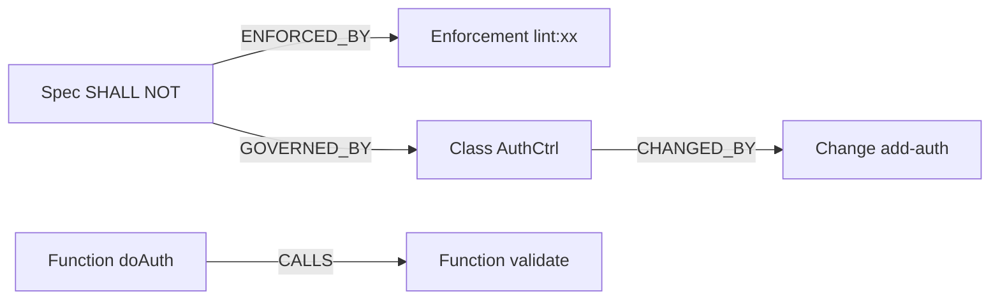

### 5.3 核心 MCP 工具

| 工具 | 功能 | 规范集成 |
|------|------|---------|
| `index_repository` | 索引代码库，构建知识图谱 | 索引时同时解析规范绑定关系 |
| `search_graph` | 按名称/模式搜索图节点 | 可按 Spec 节点搜索受管辖的代码 |
| `trace_path` | 追踪调用链（inbound/outbound/both） | 追踪时返回路径上所有 SHALL/SHALL NOT |
| `detect_changes` | 检测 git diff 影响的符号 | 变更检测时同时检测受影响的规范 |
| `query_graph` | Cypher 查询 | 支持规范-代码关联查询 |
| `get_code_snippet` | 获取代码片段 | 同时返回关联的规范约束 |
| `check_compliance` **(新增)** | 检查代码是否符合规范 | 执行所有 Enforcement 检查 |
| `get_spec_context` **(新增)** | 获取目录层级的规范上下文 | 渐进式披露加载 |
| `detect_drift` **(新增)** | 检测规范与代码的漂移 | 比较规范声明与代码实际 |

### 5.4 规范-代码绑定

规范通过**绑定规则**与代码关联，绑定规则定义在 `spec.md` 的 Enforcement 部分：

```yaml
# 绑定规则示例（在 spec.md 中定义）

bindings:
  # 按路径模式绑定
  - id: CTRL-001
    type: SHALL
    target: "src/api/controllers/**/*.ts"
    check: "ast:hasDecorator(@RestController)"
    
  # 按类名模式绑定
  - id: CTRL-003
    type: SHALL_NOT
    target: "class:*Controller"
    check: "ast:notHasInjection(Repository)"
    
  # 按图节点类型绑定
  - id: G-004
    type: SHALL_NOT
    target: "graph:Function[filePath=src/**/*.ts]"
    check: "custom:no-db-call-in-loop"
    
  # 按调用链绑定
  - id: API-002
    type: SHALL_NOT
    target: "graph:trace(Middleware, direction=outbound, depth=2)"
    check: "ast:notModifiesRequestBody"
```

---

## 6. Guard Layer — 自动化校验

### 6.1 校验体系

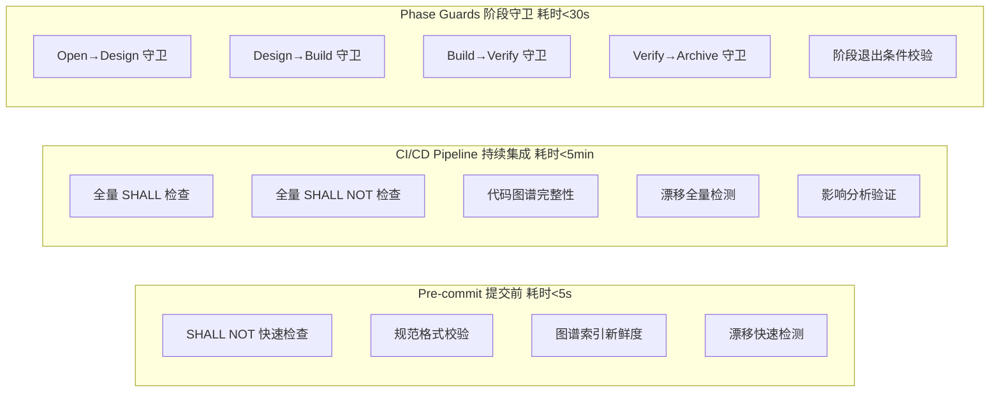

### 6.2 Phase Guard 规则

借鉴 Comet 的 phase guard 机制，每个阶段转换必须通过脚本校验：

```yaml
# Phase Guard 规则定义

# === 正向转换守卫 ===

open_to_design:
  checks:
    - proposal.md exists and non-empty
    - delta-specs/ has at least one spec file
    - affected_scopes defined in .mumuspec.yaml
    - code-graph/impact-analysis.json exists
    - single_active_change: true          # 单一活跃变更约束（硬性，不可关闭）
    - worktree_created: true              # worktree 隔离已创建（或已记录降级原因）
    - brainstorming_completed: true       # 需求探索已完成（hotfix/tweak 除外）
    - user_confirmed: true
  on_fail: "Block transition, report missing artifacts or constraint violations"

open_to_build_hotfix:
  description: "hotfix/tweak 预设路径：跳过 Design 直接进入 Build"
  checks:
    - proposal.md exists and non-empty
    - delta-specs/ has at least one spec file
    - affected_scopes defined in .mumuspec.yaml
    - code-graph/impact-analysis.json exists
    - single_active_change: true
    - worktree_created: true
    - workflow in ["hotfix", "tweak"]     # 仅 hotfix/tweak 预设可走此路径
    - build_layers defined (single layer, initialized in Open)
    - shall_not_new recorded (修复引入的 SHALL NOT 显式声明，可为空)
    - user_confirmed: true
  on_fail: "Block transition, report missing artifacts or workflow mismatch"
  note: "跳过 design 相关检查；tweak 走此守卫后 Verify 走 light verify"

design_to_build:
  checks:
    - design.md exists and non-empty
    - constraints/new-shall.md or new-shall-not.md exists
    - all enforcement checks are defined (not TBD)
    - code-graph verified no broken call chains
    - build_layers defined in .mumuspec.yaml
    - design_layers_covered: [0,1,2,3]    # 自顶向下设计覆盖所有层级
    - each_layer_shall_defined: true      # 每层 SHALL 已定义
    - user_confirmed: true
  on_fail: "Block transition, report missing design artifacts"

build_to_verify:
  checks:
    - all tasks.md items checked
    - code committed
    - build_command passed (if configured)
    - isolation field set (worktree preferred, branch requires downgrade_reason)
    - build_mode field set
    - tdd_mode field set
    - build_layers all status = done      # 自下向上所有层级已实现
    - build_layers_completed_in_bottom_up_order: true  # 按 layer 3→0 顺序完成
    - each layer enforcement passed       # 每层 SHALL/SHALL NOT 校验通过
    - code-graph updated after changes
  on_fail: "Block transition, report incomplete tasks, failed build, or incomplete layers"

verify_to_archive:
  checks:
    - verify_result: pass
    - verify.md exists with report
    - all SHALL enforcements passed
    - all SHALL NOT enforcements passed
    - no critical drift detected
    - code-graph integrity verified
    - all build_layers verified bottom-up  # 自下向上逐层验证完成
    - all_delta_spec_requirements_implemented: true  # delta-specs 所有 requirement 已实现
  on_fail: "Block archive, report verification failures"

verify_to_archive_with_deviations:
  description: "接受偏差归档：rollback_limit 超限或用户主动选择接受当前偏差"
  checks:
    - verify_result: pass-with-deviations
    - verify.md exists with report
    - accepted_deviations non-empty in .mumuspec.yaml
    - deviation_reviewer recorded
    - deviation_approved_at recorded
    - all SHALL NOT enforcements passed   # SHALL NOT 不可接受偏差，必须全通过
    - no critical drift detected
    - code-graph integrity verified
    - user_confirmed: true
  on_fail: "Block archive, report missing deviation approval or SHALL NOT violations"
  note: "SHALL 正向要求的偏差可接受；SHALL NOT 反向禁止的偏差不可接受"

# === 反向回退守卫 ===

build_to_design_rollback:
  checks:
    - user_confirmed: true                # 回退必须用户确认
    - rollback_reason recorded in .mumuspec.yaml
    - rollback_count < rollback_limit     # 未超过回退次数上限
  on_fail: "Block rollback, require user to choose accept-deviations or discard"
  side_effects:
    - save current Build artifacts to snapshots/build-rollback-N/ (preserve all historical snapshots, never overwrite)
    - record rollback_reason + rollback_history (counted: true) in .mumuspec.yaml
    - increment rollback_count
    - reset build_layers status to pending (preserve implemented code, only reset layer status)
    - set phase: design

verify_to_design_rollback:
  checks:
    - user_confirmed: true
    - rollback_reason recorded in .mumuspec.yaml
    - rollback_count < rollback_limit
  on_fail: "Block rollback, require user to choose accept-deviations or discard"
  side_effects:
    - save current artifacts + verify report to snapshots/verify-rollback-N/ (preserve all historical snapshots)
    - record rollback_reason + rollback_history (counted: true)
    - increment rollback_count
    - reset build_layers status to pending (preserve implemented code, only reset layer status)
    - set phase: design

verify_to_build_rollback:
  checks:
    - user_confirmed: true
    - rollback_reason recorded in .mumuspec.yaml
    - rebuild_count < rebuild_limit       # verify-rebuild 独立计数，不计入 rollback_count
    - specific failed build_layers identified
  on_fail: "Block rollback; if rebuild_limit exceeded, force upgrade to verify_to_design_rollback"
  side_effects:
    - save verify report to snapshots/verify-rebuild-N/ (preserve all historical snapshots)
    - record rollback_history (counted: false, event: verify-rebuild)
    - increment rebuild_count (NOT rollback_count)
    - reset only failed build_layers to pending (not all; preserve implemented code)
    - set phase: build
  note: "此回退不增加 rollback_count（设计未变，仅修复实现）；超过 rebuild_limit 时强制升级为 verify_to_design_rollback"

archive_ci_fail_rollback:
  description: "Archive 阶段 CI CRITICAL 失败回退到 Build 修复"
  checks:
    - user_confirmed: true
    - ci_failure_level == "CRITICAL"      # 仅 CRITICAL 失败回退
    - rollback_reason recorded (含 CI 失败详情)
    - rollback_count < rollback_limit     # 计入 rollback_count
  on_fail: "Block rollback, require user to choose accept-deviations or discard"
  side_effects:
    - save archive artifacts to snapshots/archive-rollback-N/
    - record rollback_reason + rollback_history (counted: true)
    - increment rollback_count
    - set phase: build                    # 回到 Build 修复，非 Design
  note: "仅 archive-in-progress 子状态可触发；archive-completed 为终态不可回退"

# === 废弃守卫 ===

discard_change:
  description: "废弃变更（旁路操作，open/design/build/verify/archive-in-progress 均可发起）"
  checks:
    - user_confirmed: true
    - discard_reason recorded in .mumuspec.yaml
    - phase != "archive-completed"        # 终态不可废弃
    - phase != "discarded"                # 已废弃不可重复废弃
  on_fail: "Block discard, report reason (e.g. terminal state)"
  side_effects:
    - save current artifacts to snapshots/discard/
    - clean up worktree (if used)
    - move change to .mumuspec/changes/archive/discarded/
    - set phase: discarded, discarded_at: <timestamp>
    - release active_change_slot

# === 终态守卫 ===

archive_is_terminal:
  description: "archive-completed 为终态，拒绝任何转换"
  checks:
    - phase != "archive-completed"        # 从 archive-completed 出发的任何转换均拒绝
  on_fail: "Block transition: archive-completed is terminal"

# === 归档完成守卫 ===

archive_complete:
  checks:
    - git_merge.merged: true              # MR 已合并
    - git_merge.commit_sha recorded
    - delta-specs merged to main specs
    - prohibitions.md updated
    - index.yaml updated
    - code-graph snapshot updated
    - spec changes committed to main branch
    - change moved to archive/
    - worktree cleaned up (if used)
    - remote branch deleted
    - active_change_slot_released: true
  on_fail: "Report incomplete archive steps"
```

### 6.3 漂移检测

```yaml
# 漂移检测规则

drift_detection:
  # 规范漂移：规范描述的约束与代码实际行为不一致
  spec_drift:
    - check: "Spec says SHALL use @RestController, but code has @Controller"
      detection: "compare spec bindings with AST analysis"
      severity: WARN
      auto_fix: false
      
    - check: "Spec says SHALL NOT use console.log, but code has console.log"
      detection: "lint rule"
      severity: ERROR
      auto_fix: false
  
  # 图谱漂移：代码图谱与实际代码不一致
  graph_drift:
    - check: "Function in graph but deleted from code"
      detection: "compare graph nodes with actual files"
      severity: ERROR
      auto_fix: true  # 自动重新索引
      
    - check: "Call edge in graph but function signature changed"
      detection: "compare graph edges with AST analysis"
      severity: WARN
      auto_fix: true
  
  # 索引新鲜度
  index_freshness:
    - check: "Code changed after last index"
      detection: "compare git diff with index timestamp"
      severity: WARN
      auto_fix: false
      recommendation: "Run mumuspec index to update"
```

---

## 7. AI Integration Layer — AI 集成

### 7.1 Rules 文件集成

```markdown
# CLAUDE.md / .cursorrules / AGENTS.md

## MumuSpec 集成

本项目使用 MumuSpec 规范体系。在编写代码前，必须：

1. **加载规范上下文**：运行 `mumuspec context <当前工作目录>` 获取树状规范
2. **遵守双向约束**：所有 SHALL 必须满足，所有 SHALL NOT 必须遵守
3. **变更前影响分析**：修改代码前运行 `mumuspec impact` 检查影响范围
4. **提交前校验**：代码提交前运行 `mumuspec check` 验证规范一致性

### 工作流规则（硬性约束）
- **默认 Worktree 隔离**：所有变更默认在 git worktree 中进行，主工作区不受影响
- **单一活跃变更**：同一时间只允许一个活跃变更，新变更前必须归档或废弃旧变更
- **自顶向下设计**：Design 阶段从根层规范开始，逐层向下细化
- **自下向上实现**：Build 阶段从叶子组件开始，逐层向上集成验证

### 规范加载策略
- AI 从目录 X 切入时，自动加载 X 向上到根的所有层级规范
- 只加载当前目录的直接子目录概要（index.yaml）
- 不加载不相关模块的规范

### 禁止项优先级
- SHALL NOT 约束的优先级高于 SHALL
- 当 SHALL 和 SHALL NOT 冲突时，以 SHALL NOT 为准
- 子层规范可以收紧但不能放宽父层约束

### Skill 生态兼容
- MumuSpec 阶段 Skill 作为编排器，分发到外部 Skill 生态（Superpowers 等）获取 HOW 指导
- 外部 Skill 的建议不能违反 MumuSpec SHALL NOT（反向禁止优先于 Skill 建议）
- 当外部 Skill 不可用时，required Skill 阻断流程，optional Skill 跳过
```

### 7.2 CLI 命令

```bash
# 规范管理
mumuspec init [path]                    # 初始化 MumuSpec
mumuspec context <path>                 # 获取目录的规范上下文（渐进式披露）
mumuspec add-spec <scope> [--type shall|shall-not]  # 添加规范
mumuspec validate                       # 校验所有规范格式

# 变更管理
mumuspec new <name>                     # 创建新变更（自动检查单一活跃变更约束）
mumuspec status [name]                  # 查看变更状态
mumuspec list                           # 列出活跃变更
mumuspec archive <name>                 # 归档变更（git 提交 + MR + 合并规范 + 清理）
mumuspec discard <name>                 # 废弃变更（清理 worktree + 释放变更槽位）

# 状态机回退
mumuspec rollback <name> --to design    # 回退到 Design 阶段（从 build/verify）
mumuspec rollback <name> --to build     # 回退到 Build 阶段（仅从 verify，不增加回退计数）
mumuspec rollback-history <name>        # 查看回退历史
mumuspec snapshot list <name>           # 列出所有快照
mumuspec snapshot restore <name> <id>   # 从快照恢复工件状态

# Worktree 管理
mumuspec worktree create <name>         # 为变更创建 worktree（默认隔离方式）
mumuspec worktree remove <name>         # 移除变更的 worktree
mumuspec worktree list                  # 列出所有 MumuSpec 管理的 worktree

# 代码图谱
mumuspec index                          # 构建/更新代码图谱
mumuspec impact [name]                  # 影响分析
mumuspec trace <symbol>                 # 追踪调用链
mumuspec search <pattern>               # 搜索代码节点

# 校验
mumuspec check                          # 全量规范校验
mumuspec check --shall                  # 只检查正向要求
mumuspec check --shall-not              # 只检查反向禁止
mumuspec drift                          # 漂移检测
mumuspec guard <change> <phase>         # 阶段守卫检查

# 状态机
mumuspec state init <name> <workflow>   # 初始化状态
mumuspec state transition <name> <event>  # 状态转换（正向或回退）
mumuspec state next <name>              # 获取下一步操作
mumuspec state graph <name>             # 可视化状态机当前状态和可转换路径

# Git 合并管理（Archive 阶段）
mumuspec merge create <name>            # 创建合并请求（MR/PR）
mumuspec merge status <name>            # 查看合并请求状态
mumuspec merge execute <name> [--strategy squash|merge|rebase]  # 执行合并
mumuspec merge abort <name>             # 中止合并流程

# 层级管理（自下向上实现）
mumuspec layer list <name>              # 查看变更的实现层级计划
mumuspec layer status <name> <layer>    # 查看特定层级的实现状态
mumuspec layer verify <name> <layer>    # 验证特定层级的规范合规性

# 设计文档管理
mumuspec design init <scope>            # 为指定目录初始化 design.md
mumuspec design update <scope>          # 更新指定层级的设计文档
mumuspec design list                    # 列出所有层级的设计文档
mumuspec design check                   # 校验 design.md 与 spec.md 一致性

# 文档生成
mumuspec doc generate [--scope <path>]  # 生成对外文档（默认全部，指定 scope 则仅生成该层级）
mumuspec doc generate --type technical  # 仅生成技术文档
mumuspec doc generate --type business   # 仅生成业务文档
mumuspec doc generate --format html     # 指定输出格式（markdown|html|pdf|confluence）
mumuspec doc generate --depth 2         # 控制上下文聚合深度（默认全部父层）
mumuspec doc list                       # 列出所有已生成文档及其状态
mumuspec doc check                      # 文档一致性校验（检测文档与 spec/design 漂移）
mumuspec doc stale                      # 列出过期的文档（spec/design 变更后未重新生成）
mumuspec doc template list              # 列出可用模板
mumuspec doc template add <file>        # 添加自定义模板
```

### 7.3 MCP Server

MumuSpec 提供 MCP Server，供 AI 工具直接调用：

```json
{
  "mcpServers": {
    "mumuspec": {
      "command": "npx",
      "args": ["@mumuspec/mcp-server"],
      "env": {
        "MUMUSPEC_ROOT": "${workspaceRoot}"
      }
    }
  }
}
```

MCP 工具列表：

| 工具 | 描述 |
|------|------|
| `get_spec_context` | 获取指定目录的树状规范上下文（渐进式披露） |
| `search_specs` | 搜索规范（按 scope、type、keyword） |
| `check_compliance` | 检查代码片段是否符合规范 |
| `get_prohibitions` | 获取指定范围的禁止项清单 |
| `get_design_context` **(新增)** | 获取指定目录的设计文档上下文（design.md） |
| `index_repository` | 构建/更新代码知识图谱 |
| `search_graph` | 搜索代码图谱节点 |
| `trace_path` | 追踪调用链 |
| `detect_changes` | 检测变更影响 |
| `detect_drift` | 检测规范与代码的漂移 |
| `get_change_status` | 获取变更状态 |
| `guard_check` | 执行阶段守卫检查 |
| `generate_docs` **(新增)** | 生成对外文档（技术/业务），支持按层级、类型、格式生成 |
| `list_docs` **(新增)** | 列出所有已生成文档及其状态（fresh/stale） |
| `check_doc_consistency` **(新增)** | 文档一致性校验，检测文档与 spec/design 的漂移 |
| `get_design_decisions` **(新增)** | 获取指定层级的架构决策记录（ADR） |

### 7.4 Skill 定义与外部 Skill 生态集成

#### 7.4.1 MumuSpec 原生 Skill 文件

MumuSpec 为每个变更阶段提供原生 Skill 文件，作为**阶段编排器**（Phase Orchestrator），负责在该阶段内分发到外部 Skill 生态：

```
.mumuspec/skills/
├── mumuspec-open.md          # 开启变更 Skill（编排器）
├── mumuspec-design.md         # 技术设计 Skill（编排器）
├── mumuspec-build.md          # 实现构建 Skill（编排器）
├── mumuspec-verify.md         # 验证 Skill（编排器）
├── mumuspec-archive.md        # 归档 Skill（编排器）
├── mumuspec-hotfix.md         # 热修复预设
├── mumuspec-tweak.md          # 微调预设
└── custom/                    # 项目自定义 Skill 扩展
```

每个 Skill 文件遵循标准格式，包含：
- 触发条件
- 前置条件检查（含 MumuSpec 约束检查）
- 执行步骤（含外部 Skill 分发点）
- 阻塞点定义
- 退出条件
- 阶段守卫调用
- **Skill 分发配置**（指定该阶段调用的外部 Skill 及约束守卫）

#### 7.4.2 外部 Skill 生态兼容架构

MumuSpec 的原生 Skill 作为**阶段编排器**，在每个阶段内部按需分发给外部 Skill 生态（如 Superpowers、Agent Skills 等）。外部 Skill 提供 HOW 的指导，MumuSpec 提供 WHAT 的约束：

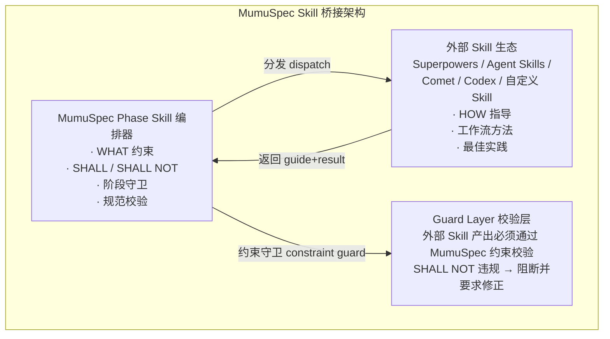

**设计原则**：
- **MumuSpec 管 WHAT**：通过 SHALL/SHALL NOT 定义做什么、不做什么
- **外部 Skill 管 HOW**：通过工作流方法指导怎么做
- **约束守卫兜底**：外部 Skill 的产出必须通过 MumuSpec 约束校验，SHALL NOT 违规则阻断

**兼容的 Skill 生态**：

| Skill 生态 | 来源 | 兼容方式 | 集成深度 |
|------------|------|---------|---------|
| **Superpowers** | `~/.claude/skills/` | MumuSpec 阶段 Skill 内部分发调用 | 深度集成（TDD、调试、验证等） |
| **Agent Skills** | `~/.agents/skills/` | 通过 skill discovery 机制自动发现并调用 | 深度集成（全生命周期覆盖） |
| **Comet** | `~/.claude/skills/comet/` | 状态机层互操作，Comet 阶段概念映射到 MumuSpec 阶段 | 协议互操作 |
| **Codex Skills** | `~/.codex/skills/` | 通过平台 skill-loading 机制加载 | 平台适配 |
| **自定义 Skill** | 项目 `.mumuspec/skills/custom/` | 用户自定义扩展 | 可插拔 |

#### 7.4.3 阶段-Skill 映射表

MumuSpec 的每个阶段在执行过程中，按子步骤分发到对应的外部 Skill：

**Phase 1: Open（开启变更）**

| 子步骤 | 分发的外部 Skill | Skill 作用 | MumuSpec 约束守卫 |
|--------|-----------------|-----------|------------------|
| 需求探索与澄清 | `brainstorming`, `interview-me` | 结构化需求探索，一次一个问题澄清意图 | 必须完成 brainstorming 才能进入下一步（hotfix/tweak 除外） |
| 影响分析 | `gitnexus-exploring`, `gitnexus-impact-analysis` | 代码结构理解与变更影响评估 | 影响分析结果必须记录到 `code-graph/impact-analysis.json` |
| 规范草案编写 | `spec-driven-development` | 规范编写方法论 | delta-specs 必须包含 SHALL 和 SHALL NOT |
| 工作区隔离 | `using-git-worktrees` | worktree 创建与管理 | 必须创建 worktree（或记录降级原因） |

**Phase 2: Design（技术设计 — 自顶向下）**

| 子步骤 | 分发的外部 Skill | Skill 作用 | MumuSpec 约束守卫 |
|--------|-----------------|-----------|------------------|
| 设计探索 | `brainstorming` | 设计方案探索与权衡 | 设计必须自顶向下逐层细化 |
| 接口设计 | `api-and-interface-design` | 稳定的 API 与接口契约设计 | 接口设计必须符合各层 SHALL/SHALL NOT |
| 安全约束 | `security-and-hardening` | 安全漏洞预防与加固 | 安全 SHALL NOT 必须有 Enforcement |
| 性能约束 | `performance-optimization` | 性能瓶颈识别与优化策略 | 性能约束必须可测量 |
| 决策记录 | `documentation-and-adrs` | 架构决策记录（ADR） | 关键设计决策必须记录到 design.md |

**Phase 3: Build（实现 — 自下向上）**

| 子步骤 | 分发的外部 Skill | Skill 作用 | MumuSpec 约束守卫 |
|--------|-----------------|-----------|------------------|
| 实现计划 | `writing-plans` | 分解为可验证的小任务 | 计划必须按 build_layers 从叶子到根排序 |
| 上下文管理 | `context-engineering` | 按需加载正确的上下文 | 必须使用渐进式披露加载规范 |
| 源码验证 | `source-driven-development` | 基于官方文档验证实现正确性 | 依赖框架的代码必须有文档引用 |
| TDD 实现 | `test-driven-development` | Red-Green-Refactor 循环 | 每层实现必须先写失败测试（tdd_mode: tdd 时） |
| 执行方式 | `executing-plans` / `subagent-driven-development` | 计划执行（内联/子代理） | 执行方式必须在 .mumuspec.yaml 中记录 |
| 调试修复 | `systematic-debugging` | 系统化根因分析 | 调试不能违反 SHALL NOT |
| 疑虑驱动 | `doubt-driven-development` | 关键决策对抗性审查 | 不可逆操作必须经过审查 |

**Phase 4: Verify（验证）**

| 子步骤 | 分发的外部 Skill | Skill 作用 | MumuSpec 约束守卫 |
|--------|-----------------|-----------|------------------|
| 完成验证 | `verification-before-completion` | 证据先于声明，运行验证命令 | 必须有验证证据才能声明通过 |
| 代码审查 | `requesting-code-review` | 提交前代码审查 | 审查必须覆盖 SHALL/SHALL NOT |
| 接收反馈 | `receiving-code-review` | 技术性接收审查反馈 | 反馈处理不能违反规范约束 |
| 回退决策 | `systematic-debugging` | 回退根因分析 | 回退必须用户确认 + 保存快照 |

**Phase 5: Archive（归档）**

| 子步骤 | 分发的外部 Skill | Skill 作用 | MumuSpec 约束守卫 |
|--------|-----------------|-----------|------------------|
| 分支完成 | `finishing-a-development-branch` | 结构化合并/PR/清理决策 | 合并策略必须用户确认 |
| CI/CD 集成 | `ci-cd-and-automation` | 自动化质量门禁配置 | CI 必须包含全量 SHALL/SHALL NOT 检查 |
| 文档归档 | `documentation-and-adrs` | 决策与文档归档 | 归档必须包含完整变更记录 |
| 发布准备 | `shipping-and-launch` | 预发布检查清单 | — |

**横切关注点（所有阶段）**

| 关注点 | 分发的外部 Skill | 作用 |
|--------|-----------------|------|
| 工作区隔离 | `using-git-worktrees` | 所有阶段在 worktree 中工作 |
| 上下文优化 | `context-engineering` | 会话开始/切换/降级时重新配置上下文 |
| 代码简化 | `code-simplification` | 实现完成后简化代码 |
| 废弃迁移 | `deprecation-and-migration` | 涉及移除旧系统时 |

#### 7.4.4 Skill 分发协议

MumuSpec 阶段 Skill 通过标准协议分发给外部 Skill。每个阶段 Skill 文件中包含 `skill_dispatch` 配置，定义该阶段如何调用外部 Skill：

```yaml
# 阶段 Skill 中的 skill_dispatch 配置示例（mumuspec-build.md）

skill_dispatch:
  # 进入阶段时分发的 Skill（按顺序执行）
  on_enter:
    - skill: context-engineering
      purpose: "加载当前层级的规范上下文"
      required: true                    # required=true 时 Skill 不可用则阻断
    - skill: writing-plans
      purpose: "创建实现计划"
      required: true
      condition: "tasks.md not exists"  # 条件分发
  
  # 阶段执行中按需分发的 Skill
  on_execute:
    - skill: executing-plans
      purpose: "按 tasks.md 顺序执行实现计划"
      required: false
      condition: "build_mode == 'executing-plans'"
    - skill: subagent-driven-development
      purpose: "将独立任务分派给子代理并行实现"
      required: false
      condition: "build_mode == 'subagent'"
    - skill: test-driven-development
      purpose: "TDD 循环实现每个任务"
      required: true
      condition: "tdd_mode == 'tdd'"
    - skill: source-driven-development
      purpose: "基于官方文档验证实现"
      required: false                   # required=false 时 Skill 不可用则跳过
      condition: "uses_framework == true"
    - skill: systematic-debugging
      purpose: "系统化调试"
      required: false
      trigger: "test_failure or build_error"  # 事件触发分发
    - skill: doubt-driven-development
      purpose: "关键决策对抗性审查"
      required: false
      trigger: "irreversible_operation"
  
  # 阶段退出前分发的 Skill
  on_exit:
    - skill: verification-before-completion
      purpose: "验证产出符合规范"
      required: true
  
  # 约束守卫（在外部 Skill 产出后执行，统一 on_fail 格式）
  constraint_guards:
    - id: SHALL_NOT-guard
      check: "mumuspec check --shall-not --layer <current_layer>"
      on_fail: "block: report violations and require fix"
    - id: SHALL-guard
      check: "mumuspec check --shall --layer <current_layer>"
      on_fail: "block: report unmet SHALL requirements"
    - id: phase-guard
      check: "mumuspec guard <change> <current_phase>"
      on_fail: "block: report phase transition failures"
```

**横切关注点分发配置**：

横切关注点 Skill（见 7.4.3 横切关注点表）适用于所有阶段，单独配置在 `cross_cutting_dispatch` 中，不重复出现在每个阶段的 `skill_dispatch`：

```yaml
# 横切关注点分发配置（独立于阶段 skill_dispatch，所有阶段共享）
cross_cutting_dispatch:
  - skill: using-git-worktrees
    purpose: "所有阶段在 worktree 中工作"
    required: true
    trigger: "phase_enter"              # 阶段进入时触发
  - skill: context-engineering
    purpose: "会话开始/切换/降级时重新配置上下文"
    required: true
    trigger: "session_start or context_degraded"
  - skill: code-simplification
    purpose: "实现完成后简化代码"
    required: false
    trigger: "build_layer_done"
  - skill: deprecation-and-migration
    purpose: "涉及移除旧系统时"
    required: false
    trigger: "removal_detected"
```

**其他阶段 skill_dispatch 示例**：

Open / Design / Verify / Archive 阶段遵循相同的 `skill_dispatch` 结构（on_enter / on_execute / on_exit / constraint_guards），仅分发的外部 Skill 不同：

```yaml
# Open 阶段 skill_dispatch 示例（mumuspec-open.md）
skill_dispatch:
  on_enter:
    - skill: brainstorming
      purpose: "需求探索与澄清"
      required: true
      condition: "workflow == 'full'"
  on_execute:
    - skill: source-driven-development
      purpose: "基于官方文档验证技术选型"
      required: false
      condition: "uses_framework == true"
  on_exit:
    - skill: requesting-code-review
      purpose: "proposal 自审"
      required: false

# Design 阶段 on_enter 关键 Skill：spec-driven-development / api-and-interface-design
# Verify 阶段 on_exit 关键 Skill：code-review-and-quality / verification-before-completion
# Archive 阶段 on_execute 关键 Skill：finishing-a-development-branch / ci-cd-and-automation / documentation-and-adrs
```

**分发流程**：

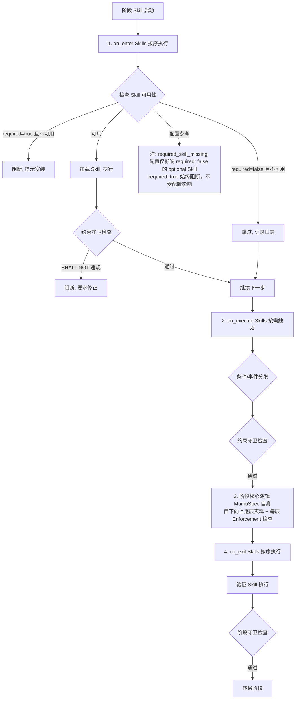

#### 7.4.5 优先级与冲突解决

当外部 Skill 的指导与 MumuSpec 约束产生冲突时，按以下优先级解决：

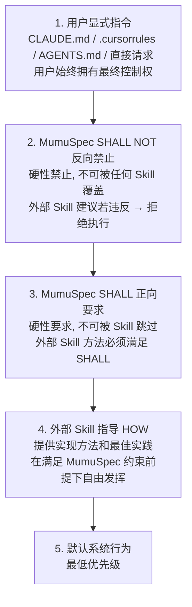

**冲突处理规则**：

| 冲突场景 | 处理方式 | 示例 |
|---------|---------|------|
| Skill 建议 vs SHALL NOT | SHALL NOT 优先，阻断 Skill 建议 | Skill 建议用 `console.log` 调试，但 SHALL NOT 禁止 → 改用 Logger |
| Skill 建议 vs SHALL | SHALL 优先，要求 Skill 调整方法 | Skill 建议直接返回 Entity，但 SHALL 要求 DTO 转换 → 必须转换 |
| 多个 Skill 冲突 | 按分发顺序，后者覆盖前者 | TDD Skill 要求先写测试，但 hotfix 预设允许 direct 模式 → 遵循预设配置 |
| Skill 不可用 | required=true 阻断；required=false 跳过 | `source-driven-development` 不可用 → 跳过文档验证 |
| 用户指令 vs Skill | 用户指令优先 | 用户说"不用 TDD" → 遵循用户，即使 TDD Skill 要求先写测试 |

#### 7.4.6 Skill 桥接配置

在 `config.yaml` 中配置外部 Skill 生态集成：

```yaml
# .mumuspec/config.yaml 中的 skill 配置

skills:
  enabled: true                      # 启用外部 Skill 生态集成
  discovery: auto                    # auto(自动发现已安装的 Skill) | manual
  
  # 兼容的 Skill 生态
  ecosystems:
    superpowers:
      enabled: true
      path: "~/.claude/skills"       # Skill 查找路径
      dispatch_mode: deep             # deep(深度集成) | loose(松散调用)
    
    agent_skills:
      enabled: true
      path: "~/.agents/skills"
      dispatch_mode: deep
    
    comet:
      enabled: true
      path: "~/.claude/skills/comet"
      dispatch_mode: interop          # interop(协议互操作)
    
    codex:
      enabled: false                  # 按需启用
      path: "~/.codex/skills"
      dispatch_mode: platform         # platform(平台适配)
    
    custom:
      enabled: true
      path: ".mumuspec/skills/custom" # 项目自定义 Skill
  
  # 分发策略
  dispatch:
    required_skill_missing: block     # 仅影响 required: false 的 optional Skill（block|skip|warn）；required: true 的 Skill 不可用时始终阻断，不受此配置影响
    shall_violation: block            # SHALL 正向要求违规：block(阻断) | warn(警告)，可配置
    shall_not_violation: block        # SHALL NOT 反向禁止违规：固定 block 不可关闭（硬性约束，不可配置）
    skill_timeout: 300s               # Skill 执行超时
    parallel_dispatch: false          # 是否允许并行分发（默认串行）
  
  # 优先级覆盖（用户自定义，仅限策略层覆盖，不可覆盖 SHALL NOT）
  priority_override:
    # 字段结构: <override_key>: <bool|enum>
    # 硬性约束: 不可覆盖 SHALL NOT 反向禁止（priority_override 永远不能绕过 shall_not_violation: block）
    # 作用范围: 仅在满足 SHALL NOT 约束的前提下，对策略层（如 tdd_mode、build_mode）进行覆盖
    # 例如: allow_tdd_skip: true  # 允许跳过 TDD（在 SHALL NOT 约束下的策略覆盖，非等同于用户指令）
    # 例如: prefer_subagent: true # 优先使用子代理实现
```

#### 7.4.7 阶段编排器 Skill 文件结构

以下是 `mumuspec-build.md` 阶段编排器的关键结构示例，展示如何集成外部 Skill：

**YAML Frontmatter**：

```yaml
---
name: mumuspec-build
description: "MumuSpec Build 阶段编排器 — 自下向上实现，分发到外部 Skill 提供 HOW 指导"
phase: build
---
```

**前置条件检查**：
- phase == design（已通过 design_to_build guard）
- design.md 存在且非空
- build_layers 已定义
- worktree 已创建（或已记录降级原因）

**执行流程（含 Skill 分发点）**：

1. **上下文加载** → 分发 `context-engineering`
   - 加载当前层级的规范上下文（渐进式披露）
   - 【约束守卫】验证加载的规范包含当前层的 SHALL/SHALL NOT

2. **实现计划创建** → 分发 `writing-plans`（仅当 tasks.md 不存在时）
   - 按 build_layers 从叶子到根排序任务
   - 【约束守卫】验证计划覆盖所有 affected_scopes

3. **逐层实现（自下向上）** → 对每一层（layer N → layer 0）：
   - 3a. TDD 实现 → 分发 `test-driven-development`（当 tdd_mode == 'tdd'）
   - 3b. 文档验证 → 分发 `source-driven-development`（当使用框架时）
   - 3c. 层级验证 → 运行该层 Enforcement 检查
   - 3d. 调试（如需要）→ 分发 `systematic-debugging`

4. **完成验证** → 分发 `verification-before-completion`
   - 【约束守卫】所有 build_layers status = done

5. **阶段转换** → 运行 `mumuspec guard <change> build --apply`

**阻塞点**：
- Step 2: 用户确认实现计划
- Step 3d: 回退决策（用户确认）

### 7.5 Git Hooks

```bash
# .git/hooks/pre-commit (或通过 husky/lefthook 配置)

#!/bin/bash
# MumuSpec pre-commit hook
# 快速检查 SHALL NOT 违规

mumuspec check --shall-not --staged-only
if [ $? -ne 0 ]; then
  echo "❌ MumuSpec SHALL NOT 违规检测失败"
  echo "请修复违规项后再提交"
  exit 1
fi

# 检查规范格式
mumuspec validate --quiet
if [ $? -ne 0 ]; then
  echo "⚠️  MumuSpec 规范格式校验有警告"
fi
```

---

## 8. 与参考项目的对比

### 8.1 核心差异

| 特性 | OpenSpec | Comet | MumuSpec |
|------|---------|-------|----------|
| **约束方向** | 仅正向（SHALL） | 仅正向 | **正向 + 反向（SHALL + SHALL NOT）** |
| **规范分布** | 集中存放 `openspec/specs/` | 集中存放 | **树状分布，按目录结构分层** |
| **上下文加载** | 全量加载规范 | 全量 + handoff 压缩 | **渐进式披露，按切入层级加载** |
| **代码索引** | 无 | CodeGraph（0.3.7+） | **原生集成知识图谱** |
| **规范-代码绑定** | 无 | 无 | **GOVERNED_BY 边 + Enforcement** |
| **漂移检测** | 无 | 无 | **自动检测规范与代码漂移** |
| **禁止项可执行** | N/A | N/A | **每个 SHALL NOT 都有可执行检查** |
| **变更生命周期** | ✓ | ✓（状态机） | ✓（状态机 + 图谱验证 + 可回退） |
| **预设路径** | 无 | hotfix/tweak | hotfix/tweak（增加规范约束） |
| **CI/CD 集成** | 无 | 无 | **原生设计 pre-commit + CI + guard** |
| **默认隔离方式** | 无 | branch/worktree 可选 | **默认 worktree，物理隔离主分支** |
| **活跃变更数量** | 无限制 | 无限制 | **单一活跃变更约束** |
| **设计-实现方向** | 无约束 | 无约束 | **自顶向下设计 + 自下向上实现** |
| **阶段回退** | 无 | verify-fail 可回退 | **Build/Verify 均可回退到 Design，带快照与回退计数** |
| **归档合并** | 无 | 无 | **Archive 阶段自动 git 提交 + 创建 MR + 合并到主分支** |
| **Skill 生态兼容** | 无 | 绑定 Superpowers | **开放兼容多 Skill 生态（Superpowers/Agent Skills/Comet/自定义）** |

### 8.2 借鉴与增强

| 来源项目 | 贡献 | MumuSpec 的增强 |
|---------|------|----------------|
| **OpenSpec** | delta spec 语义 | 保留 + 增加 SHALL NOT delta |
| | 变更工件流水线 | 保留 + 增加约束工件 (constraints/) |
| | archive 历史归档 | 保留 + 增加图谱快照归档 |
| **Comet** | 五阶段状态机 | 保留 + 每阶段增加图谱验证 + 支持反向回退 |
| | phase guard 脚本 | 保留 + 增加规范校验守卫 + 回退守卫 |
| | hotfix/tweak 预设 | 保留 + 增加升级时的规范约束 |
| | handoff 上下文压缩 | 替换为渐进式披露（更精准） |
| | CodeGraph 语义索引 | 增强 + 与规范双向绑定 |
| | branch/worktree 可选 | 默认 worktree + 降级机制 |
| | 多变更并行 | 单一活跃变更约束（强制专注） |
| | 无设计-实现方向约束 | 自顶向下设计 + 自下向上实现 |
| | verify-fail 仅回退 build | Build/Verify 均可回退 Design + 快照 |
| | 无归档合并 | Archive 阶段 git 提交 + MR + 主分支合并 |
| **Superpowers** | brainstorming 设计门禁 | 保留 + 在 Open/Design 阶段强制分发 |
| | TDD 实现方法 | 保留 + 受 SHALL NOT 约束守卫 |
| | systematic-debugging | 保留 + 回退决策时分发 |
| | verification-before-completion | 保留 + 阶段转换强制调用 |
| | writing-plans 任务分解 | 保留 + 受 build_layers 顺序约束 |
| | Skill 优先级体系 | 扩展 + 增加 MumuSpec 约束层（SHALL NOT > Skill） |
| **codebase-memory** | 知识图谱 (Nodes + Edges) | 保留 + 增加 Spec/Enforcement 节点 |
| | search_graph/trace_path | 保留 + 返回路径上的规范约束 |
| | detect_changes | 保留 + 检测受影响的规范 |
| | 14 个 MCP 工具 | 保留 + 增加 check_compliance 等 |
| **context-engineering** | 分层上下文策略 | 实现为树状渐进式披露 |
| | 反模式避免 | 设计为加载策略约束 |
| | 选择性包含 | 通过 index.yaml 实现选择性加载 |

---

## 9. 实施路线图

### Phase 1: 核心规范引擎 (MVP)

**目标**：实现树状规范 + 双向约束 + 基础 CLI

- [ ] 规范文件格式定义（spec.md / design.md / prohibitions.md / index.yaml）
- [ ] **目录级设计文档（design.md）格式与加载引擎**
- [ ] 树状规范加载引擎（渐进式披露，含 spec + design）
- [ ] CLI 核心命令（init / context / validate / check）
- [ ] 基础 lint 规则引擎（执行 Enforcement 检查）
- [ ] Rules 文件生成（CLAUDE.md / .cursorrules）

### Phase 2: 变更生命周期

**目标**：实现完整的变更管理流水线

- [ ] 变更状态机（.mumuspec.yaml）
- [ ] 五阶段流程（open → design → build → verify → archive）
- [ ] **状态机回退机制（build→design, verify→design, verify→build）**
- [ ] **回退快照保存与恢复**
- [ ] **Archive 阶段 git 提交 + MR/PR 创建 + 合并**
- [ ] Phase guard 脚本（正向 + 反向回退守卫）
- [ ] delta spec 合并引擎
- [ ] hotfix/tweak 预设路径
- [ ] **设计文档同步机制（Design 阶段 delta-design 合并到 design.md）**
- [ ] Skill 文件定义（阶段编排器）
- [ ] **外部 Skill 生态兼容层（Skill Bridge）**
- [ ] **阶段-Skill 映射与分发协议**
- [ ] **Skill 优先级与冲突解决机制**
- [ ] **Superpowers/Agent Skills 集成**

### Phase 3: 代码图谱集成

**目标**：实现知识图谱 + 规范-代码双向绑定

- [ ] 代码图谱构建引擎（AST 解析 → 图谱）
- [ ] 规范-代码绑定（GOVERNED_BY / ENFORCED_BY 边）
- [ ] 影响分析工具（detect_changes）
- [ ] 调用链追踪（trace_path + 规范标注）
- [ ] MCP Server 实现

### Phase 4: CI/CD 与自动化

**目标**：实现全链路自动化校验

- [ ] Pre-commit hook（SHALL NOT 快速检查）
- [ ] CI/CD pipeline 集成（全量校验）
- [ ] 漂移检测引擎（规范漂移 + 图谱漂移 + **设计文档漂移**）
- [ ] 图谱自动更新（git hooks）
- [ ] **文档生成引擎（从 spec + design 生成技术/业务文档）**
- [ ] **文档模板系统（内置模板 + 自定义模板）**
- [ ] **文档一致性校验（文档漂移检测 + 自动重新生成）**
- [ ] **多格式输出（Markdown / HTML / PDF）**
- [ ] 仪表盘可视化

### Phase 5: 生态与分发

**目标**：跨平台分发与社区生态

- [ ] npm 包发布（@mumuspec/cli + @mumuspec/mcp-server）
- [ ] 多平台 Skill 支持（Claude Code / Cursor / Copilot / Codex）
- [ ] **Skill 生态插件市场（社区贡献的 Skill 适配器）**
- [ ] 规范模板库（常见技术栈的预置规范）
- [ ] **文档模板市场（社区贡献的文档生成模板）**
- [ ] 评估系统（Rubric / Pass@k）
- [ ] 文档与教程

---

## 10. 技术选型建议

| 组件 | 推荐技术 | 理由 |
|------|---------|------|
| CLI 框架 | Node.js + Commander.js | 跨平台、与 Comet 生态对齐 |
| AST 解析 | tree-sitter | 多语言支持、性能好 |
| 图谱存储 | SQLite + 图查询层 | 轻量、嵌入式、无需额外服务 |
| MCP Server | @modelcontextprotocol/sdk | 标准化 AI 工具集成 |
| Lint 引擎 | 自研规则引擎 + ESLint/Semgrep 插件 | 灵活扩展 + 复用生态 |
| 规范格式 | YAML + Markdown frontmatter | 人类可读 + 机器可解析 |
| 状态管理 | YAML 文件 + 脚本校验 | 简单、可版本控制 |
| CI 集成 | GitHub Actions / GitLab CI 插件 | 主流 CI/CD 平台 |

---

## 11. 开放问题

1. **多语言支持**：不同编程语言的 AST 解析差异如何抽象？tree-sitter 是否足够覆盖所有目标语言？
2. **规范继承冲突**：当多层规范的 SHALL NOT 出现矛盾时（子层收紧到无法实现），如何自动检测和告警？
3. **图谱性能**：大型代码库（10万+ 文件）的图谱构建和查询性能如何保证？
4. **规范版本化**：规范本身也需要版本管理，如何处理规范版本与代码版本的对应关系？
5. **渐进式披露的精度**：如何确保 AI 在跨模块工作时能正确加载所有相关规范，而不遗漏？
6. **与现有 lint 工具的关系**：MumuSpec 的 Enforcement 是自研规则引擎，还是封装现有 lint 工具（ESLint/Semgrep/SonarQube）？
7. **团队协作**：多人同时修改规范时如何处理冲突？是否需要规范评审流程？

---

## 附录 A: 完整目录结构示例

```
my-project/
│
├── .mumuspec/                              # === 根层规范 (Level 0) ===
│   ├── config.yaml                         # MumuSpec 全局配置
│   ├── spec.md                             # 全局架构规范
│   ├── design.md                           # 根层设计文档（架构决策、技术选型）
│   ├── prohibitions.md                     # 全局禁止清单
│   ├── index.yaml                          # 子目录规范索引
│   │
│   ├── changes/                            # 变更管理
│   │   ├── add-user-auth/                  # 活跃变更
│   │   │   ├── .mumuspec.yaml              # 变更状态
│   │   │   ├── proposal.md
│   │   │   ├── design.md
│   │   │   ├── tasks.md
│   │   │   ├── delta-specs/
│   │   │   │   └── src-auth/spec.md
│   │   │   ├── constraints/
│   │   │   │   ├── new-shall.md
│   │   │   │   └── new-shall-not.md
│   │   │   ├── code-graph/
│   │   │   │   ├── impact-analysis.json
│   │   │   │   └── base-ref.txt
│   │   │   └── verify.md
│   │   └── archive/
│   │       └── 2026-07-01-fix-login/
│   │
│   ├── skills/                             # AI Skill 定义
│   │   ├── mumuspec-open.md
│   │   ├── mumuspec-design.md
│   │   ├── mumuspec-build.md
│   │   ├── mumuspec-verify.md
│   │   ├── mumuspec-archive.md
│   │   ├── mumuspec-hotfix.md
│   │   └── mumuspec-tweak.md
│   │
│   ├── templates/                          # 文档生成模板
│   │   ├── technical-root.yaml             # 技术文档模板：根层级
│   │   ├── technical-module.yaml           # 技术文档模板：模块级
│   │   ├── business-root.yaml              # 业务文档模板：根层级
│   │   └── business-module.yaml            # 业务文档模板：模块级
│   │
│   ├── scripts/                            # 校验脚本
│   │   ├── guard.mjs                       # 阶段守卫
│   │   ├── state.mjs                       # 状态机管理
│   │   ├── check.mjs                       # 规范校验
│   │   ├── drift.mjs                       # 漂移检测
│   │   └── doc-gen.mjs                     # 文档生成引擎
│   │
│   └── graph/                              # 代码图谱数据
│       ├── index.db                        # 图谱数据库 (SQLite)
│       └── snapshot.json                   # 图谱快照
│
├── docs/                                   # === 对外文档输出（自动生成） ===
│   ├── technical/                          # 技术文档
│   │   ├── architecture.md                 # 系统架构总览
│   │   ├── tech-standards.md               # 技术规范汇总
│   │   ├── module-auth.md                  # 认证模块技术文档
│   │   ├── module-api.md                   # API 模块技术文档
│   │   └── api-reference.md                # API 参考文档
│   └── business/                           # 业务文档
│       ├── overview.md                     # 业务全景概览
│       └── feature-auth.md                 # 认证功能业务说明
│
├── src/
│   ├── .mumuspec/                          # === src 层规范 (Level 1) ===
│   │   ├── spec.md                         # 编码规范
│   │   ├── design.md                       # src 层设计文档（模块划分决策）
│   │   ├── prohibitions.md                 # src 层禁止项
│   │   └── index.yaml                      # 子模块索引
│   │
│   ├── auth/
│   │   ├── .mumuspec/                      # === auth 层规范 (Level 2) ===
│   │   │   ├── spec.md                     # 认证规范
│   │   │   ├── design.md                   # 认证模块设计文档
│   │   │   └── prohibitions.md             # 认证禁止项
│   │   ├── login.ts
│   │   └── token.ts
│   │
│   ├── api/
│   │   ├── .mumuspec/                      # === api 层规范 (Level 2) ===
│   │   │   ├── spec.md                     # API 规范
│   │   │   ├── design.md                   # API 层设计文档
│   │   │   ├── prohibitions.md             # API 禁止项
│   │   │   └── index.yaml                  # 子目录索引
│   │   │
│   │   ├── controllers/
│   │   │   ├── .mumuspec/                  # === controllers 层 (Level 3) ===
│   │   │   │   ├── spec.md                 # Controller 规范
│   │   │   │   └── design.md               # Controller 层设计文档
│   │   │   └── user.controller.ts
│   │   │
│   │   └── middlewares/
│   │       └── auth.middleware.ts
│   │
│   └── lib/
│       ├── .mumuspec/                      # === lib 层规范 (Level 2) ===
│       │   ├── spec.md
│       │   └── design.md                   # 工具库设计文档
│       └── utils.ts
│
├── tests/
│   └── .mumuspec/                          # === tests 层规范 (Level 1) ===
│       ├── spec.md
│       └── design.md                       # 测试策略设计文档
│
├── .github/
│   └── workflows/
│       └── mumuspec-check.yml              # CI/CD 校验流水线
│
├── CLAUDE.md                               # AI Rules 文件（自动生成）
├── .cursorrules                            # Cursor Rules（自动生成）
└── package.json
```

## 附录 B: config.yaml 配置示例

```yaml
# .mumuspec/config.yaml

version: "0.1.0"
project:
  name: "my-project"
  language: "typescript"          # 主语言
  framework: "nestjs"             # 主框架

# 规范配置
specs:
  root: ".mumuspec"               # 根规范目录
  format: "yaml+markdown"         # 规范格式
  max_layer_depth: 5              # 最大规范层级深度
  auto_index: true                # 自动生成 index.yaml
  require_design_doc: true        # 每个有 spec.md 的目录必须同时维护 design.md（0.5.0 新增）

# 代码图谱配置
code_graph:
  enabled: true
  storage: "sqlite"               # sqlite | memory
  db_path: ".mumuspec/graph/index.db"
  auto_index_on_commit: true      # git commit 后自动索引
  languages: ["typescript", "javascript"]
  
# 校验配置
enforcement:
  engine: "builtin"               # builtin | eslint | semgrep
  eslint_config: ".eslintrc.json" # 如果使用 eslint 引擎
  severity_levels: ["error", "warn", "info"]
  fail_on: "error"                # CI 在什么级别失败
  
# 变更配置
changes:
  default_workflow: "full"        # full | hotfix | tweak
  require_brainstorming: true     # full 工作流是否强制 brainstorming
  auto_transition: true           # 阶段间是否自动转换
  
  # 实例层默认值（创建变更时拷贝到 .mumuspec.yaml）
  default_rollback_limit: 3       # rollback_count 上限（build/verify/archive-ci-fail 回退总和）
  default_rebuild_limit: 5        # rebuild_count 上限（verify-rebuild 独立计数）
  default_build_mode: executing-plans  # executing-plans | subagent | direct
  default_tdd_mode: tdd           # tdd | direct
  
  # 工作流规则（0.2.0 新增）
  single_active_change: true      # 硬性约束，不可关闭（固定为 true，参见 1.4 规则二）
  default_isolation: worktree     # 默认隔离方式：worktree | branch（实例层 isolation 字段从此拷贝）
  allow_isolation_downgrade: true # 允许 isolation 降级为 branch（需在 isolation_downgrade_reason 记录原因）
  
  # 硬性规则只读校验项（1.4 规则三，不可配置，仅用于 CI 校验实例层是否一致）
  implementation_strategy: bottom-up  # 固定值，CI 校验 .mumuspec.yaml.implementation_strategy == bottom-up
  design_strategy: top-down       # 固定值，CI 校验设计阶段遵循自顶向下
  
# CI/CD 配置
ci:
  pre_commit_check: "shall-not"   # pre-commit 只检查 SHALL NOT
  full_check_on_push: true        # push 时全量检查
  drift_detection_on_pr: true     # PR 时漂移检测
  
# AI 集成
ai:
  generate_rules: true            # 自动生成 CLAUDE.md 等
  mcp_server: true                # 启用 MCP Server
  rules_files:
    - "CLAUDE.md"
    - ".cursorrules"
    - "AGENTS.md"

# Skill 生态集成（0.4.0 新增）
skills:
  enabled: true                      # 启用外部 Skill 生态集成
  discovery: auto                    # auto(自动发现已安装的 Skill) | manual
  ecosystems:
    superpowers:
      enabled: true
      path: "~/.claude/skills"
      dispatch_mode: deep             # deep(深度集成) | loose(松散调用)
    agent_skills:
      enabled: true
      path: "~/.agents/skills"
      dispatch_mode: deep
    comet:
      enabled: true
      path: "~/.claude/skills/comet"
      dispatch_mode: interop          # interop(协议互操作)
    custom:
      enabled: true
      path: ".mumuspec/skills/custom" # 项目自定义 Skill
  dispatch:
    required_skill_missing: block     # 仅影响 required: false 的 optional Skill（block|skip|warn）；required: true 始终阻断
    shall_violation: block            # SHALL 正向要求违规：block(阻断) | warn(警告)，可配置
    shall_not_violation: block        # SHALL NOT 反向禁止违规：固定 block 不可关闭（硬性约束，不可配置）
    skill_timeout: 300s               # Skill 执行超时
    parallel_dispatch: false          # 是否允许并行分发（默认串行）

# 设计文档配置（0.5.0 新增）
design_docs:
  enabled: true                      # 启用目录级设计文档
  required: true                     # 每个有 spec.md 的目录必须维护 design.md
  auto_sync_on_design_phase: true   # Design 阶段完成后自动同步到 design.md
  drift_detection: true             # 检测 design.md 与代码图谱的漂移
  inheritance: true                  # 子层 design.md 继承父层设计上下文

# 文档生成配置（0.5.0 新增）
docs:
  enabled: true                      # 启用文档生成引擎
  output_dir: "docs"                 # 文档输出根目录
  
  # 生成策略
  generation:
    auto_on_build: true              # Build 阶段完成后自动重新生成受影响文档
    auto_on_archive: true            # Archive 阶段提交文档到主分支
    stale_detection: true            # 检测 spec/design 变更后标记文档为 stale
    context_aggregation_depth: -1    # 上下文聚合深度（-1=全部父层，0=仅当前层，N=向上N层）
  
  # 文档类型
  types:
    technical:                       # 技术文档
      enabled: true
      output_dir: "docs/technical"
      include_enforcement: true      # 包含 Enforcement 检查规则
      include_adr: true              # 包含架构决策记录
    business:                        # 业务文档
      enabled: true
      output_dir: "docs/business"
      simplify_language: true        # 简化技术术语为业务语言
      include_user_flow: true        # 包含用户流程图
  
  # 模板配置
  templates:
    custom_dir: ".mumuspec/templates"  # 自定义模板目录
    fallback_to_builtin: true          # 未找到自定义模板时使用内置模板
  
  # 输出格式
  output:
    default_format: markdown          # markdown | html | pdf | confluence
    formats:
      - markdown                       # 总是生成 Markdown
      # - html:                        # 按需启用 HTML
      #     output_dir: "docs/site"
      #     theme: "default"
      # - pdf:                         # 按需启用 PDF
      #     output_dir: "docs/pdf"
      #     only: ["architecture", "api-reference"]
  
  # 一致性校验
  consistency_check:
    enabled: true                     # 启用文档一致性校验
    on_pr: true                       # PR 时校验文档一致性
    auto_regen_on_drift: true         # 检测到漂移时自动重新生成（仅 auto_fix: true 的规则）
    block_on_manual_edit: true        # 检测到手动修改生成文档时发出警告
```

---

> **本文档为 MumuSpec 0.5.0-draft 设计草案，后续将根据反馈持续迭代。**
