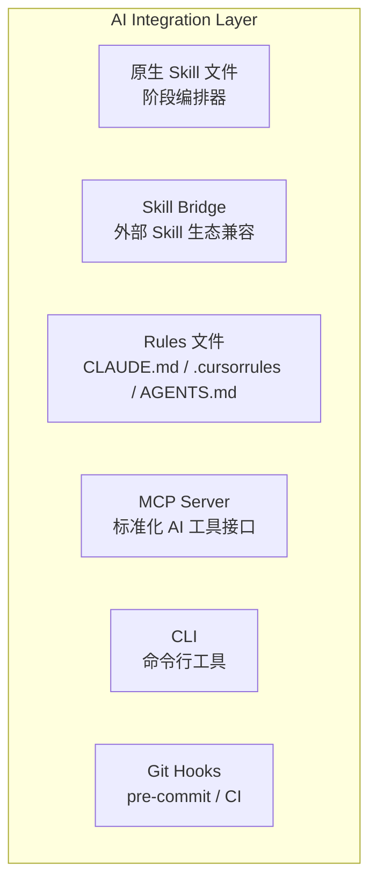
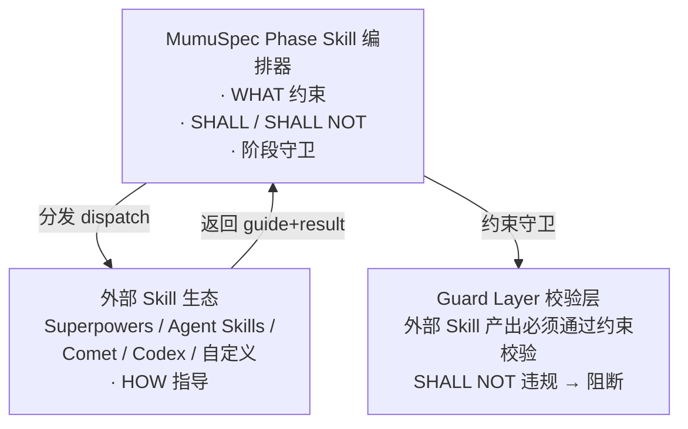
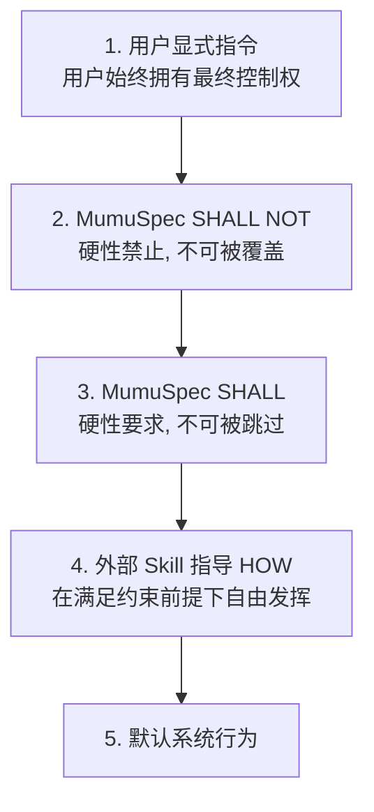

# AI Integration Layer — AI 编程工具集成

> 层级: Level 1 设计文档 | 所属层: AI Integration Layer

---

## 1. 集成架构

MumuSpec 通过多种方式与 AI 编程工具集成：



## 2. 原生 Skill 文件（阶段编排器）

MumuSpec 为每个变更阶段提供原生 Skill 文件，作为**阶段编排器**，负责在该阶段内分发到外部 Skill 生态：

```
.mumuspec/skills/
├── mumuspec-open.md          # 开启变更
├── mumuspec-design.md        # 技术设计
├── mumuspec-build.md         # 实现构建
├── mumuspec-verify.md        # 验证
├── mumuspec-archive.md       # 归档
├── mumuspec-hotfix.md        # 热修复预设
├── mumuspec-tweak.md         # 微调预设
└── custom/                   # 项目自定义 Skill
```

每个 Skill 文件包含：触发条件、前置条件检查、执行步骤（含外部 Skill 分发点）、阻塞点定义、退出条件、阶段守卫调用。

## 3. 外部 Skill 生态兼容

MumuSpec 原生 Skill 作为编排器，在每个阶段内部按需分发给外部 Skill 生态。外部 Skill 提供 **HOW** 的指导，MumuSpec 提供 **WHAT** 的约束：



### 优先级与冲突解决



| 冲突场景 | 处理方式 |
|---------|---------|
| Skill 建议 vs SHALL NOT | SHALL NOT 优先，阻断 |
| Skill 建议 vs SHALL | SHALL 优先，要求调整 |
| 多个 Skill 冲突 | 按分发顺序，后者覆盖前者 |
| Skill 不可用 | required=true 阻断；required=false 跳过 |

### 兼容的 Skill 生态

| 生态 | dispatch_mode | 说明 |
|------|--------------|------|
| Superpowers | deep | 深度集成，`~/.claude/skills` |
| Agent Skills | deep | 深度集成，`~/.agents/skills` |
| Comet | interop | 协议互操作 |
| Codex | platform | 平台适配（按需启用） |
| Custom | — | 项目自定义，`.mumuspec/skills/custom` |

### 阶段-Skill 映射概要

| 阶段 | 关键 Skill |
|------|-----------|
| **Open** | brainstorming (required), spec-driven-development (required), gitnexus-impact-analysis (required) |
| **Design** | brainstorming (required), hyperplan (conditional), test-case-design (required), api-and-interface-design (optional) |
| **Build** | writing-plans (required), test-driven-development (required), source-driven-development (optional) |
| **Verify** | verification-before-completion (required), requesting-code-review (required) |
| **Archive** | finishing-a-development-branch (required), ci-cd-and-automation (required) |
| **横切** | context-engineering, using-git-worktrees, documentation-and-adrs, doubt-driven-development |

> Skill 生态详细配置（含 hyperplan 7 阶段流程、Skill 矩阵、分发协议、决策记录）见 [参考：Skill 生态](../reference/skill-ecosystem.md)。

## 4. Rules 文件生成

MumuSpec 自动从规范生成 AI Rules 文件，供不同 AI 工具加载：

```yaml
# config.yaml 中的 AI 集成配置
ai:
  generate_rules: true
  mcp_server: true
  rules_files:
    - "CLAUDE.md"        # Claude Code
    - ".cursorrules"      # Cursor
    - "AGENTS.md"         # 通用 Agent
```

Rules 文件内容包含：
- 项目概述与当前工作目录
- 渐进式披露加载的规范（SHALL + SHALL NOT）
- Ponytail 基础编码约束（7 级优先级阶梯）
- 设计知识加载提示（引用 `.mumuspec/knowledge/` 和 `mumuspec knowledge context`）
- 代码结构查询提示（引用 `mumuspec search` / `mumuspec trace`）
- 工作流规则（worktree 隔离、单一活跃变更、自顶向下/自下向上、TDD）
- 禁止项优先级（SHALL NOT > SHALL）
- Skill 生态兼容说明

## 5. MCP Server

提供标准化 AI 工具接口：

```json
{
  "mcpServers": {
    "mumuspec": {
      "command": "npx",
      "args": ["@mumuspec/mcp-server"],
      "env": { "MUMUSPEC_ROOT": "${workspaceRoot}" }
    }
  }
}
```

> 完整 MCP 工具列表见 [参考：MCP 工具](../reference/mcp-tools.md)。

## 6. CLI 命令

提供命令行工具操作 MumuSpec 的所有功能：规范管理、变更管理、状态机回退、worktree 管理、代码图谱查询、知识管理、校验、文档生成、测试用例管理、契约管理、认知框架管理等。

### mumuspec status — 变更状态概览

显示当前活跃变更的状态摘要：
- 当前 Phase 和 Workflow
- build_layers 进度
- test-cases 锁定状态
- rollback/rebuild 计数
- 下一步操作建议

### mumuspec doctor — 环境诊断

检查 MumuSpec 运行环境：
- Node.js 版本
- Git 仓库状态
- .mumuspec/ 目录完整性
- config.yaml 校验
- 图谱索引新鲜度
- Skill 生态可用性
- 依赖工具（tree-sitter 等）

### mumuspec wizard — 交互式引导

为新用户提供交互式引导：
- 初始化项目规范
- 创建第一个变更
- 选择 Workflow（hotfix/tweak/full）
- 逐步引导完成五阶段流程

> 完整 CLI 命令列表见 [参考：CLI 命令](../reference/cli-commands.md)。

## 7. Git Hooks

Pre-commit hook 集成 MumuSpec 快速检查：
1. SHALL NOT 快速检查
2. 测试不可变性检查
3. 规范格式校验

CI/CD pipeline 集成全量检查：
- 全量 SHALL + SHALL NOT 检查
- 漂移检测（规范 + 图谱 + 设计文档 + 契约 + 知识）
- 代码图谱完整性
- Phase Guard 阶段守卫

---

> **导航**: [← 校验层](guard-layer.md) | [返回概览](../overview.md)
