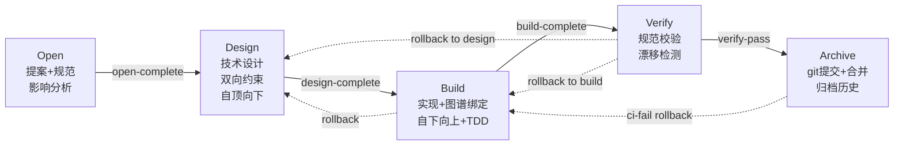

# Change Layer — 变更驱动的规范生命周期

> 层级: Level 1 设计文档 | 所属层: Change Layer

---

## 1. 变更生命周期

借鉴 OpenSpec + Comet 的工件流水线，增加双向约束、代码图谱集成，并遵循四大工作流规则：



**状态机特性**：
- 正向流转：Open → Design → Build → Verify → Archive
- 回退路径：Build/Verify 可回退到 Design（计入 `rollback_count`，上限 3）；Verify 可回退到 Build（计入 `rebuild_count`，上限 5）
- 旁路操作：Discard（任意非终态阶段可废弃）、accept-deviations（接受偏差归档）
- 单一活跃变更约束：同时只允许一个活跃变更

## 2. Phase 1: Open（提案）

**输入**: 用户描述需求
**输出**: proposal.md + delta-specs/ + 影响分析 + worktree + .mumuspec.yaml

**关键步骤**：
1. 单一活跃变更检查（硬性前置条件）
2. 需求探索与澄清（brainstorming，不可跳过，hotfix/tweak 除外）
3. 通过代码图谱进行影响分析（trace_path + detect_changes）
4. 确定 affected_scopes（受影响规范层级）
5. 创建 proposal.md + delta-specs（ADDED/MODIFIED/REMOVED 语义标记）
6. 创建 worktree 隔离工作区
7. 追加 decisions.md Open 章节
8. 用户确认（阻塞点）

## 3. Phase 2: Design（技术设计 — 自顶向下）

**输入**: proposal.md + delta-specs/ + 影响分析
**输出**: design.md + test-cases/（已锁定）+ build_layers

**设计原则**: 自顶向下（Level 0 → Level N 逐层细化），测试用例作为设计的一部分在各层同步定义。

**关键步骤**：
1. 自顶向下逐层设计（Level 0 根层 → Level 1 模块层 → Level 2 组件层 → Level 3+ 叶子层）
   - 每层定义 SHALL/SHALL NOT 和测试用例
2. 对抗式设计审查（hyperplan，仅复杂变更触发）
   - 触发条件：`affected_scopes >= 3` OR 新增 SHALL NOT OR `workflow == "full"`
   - 5 个敌对 critic 交叉攻击设计方案
   - 产出 4 类幸存洞察持久化到 `hyperplan_result`
   - 详见 [参考：Skill 生态](../reference/skill-ecosystem.md#hyperplan)
3. 编写测试用例规格（test-cases/，按 layer 组织）
4. 代码图谱验证（确认不破坏现有调用链）
5. 生成实现层级计划（build_layers，从深到浅排序）
6. **锁定测试用例**（计算 hash，设置 `design_locked=true`）
7. 追加 decisions.md Design 章节
8. 用户确认（阻塞点）

> **TDD 不可变性**：Design 完成后，test-cases/ 锁定不可变更。需修改必须回退到 Design。

## 4. Phase 3: Build（实现 — 自下向上 + 红绿 TDD）

**输入**: design.md + test-cases/（已锁定）+ build_layers
**输出**: 代码提交 + 图谱更新 + .mumuspec.yaml 状态更新

**实现原则**: 自下向上（Layer N → Layer 0）+ 红绿 TDD（Red→Green→Refactor）

**每层实现流程**：
```
a. 加载该层规范 + test-cases/layer-N/cases.md
b. RED: 依据 cases.md 编写测试套件 → 验证测试失败
c. 锁定该层测试套件（计算 hash，写入 suite-map.yaml）
d. GREEN: 编写实现代码使所有测试通过
e. REFACTOR: 重构优化（不改测试）
f. 运行该层 Enforcement 检查
g. 标记 build_layers[layer=N].status = done
h. 提交代码（worktree 内 git commit）
```

**回退处理**（Build → Design）：
- 触发条件：规范与实现存在根本性矛盾
- 保存快照 → rollback_count + 1 → build_layers 重置为 pending → test_cases 解锁
- 修改设计后需重新通过 `design_to_build` guard

## 5. Phase 4: Verify（验证 — 自下向上逐层验证）

**输入**: 完成的代码 + 规范 + 图谱 + build_layers（全部 status=done）
**输出**: verify.md（验证报告）

**验证维度**（每层执行）：
1. **完整性**：tasks.md 任务完成，delta-specs requirement 已实现
2. **规范一致性**：SHALL 检查 + SHALL NOT 检查 + Enforcement
3. **代码图谱完整性**：调用链完整，无意外破坏性变更
4. **漂移检测**：规范与代码一致，图谱与实际代码一致
5. **测试不可变性**：test-cases hash + 套件 hash 一致

**回退处理**：
- 情况 A — 回退到 Design（设计层面问题）：rollback_count + 1
- 情况 B — 回退到 Build（实现层面问题）：rebuild_count + 1（不增加 rollback_count）

> hotfix/tweak 走 light verify：仅 SHALL NOT + 图谱完整性 + 测试不可变性。

## 6. Phase 5: Archive（归档 — Git 提交 + 合并请求）

**输入**: verify_result: pass
**输出**: 合并到主分支的代码 + 合并后的主规范 + 归档记录

**三个子流程**（严格 A → B → C 顺序）：

### A. Git 合并流程
1. 最终提交（worktree 中）
2. 推送到远程
3. 创建合并请求（MR/PR）
4. CI 检查（全量 SHALL/SHALL NOT + 漂移检测 + 图谱完整性）
   - CRITICAL 失败 → 回退到 Build
   - 非 CRITICAL → 用户决定 accept-deviations
5. 合并 MR（用户确认 — 阻塞点，选择 squash/merge/rebase）

### B. 规范归档（原子操作 B0-B5）
- B0: 备份受影响规范文件
- B1: delta-specs 合并到主 spec.md（ADDED/MODIFIED/REMOVED/RENAMED 语义）
- B2: 更新 prohibitions.md 汇总
- B3: 更新 index.yaml
- B4: 更新代码图谱快照
- B5: 提交规范变更到主分支（与 B4 同一 commit）

### C. 清理与收尾
- 移动变更到 archive/ 目录
- 清理 worktree
- 释放活跃变更槽位
- 追加 decisions.md Archive 章节

## 7. Discard 流程

独立于五阶段主流程的旁路操作，允许在任意非终态阶段废弃变更：
1. 用户确认废弃（阻塞点 — AI 不能自动发起）
2. 保存快照 → 清理 worktree → 移动到 archive/discarded/ → 释放槽位
3. 状态机转换：phase → discarded（终态，不可回退）

## 8. 预设路径

| 预设 | 触发条件 | 流程 | 关键约束 |
|------|---------|------|---------|
| **hotfix** | Bug 修复 | open → build → verify → archive | 跳过 Design，但 Open 阶段必须定义并锁定单层 test-cases/；Build 执行红绿 TDD |
| **tweak** | 配置/文案/文档 | open → lightweight build → light verify → archive | 跳过 Design 和完整 Verify，仍须定义 test-cases/ + 红绿 TDD |
| **full** | 新功能/架构变更 | 完整五阶段 | 完整双向约束 + 图谱验证 + 多层 test-cases/ + hyperplan |

> **TDD 不可豁免**：即使 hotfix/tweak 跳过 Design，红绿 TDD 循环和测试不可变性约束仍然强制适用。

**升级条件**（不可降级）：
- hotfix 涉及 3+ 文件 → 升级到 full
- tweak 涉及 5+ 文件或跨模块 → 升级到 full
- 涉及新增 SHALL NOT → 升级到 full

## 9. 变更工件结构

```
.mumuspec/changes/<change-name>/
├── .mumuspec.yaml              # 变更状态（phase, workflow, build_layers, test_cases, ...）
├── proposal.md                 # 为什么 + 做什么 + 影响范围
├── design.md                   # 技术设计
├── tasks.md                    # 实现计划（Build 阶段产出）
├── delta-specs/                # 规范变更草案（ADDED/MODIFIED/REMOVED 语义）
├── constraints/
│   ├── new-shall.md            # 新增正向要求
│   └── new-shall-not.md        # 新增反向禁止
├── test-cases/                 # 测试用例规格（Design 阶段锁定）
│   ├── layer-0-cases.md
│   ├── layer-1-cases.md
│   └── layer-N-cases.md
├── suite-map.yaml              # 测试套件映射（Build 阶段锁定）
├── decisions.md                # 决策记录（各阶段 on_exit 追加）
├── code-graph/
│   ├── impact-analysis.json    # 影响分析
│   └── base-ref.txt
├── snapshots/                  # 回退快照
└── verify.md                   # 验证报告
```

> Phase Guard 详细规则见 [参考：Phase Guard](../reference/phase-guards.md)。

---

> **导航**: [← 契约层](contract-layer.md) | [代码图谱层 →](code-graph-layer.md) | [返回概览](../overview.md)
