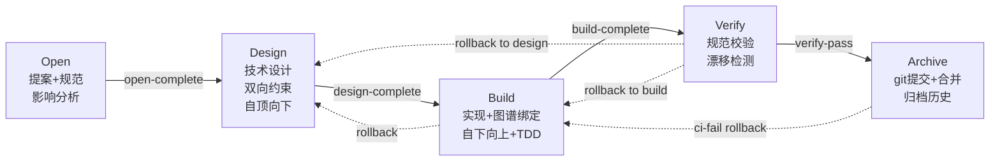

# Change Layer — 变更驱动的规范生命周期

> 层级: Level 1 设计文档 | 所属层: Change Layer

---

## 1. 变更生命周期

借鉴 OpenSpec + Comet 的工件流水线，增加双向约束、代码图谱集成，并遵循四大工作流规则：



**状态机特性**：
- 正向流转：Open → Design → Build → Verify → Archive
- 回退路径：Build/Verify 可回退到 Design（计入 `rollback_count`，上限 3）；Verify 可回退到 Build（计入 `rebuild_count`，上限 5）
- 旁路操作：Discard（任意非终态阶段可废弃）、accept-deviations（接受偏差归档）
- 单一活跃变更约束：同时只允许一个活跃变更

### 四大工作流规则

MumuSpec 变更生命周期遵循四大工作流规则，这些规则是**按约束强度等级求值的可配置约束**，贯穿变更生命周期的所有阶段：

1. **Worktree 隔离**（`workflow.worktree_isolation`，维度 RG）：每个变更在独立 worktree 中进行，物理隔离主分支，支持零上下文恢复。
2. **单一活跃变更**（`workflow.single_active_change`，维度 RG）：同时只允许一个活跃变更，强制单一任务专注，避免规范与代码的并行冲突。
3. **自顶向下设计**（`workflow.top_down_design`，维度 TD）：按**依赖视野**约束设计与实现的方向——
   设计 Level N 时视野为 Level 0..N（向上闭合），实现 Level N 时视野为 Level N 及其更低层（向下自足）。
   该规则可判定化为三条不变量：

   | 编号 | 不变量 | 反面（机器可判定） | 检查通道 |
   |------|--------|-------------------|----------|
   | I1 | 设计向上闭合：覆盖 Layer N 必覆盖 0..N-1 | 断链 | `E-GUARD-009` / `W-GUARD-009`（design_to_build，结论写入 `state.design_coverage`） |
   | I2 | 实现向下自足：只依赖本层契约与更低层 | 越界 | 同层 scope 直接调用边检测（`W-BUILD-001`） |
   | I3 | 层内默认可并行：层内只经冻结契约耦合 | 设计未闭合 | `mumuspec state plan-parallel` 派生并行组 |

   **核心等式**：实现侧的并行度是设计侧完备性的可测量投影——同层模块无法并行，不是实现能力不足，
   而是设计没闭合。因此"默认并行"不需要额外机制去实现，只需要去检测它为什么做不到。

   **两级事实，不要混同**：同层号只是**候选**并行组（`build_layers` 写入时**不**自动填
   `parallel_group`）；`parallel_group` 是**已验证**的子集，只由 `mumuspec state plan-parallel --apply`
   写入。因此 `mumuspec state layers` 在出现"`candidate L<n> (same layer, unverified)`"时，
   说明该层的并行安全性尚未验证——先跑 `plan-parallel` 再开工，而不是默认它可并行。

   ##### 自由度边界（设计与实现）

   上述三条不变量描述的是**边界**；边界**之内**是什么，需要另作声明。

   LLM 的自由度是**区间**，不是标量——上游给出约束，界内的一切选择自由。

   | 层级 | 上游（约束来源） | 界内（自由） |
   |------|-----------------|-------------|
   | 设计 Level N | Level 0..*N*-1 的规范与上层约束 | 本层的模块划分、接口组织、抽象取舍 |
   | 实现 Level N | 设计已声明的边界（冻结契约 + 本层及更低层规范 + 已锁定测试） | 算法、数据结构、函数划分 |

   两个层级形状相同：**受上游约束，界内自由**。区别只在"上游"是谁——设计的上游是更高层规范，
   实现的上游是设计本身。

   反面两类（机器可判定）：

   | 反面 | 定义 | 检查通道 |
   |------|------|----------|
   | 越权约束 | 约束没有可解析的上游来源（不属于任何层级，凭空发明） | `E-CONSTRAINT-001` / `E-CONSTRAINT-002` / `W-CONSTRAINT-003`（`src/spec/constraint-provenance.ts`，接入 `mumuspec check` 的 drift 数组） |
   | 越界实现 | 实现引用超出设计边界的符号 | I2（`W-BUILD-001`） |

   三方挂钩：**边界**由 I1/I2 判定；**边界的继承规则**由约束树的 tighten-only 承担（下层可收紧、
   不可放宽，见 [constraint-strength.md](constraint-strength.md)）；**界内自由度的度量**由既有
   `constraint-density` evaluator 承担（密度越高 = 自由度越低；weight=0，仅作调节信号，见 `mumuspec metrics`）。

   > **实践推论**：实现方案**只在违反已声明边界时**才可被驳回。界内的选择不因"未被设计约束"
   > 而成为缺陷——否则实现会把设计没说的偏好当成硬约束，自由度被静默收回。

   强度语义：`high` → I1 违规阻塞（`E-GUARD-009`）；`medium` → 降级为恒可见告警（`W-GUARD-009`）；
   `low` → 不阻断；三种强度下结构化工件 `state.design_coverage` 都始终写入，不静默失效。
   层间实现顺序为自下而上（`mumuspec state layer` 在写时校验：低层未完成时拒绝把高层置 `done`，
   `--force` 可越过）；层内各 scope 并行不受此约束。
4. **红绿 TDD 强制**（`workflow.tdd_enforced`，维度 TD）：测试用例是设计产出，Design 后锁定不可变更；Build 阶段执行红绿 TDD 循环（Red→Green→Refactor）。

> 即使在 `low` 强度下关闭 `tdd_enforced`，测试不可变性约束（test-cases/ 与测试套件 hash 锁定）的 `design_locked` 仍然强制（属 TD 维度 medium 强度）；仅 `suites_hash` 与红绿循环顺序要求放宽。

#### 强度联动（0.12.0 新增）

四大工作流规则按维度归属随 `constraint_strength` 强度等级渐进式放开:

| 工作流规则 | 维度 | high | medium | low |
|-----------|------|------|--------|-----|
| `worktree_isolation` | RG | 强制（block） | 推荐（warn，允许 branch 降级） | 关闭（info） |
| `single_active_change` | RG | 强制 1 个 | 软警告 ≤3 并行 | 关闭（无上限，WARN） |
| `top_down_design` | TD | 强制 Level 0→N（I1 断链阻塞） | 推荐：I1 断链仅 WARN 且恒可见 | 关闭（不阻断，仍写 design_coverage 工件） |
| `tdd_enforced` | TD | 强制 Red→Green→Refactor | 测试存在即可 | 关闭 |

**求值优先级**: `workflow.*` 显式设置 > `constraint_strength.overrides.workflow.*` > `constraint_strength.<dimension>` 强度等级 > 默认值（high）。

#### 配置化

四大工作流规则均可通过两种方式配置:

**方式 1: 显式二值开关（向后兼容 0.11.0）**

```yaml
# .mumuspec.yaml
workflow:
  worktree_isolation: true        # 字面默认 true；有效值由强度矩阵决定
  single_active_change: true      # 字面默认 true，可关闭（关闭后允许 N 个并行变更，上限默认 3）
  top_down_design: false          # 字面默认 false；TD=high 时矩阵生效为 true，medium/low 为 false
  tdd_enforced: false             # 字面默认 false；同上，由 TD 强度决定
```

> **默认值口径（2026-09-12 澄清）**：`workflow.*` 的字面默认值只是 `getDefaultConfig()` 的初始
> 取值，**不构成有效值**。实际生效值由 `resolveWorkflowRule()` 按"显式 override > 强度矩阵 >
> 回退 true"求出（见 `src/core/config-tree.ts` 的 `WORKFLOW_STRENGTH_MATRIX`）。
> 本项目默认 `technical_design: medium` → `top_down_design` 与 `tdd_enforced` 的有效值为 **false**。

**方式 2: 通过约束强度等级联动（推荐，0.12.0+）**

```yaml
# .mumuspec.yaml
constraint_strength:
  technical_design: high          # 影响 top_down_design / tdd_enforced
  requirement_goals: high         # 影响 worktree_isolation / single_active_change
  overrides:
    workflow:
      worktree_isolation: inherit  # inherit 时按强度等级求值
      # 显式 true/false 覆盖强度等级
```

关闭规则时 SHALL 在 `.mumuspec.yaml` 中显式记录，并在 `mumuspec status` 输出 WARN 提示。例如关闭 `single_active_change` 时输出 "已关闭单一活跃变更，可能影响变更隔离性" WARN。

> 详细的强度等级映射、Phase Guard 检查项分级、阻塞点分级见 [动态约束强度系统](constraint-strength.md)。

### 边界条件

#### 并发操作

| 场景 | 处理策略 |
|------|----------|
| 多人同时编辑同一层 spec.md | 单一活跃变更约束自然序列化；若 Git 合并冲突，CI 阻断并报告冲突 |
| AI 与用户同时操作 .mumuspec.yaml | 文件级锁（`.mumuspec/.lock`），AI 操作前检查锁状态 |
| 并行 CI 触发 | 仅第一个 CI 运行全量检查，后续 CI 检查锁文件并跳过或排队 |

#### 超深目录

| 目录深度 | 处理策略 |
|---------|----------|
| ≤ max_layer_depth (默认 5) | 正常加载 |
| > max_layer_depth | 深层目录共享父层规范，不创建独立 .mumuspec/ |
| 超深目录告警 | `mumuspec validate` 报告 WARN: "目录深度 X 超过 max_layer_depth" |

#### 空项目

| 场景 | 处理策略 |
|------|----------|
| `mumuspec init` 在空目录执行 | 创建最小 .mumuspec/ 结构（spec.md + design.md + config.yaml） |
| 无代码文件的项目 | 图谱功能跳过，规范校验仅检查格式 |
| 无 src/ 目录的项目 | 根层规范直接管理，不创建子层 |

## 设计哲学边界

MumuSpec 遵循"内部强制、外部兼容、强度可调"的设计哲学边界：

### 内部强制

对使用 MumuSpec 管理的项目，工作流规则、SHALL/SHALL NOT 约束、漂移检测按 **配置的约束强度等级** 强制执行。这是 MumuSpec 的核心价值：确保规范与代码的一致性。

强度等级分三档（high / medium / low），按"技术设计"和"需求目标"两个维度独立配置:
- `high` — 阻断（block）
- `medium` — 警告（warn，不阻断）
- `low` — 提示（info，仅记录）

详见 [动态约束强度系统](constraint-strength.md)。

### 外部兼容

通过 Skill Bridge 与外部 Skill 生态（Superpowers/OpenSpec/Comet 等）互操作时，MumuSpec SHALL NOT 强制外部 Skill 遵循 MumuSpec 工作流。具体表现为：

- 外部 Skill（如 Superpowers 的 TDD 流程）不强制遵循 MumuSpec 的单一活跃变更约束
- MumuSpec 仅对自身管理的变更工件（`.mumuspec/changes/` 下的变更）强制工作流
- 外部 Skill 创建的工件不受 MumuSpec 工作流守卫约束
- 约束强度配置不影响外部 Skill 的行为

### 强度可调

"内部强制"的程度从二值变为三档:
- 团队可按项目阶段、变更类型、团队成熟度动态调整强度
- 强度变更通过 `mumuspec constraints strength` 命令显式执行，记录到 `decisions.md`
- 例外清单（如终态守卫、用户确认门禁）不论强度等级始终 `block`

### 边界判定原则

当判断某工件是否受 MumuSpec 工作流约束时：
- 工件位于 `.mumuspec/changes/` 目录下 → 受约束（按强度等级求值）
- 工件由外部 Skill 管理（如 Superpowers 的任务文件） → 不受约束
- 工件位于项目代码中但无 MumuSpec 变更关联 → 不受约束（但漂移检测仍会检查）
- `.mumuspec/constraints.yaml` 中的持久化约束 → 对所有 MumuSpec 管理的变更生效，独立于代码

## 2. Phase 1: Open（提案）

**输入**: 用户描述需求
**输出**: proposal.md + delta-specs/ + 影响分析 + worktree + .mumuspec.yaml

**关键步骤**：
1. 单一活跃变更检查（硬性前置条件）
2. 需求探索与澄清（brainstorming，不可跳过，hotfix/tweak 除外）
3. 通过代码图谱进行影响分析（trace_path + detect_changes）
4. 确定 affected_scopes（受影响规范层级）
5. 加载 affected_scopes 的历史知识（从 Knowledge Layer PageIndex）
6. 创建 proposal.md + delta-specs（ADDED/MODIFIED/REMOVED 语义标记）
7. 创建 worktree 隔离工作区
8. 追加 decisions.md Open 章节
9. 用户确认（阻塞点）

## 3. Phase 2: Design（技术设计 — 自顶向下）

**输入**: proposal.md + delta-specs/ + 影响分析
**输出**: design.md + cognitive-map.yaml + test-cases/（已锁定）+ build_layers

**设计原则**: 自顶向下（Level 0 → Level N 逐层细化），测试用例作为设计的一部分在各层同步定义。

### 3.1 认知框架启动（步骤 0）

> **Phase 归属与启用条件**: 认知框架(Q1-Q4 乔哈里窗变体)是 **Phase 2 引入的可选特性,默认关闭,需用户显式开启**(`cognitive_framework.enabled: true`)。在 Phase 1 MVP 与默认配置下,本步骤跳过,Design 阶段直接进入 3.2 自顶向下逐层设计。`full` 工作流且用户显式开启时,Design 阶段首先启动基于乔哈里窗变体的认知框架,系统化地梳理已知信息和未知盲区,为后续设计提供完备的信息地基。详见 [参考：认知框架](../reference/cognitive-framework.md)。

> **REMOVED**: 自建认知框架作为 Design 阶段**强制步骤**的设计已移除。Phase 1-2 默认不启用,Phase 2 实现后由用户按需开启。

**四阶段递进流程**：

| 阶段 | 名称 | 核心动作 | 产出 |
|------|------|---------|------|
| Stage 1 | 信息采集 | 读取 proposal/spec/impact-analysis/contracts → Q1 锚定声明 | Q1 已知的已知 |
| Stage 2 | 探索激活 | 从 Q1 识别缺口 → 生成 Q2 提问（含选项）→ 用户回答 → 迁移到 Q1 | Q1 更新 + Q2 清空 |
| Stage 3 | 盲区扫描 | 基于 Q1 推导 Q3 隐性需求（推理链，每轮 ≤ 3 条）+ Q4 八维度盲区扫描 | Q3 确认约束 + Q4 兜底策略 |
| Stage 4 | 设计生成 | 基于完整 Q1 生成 design.md 草案 + Q4 兜底写入风险章节 | design.md 草案 + cognitive-map.yaml |

**关键约束**：
- Q2 提问必须附带选项（2-4 个），不可是开放性问题
- Q3 推理链只能引用 Q1 条目，每轮最多 3 条
- Q4 盲区扫描不可跳过（至少扫描 3 个维度）
- Stage 2+3 合计不超过 5 轮，达到上限后强制收敛
- 认知地图（cognitive-map.yaml）每轮更新

### 3.2 自顶向下逐层设计（步骤 1）

基于认知框架的 Q1 锚定声明和 Q3 确认约束，进行自顶向下逐层设计：

1. 自顶向下逐层设计（Level 0 根层 → Level 1 模块层 → Level 2 组件层 → Level 3+ 叶子层）
   - 每层定义 SHALL/SHALL NOT 和测试用例
   - Q3 confirmed 的约束自动转化为对应层的 SHALL/SHALL NOT
2. 对抗式设计审查（hyperplan，仅复杂变更触发）
   - 触发条件：`affected_scopes >= 3` OR 新增 SHALL NOT OR `workflow == "full"`
   - 5 个敌对 critic 交叉攻击设计方案
   - 产出 4 类幸存洞察持久化到 `hyperplan_result`
   - **反馈循环**：hyperplan 产出后，若存在 unresolved risks 或 open_questions：
     - hyperplan `risks` → 触发认知框架增量轮次，作为新 Q4 扫描维度
     - hyperplan `open_questions` → 转化为新 Q2 问题，进入认知框架 Stage 2 增量轮
     - 更新 `cognitive-map.yaml` 后继续 Step 3
   - 详见 [参考：Skill 生态](../reference/skill-ecosystem.md#hyperplan)
3. 编写测试用例定义（test-cases/，按 layer 组织）
   - Q4 兜底策略中的测试兜底项须有对应测试用例
4. 代码图谱验证（确认不破坏现有调用链）
5. 生成实现层级计划（build_layers，从深到浅排序）
6. **锁定测试用例**（计算 hash，设置 `design_locked=true`）
7. 追加 decisions.md Design 章节（含认知框架决策记录）
8. 用户确认（阻塞点）

> **认知框架守卫**：`design_to_build` 守卫检查 cognitive-map.yaml 存在性、Q1 非空、Q2/Q3 无待处理项、Q4 扫描完成、认知地图已收敛。详见 [参考：认知框架](../reference/cognitive-framework.md#55-phase-guard-衔接)。
>
> **TDD 不可变性**：Design 完成后，test-cases/ 锁定不可变更。需修改必须回退到 Design。

## 4. Phase 3: Build（实现 — 自下向上 + 红绿 TDD）

**输入**: design.md + test-cases/（已锁定）+ build_layers
**输出**: 代码提交 + 图谱更新 + .mumuspec.yaml 状态更新

**实现原则**: 自下向上（Layer N → Layer 0）+ 红绿 TDD（Red→Green→Refactor）

**每层实现流程**：
```
a. 加载该层规范 + test-cases/layer-N/cases.md
b. RED: 依据 cases.md 编写测试套件 → 验证测试失败
c. 锁定该层测试套件（计算 hash，写入 suite-map.yaml）
d. GREEN: 编写实现代码使所有测试通过
e. REFACTOR: 重构优化（不改测试）
f. 运行该层 Enforcement 检查
g. 标记 build_layers[layer=N].status = done
h. 提交代码（worktree 内 git commit）
```

**回退处理**（Build → Design）：
- 触发条件：规范与实现存在根本性矛盾
- 保存快照 → rollback_count + 1 → build_layers 重置为 pending → test_cases 解锁
- 修改设计后需重新通过 `design_to_build` guard

## 5. Phase 4: Verify（验证 — 自下向上逐层验证）

**输入**: 完成的代码 + 规范 + 图谱 + build_layers（全部 status=done）
**输出**: verify.md（验证报告）

**验证维度**（每层执行）：
1. **完整性**：tasks.md 任务完成，delta-specs requirement 已实现
2. **规范一致性**：SHALL 检查 + SHALL NOT 检查 + Enforcement
3. **代码图谱完整性**：调用链完整，无意外破坏性变更
4. **漂移检测**：规范与代码一致，图谱与实际代码一致
5. **测试不可变性**：test-cases hash + 套件 hash 一致

**回退处理**：
- 情况 A — 回退到 Design（设计层面问题）：rollback_count + 1
- 情况 B — 回退到 Build（实现层面问题）：rebuild_count + 1（不增加 rollback_count）

> hotfix/tweak 走 light verify：仅 SHALL NOT + 图谱完整性 + 测试不可变性。

## 6. Phase 5: Archive（归档 — Git 提交 + 合并请求）

**输入**: verify_result: pass
**输出**: 合并到主分支的代码 + 合并后的主规范 + 归档记录

**三个子流程**（严格 A → B → C 顺序）：

### A. Git 合并流程
1. 最终提交（worktree 中）
2. 推送到远程
3. 创建合并请求（MR/PR）
4. CI 检查（全量 SHALL/SHALL NOT + 漂移检测 + 图谱完整性）
   - CRITICAL 失败 → 回退到 Build
   - 非 CRITICAL → 用户决定 accept-deviations
5. 合并 MR（用户确认 — 阻塞点，选择 squash/merge/rebase）

### B. 规范归档（原子操作 B0-B5）
- B0: 备份受影响规范文件
- B1: delta-specs 合并到主 spec.md（ADDED/MODIFIED/REMOVED/RENAMED 语义）
- B1a: **约束归并**（`mergeChangeArtifacts`）— 将 `constraints/` 和变更级 `.mumuspec/` spec 文件幂等归并到目标作用域的 `tech.md`/`prd.md`/`spec.md`
- B2: 更新 prohibitions.md 汇总
- B3: 更新 index.yaml
- B4: 更新代码图谱快照
- B5: 提交规范变更到主分支（与 B4 同一 commit）

> **幂等归并**: B1a 使用 Marker 注释（如 `<!-- constraint-merged from <change>/<file> -->`）确保多次归档不会重复写入同一内容。原子写入使用 `tmp` 文件 + `rename` 确保数据一致性。

### C. 清理与收尾
- 移动变更到 archive/ 目录
- 清理 worktree
- 释放活跃变更槽位
- 追加 decisions.md Archive 章节

### D. 知识提取（0.9.0 新增）
变更归档时从变更工件中提取持久性设计知识到全局知识库（`.mumuspec/knowledge/`）：
- D1: 从 cognitive-map.yaml 提取 Q1 持久性条目 → `type: rationale` 知识页面
- D2: 从 cognitive-map.yaml 提取 Q3 confirmed 推理 → `type: rationale` 知识页面
- D3: 从 cognitive-map.yaml 提取 Q4 残留风险 → `type: risk` 知识页面
- D4: 从 hyperplan_result 提取幸存洞察 → `type: decision` / `type: risk` 知识页面
- D5: 从 decisions.md 提取关键决策 → `type: decision` 知识页面
- D6: 确认 graph_bindings（知识页面 ↔ 代码图谱节点关联）
- D7: 更新 PageIndex（_index.yaml + _reverse-index.yaml）
- D8: 检查知识冲突（新知识是否 supersede 已有知识）

> 详见 [知识层设计](knowledge-layer.md#54-archive-阶段知识提取核心)。

## 7. Discard 流程

独立于五阶段主流程的旁路操作，允许在任意非终态阶段废弃变更：
1. 用户确认废弃（阻塞点 — AI 不能自动发起）
2. 保存快照 → 清理 worktree → 移动到 archive/discarded/ → 释放槽位
3. 状态机转换：phase → discarded（终态，不可回退）

## 8. 预设路径

| 预设 | 触发条件 | 流程 | 关键约束 |
|------|---------|------|---------|
| **hotfix** | Bug 修复 | open → build → verify → archive | 跳过 Design，但 Open 阶段必须定义并锁定单层 test-cases/；Build 执行红绿 TDD |
| **tweak** | 配置/文案/文档 | open → lightweight build → light verify → archive | 跳过 Design 和完整 Verify，仍须定义 test-cases/ + 红绿 TDD |
| **full** | 新功能/架构变更 | 完整五阶段 | 完整双向约束 + 图谱验证 + 多层 test-cases/ + hyperplan |

> **TDD 不可豁免**：即使 hotfix/tweak 跳过 Design，红绿 TDD 循环和测试不可变性约束仍然强制适用。

**升级条件**（不可降级）：
- hotfix 涉及 3+ 文件 → 升级到 full
- tweak 涉及 5+ 文件或跨模块 → 升级到 full
- 涉及新增 SHALL NOT → 升级到 full

## 9. 错误恢复决策树

### 9.1 rollback_count 超限

```
rollback_count >= rollback_limit (默认 3)
├── 用户选择 accept-deviations
│   ├── verify_result == pass-with-deviations → 走 verify_to_archive_with_deviations
│   └── verify_result != pass → 阻断，提示需先完成 Verify
├── 用户选择 Discard
│   └── 走 discard_change（保存快照，归档到 discarded/）
└── 用户选择手动提升上限
    ├── 记录原因到 decisions.md
    ├── 编辑 .mumuspec/config.yaml 的 changes.default_rollback_limit
    └── 继续回退（不推荐，需 Tech Lead 审批）
```

**CLI 引导输出**:
```
[E-CHANGE-002] 回退次数已达上限 (3/3)

当前变更 "add-user-auth" 已用尽回退次数。请选择：

  [1] 接受偏差归档（推荐）
      → 当前实现通过 SHALL NOT + 测试不可变性检查即可归档
      → 命令: mumuspec state transition add-user-auth archive-in-progress

  [2] 废弃变更
      → 保存快照后归档到 discarded/，释放活跃变更槽位
      → 命令: mumuspec discard add-user-auth --confirm

  [3] 手动提升上限（需审批）
      → 记录原因到 decisions.md，由 Tech Lead 确认
      → 编辑 .mumuspec/config.yaml 的 changes.default_rollback_limit

详细说明: docs/reference/error-codes.md#E-CHANGE-002
```

### 9.2 rebuild_count 超限

```
rebuild_count >= rebuild_limit (默认 5)
└── 强制升级为 verify_to_design_rollback
    ├── rollback_count + 1
    ├── 若 rollback_count 也超限 → 进入 9.1 决策树
    └── 提示: "实现层面多次修复失败，建议回退到设计阶段重新评估"
```

### 9.3 CI CRITICAL 失败

```
Archive 阶段 CI CRITICAL 失败
├── 自动回退到 Build (archive_ci_fail_rollback)
│   ├── rollback_count + 1
│   └── 若 rollback_count 超限 → 进入 9.1 决策树
└── 用户选择 Discard
    └── 走 discard_change
```

### 9.4 test-cases 锁定后需修改

```
test-cases/ 已锁定 (design_locked == true)
├── 实现中发现测试用例遗漏场景
│   ├── 回退到 Design (build_to_design_rollback)
│   │   ├── rollback_count + 1
│   │   ├── test-cases/ 解锁
│   │   └── 修改后重新锁定
│   └── 若 rollback_count 超限 → 进入 9.1 决策树
└── hyperplan 洞察遗漏
    ├── 回退到 Design
    ├── 重新触发 hyperplan
    └── 新洞察合并后重新设计 test-cases/
```

### 9.5 worktree 创建失败

```
worktree 创建失败
├── 原因: 磁盘空间不足 / 权限问题 / git 异常
├── 降级为 branch 模式
│   ├── 记录降级原因到 decisions.md (Open 阶段)
│   ├── config: changes.default_isolation = branch
│   └── 继续变更流程
└── 若用户拒绝降级
    └── 阻断变更创建，提示修复 worktree 环境
```

### 9.6 hyperplan 执行失败

```
hyperplan 执行中失败
├── subagent 创建失败
│   ├── 重试 1 次
│   ├── 仍失败 → 降级为 4 角色（移除 researcher）
│   └── 4 角色也失败 → 跳过 hyperplan，记录到 decisions.md
├── 单角色执行超时
│   ├── 跳过该角色的 Round 2/3
│   ├── Lead 用已有 Round 1 发现蒸馏
│   └── 标注 hyperplan_result.degraded = true
└── 用户门禁无响应
    ├── 等待用户决策（不超时）
    └── 用户可选择跳过开放问题（记录到 decisions.md，标记为已知风险）
```

### 9.7 Discard 后恢复

```
变更已 Discard
├── 从 snapshots/discard/ 恢复工件
│   ├── 无 restore 命令：读取快照工件后 mumuspec new <name> 重新创建变更
│   └── 不复活旧变更，只复用工件
└── 工件已用于参考
    └── snapshots/discard/ 保留 30 天后清理
```

## 10. 变更工件结构

```
.mumuspec/changes/<change-name>/
├── .mumuspec.yaml              # 变更状态（phase, workflow, build_layers, test_cases, ...）
├── proposal.md                 # 为什么 + 做什么 + 影响范围
├── cognitive-map.yaml          # 认知地图（四象限状态 + 演化历史）
├── design.md                   # 技术设计
├── tasks.md                    # 实现计划（Build 阶段产出）
├── delta-specs/                # 规范变更草案（ADDED/MODIFIED/REMOVED 语义）
├── constraints/
│   ├── new-shall.md            # 新增正向要求
│   └── new-shall-not.md        # 新增反向禁止
├── test-cases/                 # 测试用例定义（Design 阶段锁定）
│   ├── layer-0-cases.md
│   ├── layer-1-cases.md
│   └── layer-N-cases.md
├── suite-map.yaml              # 测试套件映射（Build 阶段锁定）
├── decisions.md                # 决策记录（各阶段 on_exit 追加）
├── code-graph/
│   ├── impact-analysis.json    # 影响分析
│   └── base-ref.txt
├── snapshots/                  # 回退快照
└── verify.md                   # 验证报告
```

> Phase Guard 详细规则见 [参考：Phase Guard](../reference/phase-guards.md)。

---

## 11. 初始架构偏好选型

架构决策要有落点：Design 阶段产出的 design.md 必须记录"选了什么、备选是什么、为什么不选"，否则下游 AI 只能在无边界的前提下重做同一批决策。

### 11.1 选型发生在 Design，不发生在 init

`mumuspec init` 全自动、零交互（红线：Init SHALL NOT require user interaction during generation）。因此偏好选型不进 init 的提问循环，而以产物形态进入 Design 阶段：init 产出带未决项的骨架，人签收后成为决策记录。

| 时机 | 动作 | 责任面 |
|------|------|--------|
| init | 由代码结构探测渲染骨架，未选定项显式写 `【待定】` | 代码（`renderDesignSkeleton`） |
| Design | 逐项选定，补齐备选与理由 | 人（LLM 只提供选项与推论） |
| Guard | 校验选型表完备性 | 代码（design-schema + phase-guard） |

### 11.2 偏好包

偏好包是声明式的互斥选项集，由代码持有常量、由渲染器消费、由 skill 文本引用：

| 议题 | 候选集 | 默认推断依据 |
|------|-------------|-------------|
| 分层策略 | 分层架构 / 六边形 / 模块化单体 / 暂不约束 | 既有目录树与依赖方向 |
| 数据流 | 单向请求-响应 / 事件驱动 / 混合 / 暂不约束 | 既有入口与调用面 |
| 状态与持久化 | ORM / 查询构造器 / 文件存储 / 暂不约束 | 依赖扫描结果 |
| 边界与契约 | 显式契约冻结 / 约定式 / 暂不约束 | 契约注册表现状 |
| 模块组织 | 按特性 / 按技术层 / 混合 / 暂不约束 | 源目录聚合度 |

候选集由代码常量持有，本表是其对外说明形态；增删候选改常量并同批改本节。

候选必须包含"暂不约束"项——它的存在使"未决策"成为可记录的合法状态，而不是伪装成已决策的默认值。静默套用某个候选（例如按 preset 缺省落到 frontend）属禁止行为：缺输入时报错并列出可选值。

### 11.3 选型表与判定

design.md 的每个选型条目四字段齐备：议题、选定、备选集合（≥1）、理由（含未选代价）。判定由 `findIncompleteSelections` 承担（议题块含 `- 选定 / - 备选 / - 理由` 任一字样即视为选型行），结果进 design→build 守卫；选型属过程约束，按 CHG-5 纪律以 WARN 呈现，不阻断转换：

| 状态 | 判定 |
|------|------|
| 四字段齐备 | 通过（无告警） |
| 显式 `【待定】` | W-DESIGN-012 列出议题名，建议级不阻断 |
| 仅有选定、无备选与理由 | 渲染期即视同缺失——`design-init` 不会把它输出为已决，落盘后仍带未决标记 ⇒ 同上告警 |
| 手工改写丢字段（无 `【待定】`） | W-DESIGN-012 报出该议题 |
| 无备选的决策 | 不可复核，视同缺失（同上） |

选项来源与认知地图 Q2 同源：Q2 提问必须附带 2-4 个选项，该选项集即偏好包候选集，不允许另立一套问答。

### 11.4 E-SPEC-006 的出路

`E-SPEC-006`（有 spec.md 缺 design.md）的 prescribed 出路必须是真实存在的命令。`mumuspec design-init <scope>` 产出受 design-schema 约束、含选型表骨架的 design.md；目标位置已有 design.md 时需显式 `--force`，不静默替换用户内容。修复步骤与实际命令的一致性由 `mumuspec conformance` 的 fixSteps 探针锁定——该探针只判定命令存在性，不判定能力语义，能力语义仍由选型表四字段校验兜底。

### Enforcement

- CHANGE-SEL-1: 选型四字段完备性由 design-schema 校验器判定，人工核对不承担该职责
- CHANGE-SEL-2: 偏好包候选含"暂不约束"项，由枚举测试锁定
- CHANGE-SEL-3: E-SPEC-006 fixSteps 指向的命令存在性由回归锁定

---

> **导航**: [← 契约层](contract-layer.md) | [知识层 →](knowledge-layer.md) | [返回概览](../overview.md)
