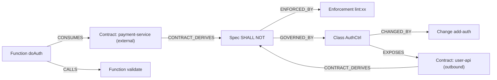

# Code Graph Layer — 代码图谱集成

> 层级: Level 1 设计文档 | 所属层: Code Graph Layer

---

## 1. 知识图谱 Schema

融合 codebase-memory-mcp 和 GitNexus 的图谱模型，增加规范节点、变更节点和契约节点：

```yaml
nodes:
  # 结构节点
  - label: File
    properties: [path, language, lines, lastModified, hash]
  - label: Function
    properties: [name, qualifiedName, signature, filePath, startLine, endLine]
  - label: Class
    properties: [name, qualifiedName, filePath, decorators]
  - label: Interface
    properties: [name, qualifiedName, filePath, methods]
  - label: Module
    properties: [name, path]

  # 规范节点
  - label: Spec
    properties: [id, scope, layer, type]    # type: SHALL, SHALL_NOT
  - label: Enforcement
    properties: [id, specId, checkType, severity]  # checkType: lint, test, ast

  # 变更节点
  - label: Change
    properties: [name, phase, workflow, createdAt]

  # 契约节点（0.8.0 新增）
  - label: Contract
    properties: [name, type, category, protocol, version, contractVersion, stability, scope]
    # type: external, outbound
    # category: rpc, rest, graphql, mq, middleware, database, event, sdk

edges:
  # 代码结构边
  - type: CALLS          # Function → Function
  - type: IMPORTS        # File → File
  - type: IMPLEMENTS     # Class → Interface
  - type: EXTENDS        # Class → Class
  - type: DEFINES        # File → [Function, Class, Interface]
  - type: CONTAINS       # Module → [File, Module]

  # 规范绑定边
  - type: GOVERNED_BY    # [Function, Class, File, Module] → Spec
  - type: ENFORCED_BY    # Spec → Enforcement
  - type: CHANGED_BY     # [Function, Class, File] → Change

  # 契约边（0.8.0 新增）
  - type: CONSUMES            # [Function, Class, Module] → Contract
    properties: [endpoint, callPattern]      # callPattern: sync, async, batch
  - type: EXPOSES             # [Function, Class, Module] → Contract
    properties: [endpoint, exposureType]     # exposureType: direct, proxied, event-driven
  - type: CONTRACT_DERIVES    # Contract → Spec
    properties: [constraintId, constraintType]  # constraintType: SHALL, SHALL_NOT
```

## 2. 图谱可视化



## 3. 核心 MCP 工具

| 工具 | 功能 | 规范集成 |
|------|------|---------|
| `index_repository` | 索引代码库，构建知识图谱 | 索引时解析规范绑定关系 |
| `search_graph` | 按名称/模式搜索图节点 | 可按 Spec 节点搜索受管辖代码 |
| `trace_path` | 追踪调用链（inbound/outbound） | 返回路径上所有 SHALL/SHALL NOT |
| `detect_changes` | 检测 git diff 影响的符号 | 同时检测受影响的规范 |
| `query_graph` | Cypher 查询 | 支持规范-代码关联查询 |
| `check_compliance` | 检查代码是否符合规范 | 执行所有 Enforcement 检查 |
| `get_spec_context` | 获取目录层级的规范上下文 | 渐进式披露加载 |
| `detect_drift` | 检测规范与代码的漂移 | 比较规范声明与代码实际 |
| `get_contract_context` | 获取指定模块的契约上下文 | 返回 CONSUMES/EXPOSES 契约及派生约束 |
| `check_contract_compliance` | 检查代码是否符合契约约束 | 校验 RPC 调用策略、向后兼容性 |
| `detect_contract_drift` | 检测契约与代码的漂移 | 代码暴露接口 vs 契约声明 |
| `trace_contract_impact` | 追踪契约变更影响范围 | 契约 → CONSUMES/EXPOSES 节点 → Spec |

> 完整 MCP 工具列表见 [参考：MCP 工具](../reference/mcp-tools.md)。

## 4. 规范-代码绑定

规范通过**绑定规则**与代码关联，绑定规则定义在 `spec.md` 的 Enforcement 部分：

```yaml
bindings:
  # 按路径模式绑定
  - id: CTRL-001
    type: SHALL
    target: "src/api/controllers/**/*.ts"
    check: "ast:hasDecorator(@RestController)"

  # 按类名模式绑定
  - id: CTRL-003
    type: SHALL_NOT
    target: "class:*Controller"
    check: "ast:notHasInjection(Repository)"

  # 按图节点类型绑定
  - id: G-004
    type: SHALL_NOT
    target: "graph:Function[filePath=src/**/*.ts]"
    check: "custom:no-db-call-in-loop"

  # 按调用链绑定
  - id: API-002
    type: SHALL_NOT
    target: "graph:trace(Middleware, direction=outbound, depth=2)"
    check: "ast:notModifiesRequestBody"
```

**绑定类型**：
- **路径模式**：按文件路径 glob 匹配
- **类名模式**：按类/函数名匹配
- **图节点类型**：按图谱节点属性查询
- **调用链**：按图谱 trace 路径匹配

---

> **导航**: [← 变更层](change-layer.md) | [校验层 →](guard-layer.md) | [返回概览](../overview.md)
