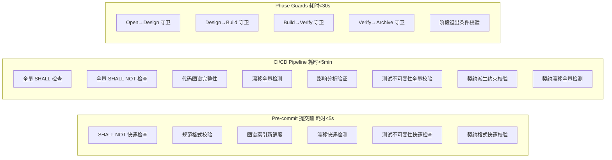

# Guard Layer — 自动化校验

> 层级: Level 1 设计文档 | 所属层: Guard Layer

---

## 1. 校验体系



## 2. 校验层次

### 2.1 Pre-commit（提交前）

快速检查（<5s），阻止明显违规进入代码库：
- SHALL NOT 快速检查（lint 规则子集）
- 规范格式校验
- 测试不可变性检查（test-cases/ + 套件 hash 未被篡改）
- 契约格式快速校验

### 2.2 CI/CD Pipeline（持续集成）

全量检查（<5min），确保代码库整体一致性：
- 全量 SHALL + SHALL NOT 检查
- 代码图谱完整性
- 漂移全量检测（规范漂移 + 图谱漂移 + 设计文档漂移 + 契约漂移）
- 测试不可变性全量校验
- 契约派生约束校验 + 契约漂移全量检测

### 2.3 Phase Guards（阶段守卫）

每个阶段转换必须通过脚本校验（<30s）：
- 检查工件完整性（proposal/design/tasks/delta-specs/test-cases）
- 检查约束满足（SHALL/SHALL NOT）
- 检查测试锁定状态
- 检查决策记录（decisions.md hash 防篡改）
- 失败时阻断转换并报告缺失工件

> Phase Guard 详细规则见 [参考：Phase Guard 规则](../reference/phase-guards.md)。

## 3. 漂移检测

漂移检测识别规范声明与代码实际之间的不一致：

| 漂移类型 | 检测内容 | 严重级别 |
|---------|---------|---------|
| **规范漂移** | spec.md 声明的 Requirement 在代码中无对应实现 | ERROR |
| **图谱漂移** | 代码图谱节点与实际代码不一致 | WARN |
| **设计文档漂移** | design.md 描述的组件关系与代码图谱不一致 | WARN |
| **测试不可变性漂移** | test-cases/ 或测试套件 hash 被篡改 | ERROR |
| **契约漂移 — 外部服务** | 代码调用了外部服务但无契约声明；RPC 策略不一致 | ERROR |
| **契约漂移 — 对外接口** | 代码暴露接口未在 outbound 契约声明 | ERROR |
| **契约漂移 — 向后兼容** | stable 端点字段被删除或类型被改变 | ERROR |
| **契约漂移 — 注册表** | contracts/ 文件未在 _registry.yaml 注册 | WARN (auto_fix) |

> 漂移检测详细规则见 [参考：漂移检测规则](../reference/drift-detection.md)。

## 4. Git Hooks

```bash
# .git/hooks/pre-commit (或通过 husky/lefthook 配置)

# 1. SHALL NOT 快速检查
mumuspec check --shall-not --staged-only

# 2. 测试不可变性检查
mumuspec check --test-immutability --staged-only

# 3. 规范格式校验
mumuspec validate --quiet
```

---

> **导航**: [← 代码图谱层](code-graph-layer.md) | [AI 集成层 →](ai-integration.md) | [返回概览](../overview.md)
