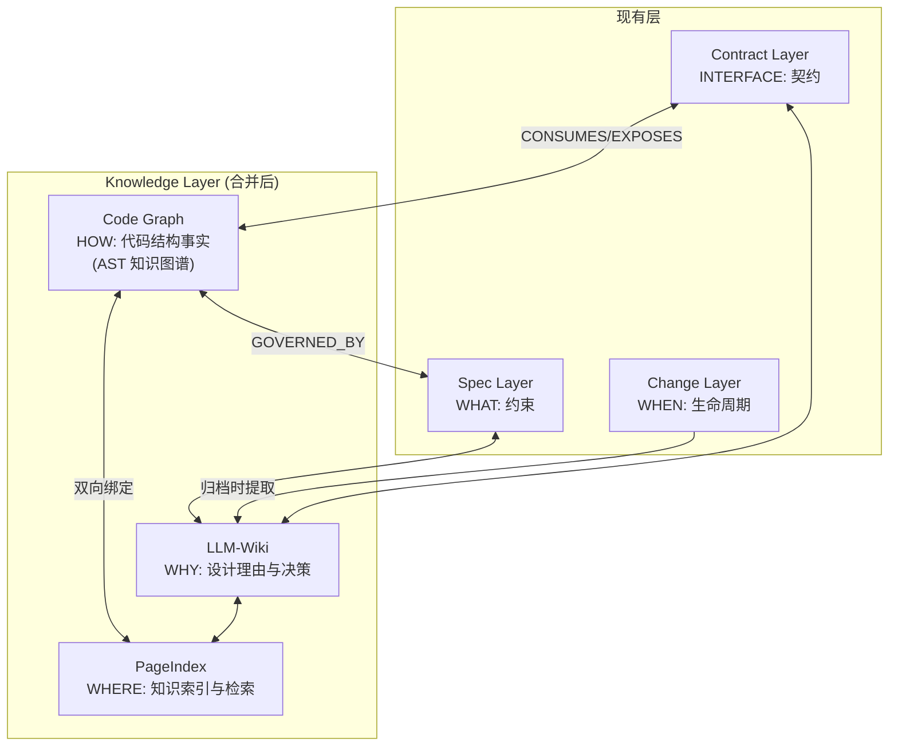
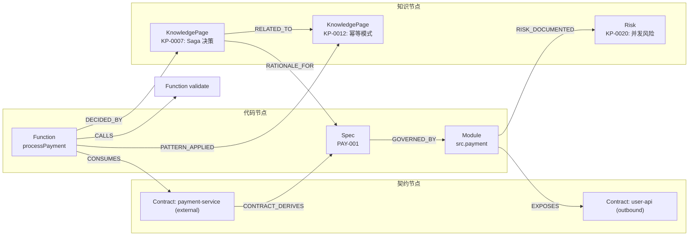
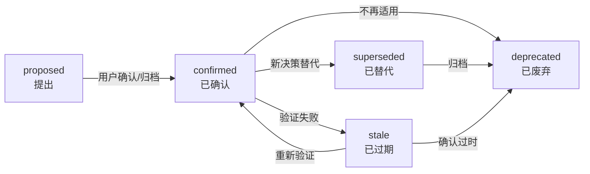

# Knowledge Layer — 持久化知识来源（代码图谱 + LLM-Wiki + PageIndex）

> 层级: Level 1 设计文档 | 所属层: Knowledge Layer | 版本: 0.10.0 重构（合并 Code Graph Layer）

---

## 1. 问题定位与设计目标

### 1.1 核心问题：设计知识的"失忆症"与代码结构的"盲人摸象"

当前 MumuSpec 的信息持久化存在两个结构性缺口：

| 缺口 | 表现 | 根因 |
|------|------|------|
| **代码结构不可知** | AI 在大型代码库中不理解模块间依赖关系，容易做出破坏性修改 | 缺少持久化的代码结构事实来源 |
| **设计知识失忆** | 设计决策和认知成果是变更级的，归档后即丢失，每次新变更从零开始 | 规范是持久的，但设计知识是变更级的 |

**根本矛盾**：AI Agent 既缺少"代码是怎么组织的"（HOW），又缺少"为什么这样设计"（WHY）。两者都是跨变更需要的持久化知识，应当统一管理。

### 1.2 设计目标

引入 **Knowledge Layer（知识层）**，将代码图谱和设计知识统一为持久化知识来源：

1. **Code Graph（代码图谱）**：基于 AST 构建的代码结构知识图谱，提供"代码怎么组织的"事实基础（HOW）
2. **LLM-Wiki**：为 LLM 优化的结构化设计知识库，提供"为什么这样设计"的理由（WHY）
3. **PageIndex**：页面级索引系统，支持按代码路径/图谱节点渐进式加载相关知识
4. **双向关联**：代码图谱节点与知识页面通过图谱边双向绑定，实现"点击代码→查看设计理由"

### 1.3 与现有层的关系



---

## 2. Code Graph — 代码结构知识图谱

### 2.1 图谱 Schema

融合 codebase-memory-mcp 和 GitNexus 的图谱模型，包含结构节点、规范节点、变更节点、契约节点和知识节点：

```yaml
nodes:
  # === 结构节点 ===
  - label: File
    properties: [path, language, lines, lastModified, hash]
  - label: Function
    properties: [name, qualifiedName, signature, filePath, startLine, endLine]
  - label: Class
    properties: [name, qualifiedName, filePath, decorators]
  - label: Interface
    properties: [name, qualifiedName, filePath, methods]
  - label: Module
    properties: [name, path]

  # === 规范节点 ===
  - label: Spec
    properties: [id, scope, layer, type]    # type: SHALL, SHALL_NOT
  - label: Enforcement
    properties: [id, specId, checkType, severity]  # checkType: lint, test, ast

  # === 变更节点 ===
  - label: Change
    properties: [name, phase, workflow, createdAt]

  # === 契约节点 ===
  - label: Contract
    properties: [name, type, category, protocol, version, contractVersion, stability, scope]
    # type: external, outbound
    # category: rpc, rest, graphql, mq, middleware, database, event, sdk

  # === 知识节点 ===
  - label: KnowledgePage
    properties: [id, title, type, status, scope, filePath, verifiedAt, freshness]
    # type: decision, pattern, risk, rationale, lesson
    # status: proposed, confirmed, superseded, deprecated
    # freshness: fresh, stale, unverified
  - label: Decision
    properties: [id, title, status, decidedAt, supersededBy]
    # Decision 是 KnowledgePage 的子类型
  - label: Risk
    properties: [id, title, severity, mitigation, status]
    # Risk 也是 KnowledgePage 的子类型

edges:
  # === 代码结构边 ===
  - type: CALLS          # Function → Function
  - type: IMPORTS        # File → File
  - type: IMPLEMENTS     # Class → Interface
  - type: EXTENDS        # Class → Class
  - type: DEFINES        # File → [Function, Class, Interface]
  - type: CONTAINS       # Module → [File, Module]

  # === 规范绑定边 ===
  - type: GOVERNED_BY    # [Function, Class, File, Module] → Spec
  - type: ENFORCED_BY    # Spec → Enforcement
  - type: CHANGED_BY     # [Function, Class, File] → Change

  # === 契约边 ===
  - type: CONSUMES            # [Function, Class, Module] → Contract
    properties: [endpoint, callPattern]      # callPattern: sync, async, batch
  - type: EXPOSES             # [Function, Class, Module] → Contract
    properties: [endpoint, exposureType]     # exposureType: direct, proxied, event-driven
  - type: CONTRACT_DERIVES    # Contract → Spec
    properties: [constraintId, constraintType]  # constraintType: SHALL, SHALL NOT

  # === 知识边 ===
  - type: DECIDED_BY          # [Function, Class, Module, File] → KnowledgePage
    properties: [context]
  - type: RISK_DOCUMENTED      # [Function, Class, Module] → Risk
    properties: [mitigationType]  # mitigationType: test, monitoring, rollback, degradation
  - type: PATTERN_APPLIED      # [Function, Class, Module] → KnowledgePage
    properties: [applicationNote]
  - type: RATIONALE_FOR        # KnowledgePage → [Function, Class, Module, Spec]
    properties: []
  - type: KNOWS_ABOUT          # KnowledgePage → Contract
    properties: [relationship]
  - type: SUPERSEDES           # KnowledgePage → KnowledgePage
    properties: [supersededAt, reason]
  - type: RELATED_TO           # KnowledgePage → KnowledgePage
    properties: [relationshipType]
```

### 2.2 图谱可视化



### 2.3 规范-代码绑定

规范通过**绑定规则**与代码关联，绑定规则定义在 `spec.md` 的 Enforcement 部分：

```yaml
bindings:
  # 按路径模式绑定
  - id: CTRL-001
    type: SHALL
    target: "src/api/controllers/**/*.ts"
    check: "ast:hasDecorator(@RestController)"

  # 按类名模式绑定
  - id: CTRL-003
    type: SHALL_NOT
    target: "class:*Controller"
    check: "ast:notHasInjection(Repository)"

  # 按图节点类型绑定
  - id: G-004
    type: SHALL_NOT
    target: "graph:Function[filePath=src/**/*.ts]"
    check: "custom:no-db-call-in-loop"

  # 按调用链绑定
  - id: API-002
    type: SHALL_NOT
    target: "graph:trace(Middleware, direction=outbound, depth=2)"
    check: "ast:notModifiesRequestBody"
```

**绑定类型**：
- **路径模式**：按文件路径 glob 匹配
- **类名模式**：按类/函数名匹配
- **图节点类型**：按图谱节点属性查询
- **调用链**：按图谱 trace 路径匹配

### 2.4 代码图谱存储与索引

| 维度 | 规范 |
|------|------|
| **存储引擎** | SQLite（嵌入式，无需额外服务） |
| **解析引擎** | tree-sitter（多语言 AST 解析） |
| **索引方式** | 全量索引 + 增量索引（仅解析变更文件） |
| **自动更新** | `config.yaml: code_graph.auto_index_on_commit: true` 时 git commit 自动触发增量索引 |
| **降级策略** | 不支持的语言降级为文件级索引；SQLite 不可用时降级为内存图（小型项目） |

---

## 3. LLM-Wiki：知识页面模型

### 3.1 知识页面（Knowledge Page）格式

每个知识页面是一个 Markdown 文件，带 YAML frontmatter 元数据，存储在 `.mumuspec/knowledge/` 目录下：

```yaml
---
# === 标识 ===
id: "KP-0007"                    # 全局唯一 ID，自动分配
title: "支付模块使用 Saga 分布式事务模式"
type: decision                    # decision | pattern | risk | rationale | lesson
status: confirmed                 # proposed → confirmed → superseded → deprecated
scope: "src/payment"              # 关联的代码范围
created_at: "2026-07-09T10:30:00Z"
updated_at: "2026-07-09T14:00:00Z"
verified_at: "2026-07-09T14:00:00Z"  # 最后一次与代码图谱验证一致的时间

# === 来源 ===
source_change: "add-payment-api"  # 产出该知识的变更名
source_phase: "design"            # open | design | build | verify | archive
source_artifact: "cognitive-map.yaml#Q3-002"  # 变更工件中的具体来源

# === 图谱关联 ===
graph_bindings:                   # 关联的代码图谱节点
  nodes:
    - type: "Module"
      qualified_name: "src.payment"
    - type: "Function"
      qualified_name: "src.payment.processPayment"
    - type: "Spec"
      id: "PAY-EXT-001"
  edges:
    - type: "DECIDED_BY"          # 代码节点 → 知识页面
      from: "src.payment.processPayment"
    - type: "RISK_DOCUMENTED"     # 代码节点 → 风险知识
      from: "src.payment"

# === 索引 ===
tags: ["distributed-transaction", "saga", "payment", "consistency"]
related_pages:
  - "KP-0003"  # 支付模块整体架构
  - "KP-0012"  # 幂等性设计模式
backward_refs: []                 # 反向引用（哪些页面引用了本页），自动维护

# === 认知框架溯源 ===
cognitive_origin:
  quadrant: "Q3"                  # Q1 | Q3 | Q4
  reasoning_chain: ["Q1-001", "Q1-003", "Q1-005"]  # 原始推理链的 Q1 条目
  confidence: high
---

## 背景

支付模块需要跨多个服务完成支付流程，涉及订单服务、库存服务和支付网关。
传统两阶段提交（2PC）在微服务环境下不可行。

## 决策

采用 Saga 模式，通过补偿事务实现最终一致性。

### 理由

1. 微服务环境下 2PC 性能不可接受（[KP-0003] 架构评估）
2. 支付场景容忍短期不一致（最终一致性足够）
3. Saga 补偿事务可复用已有回滚逻辑

## 影响

- `processPayment()` 必须实现补偿回滚接口
- 幂等性要求提升（见 [KP-0012]）
- 监控需增加 Saga 状态追踪

## 关联约束

- SHALL: `PAY-001` — 所有支付操作必须实现补偿回滚
- SHALL NOT: `PAY-NOT-003` — 禁止在 Saga 事务中使用同步阻塞等待
```

### 3.2 知识页面类型

| 类型 | 含义 | 来源 | 生命周期 |
|------|------|------|---------|
| `decision` | 架构决策记录（ADR） | Design 阶段 / decisions.md | confirmed → superseded |
| `pattern` | 设计模式和实践 | Design 阶段 / Q3 推理 | confirmed → deprecated |
| `risk` | 已知风险和兜底策略 | Q4 残留 / hyperplan risks | active → mitigated → resolved |
| `rationale` | 设计理由（为什么这样设计） | Design 阶段 / design.md | confirmed → superseded |
| `lesson` | 经验教训（回退、失败原因） | Build/Verify 回退 / decisions.md | learned → applied |

### 3.3 知识页面状态机



### 3.4 知识目录结构

```
.mumuspec/knowledge/
├── _index.yaml                   # PageIndex 主索引（全局）
├── _reverse-index.yaml           # 反向索引（代码节点 → 知识页面）
├── _memory.yaml                  # LLM-Wiki 记忆索引（L3 项目级 + L2 作用域级摘要）
├── decisions/                    # 架构决策记录
│   ├── KP-0001-payment-saga.md
│   ├── KP-0003-auth-jwt-design.md
│   └── ...
├── patterns/                     # 设计模式
│   ├── KP-0012-idempotency-pattern.md
│   └── ...
├── risks/                        # 已知风险
│   ├── KP-0020-concurrent-payment-risk.md
│   └── ...
├── rationales/                   # 设计理由
│   ├── KP-0030-why-event-driven.md
│   └── ...
├── lessons/                      # 经验教训
│   ├── KP-0040-rollback-lesson-auth.md
│   └── ...
├── imports/                      # 导入的外部知识
│   └── ...
└── _archive/                     # 已废弃/已替代的知识页面
    └── ...
```

> **结构白名单**: `knowledge/` 下的子目录和文件由 `structure-validator.ts` 强制校验，未定义的目录/文件将报 `E-SPEC-013`/`E-SPEC-014`。合法子目录：`decisions`, `patterns`, `risks`, `rationales`, `lessons`, `imports`。合法文件：`_index.yaml`, `_reverse-index.yaml`, `_memory.yaml`。

---

## 4. PageIndex：页面索引系统

### 4.1 PageIndex 主索引（`_index.yaml`）

```yaml
# .mumuspec/knowledge/_index.yaml
version: 1
updated_at: "2026-07-09T14:00:00Z"
stats:
  total_pages: 47
  by_type:
    decision: 18
    pattern: 12
    risk: 8
    rationale: 6
    lesson: 3
  by_status:
    confirmed: 39
    stale: 3
    superseded: 5
    deprecated: 0

pages:
  - id: "KP-0007"
    title: "支付模块使用 Saga 分布式事务模式"
    type: decision
    status: confirmed
    scope: "src/payment"
    file: "decisions/KP-0007-payment-saga.md"
    tags: ["distributed-transaction", "saga", "payment"]
    graph_nodes: ["src.payment", "src.payment.processPayment"]
    related_specs: ["PAY-001", "PAY-NOT-003"]
    related_contracts: ["payment-service"]
    created_at: "2026-07-09T10:30:00Z"
    verified_at: "2026-07-09T14:00:00Z"
    freshness: fresh              # fresh | stale | unverified

  # ... 更多页面
```

### 4.2 反向索引（代码节点 → 知识页面）

PageIndex 自动维护从代码图谱节点到知识页面的反向索引，支持"给定代码符号，找到关联知识"：

```yaml
# .mumuspec/knowledge/_reverse-index.yaml
# 自动生成，不可手动编辑
nodes:
  "src.payment":
    decided_by: ["KP-0007", "KP-0003"]
    risk_documented: ["KP-0020"]
    pattern_applied: ["KP-0012"]
  "src.payment.processPayment":
    decided_by: ["KP-0007"]
    risk_documented: ["KP-0020"]
  "src.auth.AuthController":
    decided_by: ["KP-0003"]
    rationale: ["KP-0030"]

specs:
  "PAY-001":
    decided_by: ["KP-0007"]
  "PAY-NOT-003":
    decided_by: ["KP-0007"]

contracts:
  "payment-service":
    decided_by: ["KP-0007", "KP-0003"]
```

### 4.3 渐进式知识加载

与 Spec Layer 的渐进式披露策略对齐，Knowledge Layer 也支持按代码范围渐进式加载：

```mermaid
graph TD
    subgraph Loaded["AI 在 src/api/controllers/ 目录工作"]
        K0["Level 0: 根层知识<br/>全局架构决策 (3-5 页)"]
        K1["Level 1: src 层知识<br/>编码规范决策 (2-3 页)"]
        K2["Level 2: api 层知识<br/>API 设计决策 (3-5 页)"]
        K3["Level 3: controllers 层知识<br/>Controller 相关决策 (1-2 页)"]
        K0 --> K1 --> K2 --> K3
    end
    subgraph NotLoaded["不加载"]
        N1["src/payment 的知识 (10 页)"]
        N2["src/auth 的知识 (5 页)"]
```

**加载策略**：
1. 从 PageIndex 中按 `scope` 字段匹配当前工作目录的祖先链
2. 每层最多加载 5 个 `status: confirmed` 且 `freshness: fresh` 的知识页面
3. `stale` 页面仅加载标题和摘要（1 行），不加载正文
4. 通过 `related_pages` 按需深入加载（懒加载）

### 4.3a LLM-Wiki 记忆索引（`_memory.yaml`）

除了渐进式知识加载，Knowledge Layer 还提供 **LLM-Wiki 记忆索引**，作为设计时 AI 的外部记忆入口：

| 层级 | 内容 | 用途 |
|------|------|------|
| **L3 项目级** | goals, key_decisions (top 10), active_risks (top 5), recent_lessons (top 5) | AI 快速获取项目全局上下文 |
| **L2 作用域级** | 按 scope 分组的 decisions, patterns, risks | AI 获取当前工作作用域的历史决策和模式 |

**记忆索引特性**：
- `_memory.yaml` 在缺失时自动重建（`loadMemoryIndex` 检测缺失 → 调用 `rebuildMemoryIndex`）
- `loadSpecContext` 自动加载记忆上下文作为 `knowledge_memory` 字段
- 记忆加载是 best-effort 的 — 失败不阻塞 spec 加载
- 每个条目包含 `summary` 字段（从知识页内容提取的一行摘要），AI 无需读取完整页面即可获得关键信息

> **语义金字塔**: L3 Summary → L2 Scenario → L1 Decision → L0 Evidence。`_memory.yaml` 提供 L3+L2 层摘要，AI 可按需深入到 L1（单个知识页）和 L0（原始工件）。

### 4.4 新鲜度管理

知识页面的 `verified_at` 与代码图谱的最后修改时间对比，自动计算新鲜度：

| 新鲜度状态 | 条件 | 处理 |
|-----------|------|------|
| `fresh` | `verified_at` ≥ 关联代码节点最后修改时间 | 正常加载 |
| `stale` | `verified_at` < 关联代码节点最后修改时间 | 标记 WARN，仅加载摘要 |
| `unverified` | `verified_at` 为空或关联代码节点已删除 | 标记 ERROR，提示重新验证 |

---

## 5. 代码图谱与知识的双向关联

### 5.1 关联机制

知识页面通过 `graph_bindings` 字段与代码图谱节点双向关联：

| 方向 | 边类型 | 含义 |
|------|--------|------|
| 代码 → 知识 | `DECIDED_BY` | 该代码节点的实现由某个决策决定 |
| 代码 → 知识 | `RISK_DOCUMENTED` | 该代码节点存在已记录的风险 |
| 代码 → 知识 | `PATTERN_APPLIED` | 该代码节点应用了某个设计模式 |
| 知识 → 代码 | `RATIONALE_FOR` | 该知识页面解释某代码的设计理由 |
| 知识 → 契约 | `KNOWS_ABOUT` | 该知识页面涉及某个契约约束 |
| 知识 → 知识 | `SUPERSEDES` | 新决策替代旧决策 |
| 知识 → 知识 | `RELATED_TO` | 知识页面间关联 |

### 5.2 关联验证

知识页面的 `verified_at` 与代码图谱的最后修改时间对比，自动计算新鲜度并纳入漂移检测：

```yaml
knowledge_drift:
  - check: "知识页面关联的代码节点已被删除"
    detection: "compare graph_bindings.nodes with actual code graph"
    severity: ERROR
    auto_fix: false
    recommendation: "代码已变更，知识页面需重新验证或标记 deprecated"

  - check: "知识页面 verified_at 过期（关联代码已修改）"
    detection: "compare verified_at with graph node lastModified"
    severity: WARN
    auto_fix: false
    recommendation: "知识页面可能过时，建议在设计阶段重新验证"
```

---

## 6. 可插拔后端架构

### 设计动机

Knowledge Layer 代码图谱原设计为自建 tree-sitter + SQLite 引擎。但生态调研显示 CGC(CodeGraphContext,35k Stars,23+ 语言,5 种图数据库)与 CBM(codebase-memory-mcp,8k Stars,158 语言,纯 C 极致性能)已是生产级工具。自建无法短期追平性能与语言覆盖,且重复造轮子违背生态协作原则。

因此 Knowledge Layer 采用 adapter 模式,支持多种后端可插拔。MumuSpec 自身仅维护"规范-代码绑定层"(GOVERNED_BY/ENFORCED_BY 边)与"知识页面管理"逻辑,不重复实现 AST 解析与图谱存储。

### GraphBackendAdapter 接口

```typescript
interface GraphBackendAdapter {
  // 初始化后端
  initialize(config: GraphBackendConfig): Promise<void>;

  // 索引代码库
  indexCodebase(rootPath: string): Promise<IndexResult>;

  // 查询节点
  queryNodes(filter: NodeFilter): Promise<GraphNode[]>;

  // 查询边
  queryEdges(filter: EdgeFilter): Promise<GraphEdge[]>;

  // 添加规范-代码绑定边
  addBindingEdge(specId: string, codeId: string, type: 'GOVERNED_BY' | 'ENFORCED_BY'): Promise<void>;

  // 检测漂移
  detectDrift(specId: string): Promise<DriftResult>;

  // 获取后端能力
  getCapabilities(): BackendCapabilities;

  // 健康检查
  healthCheck(): Promise<HealthStatus>;
}

interface BackendCapabilities {
  supportedLanguages: string[];
  supportsSemanticSearch: boolean;
  supportsCrossLanguage: boolean;
  maxFileCount: number;
  indexUpdateMode: 'realtime' | 'batch' | 'manual';
}
```

### 三种后端 Adapter 规范

#### CBM 后端(默认)

- **工具**: codebase-memory-mcp
- **语言支持**: 158 种语言
- **性能**: 纯 C 实现,极致性能
- **配置项**: `knowledge.graph_backend: "cbm"`
- **依赖**: 需安装 CBM MCP 服务器
- **优势**: 语言覆盖最广,性能最佳
- **适用场景**: 大型项目、多语言项目

#### CGC 后端(可选)

- **工具**: CodeGraphContext
- **语言支持**: 23+ 语言
- **图数据库**: 支持 Neo4j/Redis/Memgraph/DuckDB/SQLite 5 种后端
- **配置项**: `knowledge.graph_backend: "cgc"`
- **依赖**: 需安装 CGC 与选择的图数据库
- **优势**: 图数据库灵活,语义查询能力强
- **适用场景**: 需要复杂图查询的场景

#### 内置后端(降级)

- **实现**: 简化版 tree-sitter + SQLite
- **语言支持**: 仅 TypeScript/JavaScript(初始版本)
- **配置项**: `knowledge.graph_backend: "builtin"`
- **依赖**: 无外部依赖
- **优势**: 零依赖,开箱即用
- **能力边界**: 仅支持 TS/JS,无语义搜索,无跨语言分析,文件数上限 10,000
- **适用场景**: 小型项目、无外部依赖需求、CBM/CGC 不可用时的降级

### 后端选择逻辑

1. `mumuspec init` 时提示用户选择图谱后端(CBM/CGC/内置/关闭)
2. 默认推荐 CBM 后端
3. 选择 CBM/CGC 时自动检测外部工具安装状态
4. CBM/CGC 未安装或不可用时,自动降级为内置后端
5. 在 `mumuspec status` 输出中显著标注"图谱功能降级"及降级后的能力边界

### 降级能力边界标注

当外部后端不可用降级为内置后端时,STATUS 输出 SHALL 显著标注:
- "图谱功能已降级: CBM 不可用,使用内置后端"
- 降级后的能力边界: "仅支持 TypeScript/JavaScript,无语义搜索,无跨语言分析,文件数上限 10,000"

### 配置项

```yaml
# .mumuspec.yaml
knowledge:
  graph_backend: "cbm"  # cbm | cgc | builtin | none
  graph_backend_config:
    cbm:
      server_url: "http://localhost:3000"
    cgc:
      graph_db: "neo4j"
      connection_string: "bolt://localhost:7687"
    builtin:
      max_files: 10000
```

设置 `graph_backend: "none"` 时,Knowledge Layer 仅使用 Spec Layer,不启用代码图谱功能。

### MumuSpec 自身职责边界

MumuSpec 自身 SHALL 仅维护:
1. **规范-代码绑定层**: GOVERNED_BY/ENFORCED_BY 边的创建、查询、删除
2. **知识页面管理**: LLM-Wiki 页面的生命周期管理
3. **PageIndex 索引**: 知识页面的位置索引
4. **漂移检测协调**: 调用后端的 detectDrift 方法并汇总结果

MumuSpec 自身 SHALL NOT 重复实现:
- AST 解析(由后端处理)
- 图谱存储(由后端处理)
- 语言服务器集成(由后端处理)
- 语义搜索索引(由后端处理)

---

## 7. 知识价值评估

### 设计动机

Knowledge Layer 的 LLM-Wiki 知识提取在简单变更(hotfix/tweak)中跳过,在复杂变更中提取的知识是否真有价值需要验证机制。本章节定义知识价值评估指标,用于自动评估提取知识页面的价值,并标记低价值知识。

### 评估指标

Knowledge Layer SHALL 维护以下 4 项知识价值评估指标:

#### 1. 引用次数(Reference Count)

- **定义**: 知识页面在后续变更中被引用的次数
- **计算**: 每次 Design/Realize 阶段引用该知识页面时 +1
- **阈值**: 引用次数 = 0 持续 30 天视为低价值信号

#### 2. 冲突检出率(Conflict Detection Rate)

- **定义**: 知识页面参与冲突检测并检出冲突的比例
- **计算**: (检出冲突次数 / 参与检测次数) × 100%
- **阈值**: 冲突检出率 = 0 持续 90 天视为低价值信号(说明知识未参与实际冲突)

#### 3. 新鲜度验证通过率(Freshness Validation Rate)

- **定义**: 知识页面通过新鲜度自动验证的比例
- **计算**: (通过验证次数 / 总验证次数) × 100%
- **阈值**: 新鲜度验证通过率 < 50% 视为低价值信号(说明知识已过时)

#### 4. 用户确认率(User Confirmation Rate)

- **定义**: proposed 状态知识页面被用户确认为 confirmed 的比例
- **计算**: (confirmed 页面数 / proposed 页面数) × 100%
- **阈值**: 用户确认率 < 30% 视为低价值信号(说明用户认为知识不准确)

### 低价值知识标记逻辑

知识页面 SHALL 在以下条件同时满足时自动标记为 deprecated:

1. 引用次数 = 0(持续 30 天以上)
2. 新鲜度验证失败(通过率 < 50%)

标记为 deprecated 的知识页面:
- 在 `mumuspec knowledge list` 中显示 [deprecated] 标签
- 在知识搜索结果中降权
- 提示用户审查: "知识页面 [页面名] 已标记为低价值,建议审查或删除"

### 评估结果记录

知识价值评估结果 SHALL 记录在 `docs/STATUS.md` Knowledge Layer 进度中,包括:
- 总知识页面数
- deprecated 页面数
- 平均引用次数
- 平均冲突检出率
- 平均新鲜度验证通过率

### 评估触发时机

知识价值评估 SHALL 在以下时机触发:
- Archive 阶段完成知识提取后(评估新提取的知识)
- 每周定时评估(评估所有知识页面的累积指标)
- 用户手动触发(`mumuspec knowledge evaluate`)

---

## 8. MCP 工具

### 8.1 代码图谱工具

| 工具 | 描述 | 规范集成 |
|------|------|---------|
| `index_repository` | 索引代码库，构建知识图谱 | 索引时解析规范绑定关系 |
| `search_graph` | 按名称/模式搜索图节点 | 可按 Spec 节点搜索受管辖代码 |
| `trace_path` | 追踪调用链（inbound/outbound） | 返回路径上所有 SHALL/SHALL NOT |
| `detect_changes` | 检测 git diff 影响的符号 | 同时检测受影响的规范 |
| `query_graph` | Cypher 查询 | 支持规范-代码关联查询 |
| `check_compliance` | 检查代码是否符合规范 | 执行所有 Enforcement 检查 |
| `get_spec_context` | 获取目录层级的规范上下文 | 渐进式披露加载 |
| `detect_drift` | 检测规范与代码的漂移 | 比较规范声明与代码实际 |
| `get_contract_context` | 获取指定模块的契约上下文 | 返回 CONSUMES/EXPOSES 契约及派生约束 |
| `check_contract_compliance` | 检查代码是否符合契约约束 | 校验 RPC 调用策略、向后兼容性 |
| `detect_contract_drift` | 检测契约与代码的漂移 | 代码暴露接口 vs 契约声明 |
| `trace_contract_impact` | 追踪契约变更影响范围 | 契约 → CONSUMES/EXPOSES 节点 → Spec |

### 8.2 知识管理工具

| 工具 | 描述 | 典型用法 |
|------|------|---------|
| `get_knowledge_context` | 获取指定代码路径的知识上下文（渐进式） | AI 在某目录工作时加载相关知识 |
| `search_knowledge` | 按标签/类型/关键词搜索知识页面 | "查找所有关于事务的决策" |
| `get_knowledge_page` | 获取指定知识页面全文 | 深入阅读某个决策 |
| `get_code_knowledge` | 获取指定代码符号关联的知识（反向索引） | "这个函数为什么这样设计？" |
| `get_knowledge_graph` | 获取知识页面之间的关系图 | 可视化知识网络 |
| `verify_knowledge` | 验证知识页面与当前代码的一致性 | 新鲜度检查 |
| `create_knowledge_page` | 创建新知识页面 | 变更归档时自动调用 |
| `update_knowledge_status` | 更新知识页面状态 | 标记为 superseded |

> 完整 MCP 工具列表见 [参考：MCP 工具](../reference/mcp-tools.md)。

### 8.3 AI Agent 工具调用优先级

AI Agent 在设计阶段的工具调用优先级：

1. `get_spec_context` — 加载规范约束（WHAT）
2. `get_knowledge_context` — 加载设计知识（WHY）
3. `get_contract_context` — 加载契约约束（INTERFACE）
4. `search_graph` — 查询代码结构（HOW）

---

## 9. CLI 命令

### 9.1 代码图谱命令

```bash
mumuspec index                          # 构建/更新代码图谱
mumuspec impact [name]                  # 影响分析
mumuspec trace <symbol>                 # 追踪调用链
mumuspec search <pattern>               # 搜索代码节点
```

### 9.2 知识管理命令

```bash
mumuspec knowledge list [--type decision|pattern|risk|rationale|lesson] [--scope <path>]
mumuspec knowledge show <id>
mumuspec knowledge search <keyword> [--tag <tag>]
mumuspec knowledge context <path>             # 获取指定路径的知识上下文（渐进式）
mumuspec knowledge verify [--id <id> | --all] # 验证知识新鲜度
mumuspec knowledge graph [--scope <path>]     # 可视化知识关系图
mumuspec knowledge extract <change>           # 从已归档变更中提取知识（Archive 阶段自动调用）
mumuspec knowledge stale                      # 列出过期的知识页面
mumuspec knowledge supersede <id> --by <new-id> # 标记知识被新决策替代
```

> 完整 CLI 命令列表见 [参考：CLI 命令](../reference/cli-commands.md)。

---

## 10. 变更生命周期集成

### 10.1 各阶段的知识层交互

| 阶段 | 知识层动作 | 说明 |
|------|-----------|------|
| **Open** | 加载 affected_scopes 的历史知识 | Q1 信息采集时，从 PageIndex 加载已有决策和风险 |
| **Open** | 代码图谱影响分析 | trace_path + detect_changes 分析代码变更影响 |
| **Design** | 认知框架 Q1 从知识库锚定 | Q1 锚定声明的来源增加 `knowledge/` |
| **Design** | Q3 confirmed 约束标记为 `proposed` 知识 | 推理链结论自动生成 `type: rationale` 的知识页面草案 |
| **Design** | Q4 残留风险标记为 `proposed` 风险 | 残留项自动生成 `type: risk` 的知识页面草案 |
| **Design** | hyperplan 幸存洞察标记为 `proposed` 决策 | hard_constraints 和 decisions 生成知识页面草案 |
| **Build** | 知识页面 `graph_bindings` 确认 | 实现代码后，确认知识页面与代码节点的绑定关系 |
| **Verify** | 知识新鲜度验证 | 确认知识页面与最终代码一致 |
| **Archive** | 知识提取与持久化 | 将 `proposed` 知识页面转为 `confirmed`，写入全局知识库 |

### 10.2 Open 阶段：知识加载

在 Open 阶段的影响分析中，除了代码图谱影响分析，还加载受影响范围的**历史知识**：

```yaml
# Open 阶段新增步骤
open_knowledge_loading:
  - step: "从 PageIndex 按 affected_scopes 加载历史知识"
    output: "knowledge-context.json"
    content:
      - confirmed_decisions: [...]    # 相关范围的历史决策
      - active_risks: [...]           # 相关范围的已知风险
      - applied_patterns: [...]       # 相关范围的设计模式
      - lessons_learned: [...]        # 相关范围的经验教训
    integration: "注入 proposal.md 的 'Context from Knowledge Base' 章节"
```

### 10.3 Design 阶段：认知框架与知识层联动

认知框架的 Q1 锚定声明增加知识库来源：

```yaml
# cognitive-map.yaml 的 Q1 来源扩展
q1_known_knowns:
  - id: Q1-001
    source: spec.md#L12
    content: "所有 API 响应必须使用统一信封格式"
    confidence: high
    verified_by: spec_file

  # 新增：来自知识库的 Q1
  - id: Q1-K01
    source: knowledge/KP-0007.md
    content: "支付模块已确认采用 Saga 分布式事务模式"
    confidence: high
    verified_by: knowledge_base
    knowledge_page_id: KP-0007

  - id: Q1-K02
    source: knowledge/KP-0020.md
    content: "并发支付存在幂等性风险，已有兜底测试策略"
    confidence: high
    verified_by: knowledge_base
    knowledge_page_id: KP-0020
```

### 10.4 Archive 阶段：知识提取（核心）

Archive 阶段的规范归档（B0-B5）之后，新增**知识提取子流程（D）**：

```
D. 知识提取（Knowledge Extraction）
├── D1: 从 cognitive-map.yaml 提取 Q1 持久性条目
│   ├── 过滤: 排除变更特定的临时信息
│   ├── 转换: 通用 Q1 条目 → type: rationale 知识页面
│   └── 状态: proposed → confirmed (归档时自动确认)
├── D2: 从 cognitive-map.yaml 提取 Q3 confirmed 推理
│   ├── 转换: Q3 推理链 → type: rationale 知识页面
│   └── 保留: cognitive_origin.quadrant = "Q3"
├── D3: 从 cognitive-map.yaml 提取 Q4 残留风险
│   ├── 转换: Q4 residuals → type: risk 知识页面
│   └── 关联: 兜底策略写入知识页面的 mitigation 字段
├── D4: 从 hyperplan_result 提取幸存洞察
│   ├── hard_constraints → type: decision 知识页面
│   ├── decisions → type: decision 知识页面
│   └── risks → type: risk 知识页面（与 D3 合并去重）
├── D5: 从 decisions.md 提取关键决策
│   ├── 转换: DEC-xxx 条目 → type: decision 知识页面
│   └── 保留: 原始 decisions.md 留在 archive/ 供追溯
├── D6: 确认 graph_bindings
│   ├── 将知识页面与代码图谱节点关联
│   └── 生成 DECIDED_BY / RISK_DOCUMENTED 边
├── D7: 更新 PageIndex
│   ├── 新页面注册到 _index.yaml
│   ├── 更新 _reverse-index.yaml
│   └── 计算初始 freshness = fresh
└── D8: 检查知识冲突
    ├── 新知识是否 supersede 已有知识
    └── 若是，标记旧知识为 superseded，建立 SUPERSEDES 边
```

### 10.5 Phase Guard 集成

`verify_to_archive` 守卫新增知识提取检查：

```yaml
# verify_to_archive 新增检查项
  - knowledge_extraction_completed: true      # D 知识提取已完成
  - knowledge_pages_created_count > 0        # 至少创建了 1 个知识页面
  - knowledge_graph_bindings_verified: true   # 知识页面与代码节点绑定已验证
  - knowledge_conflicts_resolved: true        # 知识冲突已处理
```

---

## 11. 配置集成

### 11.1 项目级配置（config.yaml）

```yaml
# config.yaml
knowledge:
  enabled: true
  # --- 代码图谱 ---
  code_graph:
    enabled: true
    storage: "sqlite"               # sqlite | memory
    db_path: ".mumuspec/graph/index.db"
    auto_index_on_commit: true
    languages: ["typescript", "javascript"]
  # --- LLM-Wiki ---
  wiki:
    dir: ".mumuspec/knowledge"
    auto_extract_on_archive: true       # Archive 时自动提取知识
    max_pages_per_scope: 20             # 每个代码范围最大知识页面数
  # --- 渐进式加载 ---
  progressive_disclosure:
    max_pages_per_layer: 5            # 渐进式加载每层最大页面数
    load_stale_summary: true          # 是否加载过期页面的摘要
  # --- 新鲜度管理 ---
  freshness:
    check_on_load: true               # 加载时检查新鲜度
    warn_after_days: 90               # 90 天未验证标记为 stale
    error_after_days: 180             # 180 天未验证标记为 unverified
  # --- 漂移检测 ---
  drift_detection: true               # 知识漂移检测
```

### 11.2 变更级配置（.mumuspec.yaml 扩展）

```yaml
# .mumuspec.yaml 新增
knowledge:
  proposed_pages: []                  # Design 阶段产出的知识页面草案
  extracted_pages: []                 # Archive 阶段提取的知识页面 ID
  knowledge_context_loaded: false     # Open 阶段是否已加载知识上下文
  knowledge_conflicts: []             # 检测到的知识冲突
```

---

## 12. 漂移检测集成

在 `drift-detection.md` 中的漂移检测类型：

```yaml
# 代码图谱漂移
graph_drift:
  - check: "代码图谱节点与实际代码不一致"
    detection: "compare graph nodes with actual code files"
    severity: WARN
    auto_fix: false
    recommendation: "运行 mumuspec index 更新图谱"

# 知识漂移
knowledge_drift:
  # 知识页面关联的代码节点已删除
  - check: "知识页面 graph_bindings 中的代码节点在图谱中不存在"
    detection: "compare knowledge page graph_bindings with code graph nodes"
    severity: ERROR
    auto_fix: false
    recommendation: "代码已删除，知识页面需标记为 deprecated 或更新关联"

  # 知识页面过期
  - check: "知识页面 verified_at 超过 freshness.error_after_days"
    detection: "compare verified_at with current date"
    severity: WARN
    auto_fix: false
    recommendation: "知识页面长期未验证，建议在设计阶段重新确认"

  # 决策被覆盖但未标记 superseded
  - check: "代码实际行为与 confirmed 决策矛盾"
    detection: "compare decision content with code graph analysis"
    severity: ERROR
    auto_fix: false
    recommendation: "代码偏离了已有决策，需创建新变更更新决策或回退代码"

  # PageIndex 与实际文件不一致
  - check: "PageIndex 注册的知识页面文件不存在"
    detection: "compare _index.yaml entries with actual files"
    severity: WARN
    auto_fix: true                    # 自动从索引中移除
    recommendation: "知识文件被手动删除，已自动更新索引"
```

> 漂移检测详细规则见 [参考：漂移检测规则](../reference/drift-detection.md)。

---

## 13. 知识与规范的关系

| 维度 | Spec (spec.md) | Knowledge (knowledge/) | Code Graph (graph/) |
|------|----------------|----------------------|---------------------|
| **回答的问题** | 做什么 / 不能做什么 | 为什么这样设计 | 代码怎么组织的 |
| **约束类型** | 硬性约束（SHALL / SHALL NOT） | 软性指导（设计理由、决策、风险） | 事实数据（节点、边、属性） |
| **可执行校验** | 有 Enforcement 检查 | 无直接校验，但有新鲜度和漂移检测 | 有漂移检测 |
| **生命周期** | 随代码版本持久存在 | 有状态生命周期（proposed → confirmed → superseded） | 随代码变更自动更新 |
| **加载方式** | 渐进式披露（3 层） | 渐进式知识加载（按 scope + 新鲜度） | 按需查询（MCP 工具） |
| **图谱关联** | GOVERNED_BY 边 | DECIDED_BY / RISK_DOCUMENTED 边 | 节点本身 |
| **变更时更新** | delta-specs 合并 | 知识提取（D 子流程） | 增量索引 |

> **互补关系**：Spec 定义"约束"，Code Graph 提供"事实"，Knowledge 解释"理由"。三者通过图谱双向关联。AI 在某目录工作时，同时加载该目录的规范约束、代码结构和设计知识。

---

## 14. 与 AI 集成层的集成

### 14.1 Rules 文件增强

自动生成的 Rules 文件（AGENTS.md canonical + 薄壳桥接）增加知识层说明：

```markdown
## Knowledge Base

本项目使用 MumuSpec Knowledge Layer 管理代码结构和设计知识。

- 代码结构通过代码图谱索引，使用 `mumuspec search` / `mumuspec trace` 查询
- 设计决策和理由存储在 `.mumuspec/knowledge/` 目录
- 通过 `mumuspec knowledge context <path>` 获取当前目录的知识上下文
- 设计新功能时，先加载相关知识页面，避免重复已有决策
- 知识页面有状态管理：confirmed 的知识可信，stale 的需重新验证
```

---

## 15. 实施路线图

| Phase | 任务 | 优先级 |
|-------|------|--------|
| Phase 3 | 代码图谱构建引擎（AST 解析 → 图谱） | P0 |
| Phase 3 | 规范-代码绑定（GOVERNED_BY / ENFORCED_BY 边） | P0 |
| Phase 3 | 知识页面格式定义 + PageIndex 引擎 | P0 |
| Phase 3 | 代码图谱扩展（KnowledgePage/Decision/Risk 节点 + 知识边类型） | P0 |
| Phase 3 | MCP Server 实现 | P0 |
| Phase 3 | 契约图谱集成（Contract 节点 + CONSUMES/EXPOSES/CONTRACT_DERIVES 边） | P1 |
| Phase 3 | 知识 MCP 工具（get_knowledge_context / search_knowledge / get_code_knowledge） | P1 |
| Phase 4 | Archive 阶段知识提取子流程（D） | P0 |
| Phase 4 | 漂移检测（图谱漂移 + 知识漂移） | P1 |
| Phase 4 | 知识新鲜度管理 | P1 |
| Phase 4 | `mumuspec knowledge` CLI 命令 | P1 |
| Phase 5 | 知识模板库（常见技术栈的预置知识页面） | P2 |

---

> **导航**: [← 变更层](change-layer.md) | [校验层 →](guard-layer.md) | [返回概览](../overview.md)
