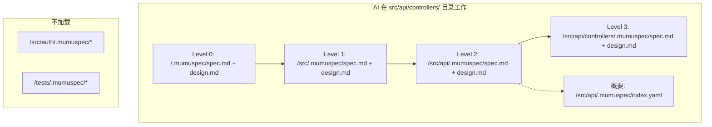
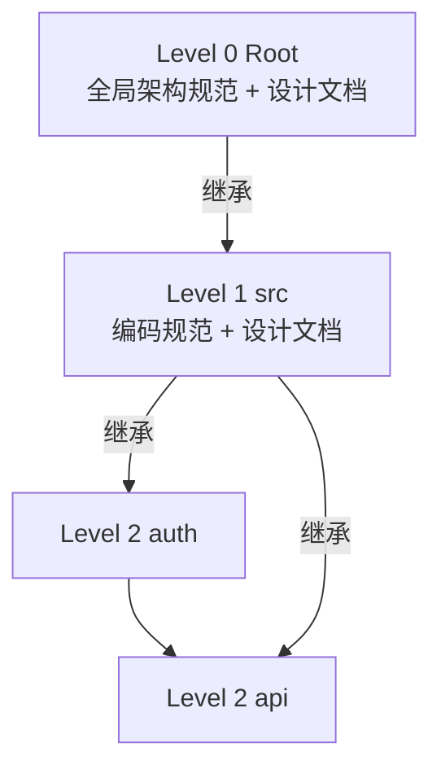

# Spec Layer — 树状分布的双向约束规范

> 层级: Level 1 设计文档 | 所属层: Spec Layer

---

## 1. 核心设计：正向 + 反向并重

每个规范单元包含两类硬性约束：

```yaml
## Requirement: API 响应格式

### SHALL (正向要求 — 必须做到)
- 所有 API 响应必须使用统一信封格式 `{ code, message, data }`
- 分页接口必须返回 `total`、`page`、`pageSize` 字段

### SHALL NOT (反向禁止 — 绝不能做)
- 禁止在 API 响应中直接返回数据库实体对象（必须经过 DTO 转换）
- 禁止使用 HTTP 状态码 200 表示业务错误

### Enforcement (可执行校验)
- SHALL-1: lint 规则 `enforce-response-envelope` 检查所有 Controller 返回类型
- SHALL_NOT-1: lint 规则 `no-raw-entity-return` 检查返回类型不含 `@Entity` 注解类
```

**禁止项优先级**：SHALL NOT 优先于 SHALL。冲突时以 SHALL NOT 为准。

## 2. Ponytail 基础编码约束

> 来源: [Ponytail](https://github.com/DietrichGebert/ponytail) — 懒惰高级开发者编码约束

MumuSpec 将 Ponytail 的 7 级优先级阶梯作为**基础编码约束**，自动注入到根层 `spec.md`，适用于所有代码层级。这些约束与项目自定义的 SHALL/SHALL NOT 并行生效。

### 2.1 七级优先级阶梯（Ponytail Ladder）

编写任何代码前，必须按以下优先级顺序逐级检查：

| 级别 | 问题 | 行动 | 约束类型 |
|------|------|------|--------|
| 1 | 这段代码需要存在吗？ | **YAGNI** — 不需要则不写 | SHALL NOT |
| 2 | 代码库中已有实现吗？ | **复用** — 找到并使用已有代码 | SHALL |
| 3 | 标准库已经提供了吗？ | **使用标准库** — 不引入外部依赖 | SHALL |
| 4 | 平台原生特性支持吗？ | **使用平台特性** — 不引入 polyfill | SHALL |
| 5 | 已安装的依赖能做吗？ | **使用已有依赖** — 不引入新依赖 | SHALL |
| 6 | 能一行写完吗？ | **一行代码** — 不过度抽象 | SHOULD |
| 7 | 以上都不满足 | **最小可工作代码** — 仅写必要的 | SHALL |

### 2.2 硬性编码约束

以下约束自动注入根层 spec.md，作为 Ponytail 集成的一部分：

```yaml
## Requirement: Ponytail 基础编码约束

### SHALL NOT
- 禁止引入未被请求的抽象层（YAGNI）
- 禁止在标准库/平台特性已满足需求时引入新依赖
- 禁止生成未被请求的样板代码（boilerplate）
- 禁止用复杂方案替代简单方案（boring over clever）

### SHALL
- 编写新代码前必须检查代码库中是否已有可复用的实现
- 新代码必须是最小可工作实现（仅写必要的代码）
- 有意简化必须用 `ponytail:` 注释标记原因

### SHOULD
- 优先删除而非新增代码（deletion over addition）
- 理解问题后再写代码，而非边写边理解
- 对复杂请求提出质疑而非盲目实现
```

### 2.3 不可懒惰的领域

Ponytail 的"懒惰"原则不适用于以下领域，这些领域必须**严谨而非偷懒**：

| 领域 | 原因 |
|------|------|
| 问题理解 | 理解错误导致全盘皆错 |
| 输入验证 | 安全漏洞入口 |
| 错误处理 | 影响系统稳定性 |
| 安全性 | 不可妥协 |
| 可访问性（a11y） | 用户体验底线 |
| 校准与测试 | 正确性保障 |
| 明确请求的功能 | 用户需求不可省略 |

### 2.4 与项目自定义约束的关系

| 维度 | Ponytail 基础约束 | 项目自定义约束 |
|------|-----------------|--------------|
| **来源** | MumuSpec 内置 | 项目 spec.md 手写 |
| **层级** | 根层（Level 0）自动注入 | 各层级手写 |
| **优先级** | 基础约束，可被收紧不可被放宽 | 可在 Ponytail 基础上增加更严格的约束 |
| **可关闭** | `config.yaml: ponytail.enabled: false` | 不可关闭 |
| **漂移检测** | 纳入漂移检测 | 纳入漂移检测 |

> **继承规则**：Ponytail 约束遵循规范继承规则——子层可收紧但不可放宽。子层的 SHALL NOT 累加到父层。

### 2.5 `ponytail:` 注释标记

有意简化的代码必须用 `ponytail:` 注释标记原因，便于后续维护者理解：

```typescript
// ponytail: 使用简单对象替代类，当前仅 2 个方法，无需 OOP 抽象
const authClient = {
  login: (credentials) => { /* ... */ },
  logout: () => { /* ... */ },
};

// ponytail: 硬编码 3 次重试，业务场景固定，无需配置化
const MAX_RETRIES = 3;
```

---

## 3. 树状目录结构 — 渐进式披露

规范按项目目录结构分层存放。**每个目录的 `.mumuspec/` 包含该目录及其直接子目录的规范概要**。

```
my-project/
├── .mumuspec/                          # 根层规范 (Level 0)
│   ├── spec.md                         # 全局架构规范 + 正向/反向约束
│   ├── design.md                       # 根层设计文档（架构决策、技术选型）
│   ├── prohibitions.md                 # 全局禁止清单（汇总）
│   ├── config.yaml                     # MumuSpec 配置
│   ├── index.yaml                      # 规范索引（指向各子层）
│   └── contracts/                      # 契约层（见 contract-layer.md）
│
├── src/
│   ├── .mumuspec/                      # src 层规范 (Level 1)
│   │   ├── spec.md + design.md + prohibitions.md + index.yaml
│   ├── auth/
│   │   └── .mumuspec/                  # auth 模块规范 (Level 2)
│   ├── api/
│   │   ├── .mumuspec/                  # api 层规范 (Level 2)
│   │   └── controllers/
│   │       └── .mumuspec/              # controllers 层规范 (Level 3)
│   └── lib/
│       └── .mumuspec/                  # lib 模块规范 (Level 2)
└── tests/
    └── .mumuspec/                      # 测试规范 (Level 1)
```

> 完整目录结构见 [附录：目录结构](../appendix/directory-structure.md)。

## 4. 渐进式披露加载策略

当 AI 从某个目录切入工作时，**只加载三层规范 + 设计文档**：



`index.yaml` 记录直接子目录的规范概要，AI 通过索引决定是否深入加载某子目录。

## 5. 规范文件格式

### 5.1 `spec.md` — 规范定义文件

```yaml
---
layer: 2
scope: "src/api"
last_updated: "2026-07-09"
---
## Requirement: RESTful 路由
### SHALL
- 所有端点必须遵循 RESTful 命名规范
### SHALL NOT
- 禁止在 URL 中使用动词
### Enforcement
- SHALL-1: lint `restful-naming`
```

### 5.2 `prohibitions.md` — 禁止清单汇总

汇总本层及子模块所有 SHALL NOT，供 AI 快速加载。包含全局禁止（适用所有子目录）和模块级禁止（仅适用特定子目录）。

### 5.3 `design.md` — 目录级设计文档

记录本层的设计决策、架构原理和上下文。回答"为什么这样设计"，与 `spec.md`（定义"做什么/不能做什么"）互补。

| 维度 | `spec.md` | `design.md` |
|------|-----------|-------------|
| 回答的问题 | 做什么 / 不能做什么 | 为什么这样设计 |
| 约束类型 | 硬性约束（SHALL / SHALL NOT） | 设计决策与原理（软性指导） |
| 可执行校验 | 有 Enforcement 检查 | 无直接校验，但影响 spec 生成 |

**维护规则**：
1. 每个有 `spec.md` 的目录**必须**同时维护 `design.md`
2. 变更的 Design 阶段产出更新对应层级 `design.md`
3. `design.md` 纳入漂移检测

## 6. 规范层级关系与继承



**继承规则**：
1. 子层自动继承父层的所有 SHALL 和 SHALL NOT
2. 子层可以收紧父层约束，**但不能放宽**
3. 子层的 SHALL NOT 累加到父层（不覆盖）
4. Enforcement 随 SHALL/SHALL NOT 一并继承，子层可重定义 check 方式但不可降低 severity
5. `design.md` 随规范层级一同继承

### 边界条件

#### 并发操作

| 场景 | 处理策略 |
|------|----------|
| 多人同时编辑同一层 spec.md | 单一活跃变更约束自然序列化；若 Git 合并冲突，CI 阻断并报告冲突 |
| AI 与用户同时操作 .mumuspec.yaml | 文件级锁（`.mumuspec/.lock`），AI 操作前检查锁状态 |
| 并行 CI 触发 | 仅第一个 CI 运行全量检查，后续 CI 检查锁文件并跳过或排队 |

#### 超深目录

| 目录深度 | 处理策略 |
|---------|----------|
| ≤ max_layer_depth (默认 5) | 正常加载 |
| > max_layer_depth | 深层目录共享父层规范，不创建独立 .mumuspec/ |
| 超深目录告警 | `mumuspec validate` 报告 WARN: "目录深度 X 超过 max_layer_depth" |

#### 空项目

| 场景 | 处理策略 |
|------|----------|
| `mumuspec init` 在空目录执行 | 创建最小 .mumuspec/ 结构（spec.md + design.md + config.yaml） |
| 无代码文件的项目 | 图谱功能跳过，规范校验仅检查格式 |
| 无 src/ 目录的项目 | 根层规范直接管理，不创建子层 |

## 7. 文档生成引擎

MumuSpec 根据各目录下的 `spec.md` + `design.md` 自动生成对外文档，确保文档与内部规范一致。

### 文档类型

| 文档类型 | 目标读者 | 数据来源 | 输出目录 |
|---------|---------|---------|---------|
| 技术文档 | 开发者、架构师 | spec.md + design.md | `docs/technical/` |
| 业务文档 | 产品经理、业务方 | spec.md + design.md | `docs/business/` |
| 集成指南 | 外部集成方 | `contracts/outbound/` | `docs/integration/` |
| 外部依赖文档 | 开发者、运维 | `contracts/external/` | `docs/dependencies/` |

### 上下文聚合

生成某层文档时，聚合从根到目标层的所有规范上下文：
- **技术文档**：聚合所有 `spec.md` 的 SHALL + `design.md` 的 Design Decisions
- **业务文档**：聚合 Requirement 描述 + Architecture Overview
- 不加载兄弟模块规范（避免上下文过载）

### 模板系统

模板定义如何从 spec + design 提取信息并组织为文档：
- 项目自定义模板：`.mumuspec/templates/`
- 内置默认模板：`@mumuspec/templates/`
- 可通过 npm 包分发共享

### 与变更生命周期集成

| 阶段 | 文档生成动作 |
|------|------------|
| Design | 更新 design.md 后，标记受影响文档为 stale |
| Build | 实现完成后，自动重新生成受影响文档 |
| Verify | 校验生成文档与 spec/design 的一致性 |
| Archive | 将最终文档提交到主分支 |

> 完整配置项见 [参考：配置文件](../reference/configuration.md)。

---

> **导航**: [返回概览](../overview.md) | [契约层 →](contract-layer.md)
