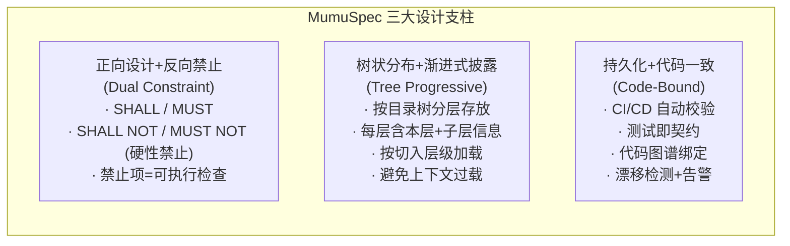
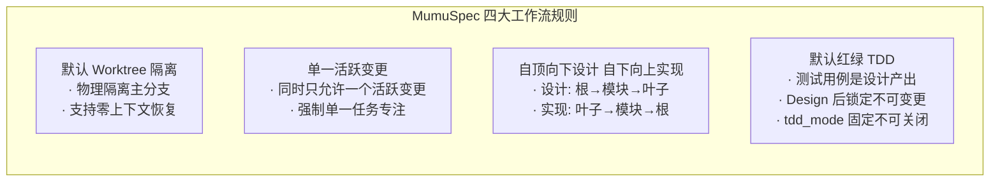
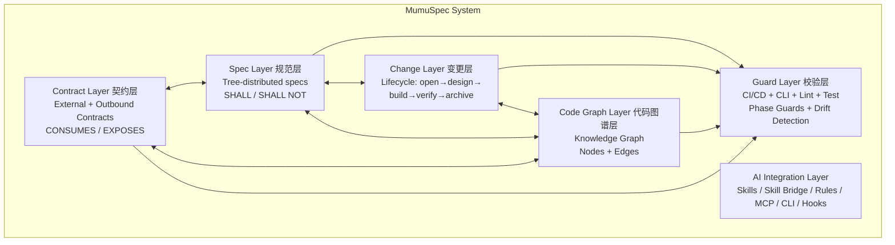

# MumuSpec — 全局概览

> **版本**: 0.8.0-draft | **日期**: 2026-07-09 | **状态**: 设计草案

---

## 1. 问题陈述

当前 AI 编程辅助工具面临四大核心挑战：

1. **规范缺失或单向**：只有正向要求（"做什么"），缺少反向禁止（"绝不能做什么"），AI 在边界场景失控；或笼统全量加载 `.cursorrules`，造成上下文过载。
2. **规范与代码脱节**：规范写完即过时，无法自动校验代码是否遵守，沦为"摆设文档"。
3. **缺乏代码结构感知**：AI 在大型代码库中"盲人摸象"，不理解模块间依赖关系，容易做出破坏性修改。
4. **服务契约断裂**：外部服务接口契约散落在 wiki、口头约定中，AI 编写 RPC 调用时无从获知超时策略、重试规则；自身对外接口也缺乏正式声明，变更时无法检测向后兼容性破坏。

## 2. 三大设计支柱

## 3. 四大工作流规则

> 以上四条规则是硬性流程约束，贯穿变更生命周期的所有阶段。详见 [变更层设计](design/change-layer.md)。

## 4. 总体架构

| 层 | 职责 | 详细文档 |
|----|------|---------|
| **Spec Layer** | 树状分布的双向约束规范，按目录结构分层存放 | [设计](design/spec-layer.md) |
| **Contract Layer** | 外部服务契约 + 自身对外契约，自动派生约束 | [设计](design/contract-layer.md) |
| **Change Layer** | 变更驱动的规范生命周期管理 | [设计](design/change-layer.md) |
| **Code Graph Layer** | 代码结构索引，为规范提供代码事实基础 | [设计](design/code-graph-layer.md) |
| **Guard Layer** | 自动化校验规范与代码一致性 | [设计](design/guard-layer.md) |
| **AI Integration Layer** | 与 AI 编程工具的集成接口，兼容外部 Skill 生态 | [设计](design/ai-integration.md) |

## 5. 参考项目借鉴

| 项目 | 核心价值 | 借鉴点 |
|------|---------|--------|
| **OpenSpec** | 变更驱动的规范生命周期 | delta spec 语义合并、变更工件流水线 |
| **Comet** | OpenSpec + Superpowers 双星工作流 | 五阶段状态机、phase guard、hotfix/tweak 预设 |
| **codebase-memory / GitNexus** | 代码知识图谱 | 图谱 schema、search/trace/impact 工具 |
| **context-engineering** | 上下文分层策略 | 渐进式披露原则、反模式避免 |

> 详细对比见 [附录：与参考项目对比](appendix/comparison.md)。

## 6. 版本演进

| 版本 | 核心变更 |
|------|---------|
| 0.2.0 | 三条工作流规则：worktree 隔离、单一活跃变更、自顶向下设计 + 自下向上实现 |
| 0.3.0 | 状态机管理变更阶段，支持回退；Archive 增加 git 提交与合并请求 |
| 0.4.0 | 外部 Skill 生态兼容层 |
| 0.4.1 | 流程连贯性修复（状态机路径补全、回退计数修正、Phase Guard 补强） |
| 0.5.0 | 目录级设计文档（design.md）+ 文档生成引擎 |
| 0.6.0 | 红绿 TDD 开发规则 + 测试不可变性约束 |
| 0.7.0 | Hyperplan 对抗式规划 Skill + Skill 矩阵 + 决策记录（decisions.md） |
| 0.8.0 | Contract Layer 契约层（外部服务契约 + 自身对外契约 + 漂移检测） |

## 7. 实施路线图概要

| Phase | 目标 | 关键产出 |
|-------|------|---------|
| Phase 1 | 核心规范引擎 (MVP) | 树状规范 + 双向约束 + 基础 CLI |
| Phase 2 | 变更生命周期 | 五阶段状态机 + 回退机制 + TDD + Skill 生态 |
| Phase 3 | 代码图谱集成 | 知识图谱 + 规范-代码绑定 + 契约图谱 |
| Phase 4 | CI/CD 与自动化 | 全链路校验 + 漂移检测 + 文档生成 |
| Phase 5 | 生态与分发 | npm 包 + 多平台 Skill + 模板库 |

> 详细路线图见 [附录：实施路线图](appendix/roadmap.md)。

## 8. 开放问题

1. 多语言 AST 解析差异如何抽象？
2. 规范继承冲突如何自动检测？
3. 大型代码库（10万+ 文件）图谱性能？
4. 契约与外部服务的自动同步策略？
5. 契约约束与手写规范的冲突解决？
6. 契约的跨项目共享机制？

> 完整开放问题见 [附录：开放问题](appendix/open-questions.md)。

---

## 文档导航

| 层级 | 文档 | 适合读者 |
|------|------|---------|
| **Level 0** | 本文档（全局概览） | 所有人 |
| **Level 1** | [规范层](design/spec-layer.md) · [契约层](design/contract-layer.md) · [变更层](design/change-layer.md) · [代码图谱层](design/code-graph-layer.md) · [校验层](design/guard-layer.md) · [AI 集成层](design/ai-integration.md) | 实现者、使用者 |
| **Level 2** | [CLI 命令](reference/cli-commands.md) · [MCP 工具](reference/mcp-tools.md) · [配置](reference/configuration.md) · [Phase Guard](reference/phase-guards.md) · [漂移检测](reference/drift-detection.md) · [Skill 生态](reference/skill-ecosystem.md) | 操作者、CI 配置 |
| **Level 3** | [目录结构](appendix/directory-structure.md) · [对比](appendix/comparison.md) · [路线图](appendix/roadmap.md) · [开放问题](appendix/open-questions.md) | 深入了解者 |
