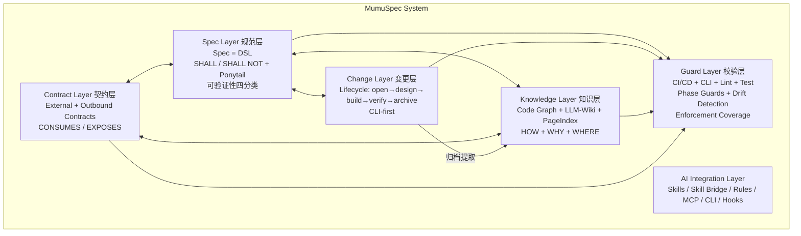
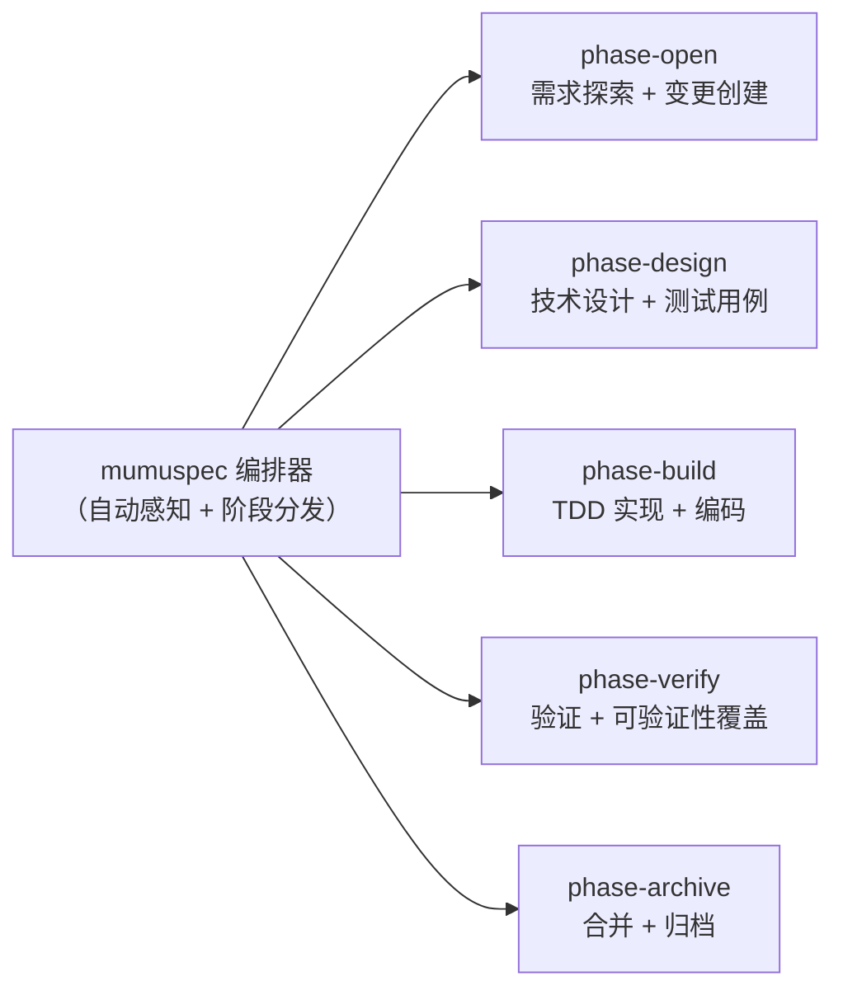

# MumuSpec — 全局概览

> **版本**: 0.20.0-draft | **日期**: 2026-09-06 | **状态**: 设计草案
>
> **定位**: MumuSpec 是一门面向 Vibe Coding 的领域特定语言（DSL）。详见 [KP-0059](../.mumuspec/knowledge/decisions/global/KP-0059-spec-as-dsl-not-bytecode.md)。

---

## 0. 核心目标

**MumuSpec 的核心目标是创建自然语言的中间层作为 Vibe Coding 的辅助——大模型起草精准 Spec，人做设计决策与审批签收，AI 根据 Spec 生成代码。人不逐字编写 Spec 全文，也不编写代码。**

```
随意的自然语言  →  大模型起草精准 Spec  ⇄  设计缺陷时向人追问补全  →  大模型判定设计完备性（人签收）  →  代码（AI 生成）
```

### Spec 即 DSL

MumuSpec 的持久化 Spec 不是文档，不是配置，而是一门**领域特定语言**（详见 [KP-0059](../.mumuspec/knowledge/decisions/global/KP-0059-spec-as-dsl-not-bytecode.md)）：

| DSL 层面 | MumuSpec 对应物 |
|----------|----------------|
| **语法面** | `## Requirement:` 块结构、`### SHALL/SHALL NOT/SHOULD/Enforcement` 节、`manual(原因)` 保留字、frontmatter annotation、constraints.yaml 条目 schema、树状继承（子层可收紧不可放宽） |
| **语义面** | 极性（shall / shall-not）× 维度（TD / RG）× 强度（high / medium / low）× 可验证性四分类（enforced-strong / enforced-weak / manual / unverifiable） |
| **诊断面** | `E-SPEC-*` 错误码即编译诊断（E-SPEC-015 = "红线约束未声明验证方式"≈ 类型错误） |
| **链接器与加载器** | 渐进披露（context ≤3 层）是加载策略，GOVERNED_BY 绑定与 drift 检测是链接期检查 |

### 核心原则

> **为目标增加限制，但不限制过程。** — CHG-5

- Spec 只约束 WHAT（验收标准、红线），不约束 HOW（执行路径）
- 结果约束 block，行为约束 advisory
- Spec 是一等源文件（人机合著），代码是衍生品；设计决策权始终在人
- 可验证性是一等语义：不可验证的约束等于不存在的约束

### 为什么是 DSL 而不是字节码

早期分析曾以"自然语言字节码"作为类比（见 `review/nl-bytecode-gap-analysis-2026-08-29.md`）。用户在 2026-08-29 裁决修正为 DSL 定位（KP-0059）：

- **保留**：加载时 verifier（不通过则拒绝）、平台无关（MCP + rules 生成 + context）、不约束执行路径
- **放弃**：字节码式"中间表示"定位——Spec 不是从上游需求编译来、向下游代码编译去的中介产物，而是**作者直接书写的一等语言**

---

## 0.1 目标用户

### 画像 1: 独立开发者 Alex

- **角色**: 全栈开发者，独立维护 1-2 个中型项目
- **场景**: 使用 AI 编程工具（Claude Code / Cursor / CatPaw）加速开发
- **痛点**: AI 不了解项目规范，经常生成不符合架构约束的代码；自己又不想花时间审查每一行代码
- **目标**: **用自然语言表达需求与约束，让 AI 起草 Spec 并生成代码，人只做设计决策与审批签收**
- **使用路径**: `mumuspec init` → 编写 Spec → AI 加载 Spec → AI 生成代码 → 自动校验

### 画像 2: Tech Lead Jordan

- **角色**: 技术负责人，管理 5-10 人团队
- **场景**: 团队使用多种 AI 工具，代码质量参差不齐
- **痛点**: 架构规范写在 wiki 中无人遵守，AI 修改代码时无感知
- **目标**: 用 MumuSpec 统一 Spec 管理 + CI 自动校验
- **使用路径**: Spec 分层设计 → CI 集成 → Phase Guard 强制 → 决策审计

### 画像 3: AI 工具贡献者 Sam

- **角色**: AI 编程工具生态开发者
- **场景**: 开发新的 AI Skill 或 MCP 工具
- **痛点**: 缺乏标准化的规范接口
- **目标**: 通过 MumuSpec 的 Skill Bridge 和 MCP Server 集成
- **使用路径**: Skill 适配 → MCP 工具开发 → Spec-代码绑定

---

## 1. 问题陈述

当前 AI 编程辅助工具面临五大核心挑战：

1. **规范缺失或单向**：只有正向要求（"做什么"），缺少反向禁止（"绝不能做什么"），AI 在边界场景失控；或笼统全量加载 `.cursorrules`，造成上下文过载。

2. **规范与代码脱节**：规范写完即过时，无法自动校验代码是否遵守，沦为"摆设文档"。MumuSpec 通过 **Spec 即 DSL + verifier** 解决：不可验证的约束直接 block。

3. **设计知识失忆**：AI 在大型代码库中"盲人摸象"，设计决策和认知成果是变更级的，归档后即丢失。MumuSpec 通过 **Knowledge Layer**（WHY + HOW + WHERE）持久化设计知识。

4. **服务契约断裂**：外部服务接口契约散落在 wiki、口头约定中，AI 编写 RPC 调用时无从获知超时策略、重试规则。

5. **过程约束过重**：主流方案（Spec Kit / Kiro）用过程门禁和阶段审批保正确性，spec 是一次性工件。MumuSpec 的 **CHG-5 原则**把过程约束降为 advisory，只保留结果约束 block——为目标增加限制，不限制过程。

## 1.1 非目标（Non-Goals）

以下功能明确不在 MumuSpec 当前范围内：

| 非目标 | 原因 |
|--------|------|
| **多项目规范同步** | 当前聚焦单项目，跨项目共享留给后续生态层 |
| **IDE 原生插件** | 通过 MCP Server + CLI 覆盖 IDE 集成需求 |
| **可视化编辑器** | Spec 文件为 YAML + Markdown，无需专用编辑器 |
| **规范自动生成**（从代码逆向生成 spec） | Spec 是设计意图的一等源文件，代码是衍生品；自动生成导致循环依赖 |
| **强制代码风格检查** | 由项目现有 ESLint/Prettier 负责 |
| **过程编排** | 过程约束降为 advisory，不限制 AI 的执行路径 |

## 1.2 设计假设

| 编号 | 假设 | 若假设不成立 | 降级方案 |
|------|------|-------------|---------|
| A-01 | 项目使用 Git 进行版本控制 | MumuSpec 无法管理变更历史 | 无降级（硬性依赖） |
| A-02 | 项目主语言被 tree-sitter 支持 | 图谱功能降级为文件级索引 | 详见设计文档 |
| A-03 | 单一活跃变更约束可被接受（per-scope） | 需引入变更队列机制 | 关闭约束，允许 N 个并行变更 |
| A-04 | AI 工具支持 MCP 协议或 Rules 文件 | 需开发平台特定适配器 | Rules 文件作为最低兼容层 |
| A-05 | Spec 编写者愿意写 SHALL/SHALL NOT | DSL 语法需要学习成本 | 提供模板、示例、`mumuspec spec annotate` 辅助 |

---

## 2. 设计支柱

### 2.1 Spec 即一等源文件（Spec-as-Source）

Spec 不是文档、不是配置，是作者（人与大模型合著）直接书写的领域特定语言。语法面、语义面、诊断面三件套构成完整的语言系统。可读性、可写性与诊断质量是语言设计的一等约束。

### 2.2 双向约束（Dual Constraint）

通过 SHALL（必须做）与 SHALL NOT（绝不能做）两套规范树，定义 AI 工作的正负边界。每条约束声明其验证方式（Enforcement 条目），**不可验证的约束等于不存在的约束**（0.20 E-SPEC-015 恒 block）。

### 2.3 树状分布 + 渐进式披露（Tree Progressive）

Spec 按项目目录树分层存放，子层自动继承父层约束（可收紧、不可放宽）。AI 只加载当前工作目录的规范链，而非全量加载，显著降低 token 消耗。冲突时高层级优先。

### 2.4 持久化 + 代码绑定（Code-Bound）

Spec 存储在 `.mumuspec/` 下，版本化管理，不随代码删除而消失。CI/CD 自动校验代码与规范的一致性，漂移检测覆盖 spec、graph、contract、knowledge 等维度。Phase Guard 在每次阶段转换时强制执行阶段守卫检查。

### 2.5 双维度动态约束强度（Dynamic Constraint Strength）

沿"技术设计 HOW"与"需求目标 WHAT"两条独立轴线组织约束，每轴线独立配置强度：high（block）/ medium（warn）/ low（info）。工作流规则按强度等级渐进式调整。

### 2.6 可验证性一等化（0.20 P0）

每条约束按固定顺序判定为四分类之一（enforced-strong / enforced-weak / manual / unverifiable）。SHALL NOT 无验证通道恒 block（E-SPEC-015）；可验证性与强度正交。详见 `docs/design/constraint-strength.md` §9.0。

### 2.7 规则-实现分离（KP-0060）

引擎归代码（固定部分由代码实现）、规则归 LLM（仅创建声明式规则）、校验归代码（非法规则拒绝执行）。CLI-first 是其在流程层的特例。

---

## 3. 工作流规则

| # | 规则 | 含义 |
|---|------|------|
| 1 | **Worktree 隔离** | 每个变更在独立 worktree 中工作（配置级推荐，自动 worktree 操作在开发中） |
| 2 | **单一活跃变更** | 同时只允许一个活跃变更（per-scope），强制单一任务专注 |
| 3 | **自顶向下设计，自底向上实现** | 设计从根到叶逐级细化，实现从叶到根逐级集成 |
| 4 | **红绿 TDD** | 测试用例是 Design 阶段的产出，Design 锁定后测试不可变更 |

> 规则 1–4 随约束强度等级动态调整：high 强制执行、medium 推荐 + 可降级、low 关闭。团队可通过 `.mumuspec/config.yaml` 显式覆盖。

> 四大规则贯穿变更生命周期的所有阶段，详见 [变更层设计](design/change-layer.md)。

---

## 4. 总体架构



| 层 | 职责 | 详细文档 |
|----|------|---------|
| **Spec Layer** | 树状分布的双向约束 Spec（DSL）+ Ponytail 编码约束 | [设计](design/spec-layer.md) |
| **Contract Layer** | 外部服务契约 + 自身对外契约，自动派生约束 | [设计](design/contract-layer.md) |
| **Change Layer** | 变更驱动的 Spec 生命周期管理（CLI-first） | [设计](design/change-layer.md) |
| **Knowledge Layer** | 持久化知识来源：代码图谱 + LLM-Wiki + PageIndex | [设计](design/knowledge-layer.md) |
| **Guard Layer** | 自动化校验 Spec 与代码一致性 + 可验证性覆盖 | [设计](design/guard-layer.md) |
| **AI Integration Layer** | 与 AI 编程工具的集成接口，兼容外部 Skill 生态 | [设计](design/ai-integration.md) |

---

## 5. AI 工作流编排（Skill 驱动 + CLI-first）

MumuSpec 采用编排器-阶段 Skill 驱动模式：



### CLI-first 原则

确定性工作流步骤（阶段转换、guard 校验、hash 锁定、决策登记、套件锁定、layer 状态）必须通过 CLI 命令执行。LLM 只承担复杂决策域：需求澄清、设计创作、对抗审查、偏差接受建议。

详见根 spec.md「流程执行载体（CLI-first）」块与 `review/pipeline-cli-first-analysis-2026-08-29.md`。

---

## 6. 参考项目借鉴

| 项目 | 核心价值 | 借鉴点 |
|------|---------|--------|
| **OpenSpec** | 变更驱动的规范生命周期 | delta spec 语义合并、变更工件流水线 |
| **Comet** | 五阶段状态机、phase guard | hotfix/tweak 预设 |
| **Kiro (AWS)** | EARS 半形式化句式 | `WHEN <trigger> THE SYSTEM SHALL <response>` 可提取验证 |
| **codebase-memory / GitNexus** | 代码知识图谱 | 图谱 schema、search/trace/impact 工具 |
| **Ponytail** | 懒惰高级开发者编码约束 | 7 级优先级阶梯 |

> 详细对比见 [附录：与参考项目对比](appendix/comparison.md) 与 `review/nl-bytecode-gap-analysis-2026-08-29.md`。

---

## 7. 版本演进

| 版本 | 日期 | 核心变更 |
|------|------|---------|
| 0.20.0-dev | 2026-09-05 | 全流程自洽性修复批次：Dogfood canonical AGENTS.md 迁移、CHG-7 项目级 workflow.yaml override、CLI 去重（drift --change / knowledge search）、SKILL.md 开放标准对齐、规则-实现分离（KP-0060） |
| 0.20.0-dev | 2026-08-29 | Spec 即 DSL 定位（KP-0059）；Verifier 语义收紧 P0（可验证性四分类、E-SPEC-015、enforcement coverage）；CLI-first 三命令（tasks next / lock-suite / state layer） |
| 0.19.1 | 2026-08-22 | 安全加固、spec annotate、错误码自动生成 |
| 0.15.0 | 2026-08-01 | Mode-aware Guard、Spec Scaffolder、Git 封装、Dashboard、Init/Archive 重构 |
| 0.13.0 | 2026-07-15 | Bundle-based Skill 系统、Env Detector、Init Generator |
| 0.12.0 | 2026-07-27 | 动态约束强度系统 |
| 0.10.0 | 2026-07-10 | 初始 MVP：六层架构 |

---

## 8. 实施路线图概要

| Phase | 目标 | 关键产出 |
|-------|------|---------|
| Phase 1 | 核心规范引擎 (MVP) | 树状 Spec + 双向约束 + CLI |
| Phase 2 | 变更生命周期 | 五阶段状态机 + TDD + 认知框架 + Ponytail |
| Phase 3 | 知识层集成 | 代码图谱 + Spec-代码绑定 + 契约层 + LLM-Wiki |
| Phase 4 | CI/CD 与自动化 | 全链路校验 + 漂移检测 + 知识提取 + 文档生成 |
| Phase 5 | 生态与分发 | npm 包 + 多平台 Skill + 模板库 |

> 详细进度见 [STATUS.md](./STATUS.md)。

---

## 9. 开放问题

1. 统一 DSL 语言规范（P1）：grammar + semantics + diagnostics 三件套的形式化定义
2. 过程层出清：15 个不可校验的过程性阻塞点移出强制面
3. 按 target 的 JIT 式加载：代码图谱绑定变成 context 主入口
4. 反向通道升一等公民：spec target 变了但代码未动 → 漂移检测
5. `mumuspec capability` 命令实现（或从 spec 降级删除）
6. `mumuspec next` 结构化编排命令（"我现在该做什么"的统一入口）
7. 多语言 AST 解析差异如何抽象？
8. 知识新鲜度的自动化验证策略？

> 完整开放问题见 [附录：开放问题](appendix/open-questions.md) 与各 `review/*.md` 分析文档。

---

## 文档导航

| 层级 | 文档 | 适合读者 |
|------|------|---------|
| **Level 0** | 本文档（全局概览） · [STATUS.md](./STATUS.md)（进度权威来源） | 所有人 |
| **Level 1** | [规范层](design/spec-layer.md) · [约束强度](design/constraint-strength.md) · [变更层](design/change-layer.md) · [契约层](design/contract-layer.md) · [知识层](design/knowledge-layer.md) · [校验层](design/guard-layer.md) · [AI 集成层](design/ai-integration.md) | 实现者、使用者 |
| **Level 2** | [CLI 命令](reference/cli-commands.md) · [MCP 工具](reference/mcp-tools.md) · [配置](reference/configuration.md) · [Phase Guard](reference/phase-guards.md) · [漂移检测](reference/drift-detection.md) · [认知框架](reference/cognitive-framework.md) · [Skill 生态](reference/skill-ecosystem.md) · [错误码](reference/error-codes.md) · [打包与部署](reference/packaging-deployment.md) · [发布策略](reference/release-strategy.md) · [反馈流程](reference/feedback-process.md) · [术语表](reference/glossary.md) | 操作者、CI 配置 |
| **Level 3** | [附录](appendix/) · 各 `review/*.md` 分析报告 | 深入了解者 |
