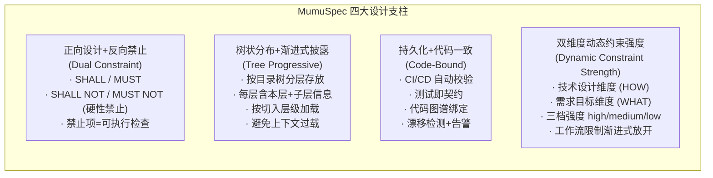
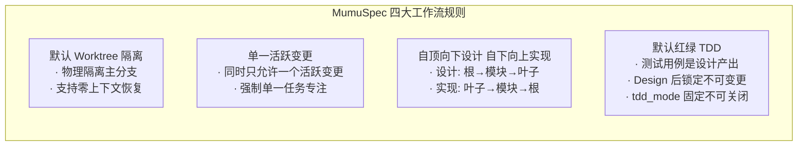
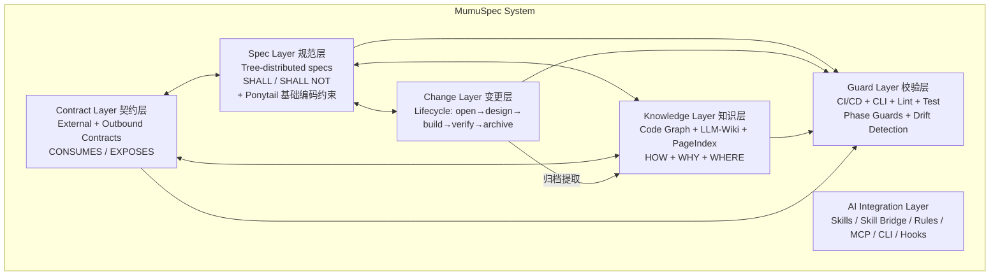

# MumuSpec — 全局概览

> **版本**: 0.12.1-draft | **日期**: 2026-07-27 | **状态**: 设计草案

---

## 0. 核心目标

MumuSpec 的核心目标是**创建独立于代码的、基于"技术设计 + 需求目标"两个维度的持久化正反向约束指导 agent 的工作**。

- **持久化** — 约束定义存储在 `.mumuspec/` 下，版本化管理，不随代码删除而消失
- **独立于代码** — 约束描述"agent 应做 / 不应做"的行为准则，不引用具体代码路径
- **双维度** — 沿"技术设计 (HOW)"与"需求目标 (WHAT)"两条独立轴线组织
- **正反向并重** — 正向 SHALL 指明必达目标，反向 SHALL NOT 划定不可逾越红线
- **树状分层** — 约束按目录树分层存放，底层级受高层级约束，冲突时以高层级为准（0.12.1+）
- **动态可调** — 三档强度（high / medium / low）按团队成熟度、项目阶段、变更类型动态切换

详见 [动态约束强度系统设计](design/constraint-strength.md)。

---

## 0.1 目标用户

### 画像 1: 独立开发者 Alex

- **角色**: 全栈开发者，独立维护 1-2 个中型项目
- **场景**: 使用 AI 编程工具（Claude Code / Cursor）加速开发
- **痛点**: AI 不了解项目规范，经常生成不符合架构约束的代码
- **目标**: 用 MumuSpec 约束 AI 行为，减少手动审查
- **使用路径**: `mumuspec init` → 编写规范 → AI 加载规范 → 自动校验

### 画像 2: Tech Lead Jordan

- **角色**: 技术负责人，管理 5-10 人团队
- **场景**: 团队使用多种 AI 工具，代码质量参差不齐
- **痛点**: 架构规范写在 wiki 中无人遵守，AI 修改代码时无感知
- **目标**: 用 MumuSpec 统一规范管理 + CI 自动校验
- **使用路径**: 规范分层设计 → CI 集成 → Phase Guard 强制 → 决策审计

### 画像 3: AI 工具贡献者 Sam

- **角色**: AI 编程工具生态开发者
- **场景**: 开发新的 AI Skill 或 MCP 工具
- **痛点**: 缺乏标准化的规范接口
- **目标**: 通过 MumuSpec 的 Skill Bridge 和 MCP Server 集成
- **使用路径**: Skill 适配 → MCP 工具开发 → 规范-代码绑定

---

## 1. 问题陈述

当前 AI 编程辅助工具面临五大核心挑战：

1. **规范缺失或单向**：只有正向要求（"做什么"），缺少反向禁止（"绝不能做什么"），AI 在边界场景失控；或笼统全量加载 `.cursorrules`，造成上下文过载。
2. **规范与代码脱节**：规范写完即过时，无法自动校验代码是否遵守，沦为"摆设文档"。
3. **代码结构不可知与设计知识失忆**：AI 在大型代码库中"盲人摸象"，不理解模块间依赖关系，容易做出破坏性修改；设计决策和认知成果是变更级的，归档后即丢失，每次新变更从零开始理解"为什么现有代码是这样设计的"；设计认知过程不系统，缺乏对已知信息、未知盲区的结构化梳理，导致设计决策基于不完整或不准确的信息地基。
4. **服务契约断裂**：外部服务接口契约散落在 wiki、口头约定中，AI 编写 RPC 调用时无从获知超时策略、重试规则；自身对外接口也缺乏正式声明，变更时无法检测向后兼容性破坏。
5. **编码约束缺失**：AI 生成的代码过度抽象、引入不必要的依赖、产生冗余样板代码，违背"懒惰的高级开发者"原则。

## 1.1 量化目标

| 维度 | 指标 | 目标值 | 度量方式 |
|------|------|--------|----------|
| **性能** | Pre-commit 检查耗时 | < 5s（1万文件）| `mumuspec check --benchmark` |
| **性能** | CI 全量校验耗时 | < 5min（10万文件）| CI pipeline 计时 |
| **性能** | Phase Guard 耗时 | < 30s | `mumuspec guard --timing` |
| **性能** | 规范加载 token 消耗 | 较全量加载减少 ≥ 60% | 对比渐进式披露 vs 全量加载的 token 数 |
| **质量** | 规范-代码漂移检出率 | 100%（ERROR 级） | CI 漂移检测报告 |
| **质量** | SHALL NOT 违规阻断率 | 100% | Pre-commit + CI 统计 |
| **效率** | 变更回退率（rollback/total） | < 20% | .mumuspec.yaml 统计 |
| **效率** | Design→Build 一次通过率 | ≥ 80% | Phase Guard 日志 |
| **采纳** | `mumuspec init` 成功率 | ≥ 95% | CLI 遥测（匿名） |
| **采纳** | 新项目首次变更完成时间 | < 30min（hotfix） | CLI 计时 |

## 1.2 非目标（Non-Goals）

以下功能明确不在 MumuSpec 当前范围内：

| 非目标 | 原因 | 未来可能 revisit 的版本 |
|--------|------|------------------------|
| **多项目规范同步** | 当前聚焦单项目规范管理，跨项目共享留给 Phase 5 生态层 | v1.0+ |
| **IDE 原生插件**（VS Code 扩展等） | 通过 MCP Server + CLI 覆盖 IDE 集成需求，原生插件投入产出比低 | v1.0+ |
| **可视化编辑器** | 规范文件为 YAML + Markdown，无需专用编辑器 | 不计划 |
| **规范自动生成**（从代码逆向生成 spec.md） | 规范是设计意图的表达，自动生成会导致"代码即规范"的循环依赖 | 不计划 |
| **多语言规范翻译** | 规范以项目主语言编写，AI 工具可自行翻译 | 不计划 |
| **实时协作编辑** | 单一活跃变更约束已序列化规范修改，无需实时协作 | 不计划 |
| **规范版本回滚**（rollback spec to historical version） | 规范变更通过 Git 版本控制管理，不额外实现 | 不计划 |
| **强制代码风格检查**（格式化、缩进等） | 由项目现有 ESLint/Prettier 负责，MumuSpec 聚焦架构约束 | 不计划 |

## 1.3 设计假设

| 编号 | 假设 | 影响范围 | 若假设不成立 | 降级方案 |
|------|------|---------|--------------|---------|
| A-01 | 项目使用 Git 进行版本控制 | 全局 | MumuSpec 无法管理变更历史 | 无降级(硬性依赖) |
| A-02 | 项目主语言被 tree-sitter 支持 | Knowledge Layer | 图谱功能降级为文件级索引 | 详见设计文档 |
| A-03 | 单一活跃变更约束可被团队接受 | Change Layer | 需引入变更队列机制 | 关闭约束,允许 N 个并行变更(上限 3),WARN 提示隔离性风险 |
| A-04 | AI 工具支持 MCP 协议或 Rules 文件 | AI Integration Layer | 需开发平台特定适配器 | 详见设计文档 |
| A-05 | 项目目录结构相对稳定（不频繁大重构） | Spec Layer | 规范层级需频繁重建 | 详见设计文档 |
| A-06 | 测试框架支持红绿 TDD 循环 | Change Layer | TDD 强制约束无法执行 | TDD 强制降级为可选(`tdd_enforced: false`),仅要求"测试存在但不强制红绿循环" |
| A-07 | CI 环境可运行 Node.js | Guard Layer | 需提供 Docker 镜像 | 详见设计文档 |
| A-08 | 团队接受 SHALL NOT 优先于 SHALL | 全局 | 优先级体系需重新设计 | 优先级体系可配置,允许团队设为"SHALL 优先"模式(`priority_mode: shall_first`) |

### 隐性假设

除上述显式假设外,MumuSpec 设计还隐含以下假设,现显式化并提供降级方案:

| 隐性假设 | 降级方案 |
|---------|---------|
| AI 工具支持 MCP | Rules 文件生成作为最低兼容层,所有 AI 工具可通过 Rules 文件使用 MumuSpec |
| 用户编写完整 SHALL NOT | 提供 SHALL NOT 模板与示例,lint 检测"SHALL NOT 无 Enforcement"时 WARN |
| 代码图谱对每个项目都需要 | 图谱后端可关闭(`knowledge.graph_backend: none`),仅用 Spec Layer |
| LLM-Wiki 提取有价值 | 增加知识价值评估指标(引用次数、冲突检出率),低价值知识自动标记 deprecated |

---

## 2. 四大设计支柱

### 设计哲学边界:内部强制、外部兼容

MumuSpec 遵循"内部强制、外部兼容"的设计哲学边界:

- **内部强制**: 对使用 MumuSpec 管理的项目,工作流规则、SHALL/SHALL NOT 约束、漂移检测按配置的约束强度等级强制执行
- **外部兼容**: 通过 Skill Bridge 与外部 Skill 生态(Superpowers/OpenSpec/Comet)互操作时,不强制外部 Skill 遵循 MumuSpec 工作流
- **强度可调**: 内部强制的程度从二值变为三档(high/medium/low),按双维度独立配置

详见 [Change Layer 设计哲学边界](./design/change-layer.md#设计哲学边界) 与 [动态约束强度系统设计](./design/constraint-strength.md)。

## 3. 四大工作流规则

> 以上四条规则均为**按约束强度等级求值的可配置约束**。在 `constraint_strength` 配置下,工作流规则按维度归属随强度等级渐进式放开:
> - `high` — 强制执行（block）
> - `medium` — 推荐执行（warn，允许降级）
> - `low` — 关闭（info）
>
> 团队仍可通过 `.mumuspec.yaml` 的 `workflow.*` 配置项显式覆盖强度等级（`inherit | true | false`）。详见 [Configuration 文档](./reference/configuration.md#workflow) 与 [动态约束强度系统](./design/constraint-strength.md#61-强度与工作流规则的关系)。

> 四大规则贯穿变更生命周期的所有阶段,详见 [变更层设计](design/change-layer.md)。

## 4. 总体架构

| 层 | 职责 | 详细文档 |
|----|------|---------|
| **Spec Layer** | 树状分布的双向约束规范 + Ponytail 基础编码约束，按目录结构分层存放 | [设计](design/spec-layer.md) |
| **Contract Layer** | 外部服务契约 + 自身对外契约，自动派生约束 | [设计](design/contract-layer.md) |
| **Change Layer** | 变更驱动的规范生命周期管理 | [设计](design/change-layer.md) |
| **Knowledge Layer** | 持久化知识来源：代码图谱（HOW）+ LLM-Wiki 设计知识（WHY）+ PageIndex 索引（WHERE） | [设计](design/knowledge-layer.md) |
| **Guard Layer** | 自动化校验规范与代码一致性 | [设计](design/guard-layer.md) |
| **AI Integration Layer** | 与 AI 编程工具的集成接口，兼容外部 Skill 生态 | [设计](design/ai-integration.md) |

## 5. 参考项目借鉴

| 项目 | 核心价值 | 借鉴点 |
|------|---------|--------|
| **OpenSpec** | 变更驱动的规范生命周期 | delta spec 语义合并、变更工件流水线 |
| **Comet** | OpenSpec + Superpowers 双星工作流 | 五阶段状态机、phase guard、hotfix/tweak 预设 |
| **codebase-memory / GitNexus** | 代码知识图谱 | 图谱 schema、search/trace/impact 工具 |
| **context-engineering** | 上下文分层策略 | 渐进式披露原则、反模式避免 |
| **Ponytail** | 懒惰高级开发者编码约束 | 7 级优先级阶梯（YAGNI→复用→标准库→平台特性→已有依赖→一行代码→最小实现），作为 MumuSpec 基础编码约束 |

> 详细对比见 [附录：与参考项目对比](appendix/comparison.md)。

## 6. 版本演进

| 版本 | 核心变更 |
|------|---------|
| 0.2.0 | 三条工作流规则：worktree 隔离、单一活跃变更、自顶向下设计 + 自下向上实现 |
| 0.3.0 | 状态机管理变更阶段，支持回退；Archive 增加 git 提交与合并请求 |
| 0.4.0 | 外部 Skill 生态兼容层 |
| 0.4.1 | 流程连贯性修复（状态机路径补全、回退计数修正、Phase Guard 补强） |
| 0.5.0 | 目录级设计文档（design.md）+ 文档生成引擎 |
| 0.6.0 | 红绿 TDD 开发规则 + 测试不可变性约束 |
| 0.7.0 | Hyperplan 对抗式规划 Skill + Skill 矩阵 + 决策记录（decisions.md） |
| 0.8.0 | Contract Layer 契约层（外部服务契约 + 自身对外契约 + 漂移检测）；认知框架（乔哈里窗变体 Q1-Q4）集成到 Design 阶段；设计文档重构为渐进式披露文档组 |
| 0.9.0 | Knowledge Layer 知识层（LLM-Wiki + PageIndex + 代码图谱集成）；全量审查修复 |
| 0.10.0 | 合并 Code Graph Layer 到 Knowledge Layer 作为持久化知识来源；引入 Ponytail 作为基础编码约束 |
| 0.11.0 | 2026-07-24 设计优化：Knowledge Layer 可插拔图谱后端、MVP 范围收敛、工作流规则可配置化、漂移检测分级、Skill Bridge 优先、AI 工具适配层、软假设降级方案、知识价值评估 |
| 0.12.0 | 2026-07-27 动态约束强度系统：双维度（技术设计 + 需求目标）+ 三档强度（high/medium/low）+ 持久化 constraints.yaml（独立于代码的正反向约束）+ 工作流限制渐进式放开 |
| 0.12.1 | 2026-07-27 constraints.yaml 树状层级化：按目录树分层存放与 spec.md 对齐；子层继承父层约束可收紧不可放宽；同 ID 冲突高层级优先；新增 `resolveConstraintTree()` 解析器与冲突审计 |

## 7. 实施路线图概要

| Phase | 目标 | 关键产出 |
|-------|------|---------|
| Phase 1 | 核心规范引擎 (MVP) | 树状规范 + 双向约束 + 基础 CLI |
| Phase 2 | 变更生命周期 | 五阶段状态机 + 回退机制 + TDD + Skill 生态 |
| Phase 3 | 知识层集成 | 代码图谱 + 规范-代码绑定 + 契约图谱 + LLM-Wiki + PageIndex |
| Phase 4 | CI/CD 与自动化 | 全链路校验 + 漂移检测（含知识漂移） + 知识提取 + 文档生成 |
| Phase 5 | 生态与分发 | npm 包 + 多平台 Skill + 模板库 |

> 详细路线图见 [附录：实施路线图](appendix/roadmap.md)。

## 7.1 MVP 范围

Phase 1 MVP SHALL 仅包含以下核心能力:

- **Spec Layer**: 树状规范 + SHALL/SHALL NOT + 渐进式披露(不含 Ponytail)
- **Change Layer**: 五阶段状态机 + 基础回退(不含 TDD 强制、不含认知框架)
- **Guard Layer**: Pre-commit SHALL NOT 检查 + 基础规范漂移(P0 级)
- **AI Integration**: Rules 文件生成(CLAUDE.md/.cursorrules) + AI 工具适配层

以下能力 SHALL 推迟到 Phase 2-3:
- Ponytail 编码约束(Phase 2)
- 认知框架 Q1-Q4(Phase 2,默认关闭,用户显式开启)
- TDD 强制与测试不可变性(Phase 2,可配置)
- Contract Layer(Phase 3)
- Hyperplan 对抗式规划(Phase 5)
- Skill Bridge 外部生态兼容(Phase 3)
- Knowledge Layer 代码图谱(Phase 3)
- LLM-Wiki 与 PageIndex(Phase 3)

新用户首次使用 MVP 时,30 分钟内可完成首个变更(hotfix 路径)。详细进度参见 [STATUS.md](./STATUS.md)。

## 8. 开放问题

1. 多语言 AST 解析差异如何抽象？
2. 规范继承冲突如何自动检测？
3. 大型代码库（10万+ 文件）图谱性能？
4. 契约与外部服务的自动同步策略？
5. 契约约束与手写规范的冲突解决？
6. 契约的跨项目共享机制？
7. 知识冲突的自动检测与解决？
8. 知识新鲜度的自动化验证策略？

> 完整开放问题见 [附录：开放问题](appendix/open-questions.md)。

---

## 文档导航

| 层级 | 文档 | 适合读者 |
|------|------|---------|
| **Level 0** | 本文档（全局概览） · [STATUS.md](./STATUS.md)（项目状态：设计完备性与实现进度权威来源） | 所有人 |
| **Level 1** | [规范层](design/spec-layer.md) · [契约层](design/contract-layer.md) · [变更层](design/change-layer.md) · [知识层](design/knowledge-layer.md) · [校验层](design/guard-layer.md) · [AI 集成层](design/ai-integration.md) | 实现者、使用者 |
| **Level 2** | [CLI 命令](reference/cli-commands.md) · [MCP 工具](reference/mcp-tools.md) · [配置](reference/configuration.md) · [Phase Guard](reference/phase-guards.md) · [漂移检测](reference/drift-detection.md) · [认知框架](reference/cognitive-framework.md) · [Skill 生态](reference/skill-ecosystem.md) · [错误码](reference/error-codes.md) · [打包与部署](reference/packaging-deployment.md) · [发布策略](reference/release-strategy.md) · [反馈流程](reference/feedback-process.md) · [术语表](reference/glossary.md) | 操作者、CI 配置 |
| **Level 3** | [目录结构](appendix/directory-structure.md) · [对比](appendix/comparison.md)（已精简为速查表） · [MumuSpec 生态对比与差距分析](appendix/mumuspec-ecosystem-comparison.md) · [AI Coding Agent 生态深度调研报告](appendix/ai-agent-ecosystem-research.md) · [路线图](appendix/roadmap.md) · [开放问题](appendix/open-questions.md) | 深入了解者 |
