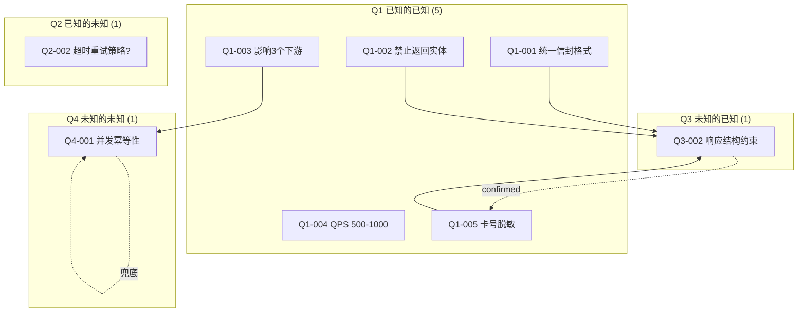

# 认知框架 — 乔哈里窗变体

> 层级: Level 2 参考文档 | 适用阶段: Design Phase

---

## 1. 框架概述

MumuSpec 在 Design 阶段引入基于"乔哈里窗"（Johari Window）变体的四象限认知框架，作为 AI Agent 辅助技术设计的系统化认知方法。

**核心逻辑**：Agent 基于 Q1（已知的已知）+ Q2（已知的未知）辅助确认 Q3（未知的已知），并最小化 Q4（未知的未知）。

```
                    ┌─────────────────────┬─────────────────────┐
                    │   用户知道           │   用户不知道          │
    ┌───────────────┼─────────────────────┼─────────────────────┤
    │  Agent 知道    │  Q1 已知的已知       │  Q3 未知的已知       │
    │               │  → 锚定推理地基      │  → 推理链让用户确认   │
    ├───────────────┼─────────────────────┼─────────────────────┤
    │  Agent 不知道  │  Q2 已知的未知       │  Q4 未知的未知       │
    │               │  → 提问补全（含选项）│  → 盲区扫描 + 兜底    │
    └───────────────┴─────────────────────┴─────────────────────┘
```

---

## 2. 四象限定义与操作策略

### Q1：已知的已知（Known Knowns）— 锚定

**定义**：Agent 和用户共同掌握的信息，是设计的推理地基。

**MumuSpec 中的 Q1 来源**：

| 来源 | 内容 | 获取方式 |
|------|------|---------|
| `proposal.md` | 变更目标、影响范围、delta-specs | 读取变更工件 |
| 既有 `spec.md` | 当前层级的 SHALL / SHALL NOT 约束 | `mumuspec context <path>` 渐进式加载 |
| `code-graph/impact-analysis.json` | 影响分析结果（受影响文件/函数/调用链） | `mumuspec impact <name>` |
| 既有 `design.md` | 现有架构决策和技术选型 | 读取目录级设计文档 |
| 既有 `contracts/` | 外部服务契约 + 对外契约 | `mumuspec contract list` |
| 既有 `test-cases/` | 已有测试覆盖范围（若存在） | 读取 test-cases/ 目录 |

**操作策略**：

1. **锚定声明**：Design 阶段开始时，Agent 首先输出 Q1 锚定声明，列出所有已知约束和上下文
2. **置信度标注**：每条 Q1 信息标注置信度（`high` / `medium` / `low`）
   - `high`：直接从规范文件或代码图谱获取，可验证
   - `medium`：从 design.md 推断，未经图谱验证
   - `low`：从 proposal.md 推断，未经代码验证
3. **矛盾检测**：Q1 信息之间若存在矛盾（如 proposal 与既有 spec.md 冲突），立即报告

> **约束**：Q1 锚定声明是后续所有推理的基础。Q2/Q3/Q4 的推导必须引用 Q1 条目编号。

### Q2：已知的未知（Known Unknowns）— 提问补全

**定义**：Agent 明确知道自己缺失的信息，需要通过提问从用户获取。

**MumuSpec 中的 Q2 典型场景**：

| 场景 | 示例提问 |
|------|---------|
| 实现方案选择 | "API 响应格式选择 `{code,message,data}` 还是 RESTful 状态码？A: 统一信封 B: RESTful C: 混合" |
| 性能指标未明确 | "该接口的预期 QPS 是多少？A: <100 B: 100-1000 C: >1000" |
| 外部服务行为未知 | "支付服务超时后是否自动重试？A: 是(最多3次) B: 否(直接失败) C: 不确定" |
| 规范边界模糊 | "该 SHALL NOT 是否适用于内部工具接口？A: 适用 B: 仅外部接口 C: 不适用" |
| 向后兼容范围 | "v1 接口的哪些字段是下游必须依赖的？A: 全部 B: 仅 code+data C: 不确定" |

**操作策略**：

1. **必须提供选项**：每个 Q2 提问必须附带 2-4 个选项（含"不确定"选项），降低用户认知负担
2. **选项基于 Q1 推导**：选项不能凭空生成，必须引用 Q1 中的上下文
3. **批量提问**：单轮最多 5 个 Q2 问题，避免认知过载；超出部分分轮提出
4. **默认值推断**：若用户选择"不确定"，Agent 基于 Q1 推断默认值并标注 `inferred: true`
5. **回答归类**：用户回答后，信息从 Q2 迁移到 Q1（变为已知的已知）

> **约束**：Q2 问题不得是开放性问题（如"你想要什么？"），必须是带选项的选择题。

### Q3：未知的已知（Unknown Knowns）— 推理链确认

**定义**：Agent 通过 Q1 推导出的隐性需求或约束，用户可能尚未显式表达但隐含认同。

**MumuSpec 中的 Q3 典型场景**：

| 场景 | 推理链示例 |
|------|-----------|
| 隐性架构约束 | Q1: "既有 spec.md 要求 DTO 转换" + Q1: "proposal 新增支付接口" → Q3: "支付接口响应也必须经过 DTO 转换（继承父层约束）" |
| 隐性安全需求 | Q1: "接口涉及用户敏感数据" + Q1: "既有 SHALL NOT 禁止明文返回" → Q3: "支付接口响应须脱敏处理卡号（仅返回后4位）" |
| 隐性兼容性约束 | Q1: "该接口已被 3 个下游服务调用" + Q1: "契约标记为 stable" → Q3: "新增字段只能追加到 data 内部，不可改变顶层结构" |
| 隐性测试需求 | Q1: "hyperplan 标注风险: 并发扣款" → Q3: "test-cases 须包含并发扣款的幂等性测试用例" |
| 隐性性能约束 | Q1: "该接口在 critical path 上" + Q1: "SLA 要求 P99 < 200ms" → Q3: "数据库查询必须走索引，禁止全表扫描" |

**操作策略**：

1. **推理链格式**：每条 Q3 必须以推理链形式呈现：`Q1[编号] + Q1[编号] → Q3: 推导结论`
2. **用户确认**：Q3 推导结论需用户显式确认（`confirmed` / `rejected` / `modified`）
   - `confirmed`：迁移到 Q1，作为新的已知约束
   - `rejected`：记录拒绝理由到 decisions.md，不再追踪
   - `modified`：用户修正后重新确认
3. **每轮不超过 3 条**：避免认知过载，超出部分分轮提出
4. **置信度传播**：Q3 的置信度不超过其推理链中最低置信度的 Q1 条目
5. **与 SHALL/SHALL NOT 衔接**：`confirmed` 的 Q3 若涉及约束，自动转化为 design.md 中的 SHALL/SHALL NOT 草案

> **约束**：Q3 推导必须基于 Q1，不可基于 Q2（未回答的问题不能作为推导前提）。Q3 每轮最多 3 条。

### Q4：未知的未知（Unknown Unknowns）— 盲区扫描

**定义**：Agent 和用户都未意识到的盲区，通过主动扫描发现或写入兜底策略。

**MumuSpec 中的 Q4 扫描维度**：

| 扫描维度 | 检查项 | 工具/方法 |
|---------|--------|----------|
| **隐藏耦合** | 代码图谱中存在间接调用链但 proposal 未覆盖 | `mumuspec trace <symbol>` 深度遍历 |
| **并发安全** | 共享资源访问、竞态条件、死锁风险 | 代码图谱 CONSUMES 边 + 模式匹配 |
| **契约兼容性** | delta-specs 的 REMOVED 操作是否破坏下游 | `mumuspec contract compat-check <name>` |
| **规范继承冲突** | 子层 SHALL NOT 与父层 SHALL 矛盾 | 规范加载时可满足性检查 |
| **依赖链风险** | 第三方依赖的 breaking change | 依赖版本扫描 |
| **合规盲区** | 数据隐私、日志脱敏、审计要求 | 安全扫描 Skill |
| **性能盲区** | N+1 查询、大对象序列化、冷启动 | 代码图谱 CALLS 边分析 |
| **测试盲区** | 边界条件、异常路径、幂等性 | hyperplan validator 角色 |

**操作策略**：

1. **主动扫描**：Agent 在 Q1-Q3 处理完成后，主动执行 Q4 盲区扫描
2. **发现即转化**：扫描发现的盲区转化为新的 Q2（需用户确认的问题）或 Q3（可推导的隐性需求）
3. **兜底策略**：无法通过扫描消除的 Q4，写入以下兜底策略：
   - **监控兜底**：在 design.md 中标注 `risk: unresolvable-blind-spot`，建议添加监控告警
   - **测试兜底**：在 test-cases/ 中添加防御性测试用例
   - **回退兜底**：在 decisions.md 中记录"若此盲区在 Build/Verify 阶段暴露，回退到 Design"
   - **降级兜底**：在 design.md 中定义降级方案（feature flag / fallback path）
4. **残留 Q4 记录**：所有未能消除的 Q4 残留项记录到 `.mumuspec.yaml: cognitive_map.q4_residuals`

> **约束**：Q4 扫描是 Design 阶段的必要步骤，不可跳过。扫描结果须写入认知地图。

---

## 3. 工作流程

### 四阶段递进流程

```
┌─────────────────────────────────────────────────────────────────────┐
│                    Design Phase 认知框架工作流                       │
├─────────────────────────────────────────────────────────────────────┤
│                                                                     │
│  Stage 1: 信息采集 (Information Collection)                         │
│  ┌─────────────────────────────────────────────────────────┐        │
│  │ 读取 proposal.md + delta-specs                           │        │
│  │ 加载 affected_scopes 的 spec.md (渐进式披露)              │        │
│  │ 执行代码图谱影响分析 (mumuspec impact)                    │        │
│  │ 加载既有 design.md + contracts/                           │        │
│  │ → 产出: Q1 锚定声明                                       │        │
│  └──────────────────────────┬──────────────────────────────┘        │
│                              ↓                                      │
│  Stage 2: 探索激活 (Exploration Activation)                         │
│  ┌─────────────────────────────────────────────────────────┐        │
│  │ 从 Q1 识别信息缺口 → 生成 Q2 提问（含选项）               │        │
│  │ 用户回答 Q2 → 回答迁移到 Q1                               │        │
│  │ 循环直到 Q2 收敛（无新问题）或达到 3 轮上限               │        │
│  │ → 产出: 更新后的 Q1 + 空 Q2                              │        │
│  └──────────────────────────┬──────────────────────────────┘        │
│                              ↓                                      │
│  Stage 3: 盲区扫描 (Blind Spot Scanning)                            │
│  ┌─────────────────────────────────────────────────────────┐        │
│  │ 基于 Q1 推导 Q3 隐性需求（推理链，每轮 ≤ 3 条）            │        │
│  │ 用户确认 Q3 → confirmed 迁移到 Q1                        │        │
│  │ 执行 Q4 盲区扫描（8 个维度）                              │        │
│  │ 扫描发现 → 转化为新 Q2/Q3 或写入兜底策略                  │        │
│  │ → 产出: 更新后的 Q1 + Q4 残留记录 + 兜底策略              │        │
│  └──────────────────────────┬──────────────────────────────┘        │
│                              ↓                                      │
│  Stage 4: 设计生成 (Design Generation)                               │
│  ┌─────────────────────────────────────────────────────────┐        │
│  │ 基于 Q1（含确认的 Q3）生成 design.md 草案                 │        │
│  │ Q4 兜底策略写入 design.md 风险章节                        │        │
│  │ 触发 hyperplan 对抗审查（若满足条件）                      │        │
│  │ hyperplan 幸存洞察合并到 design.md                        │        │
│  │ → 产出: design.md + 认知地图快照                          │        │
│  └─────────────────────────────────────────────────────────┘        │
│                                                                     │
└─────────────────────────────────────────────────────────────────────┘
```

### 与 Design Phase 现有步骤的映射

| 认知框架阶段 | Design Phase 现有步骤 | 衔接关系 |
|-------------|----------------------|---------|
| Stage 1: 信息采集 | 步骤 4（代码图谱验证）的前置 | 采集结果作为步骤 1（逐层设计）的输入 |
| Stage 2: 探索激活 | 步骤 1（逐层设计）中并行 | Q2 回答指导每层设计决策 |
| Stage 3: 盲区扫描 | 步骤 2（hyperplan）的前置 | Q3 确认后的约束进入 hyperplan 审查；Q4 扫描补充 hyperplan 未覆盖的盲区 |
| Stage 4: 设计生成 | 步骤 1-5 的整合产出 | 认知地图作为 design.md 的附录 |

### 循环与收敛规则

| 规则 | 说明 |
|------|------|
| **Q2 收敛条件** | 连续 1 轮无新 Q2 问题，或达到 3 轮上限 |
| **Q3 每轮上限** | 每轮最多 3 条 Q3 推导，避免认知过载 |
| **Q4 扫描触发** | Q2 收敛 + Q3 全部处理完毕后触发 |
| **总轮次上限** | Stage 2+3 合计不超过 5 轮（防止无限循环） |
| **强制收敛** | 达到上限后，未解决问题标记为 `unresolved`，写入兜底策略 |

---

## 4. 输出格式规范

### 4.1 认知地图（Cognitive Map）

每轮交互后更新认知地图，以可视化方式呈现当前四象限状态：

```yaml
# .mumuspec/changes/<change-name>/cognitive-map.yaml
version: 1
change: add-payment-api
updated_at: "2026-07-09T10:30:00Z"
round: 2

q1_known_knowns:
  - id: Q1-001
    source: spec.md#L12
    content: "所有 API 响应必须使用统一信封格式 {code, message, data}"
    confidence: high
    verified_by: spec_file
  - id: Q1-002
    source: impact-analysis.json
    content: "支付接口影响 3 个下游服务: order-service, notification-service, analytics-service"
    confidence: high
    verified_by: code_graph
  - id: Q1-003
    source: proposal.md#L8
    content: "新增支付接口需支持微信支付和支付宝"
    confidence: high
    verified_by: proposal
  - id: Q1-004
    source: Q2-001 (round 1, confirmed)
    content: "预期 QPS 为 500-1000"
    confidence: high
    verified_by: user_confirmation
  - id: Q1-005
    source: Q3-001 (round 1, confirmed)
    content: "支付接口响应须脱敏处理卡号（仅返回后4位）"
    confidence: high
    verified_by: user_confirmation

q2_known_unknowns:
  - id: Q2-002
    question: "支付超时后的重试策略？"
    options:
      - id: A
        label: "自动重试（最多3次，间隔5s）"
        q1_basis: [Q1-003]
      - id: B
        label: "直接失败，由调用方重试"
        q1_basis: [Q1-003]
      - id: C
        label: "不确定"
        q1_basis: [Q1-003]
    status: pending
    round: 2

q3_unknown_knowns:
  - id: Q3-002
    reasoning_chain:
      - q1_ref: Q1-001
        fact: "统一信封格式要求"
      - q1_ref: Q1-003
        fact: "支付接口新增"
      - q1_ref: Q1-005
        fact: "卡号需脱敏"
    conclusion: "支付接口响应的 data 字段须为 {transactionId, amount, maskedCardNo, status}，不含完整卡号"
    status: pending
    round: 2

q4_unknown_unknowns:
  scans:
    - dimension: hidden_coupling
      method: "mumuspec trace processPayment"
      result: "发现 processPayment 间接调用 inventoryService.deduct，proposal 未覆盖库存扣减"
      action: "转化为 Q2-003: 库存扣失败时支付是否回滚？"
      status: converted_to_q2
  residuals:
    - id: Q4-001
      dimension: concurrency_safety
      description: "并发支付请求的幂等性无法在设计阶段完全验证"
      mitigation:
        - type: test_fallback
          detail: "test-cases/layer-1 须包含并发幂等性测试用例"
        - type: monitoring_fallback
          detail: "design.md 风险章节标注：需监控重复支付率"
      status: unresolvable

convergence:
  q2_resolved: 1
  q2_pending: 1
  q3_confirmed: 1
  q3_pending: 1
  q4_resolved: 1
  q4_residual: 1
  total_rounds: 2
  max_rounds: 5
  converged: false
```

### 4.2 Q1 锚定声明输出格式

```markdown
## Q1 锚定声明

### 来自规范文件
- [Q1-001] (high) `spec.md#L12`: 所有 API 响应必须使用统一信封格式 {code, message, data}
- [Q1-002] (high) `spec.md#L18`: 禁止在 API 响应中直接返回数据库实体对象

### 来自代码图谱
- [Q1-003] (high) `impact-analysis.json`: 支付接口影响 3 个下游服务
- [Q1-004] (medium) `code-graph`: processPayment() 当前调用 PaymentGateway.charge()

### 来自提案
- [Q1-005] (high) `proposal.md#L8`: 新增支付接口需支持微信支付和支付宝

### 来自契约
- [Q1-006] (high) `contracts/external/wechat-pay.yaml`: 微信支付 API 超时 30s

### 矛盾检测
- ⚠️ [Q1-004] 与 [Q1-006] 潜在矛盾: 当前 PaymentGateway.charge() 无超时设置，但契约要求 30s
```

### 4.3 Q2 提问输出格式

```markdown
## Q2 待确认问题（第 2 轮）

### Q2-002: 支付超时后的重试策略？

**上下文**: [Q1-005] 需支持微信支付，[Q1-006] 微信支付超时 30s

**选项**:
- **A**: 自动重试（最多3次，间隔5s）— 适用于网络抖动场景
- **B**: 直接失败，由调用方重试 — 适用于强一致性场景
- **C**: 不确定 — Agent 将基于 Q1 推断默认值

> 请选择 A/B/C，或补充其他方案。
```

### 4.4 Q3 推理链输出格式

```markdown
## Q3 隐性需求推导（第 2 轮，共 2 条）

### Q3-002: 支付接口响应结构约束

**推理链**:
1. [Q1-001] 统一信封格式 {code, message, data}
2. [Q1-002] 禁止直接返回数据库实体
3. [Q1-005] 卡号需脱敏（仅后4位）
   ↓
**结论**: 支付接口响应的 `data` 字段须为 `{transactionId, amount, maskedCardNo, status}`，不含完整卡号

**建议**: 转化为 design.md 中的 SHALL 约束

> 请确认 ✅ confirmed / ❌ rejected / ✏️ modified
```

### 4.5 Q4 盲区扫描报告输出格式

```markdown
## Q4 盲区扫描报告

### 扫描结果摘要

| 维度 | 发现数 | 已转化 | 残留 |
|------|--------|--------|------|
| 隐藏耦合 | 1 | 1 | 0 |
| 并发安全 | 1 | 0 | 1 |
| 契约兼容性 | 0 | 0 | 0 |
| 规范继承冲突 | 0 | 0 | 0 |
| 依赖链风险 | 0 | 0 | 0 |
| 合规盲区 | 0 | 0 | 0 |
| 性能盲区 | 0 | 0 | 0 |
| 测试盲区 | 0 | 0 | 0 |

### 已转化项

- **[隐藏耦合]** processPayment 间接调用 inventoryService.deduct → 转化为 Q2-003

### 残留项（兜底策略）

- **[Q4-001] 并发安全**: 并发支付请求的幂等性无法在设计阶段完全验证
  - **兜底 1（测试）**: test-cases/layer-1 须包含并发幂等性测试用例
  - **兜底 2（监控）**: design.md 风险章节标注：需监控重复支付率
```

### 4.6 认知地图可视化（Mermaid）

每轮更新后输出可视化的认知地图：



---

## 5. 设计要点说明与适用场景

### 5.1 关键约束

| 约束 | 说明 | 原因 |
|------|------|------|
| **Q3 每轮 ≤ 3 条** | 每轮最多推导 3 条隐性需求 | 避免用户认知过载，保证确认质量 |
| **Q2 必须提供选项** | 每个问题附带 2-4 个选项 | 降低决策成本，避免开放性问题的认知负担 |
| **Q3 基于且仅基于 Q1** | 推理链只能引用 Q1 条目 | 确保推导的可靠性，避免基于未确认信息的推理 |
| **Q4 不可跳过** | 盲区扫描是必要步骤 | 未扫描的盲区可能在 Build/Verify 阶段暴露，导致回退 |
| **认知地图每轮更新** | 每轮交互后更新 cognitive-map.yaml | 提供可追溯的认知演化路径 |
| **总轮次 ≤ 5** | Stage 2+3 合计不超过 5 轮 | 防止无限循环，强制收敛 |

### 5.2 与 Hyperplan 的关系

| 维度 | 认知框架 | Hyperplan |
|------|---------|-----------|
| **定位** | 设计前的信息完备性保障 | 设计后的对抗式审查 |
| **时机** | Design 步骤 1 之前 | Design 步骤 2 |
| **方法** | 结构化问答 + 推理链 | 多角色对抗攻击 |
| **目标** | 最小化未知（Q4） | 攻击设计缺陷 |
| **产出** | 认知地图 + Q1 锚定 | 幸存洞察（硬约束/决策/风险/开放问题） |
| **衔接** | Q3 confirmed 的约束 → 进入 hyperplan 审查 | hyperplan 风险 → 转化为 Q4 扫描维度 |

**协作流程**：
1. 认知框架 Stage 1-3 完成 → Q1 锚定 + Q3 确认约束
2. 基于完整 Q1 生成 design.md 草案
3. hyperplan 对 design.md 草案进行对抗审查
4. hyperplan 幸存洞察中的 `risks` → 反馈为新的 Q4 扫描维度
5. hyperplan `open_questions` → 转化为新的 Q2 问题

### 5.3 适用场景

| 场景 | 认知框架模式 | 说明 |
|------|-------------|------|
| **full 工作流** | 完整四阶段 | Q1-Q4 全流程执行，认知地图完整记录 |
| **hotfix 工作流** | 轻量模式 | 仅 Stage 1（信息采集）+ Q4 快速扫描（3 个维度） |
| **tweak 工作流** | 跳过 | 配置/文案变更无需认知框架 |
| **回退后重新 Design** | 增量模式 | 保留上一轮 Q1，仅重新执行 Q2-Q3 中受影响的部分 |
| **复杂架构变更** | 增强模式 | Q4 扫描增加架构特定维度（如微服务边界、数据一致性） |

### 5.4 与 decisions.md 的衔接

认知框架的关键决策记录到 decisions.md Design 章节：

```markdown
## Design — 认知框架决策

### DEC-005: Q2-002 超时重试策略
- **用户选择**: A（自动重试，最多3次，间隔5s）
- **Q1 依据**: Q1-005, Q1-006
- **时间**: 2026-07-09T10:25:00Z

### DEC-006: Q3-002 支付接口响应结构约束
- **状态**: confirmed
- **推理链**: Q1-001 + Q1-002 + Q1-005
- **转化为**: design.md SHALL: "支付接口 data 字段须为 {transactionId, amount, maskedCardNo, status}"
- **时间**: 2026-07-09T10:28:00Z

### DEC-007: Q4-001 并发幂等性盲区
- **状态**: unresolvable
- **兜底策略**: test-cases/layer-1 并发幂等测试 + 监控重复支付率
- **时间**: 2026-07-09T10:30:00Z
```

### 5.5 Phase Guard 衔接

`design_to_build` 守卫增加认知框架检查项：

| 检查项 | 通过标准 | 失败错误码 |
|--------|---------|-----------|
| `cognitive_map.exists` | cognitive-map.yaml 存在 | E-DESIGN-001 |
| `cognitive_map.q1_count > 0` | Q1 至少有 1 条 | E-DESIGN-002 |
| `cognitive_map.q2_pending == 0` | Q2 无待回答问题（或达到轮次上限） | E-DESIGN-003 |
| `cognitive_map.q3_pending == 0` | Q3 无待确认推导（或达到轮次上限） | E-DESIGN-004 |
| `cognitive_map.q4_scans_completed` | Q4 扫描已执行（至少 3 个维度） | E-DESIGN-005 |
| `cognitive_map.converged == true` | 认知地图已收敛（或达到轮次上限强制收敛） | E-DESIGN-006 |

> hotfix 工作流豁免 `q2_pending == 0` 和 `q3_pending == 0` 检查，仅要求 `q1_count > 0` 和 `q4_scans_completed`。

---

## 6. 工件结构

认知框架产出物纳入变更工件结构：

```
.mumuspec/changes/<change-name>/
├── cognitive-map.yaml          # 认知地图（四象限状态 + 演化历史）
├── design.md                   # 技术设计（含 Q3 转化的 SHALL/SHALL NOT + Q4 兜底策略）
├── ...
```

### cognitive-map.yaml 与 .mumuspec.yaml 的关系

```yaml
# .mumuspec.yaml 中新增字段
cognitive_framework:
  enabled: true                  # 是否启用认知框架
  mode: full                     # full | lightweight | incremental
  rounds_completed: 2
  converged: true
  convergence_reason: "q2_empty" # q2_empty | max_rounds | forced
  q1_count: 5
  q2_resolved: 3
  q2_pending: 0
  q3_confirmed: 4
  q3_pending: 0
  q4_scans_completed: 8
  q4_residuals: 1
  cognitive_map_ref: "cognitive-map.yaml"
```

---

> **导航**: [← Phase Guard](phase-guards.md) | [Skill 生态 →](skill-ecosystem.md) | [返回概览](../overview.md)
