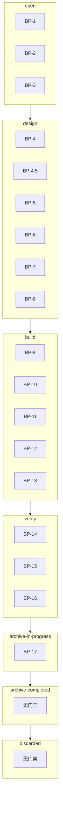
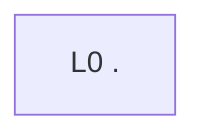

# Workflow Diagrams (generated)

> **Auto-generated** from graph data via `src/graph/doc-page.ts`. Do not edit manually.
> Regenerate: `npm run build` — drift is reported by `npm run docs:audit`.

## 状态机（full 工作流）

节点为阶段，边为转移；未挂门禁的边标注"未把守"，回退边与正向边以类别区分。

```mermaid
flowchart LR
  %% 来源: workflow=full
  p0["open"]
  p1["design"]
  p2["build"]
  p3["verify"]
  p4["archive-in-progress"]
  p5["archive-completed"]
  p6["discarded"]
  p4 --> p5["archive-in-progress → archive-completed"] : "archive-in-progress → archive-completed ｜ 未把守 ｜ none ｜ forward"
  p4 --> p2["archive-in-progress → build"] : "archive-in-progress → build ｜ 未把守 ｜ rollback ｜ backward"
  p4 --> p6["archive-in-progress → discarded"] : "archive-in-progress → discarded ｜ 未把守 ｜ none ｜ skip"
  p2 --> p1["build → design"] : "build → design ｜ 未把守 ｜ rollback ｜ backward"
  p2 --> p6["build → discarded"] : "build → discarded ｜ 未把守 ｜ none ｜ skip"
  p2 --> p3["build → verify"] : "build → verify ｜ 未把守 ｜ none ｜ forward"
  p1 --> p2["design → build"] : "design → build ｜ BP-4 设计方案确认 ｜ none ｜ forward"
  p1 --> p6["design → discarded"] : "design → discarded ｜ 未把守 ｜ none ｜ skip"
  p0 --> p2["open → build"] : "open → build ｜ BP-3 工件审查与确认（预设路径） ｜ none ｜ skip"
  p0 --> p1["open → design"] : "open → design ｜ BP-3 工件审查与确认 ｜ none ｜ forward"
  p0 --> p6["open → discarded"] : "open → discarded ｜ 未把守 ｜ none ｜ skip"
  p3 --> p4["verify → archive-in-progress"] : "verify → archive-in-progress ｜ BP-17 归档最终确认 ｜ none ｜ forward"
  p3 --> p2["verify → build"] : "verify → build ｜ 未把守 ｜ rebuild ｜ backward"
  p3 --> p1["verify → design"] : "verify → design ｜ 未把守 ｜ rollback ｜ backward"
  p3 --> p6["verify → discarded"] : "verify → discarded ｜ 未把守 ｜ none ｜ skip"
```

## 阶段×阻塞点泳道

每个阶段一条泳道；泳道内为 `无门禁` 即该阶段当前没有任何阻塞点把守。



## 契约上下游

孤立节点表示该契约既无上游也无下游；指向未声明节点的边由渲染器拒绝而非静默补齐。

```mermaid
flowchart LR
```

## 约束继承树（根路径）

边表示继承来源；无上游来源的层即断链，保留在图上而不是被省略。


